# 第一课 — Lesson 1

> OCR transcription; not manually verified. Source and confidence metadata are preserved per page.

<!-- source_pdf_page: 24; source_printed_page: 1; ocr_confidence: 0.9887 -->

## 一、会话 Conversation

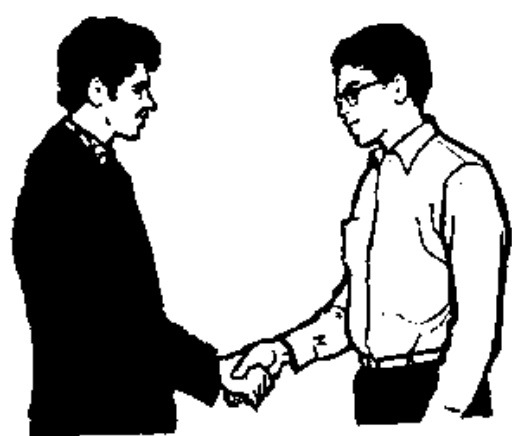

A: Nǐ hǎo!

你好!

B: Nǐ hǎo!

你好!

## 二、生词和汉字 New Words and Chinese Characters

|  1. nǐ | (代) | 你 | you (s.)  |
| --- | --- | --- | --- |
|  2. hǎo | (形) | 好 | good, well  |
|  3. yī | (数) | 一 | one  |
|  4. wǔ | (数) | 五 | five  |
|  5. bā | (数) | 八 | eight  |

<!-- source_pdf_page: 25; source_printed_page: 2; ocr_confidence: 0.9773 -->

6. tā he, she
7. bù not, no
8. dà big
9. yú fish

## 三、韵母 Finals

a o e i u ü
ai ei ao ou

## 四、声母 Initials

b p m f
d t n l
g k h

## 五、声调 Tones

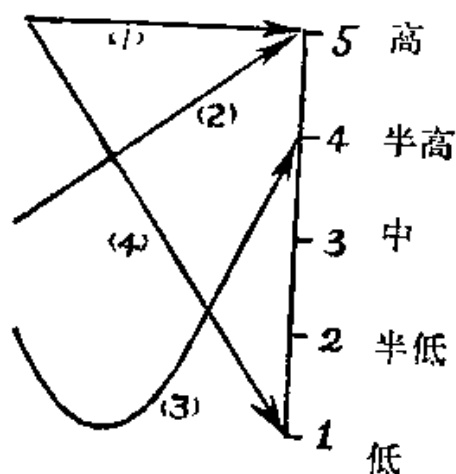

- : 第一声 1st tone
- : 第二声 2nd tone
- : 第三声 3rd tone
- : 第四声 4th tone

声调示意图 Figure showing the four tones

声调不同，意义不同。例如：

<!-- source_pdf_page: 26; source_printed_page: 3; ocr_confidence: 0.9919 -->

When a syllable is pronounced in different tones, it has different meanings, e.g.

|  mā | má | mǎ | mà  |
| --- | --- | --- | --- |
|  dā | dá | dā | dà  |

## 六、注释 Notes

### 1. 声母和韵母 Initials and finals

汉语的音节大多数是由声母和韵母拼合而成的。音节开头的辅音是声母，其余部分是韵母。例如：ni，其中 n 是声母，i 是韵母。

现代汉语有21个声母，38个韵母。声母都是由一个辅音充当的。韵母有的是单元音，叫单韵母，如 i；有的是复合元音，叫复韵母，如 ao；有的是元音加鼻辅音，叫鼻韵母，如 an。

According to traditional Chinese phonology, a syllable in Chinese is generally made up of an initial and a final. The initial is the consonantal beginning of a syllable, and the final is the part of the syllable excluding the initial. For example, in *ni*, *n* is the initial, and *i* is the final.

There are 21 initials and 38 finals in Chinese. All the initials are consonants except for the zero initial (i.e. no initial) e.g. *an*, and all the finals consist of a vowel (either simple or compound) vowel, or a vowel plus a nasal consonant. The simple vowel is called a simple final, e.g. *i*; the compound vowel is called a compound final, e.g. *ao*; and the vowel plus a nasal consonant is called a nasal final, e.g. *an*.

### 2. 单韵母 ao e i u ü Simple finals *a*, *o*, *e*, *i*, *u*, *ü* ...

a 开口度最大，舌位最低，唇不圆。

*a* is produced by lowering the tongue, with the mouth

<!-- source_pdf_page: 27; source_printed_page: 4; ocr_confidence: 0.9990 -->

wide-open and the lips unrounded.

o 开口度中等,舌位半高、偏后,圆唇。

o is produced by keeping the tongue in a half raised position with the back of the tongue towards the soft palate. The mouth is half-open, and the lips are rounded

e 开口度中等,舌位半高、偏后,唇不圆。

e is produced by keeping the tongue in a half raised position with the back of the tongue towards the soft palate. The mouth is half-open, and the lips are unrounded.

i 开口度最小,唇扁平,舌位高、偏前。

i is produced by raising the front blade of the tongue towards the hard palate, with the mouth a little open and the lips flat.

u 开口度最小,唇最圆,舌位高,偏后。

u is produced by keeping the back of the tongue towards the soft palate with the mouth slightly open, and the lips as rounded as possible.

ü 舌位高、偏前,是与i[i]相对的圆唇音。

ü is produced by raising the front of the blade of the

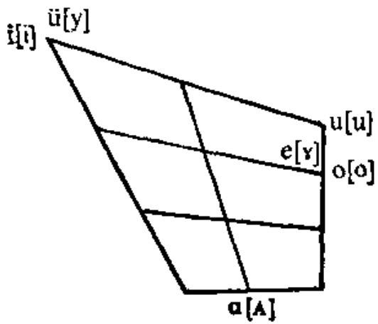

<!-- source_pdf_page: 28; source_printed_page: 5; ocr_confidence: 0.9904 -->

tongue towards the hard palate with the lips rounded. It is the corresponding lip-rounded sound to i [i].

3. 复韵母 ai ei ao ou Compound finals ai, ei, ao, ou

ai 发复韵母 ai 时, 舌位从 a 向 i 滑动, 前面的 a 要念得长而响亮, 后面的 i 要念得轻而短。

ai is produced by starting from a and then gliding towards i. a is pronounced longer, louder and clearer, and i shorter and weaker.

ei ao ou 发音要领跟 ai 一样, 前一个元音要念得长而响亮, 后一个元音要念得轻而短。

Similarly, the first constituent of ei, ao and ou is also pronounced longer, louder and clearer than the second one.

4. 送气音和不送气音 Aspirated and unaspirated consonants.

声母 b p 和 d t 是两组相对应的不送气音和送气音。每组的两个辅音发音部位完全一样, 只是在发 p t 时气流要 b,p 发音示意图

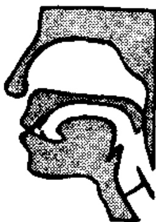

(1) 准备
Lip-position

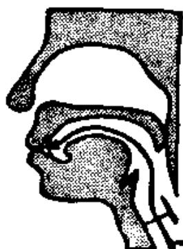

(2) 蓄气
Holding breath

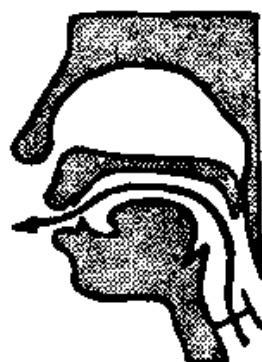

(3) 发音
Releasing breath

<!-- source_pdf_page: 29; source_printed_page: 6; ocr_confidence: 0.9952 -->

### d、t发音示意图

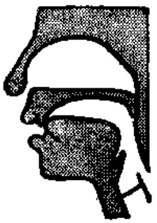

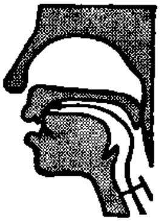

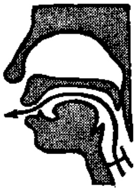

(1) 准备
Lip-position

(2) 蓄气
Holding breate

(3) 发音
Releasing breath

用力吐出，称为“送气音”。发 b d 时，气流爆发而出，不送气，称为“不送气音”。以后还要学几组送气音和不送气音。

The initials b and p are a pair of bilabial voiceless plosives which have the same place of articulation. The only difference is that b is unaspirated while p is aspirated. d and t are another pair of bilabial voiceless plosives in which the first is unaspirated while the latter is aspirated. We shall later study several pairs of initials of this kind.

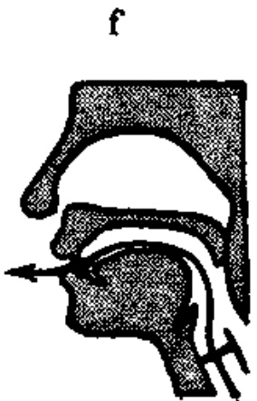

m

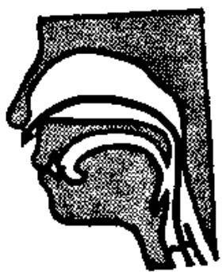

<!-- source_pdf_page: 30; source_printed_page: 7; ocr_confidence: 0.9836 -->

n

l

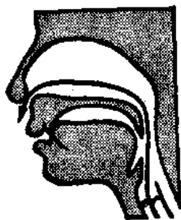

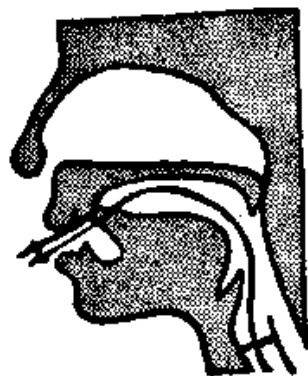

g,k 发音示意图

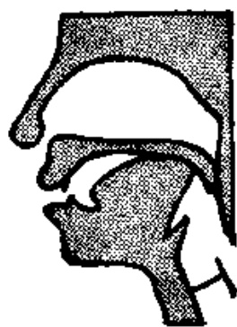

(1) 准备
Lip-position

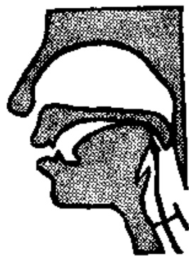

(2) 蓄气
Holding breath

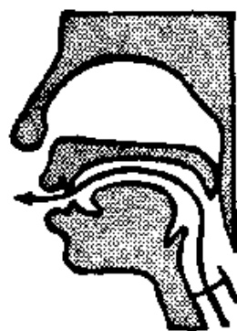

(3) 发音
Releasing breath

h

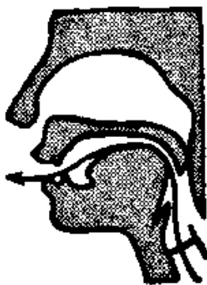

<!-- source_pdf_page: 31; source_printed_page: 8; ocr_confidence: 0.9840 -->

### 5. 声调 Tones

北京语音有四个基本声调，分别用声调符号“·”（第一声）、“·”（第二声）、“~”（第三声）、“、”（第四声）来表示。声调不同，表示的意义不同。例如：yī（一），yì（亿）。

当一个音节只有一个元音时，声调符号标在元音上。元音 i 上有调号时，要去掉 i 上的点。例如：nǐ。一个音节如有两个或两个以上的元音时，声调符号要标在开口度最大的元音上。例如：hǎo。

Beijing dialect has four basic tones, usually numbered as 1st, 2nd, 3rd and 4th tones, represented respectively by -，·，~ and ·。When a syllable is pronounced in different tones, it has different meanings, e.g. yī (— one), yì (亿, hundred million).

When a syllable contains only a single vowel, the tone-graph is placed above it. When a tone-graph is placed above the vowel i, the dot over it is omitted, e.g. nǐ + ~ nǐ. When the final is a compound vowel (a diphthong or a triphthong), the tone-graph is placed above the main element of the compound vowel (namely the one pronounced loud with the mouth wide open), e.g. hǎo.

### 6. 拼写规则 Spelling rules

i 自成音节时写成 yì。

u 自成音节时写成 wu。

ü 自成音节时写成 yu。

<!-- source_pdf_page: 32; source_printed_page: 9; ocr_confidence: 0.9966 -->

Standing alone as a syllable, *i* is written as *yi*, *u* as *wu* and *ü* as *yu*.

#### 7. 你好

“你好”是汉语里常用的问候语，早上、中午、晚上见面时都可以用。对方的回答也说“你好”。

你好 is a common greeting in Chinese used upon meeting somebody in the morning, in the afternoon or in the evening. The answer expected is also 你好.

#### 8. 汉字 Chinese characters

汉字是汉语的书写符号。一个音节写成一个汉字。汉字是由基本笔画组成的，汉字的基本笔画并不多。基本笔画组成独体字，一部分独体字或固定的组字成分构成合体字。每个字不管笔画多少，都应按同样大小的方格书写。写汉字要注意笔顺正确，结构紧凑匀称。

The Chinese characters are the written symbols of the Chinese language. Usually, one character stands for one syllable, and it is composed of several basic strokes. The number of possible basic strokes is in fact quite small. The basic characters, i.e. characters that cannot be broken down, are made up of basic strokes, and the compound characters are made up of basic characters or fixed components. All characters should be written so as to fit into equal-sized squares no matter how many strokes they have. The characters should be written in the proper stroke order, and their structure should be compact and well-balanced.

<!-- source_pdf_page: 33; source_printed_page: 10; ocr_confidence: 0.9934 -->

### 汉字的基本笔画 Basic Strokes of

### Chinese Characters

|  笔画 Strokes | 名称 Name | 运笔方向 Directions of strokes | 例字 Examples  |
| --- | --- | --- | --- |
|  ˋ | 点 diǎn | ˋ | 不 们 六  |
|  ˉ | 横 héng | ˉ | 不 火 五  |
|  ˉ | 竖 shù | ˉ | 不 你 忙  |
|  ˊ | 撇 piě | ˊ | 八 不 大  |
|  ˋ | 捺 nà | ˋ | 八 火 体  |
|  ˇ | 提 tí | ˇ | 汉 或 报  |
|  ˘ | 横钩 hénggōu | ˘ | 你 好 学  |
|  ˉ | 竖钩 shùgōu | ˉ | 你 好 小  |
|  ˋ | 斜钩 xiègōu | ˋ | 我 飘 民  |
|  ˉ | 横折 héngzhé | ˉ | 五 口 骂  |
|  ˋ | 竖折 shùzhé | ˋ | 忙 七 幡  |

<!-- source_pdf_page: 34; source_printed_page: 11; ocr_confidence: 0.9967 -->

### 汉字笔顺规则 Rules of Stroke-order of

### Chinese Characters

|  例 字 Example | 笔 顺 Stroke-order | 规 则 Rules  |
| --- | --- | --- |
|  十 | 一 十 | 先 横 后 竖 “héng” precedes “shù”  |
|  人 | 丿 人 | 先 撇 后 捺 “piē” precedes “nà”  |
|  三 | 一 二 三 | 从 上 到 下 from top to bottom  |
|  什 | 亻 什 | 从 左 到 右 from left to right  |
|  月 | 幔 月 | 从 外 到 内 from outside to inside  |
|  国 | 冂 国 国 | 先 里 头 后 封 口 inside precedes the sealing stroke  |
|  小 | 丿 小 小 | 先 中 间 后 两 边 middle precedes the two sides  |

<!-- source_pdf_page: 35; source_printed_page: 12; ocr_confidence: 0.9965 -->

## 七、练习 Exercises

### 1. 四个声调 Four tones

|  nǐ | ní | nǐ | nì | nǐ  |
| --- | --- | --- | --- | --- |
|  hǎo | háo | hǎo | hào | hǎo  |
|  yǐ | yí | yǐ | yì | yǐ  |
|  wū | wú | wǔ | wù | wǔ  |
|  bǎ | bà | bà | bà | bā  |
|  tā | tá | tǎ | tà | tā  |
|  bū | bú | bǔ | bù | bù  |
|  dā | dá | dǎ | dà | dà  |
|  yū | yú | yǔ | yù | yú  |

### 2. 辨音 Sound discrimination

|  bō | pō | bà | pà  |
| --- | --- | --- | --- |
|  dē | tē | dì | tì  |
|  mǒ | fō | mú | fú  |
|  ně | lē | nǚ | lǚ  |
|  gé | ké | gāi | kāi  |
|  dáo | táo | dòu | tòu  |
|  gǒu | gāo | kāi | gǎi  |
|  gǎo | kǎo | yī | yǔ  |

### 3. 两个音节连读 Two syllables pronounced in succession

|  nǐ hǎo | tā hǎo  |
| --- | --- |
|  bù hǎo | dà yú  |

### 4. 汉字认读 Get to know Chinese characters

A: 你好!

B: 你好!

<!-- source_pdf_page: 36; source_printed_page: 13; ocr_confidence: 0.9971 -->

## 汉字表 Table of Chinese Characters

> **Uncertainty:** OCR of character components and stroke forms is unreliable. This section is excluded from the default retrieval corpus.

|  1 | 你 | 亻 (丿亻)  |   |
| --- | --- | --- | --- |
|   |  | 尔 | ㄙ (丿ㄙ)  |
|   |  |  | 小 (亅亅小)  |
|  2 | 好 | 女 (ㄑㄠ女)  |   |
|   |  | 子 (ㄧ了子)  |   |
|  3 | 一 | 一  |   |
|  4 | 五 | 一 丌 丌 五  |   |
|  5 | 八 | 丿 八  |   |
