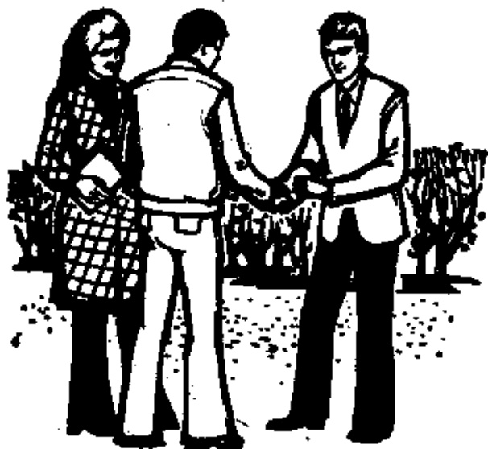

# 第二课 — Lesson 2

> OCR transcription; not manually verified. Source and confidence metadata are preserved per page.

<!-- source_pdf_page: 37; source_printed_page: 14; ocr_confidence: 0.9855 -->

## 一、会话 Conversation

A: Nǐ hǎo!

B: 你好!

C: Nǐmen hǎo! Máng ma?

你们好! 忙吗?

A: Wǒ hěn máng.

我很忙。

C: Nǐ máng ma?

你忙吗?

B: Wǒ bù máng.

我不忙。

<!-- source_pdf_page: 38; source_printed_page: 15; ocr_confidence: 0.9870 -->

## 二、生词和汉字 New Words and Chinese Characters

|  1. nimen | (代) | 你们 | you (pl.)  |
| --- | --- | --- | --- |
|  2. máng | (形) | 忙 | busy  |
|  3. ma | (助) | 吗 | *an interrogative particle*  |
|  4. wǒ | (代) | 我 | I, me  |
|  5. hěn | (副) | 很 | very  |
|  6. bù | (副) | 不 | no, not  |
|  7. wǒmen | (代) | 我们 | we, us  |
|  8. dōng |  |  | to understand  |
|  9. nán |  |  | difficult  |

## 三、韵母 Finals

|  an | en | ang | eng | ong  |
| --- | --- | --- | --- | --- |
|  ua | uo | uai | uei (-ui) |   |

## 四、注释 Notes

1. 鼻韵音 an en ang eng ong Nasal finals *an, en, ang, eng, ong*

an 是个舌尖鼻韵母。先发 a, 紧跟着舌尖抵向齿颊, 同时软腭下垂, 让气流从鼻腔流出。en 也是舌尖鼻韵母。发音要领与 an 相同。

ang 是个舌根鼻韵母。先发舌位靠后一点儿的 a, 紧跟着舌头往后缩, 舌根抵向软腭, 同时软腭下垂, 让气流从鼻腔流出。eng ong 也是舌根鼻韵母, 发音要领与 ang 相同。

<!-- source_pdf_page: 39; source_printed_page: 16; ocr_confidence: 0.9922 -->

*an* is an alveolar nasal formed by *a* and *n*. It starts from *a* and then, with the tongue touching the gum and the soft palate relaxed, glides naturally towards *n* without any pause. *en* is also an alveolar nasal final pronounced in a similar way to *an*.

*ang* is a velar nasal final formed by *a* plus-*ng*. It is produced by starting with a back *a*, then raising the back of the tongue against the soft palate, and letting the air escape through the nasal cavity. *eng* and *ong* are also velar nasal finals pronounced in a similar way to *ang*.

### 2. 复韵母 *ua uo* Compound finals *ua* and *uo*

*ua* 发 *ua* 时, 前一个元音要念得轻而短, 后一个元音要念得长而响亮。*uo* (以及将要学的 *ia ie üe*) 的发音要领跟 *ua* 相同。

*ua* is a compound final in which *u* is pronounced weaker and shorter, and *a* louder and longer. *uo* (and *ia*, *ie*, *ue*, which we shall learn later) is pronounced in a similar way to *ua*.

### 3. 三声变调 (一) Changes in the 3rd tone (1)

两个三声音节连在一起时, 第一个三声音节要读成第二声。例如: *nǐ hǎo* → *ní hǎo*.

When a 3rd tone is followed by another 3rd, the first one changes into a 2nd tone, e.g. *nǐ hǎo* → *ní hǎo*.

### 4. 轻声 Neutral tone

普通话里有一些音节读得又轻又短, 叫作轻声。本书中轻声不标调号。例如: *nǐmen*.

In Chinese, there are certain syllables pronounced both weak and short which are defined as taking the neutral tone. This is indicated in this textbook by the absence of a tone-graph, e.g. *nǐmen*.

<!-- source_pdf_page: 40; source_printed_page: 17; ocr_confidence: 0.9849 -->

### 5. 拼写规则 Spelling rules

u 在一个音节开头时，将 u 写成 w. 例如：

u at the beginning of a syllable is written w, e.g.

|  ua | —— wa | uan | —— wan  |
| --- | --- | --- | --- |
|  uo | —— wo | uen | —— wen  |
|  uai | —— wai | uang | —— wang  |
|  uei | —— wei | ueng | —— weng  |

uei 前面加声母时写成 -ui。例如duì (对) huì (会)。声调符号标在 i 上。

uei preceded by an initial is written -ui, e.g. duì (对) huì (会). The tone-graph is placed above i.

## 五、练习 Exercises

### 1. 四个声调 The four tones

|  māng | máng | mǎng | màng | —— máng  |
| --- | --- | --- | --- | --- |
|  wō | wó | wǒ | wò | —— wǒ  |
|  hēn | hén | hěn | hèn | —— hěn  |
|  dōng | dóng | dǒng | dòng | —— dǒng  |
|  nān | nán | nǎn | nàn | —— nán  |

### 2. 辨音 Sound discrimination

|  bān | bāng | dǎn | dǎng  |
| --- | --- | --- | --- |
|  gēn | gēng | fěn | fěng  |
|  hǎn | hěn | láng | léng  |
|  duō | tuō | kuā | guā  |
|  pān | pāng | tàn | tàng  |
|  pén | péng | nàn | nèn  |
|  máng | méng | děng | dǒng  |
|  kuài | guài | huì | kuì  |

<!-- source_pdf_page: 41; source_printed_page: 18; ocr_confidence: 0.9851 -->

3. 轻声 Neutral tone

|  wǒmen | nìmen | tāmen |   |
| --- | --- | --- | --- |
|  hǎo ma | nán ma | dǒng ma | dà ma  |
|  báide | lánde | hóngde | fěnde  |
|  bàba | māma | gēge | dìdi  |

4. 三声的变调 Changes in the 3rd tone

|  hěn | gāo | nǐ | hē  |
| --- | --- | --- | --- |
|   |  nán |   | máng  |
|   |  hǎo |   | gěi  |
|   |  dà |   | kàn  |

5. 朗读短句 Read aloud the following sentences.

A: Nán ma?

B: Bù nán.

A: Dǒng le ma?

B: Dǒng le.

6. 汉字认读 Get to know Chinese characters.

A: 你好!

C: 你们好! 忙吗?

A: 我很忙。

C: 你忙吗?

B: 我不忙。

<!-- source_pdf_page: 42; source_printed_page: 19; ocr_confidence: 0.9858 -->

## 汉字表 Table of Chinese Characters

> **Uncertainty:** OCR of character components and stroke forms is unreliable. This section is excluded from the default retrieval corpus.

|  1 | 们 | 亻 | 們  |
| --- | --- | --- | --- |
|   |  | 门 (丿) |   |
|  2 | 忙 | 亻 (亻) |   |
|   |  | 亡 (亡) |   |
|  3 | 吗 | 口 (口) | 嗎  |
|   |  | 马 (马) |   |
|  4 | 我 | 一 | 我我我  |
|  5 | 很 | 亻 (亻) |   |
|   |  | 艮 (艮) |   |
|  6 | 不 | 一 | 不不  |
