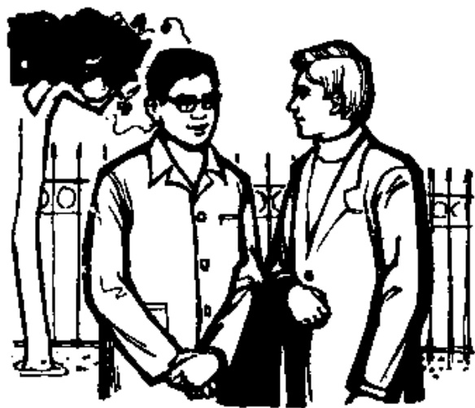
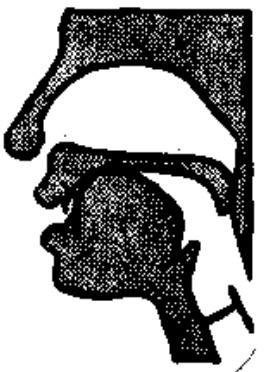
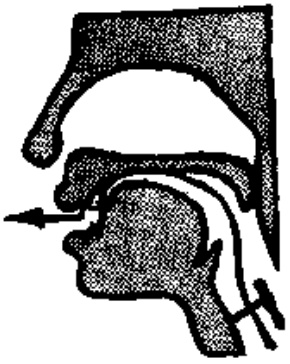
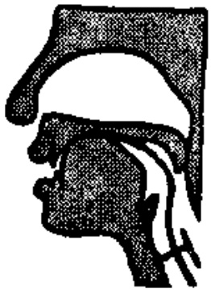
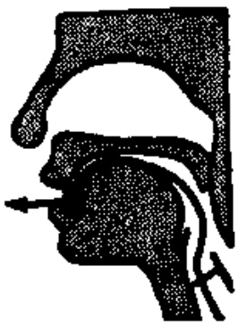
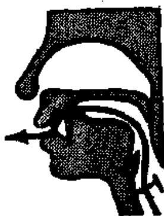

# 第三课 — Lesson 3

> OCR transcription; not manually verified. Source and confidence metadata are preserved per page.

<!-- source_pdf_page: 43; source_printed_page: 20; ocr_confidence: 0.9482 -->

## 一、会话 Conversation

A: Nǐ hǎo!

你 好!

B: Nǐ hǎo!

你 好!

A: Nǐ shēntǐ hǎo ma?

你身体好 吗?

B: Hěn hǎo, xièxie. Nǐ ne?

很 好，谢谢。你呢？

A: Yě hěn hǎo.

也 很 好。

<!-- source_pdf_page: 44; source_printed_page: 21; ocr_confidence: 0.9860 -->

## 二、生词和汉字 New Words and Chinese Characters

1. shēntǐ (名) 身体 body, health
2. xièxie (动) 谢谢 to thank
3. ne (助) 呢 a modal particle
4. yě (副) 也 also, too
5. liù (数) 六 six
6. qī (数) 七 seven
7. jiǔ (数) 九 nine
8. xiǎo small, little
9. bú kèqi You're welcome, not at all

## 三、韵母 Finals

ia ie iao iou (-iu)

## 四、声母 Initials

j q x sh

## 五、注释 Notes

1. 声母 j q x sh Initials j q x sh

j 舌面前部贴硬腭，舌尖顶下齿背，气流从舌面前部与硬腭间摩擦而出。声带不振动。

j is produced by raising the blade of the tongue to the hard palate, pressing the tip of the tongue against the back of the

<!-- source_pdf_page: 45; source_printed_page: 22; ocr_confidence: 0.9983 -->

lower teeth, and then squeezing the air out through the channel between the front of the tongue and the hard palate. The vocal cords do not vibrate.

q 发音部位与 j 一样，发音时要尽量送气。

j、q 发音示意图

(1) 准备

Lip-position

(2) 蓄气

Holding breath

(3) 发音

Releasing breath

q is produced in a similar way as j, except that q is post-aspirated; that is to say, it should be produced with a strong puff of breath.

x

x 舌面前部与硬腭相近，形成一条窄缝，气流摩擦而出。声带不振动。

x is produced by raising the blade of the tongue towards the hard palate, and then squeezing the air out through the channel between the front of the tongue and the hard palate. The vocal cords do not vibrate.

<!-- source_pdf_page: 46; source_printed_page: 23; ocr_confidence: 0.9918 -->

sh

sh 舌尖上卷，接近硬腭前端，气流从舌尖与硬腭间摩擦而出。声带不振动。

This is a retroflex consonant. It is produced by turning up the tip of the tongue towards the front of the hard palate and squeezing the air out through the channel between the tip of the tongue and the hard palate. The vocal cords do

not vibrate.

### 2. ie 中 e 的发音 Pronunciation of e in ie

复韵母 ie 和 üe（见第四课）中的 e 是极少单独使用的单韵母 ê [ɛ]。

e in ie and üe (in Lesson Four) is the simple final e [ɛ], which is seldom used by itself.

### 3. 三声变调（二） Changes in the 3rd tone (2)

第三声在第一、二、四声和绝大部分轻声前边出现时，读作半三声，就是只读原来第三声的前一半降调。

When a 3rd tone is followed by any tone except another 3rd, it changes into a half 3rd tone, which is the full tone minus its terminal rising part.

### 4. “不”的变调 Tone changes of 不

“不”单用或在第一、二、三声前读第四声 (bù)，在第四声前读第二声 (bú)。例如 bù máng, bú kèqi。

不 is pronounced in the 4th tone when it stands by itself or precedes a 1st, 2nd or a 3rd tone (bù), but it is pronounced in the 2nd tone when it precedes a 4th tone, e.g. bù máng, bú kèqi.

### 5. 拼写规则 Spelling rules

ia ie iao iou 自成音节时写成 ya ye yao you。

<!-- source_pdf_page: 47; source_printed_page: 24; ocr_confidence: 0.9867 -->

iou 前边加声母时写成 -iu, 例如: liù (六), jiǔ (九)。声调符号标在 u 上。

Standing alone as a syllable, ia is written as ya, ie as ye, iao as yao, and iou as you.

iou is written as -iu when it is preceded by an initial, and the tone-graph is placed above u, e.g. liù (六), jiǔ (九).

## 六、练习 Exercises

### 1. 四个声调 The four tones

|  shēn | shén | shěn | shèn—shēntǐ  |
| --- | --- | --- | --- |
|  xiē | xié | xiě | xiè—xièxie  |
|  yē | yé | yě | yè—yě  |
|  liū | liú | liǔ | liù—liù  |
|  qī | qí | qǐ | qì—qǐ  |
|  jiū | jiú | jiǔ | jiù—jiǔ  |
|  xiǎo | xiáo | xiǎo | xiào—xiǎo  |
|  kē | ké | kě | kè—kèqì  |

### 2. 辨音 Sound discrimination

|  jījí | jīqì | xīqí | xǐ qì  |
| --- | --- | --- | --- |
|  jití | qìtǐ | xítí | tījī  |
|  jiějí | jīxiè | jiàqī | jiěqià  |

### 3. 双音节词语 Disyllabic words

(1) 第一声加第一声 1st tone plus 1st tone

|  fēijī | fāshēng  |
| --- | --- |
|  jiāotōng | gōngkāi  |

(2) 第一声加第二声 1st tone plus 2nd tone

<!-- source_pdf_page: 48; source_printed_page: 25; ocr_confidence: 0.9767 -->

jūji

jiāo yóu

yāoqiú

biāotí

(3) 第一声加第三声 1st tone plus 3rd tone

gāngbí

shēntǐ

xiūlǐ

bāoguǒ

(4) 第一声加第四声 1st tone plus 4th tone

kōngqì

jīdàn

shēngdiào

xūyào

(5) 第一声加轻声 1st tone plus neutral tone

bōlǐ

xiāoxi

yīfu

xiūxi

4. 朗读会话 Read aloud the following conversation.

A: Nǐ shēntǐ hǎo ma?

B: Hěn hǎo, xièxie. Nǐ ne?

A: Wǒ yě hěn hǎo. Nǐ máng ma?

B: Hěn máng.

5. 汉字认读 Get to know Chinese characters.

A: 你好!

B: 你好!

A: 你身体好吗?

B: 很好, 谢谢。你呢?

A: 也很好。

<!-- source_pdf_page: 49; source_printed_page: 26; ocr_confidence: 0.9973 -->

## 汉字表 Table of Chinese Characters

> **Uncertainty:** OCR of character components and stroke forms is unreliable. This section is excluded from the default retrieval corpus.

|  1 | 身 | 丿丿有有有身  |   |
| --- | --- | --- | --- |
|  2 | 体 | 亻 | 體  |
|   |  | 本(一十才木本)  |   |
|  3 | 谢 | 氵(氵氵) | 謝  |
|   |  | 身  |   |
|   |  | 寸(一寸寸)  |   |
|  4 | 呢 | 口  |   |
|   |  | 尼(一冚尸尸尼)  |   |
|  5 | 也 | 丿也  |   |
|  6 | 六 | 二(二二)  |   |
|   |  | 八(八八)  |   |
|  7 | 七 | 一七  |   |
|  8 | 九 | 丿九  |   |
