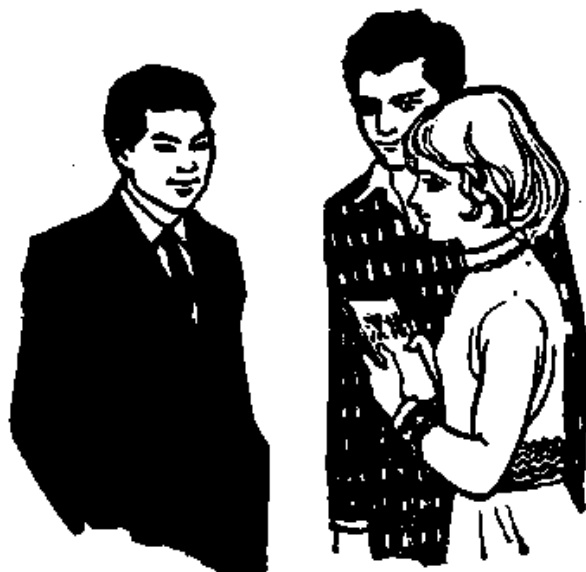

# 第四课 — Lesson 4

> OCR transcription; not manually verified. Source and confidence metadata are preserved per page.

<!-- source_pdf_page: 50; source_printed_page: 27; ocr_confidence: 0.9840 -->

## 一、会话 Conversation

A: Ni xuéxí shénme?

你学习什么？

B: Wǒ xuéxí Hànyǔ.

我学习汉语。

A: Tā xuéxí shénme?

他学习什么？

B: Tā yě xuéxí Hànyǔ.

他也学习汉语。

A: Hànyǔ nán ma?

汉语难吗？

<!-- source_pdf_page: 51; source_printed_page: 28; ocr_confidence: 0.9916 -->

B: Hànyǔ bù nán.

汉语不难。

## 二、生词和汉字 New Words and Chinese Characters

|  1. xuéxí | (动) 学习 | to learn, to study  |
| --- | --- | --- |
|  2. shénme | (代) 什么 | what  |
|  3. hànyǔ | (名) 汉语 | Chinese  |
|  4. tā | (代) 他 | he, him  |
|  5. nán | (形) 难 | difficult  |
|  6. tāmen | (代) 他们 | they, them  |
|  7. wèn |  | to ask  |
|  8. wèntí |  | question  |
|  9. huídá |  | answer  |
|  10. duì |  | right, correct  |

## 三、韵母 Finals

|  uan | uen(-un) | uang | ueng  |
| --- | --- | --- | --- |
|  üe | üan | ün |   |

## 四、注释 Notes

1. ong 与 ueng *ong* and *ueng*

ong 只能与声母相拼，不能独立自成音节；ueng 不能与声母相拼，只能自成音节，拼写成 weng。

*ong* cannot stand alone as a syllable, and it can only be combined with an initial. *ueng* stands alone as a syllable written as *weng*, and it cannot be combined with any initial.

<!-- source_pdf_page: 52; source_printed_page: 29; ocr_confidence: 0.9924 -->

### 2. 拼写规则 Spelling rules

uen 前边加声母时写成 -un. 例如：dūn (吨)。

ü 和由 ü 开头的韵母和 j q x 相拼时，ü 上的两点几省去。

üe、üan、ün 自成音节时，写作 yue、yuan、yun.

uen preceded by an initial is written as -un, e.g. dūn (吨)。

When j, q or x is followed by ü or a final beginning with ü, the two dots over ü are omitted.

Standing alone as a syllable, üe is written as yue, üan as yuan, and ün as yun.

## 五、练习 Exercises

### 1. 四个声调 The four tones

|  xuē | xué | xuě | xuè | —— | xuéxí  |
| --- | --- | --- | --- | --- | --- |
|  shēn | shén | shěn | shèn | —— | shénme  |
|  yū | yú | yǔ | yù | —— | Hànyǔ  |
|  wēn | wén | wěn | wèn | —— | wèn  |
|  tī | tí | tí | tì | —— | wèntí  |
|  huī | huí | huí | huì | —— | huídá  |
|  duì | duí | duí | duì | —— | duì  |

### 2. 辨音 Sound discrimination

|  jū | jiū | jǔ | jiǔ  |
| --- | --- | --- | --- |
|  qū | qiū | qú | qiú  |
|  xū | xiū | xù | xiù  |
|  wán | wáng | wēn | wēng  |
|  guàn | guàng | kuān | kuāng  |
|  jūn | xūn | quán | xuán  |

### 3. 双音节词语 Disyllabic words

<!-- source_pdf_page: 53; source_printed_page: 30; ocr_confidence: 0.9891 -->

(1) 第二声加第一声 2nd tone plus 1st tone
guójiā yuánguì
lóutí máoyí
(2) 第二声加第二声 2nd tone plus another 2nd
tuánjié tóngxué
yóujú lánqiú
(3) 第二声加第三声 2nd tone plus 3rd tone
niúnǎi píjiǔ
quántǐ yóulǎn
(4) 第二声加第四声 2nd tone plus 4th tone
xuéxiào xuéyuàn
hánjià yúkuài
(5) 第二声加轻声 2nd tone plus neutral tone
péngyou pútao
mántou biéde

4. 朗读短句 Read aloud the following sentences.

(1) Wǒ wèn wèntí, nǐmen huídá.
(2) Duì bu duì?
(3) Duì le.
(4) Bú duì.

5. 汉字认读 Get to know Chinese characters.

A: 你学习什么?

B: 我学习汉语。

A: 他学习什么?

B: 他也学习汉语。

<!-- source_pdf_page: 54; source_printed_page: 31; ocr_confidence: 0.9456 -->

A: 汉语难吗?

B: 汉语不难。

## 汉字表 Table of Chinese Characters

> **Uncertainty:** OCR of character components and stroke forms is unreliable. This section is excluded from the default retrieval corpus.

|  1 | 学 | 𠂇 ( 𠂇 𠂇 𠂇 𠂇 ) | 學  |
| --- | --- | --- | --- |
|   |  | 子 |   |
|  2 | 习 | 冂冂习 | 習  |
|  3 | 什 | 亻 | 甚  |
|   |  | 十 (一十) |   |
|  4 | 么 | 𠂇 𠂇 𠂇 | 麼  |
|  5 | 汉 | 氵 ( 𠂇 𠂇 ) | 漢  |
|   |  | 又 (冂又) |   |
|  6 | 语 | 讠 | 語  |
|   |  | 吾 五 |   |
|   |  | 口 |   |
|  7 | 他 | 亻 |   |
|   |  | 也 |   |
|  8 | 难 | 又 | 難  |
|   |  | 隹 ( 𠂇 亻 亻 仆 仆隹隹) |   |
