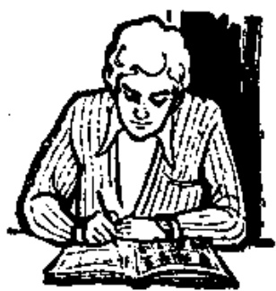
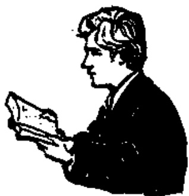
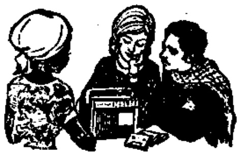
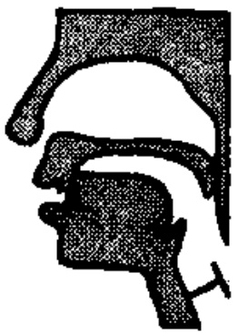
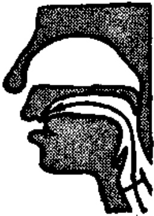
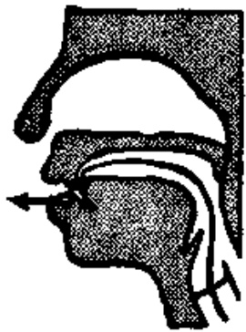
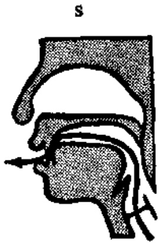

# 第五课 — Lesson 5

> OCR transcription; not manually verified. Source and confidence metadata are preserved per page.

<!-- source_pdf_page: 55; source_printed_page: 32; ocr_confidence: 0.9731 -->

## 一、会话 Conversation

A: Nǐ zuò shénme ne?

你作 什么呢?

B: Wǒ xiè Hànzì ne.

我写汉字呢。

A: Tā zuò shénme ne?

他作 什么呢?

B: Tā niàn shēngcì ne.

他念生词呢。

A: Tāmen zuò shénme ne?

他们作 什么呢?

B: Tāmen tīng lùyīn ne.

他们听录音呢。

<!-- source_pdf_page: 56; source_printed_page: 33; ocr_confidence: 0.9910 -->

## 二、生词和汉字 New Words and Chinese Characters

1. zuò (动) 作 to do, to make
2. xiě (动) 写 to write
3. Hànzì (名) 汉字 Chinese character
4. niàn (动) 念 to read
5. shēngcí (名) 生词 new word
6. tīng (动) 听 to listen, to hear
7. lù yīn 录音 record
8. èr (数) 二 two
9. sān (数) 三 three
10. sì (数) 四 four
11. zàijiàn goodbye

## 三、韵母 Finals

ian in iang ing iong
er
-i[1]

## 四、声母 Initials

z c s

## 五、注释 Notes

1. 韵母 er Final er

<!-- source_pdf_page: 57; source_printed_page: 34; ocr_confidence: 0.9957 -->

er 是一个卷舌韵母。在发单韵母 e [ə] 时，把舌尖稍卷起来对着硬腭，就可以发出 er 的音。

er 可以自成音节，如：èr（二）。

er is a retroflex final formed by producing the simple final e [ə] with the tip of the tongue turned up towards the hard palate. er can stand alone as a syllable, e.g. èr（二）.

2. 声母 z c s Initials z, c, s

z,c 发音示意图

(1) 准备
Lip-position

(2) 替气
Holding breath

(3) 发音
Releasing breath

z 舌尖平伸，抵上齿背，然后气流冲开一条窄缝，摩擦而出。声带不振动。

c 是跟 z 相对的送气音。

s 舌尖靠近上齿背，构成窄缝，气流摩擦而出，声带不振动。

z is produced by first pressing the tip of the tongue against the back of the upper teeth, and then moving it away a little and squeezing the air out through the channel thus made. The vocal cords do not vibrate.

c is the same as z except that it is aspirated.

<!-- source_pdf_page: 58; source_printed_page: 35; ocr_confidence: 0.9948 -->

s is produced by raising the tip of the tongue towards the back of the upper teeth and squeezing the air out through the channel between the blade of the tongue and the upper teeth. The vocal cords do not vibrate.

3. zi ci si 中的韵母 The final in zi, ci, si

zi ci si 中的韵母是否尖前元音[i], 用 i 表示。zi ci si 中的韵母 i 一定不能读成 [i]。

The final in zi, ci, si is the blade-alveolar vowel [l]. It should not be confused with [i], which is also represented by i.

## 六、练习 Exercises

1. 四个声调 The four tones

|  zuǒ | zuó | zuǒ | zuò | — | zuò  |
| --- | --- | --- | --- | --- | --- |
|  zǐ | zǐ | zǐ | zì | — | Hànzì  |
|  niān | nián | niǎn | niàn | — | niàn  |
|  cī | cí | cǐ | cì | — | shēngcí  |
|  tīng | tíng | tǐng | tìng | — | tǐng  |
|  lū | lú | lǔ | lù | — | lùyīn  |
|  ēr | ér | ěr | èr | — | èr  |
|  sān | sán | sǎn | sàn | — | sǎn  |
|  sī | sí | sǐ | sì | — | sì  |
|  zāi | zái | zǎi | zài | — | zàijiàn  |

2. 双音节词语 Disyllabic words

(1) 第三声加第一声 3rd tone plus 1st tone

<!-- source_pdf_page: 59; source_printed_page: 36; ocr_confidence: 0.9673 -->

Běijīng

shǒudū

zǎocāo

měitiān

(2) 第三声加第二声 3rd tone plus 2nd tone

zǔguó

lǚxíng

yǔyán

zǒuláng

(3) 第三声加第三声 3rd tone plus another 3rd

xīzǎo

shǒubiǎo

shuǐguǒ

fǔdǎo

(4) 第三声加第四声 3rd tone plus 4th tone

yǒuyì

qíngzuò

cǎisè

zǎofàn

(5) 第三声加轻声 3rd tone plus neutral tone

zǎoshang

yīzi

mǔqīn

jiějie

3. 朗读会话 Read aloud the following conversation.

A: Nǐ zuò shénme ne?

B: Wǒ niàn shēngcí, xiě· Hànzì ne.

A: Nǐ niàn, wǒ tīng, hǎo ma?

B: Hǎo. …… Duì bu duì?

A: Duì le.

B: Xièxie.

A: Bú kèqì.

4. 汉字认读 Get to know Chinese characters.

A: 你作什么呢?

B: 我写汉字呢。

A: 他作什么呢?

<!-- source_pdf_page: 60; source_printed_page: 37; ocr_confidence: 0.9609 -->

B: 他念生词呢。

A: 他们作什么呢？
B：他们听录音呢。

## 汉字表 Table of Chinese Characters

> **Uncertainty:** OCR of character components and stroke forms is unreliable. This section is excluded from the default retrieval corpus.

|  1 | 作 | 亻  |   |
| --- | --- | --- | --- |
|   |  | 乍（丿乍乍乍乍）  |   |
|  2 | 写 | 冖（丿冖） | 寫  |
|   |  | 与（一与与）  |   |
|  3 | 字 | 宀（丶宀丶丶）  |   |
|   |  | 子  |   |
|  4 | 念 | 今（丿人今今）  |   |
|   |  | 心（丿心心心）  |   |
|  5 | 生 | 丿（一一生生）  |   |
|  6 | 词 | 讠 | 詞  |
|   |  | 司（丁司司）  |   |
|  7 | 听 | 口 | 聽  |
|   |  | 斤（斤斤斤）  |   |

<!-- source_pdf_page: 61; source_printed_page: 38; ocr_confidence: 0.9828 -->

|  8 | 录 | 三（フロ三） | 録  |
| --- | --- | --- | --- |
|   |  | 氷（丨リヌオ氷） |   |
|  9 | 音 | 立（・シテテ立） |   |
|   |  | 日（丨月日日） |   |
|  10 | 二 | 一二 |   |
|  11 | 三 | 一二三 |   |
|  12 | 四 | 丨冂冂冂四 |   |
