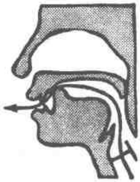
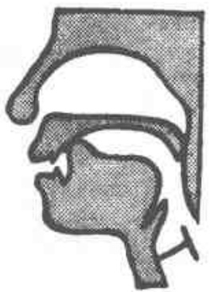
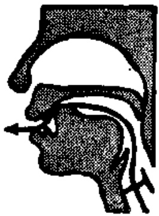

# 第六课 — Lesson 6

> OCR transcription; not manually verified. Source and confidence metadata are preserved per page.

<!-- source_pdf_page: 62; source_printed_page: 39; ocr_confidence: 0.9965 -->

## 一、会话 Conversation

A: Zhè wèi shì Wáng lǎoshī ma?

这位是王老师吗?

B: Zhè wèi shì Wáng lǎoshī.

这位是王老师。

A: Nà wèi shì Zhāng lǎoshī ma?

那位是张老师吗?

B: Nà wèi shì Zhāng lǎoshī.

那位是张老师。

A: Nà wèi yě shì lǎoshī ma?

那位也是老师吗?

<!-- source_pdf_page: 63; source_printed_page: 40; ocr_confidence: 0.9842 -->

B: Yě shì lǎoshī.

也是老师。

A: Tāmen qù nǎr?

他们去哪儿？

B: Tāmen qù Tiān'ānmén.

他们去 天安门。

## 二、生词和汉字 New Words and Chinese Characters

|  1. zhè | (代) | 这 | this  |
| --- | --- | --- | --- |
|  2. wèi | (量) | 位 | *a measure word for persons*  |
|  3. shì | (动) | 是 | to be  |
|  4. Wáng | (专) | 王 | Wang, *a surname*  |
|  5. lǎoshī | (名) | 老师 | teacher  |
|  6. nà | (代) | 那 | that  |
|  7. Zhāng | (专) | 张 | Zhang, *a surname*  |
|  8. qù | (动) | 去 | to go  |
|  9. nǎr | (代) | 哪儿 | where  |
|  10. Tiān'ānmén | (专) | 天安门 | Tian'anmen Square  |
|  11. shí | (数) | 十 | ten  |
|  12. zhèr | (代) | 这儿 | here  |
|  13. nàr | (代) | 那儿 | there  |

<!-- source_pdf_page: 64; source_printed_page: 41; ocr_confidence: 0.9814 -->

14. zázhì

magazine

15. běnzi

note-book, exercise-

book

16. «Rénmín

People's Daily

Rìbào»

## 三、韵母 Finals

-i [1]

## 四、声母 Initials

zh ch (sh) r

## 五、注释 Notes

1. 声母 zh ch (sh) r Initials zh, ch, (sh), r

zh、ch 发音示意图

(1) 准备

Lip-position

(2) 蓄气

Holding breath

(3) 发音

Releasing breath

zh 发音时舌尖稍往上卷，顶住硬腭前端，气流从舌尖与硬腭间摩擦而出。声带不振动。

ch 是与 zh 相对的送气音。

<!-- source_pdf_page: 65; source_printed_page: 42; ocr_confidence: 0.9962 -->

r 发音部位跟 sh（见第三课）一样，但 r 是浊擦音，声带振动。

zh is a retroflex consonant. It is produced by first turning up the tip of the tongue against the front of the hard palate and then loosening it and squeezing the air out through the channel thus made. The vocal cords do not vibrate.

ch is the same as zh except that it is aspirated.

r is the voiced fricative corresponding to sh (see Lesson Three), so in producing this sound the vocal cords vibrate.

2. zhi chi shi ri 中的韵母 The final in zhi, chi, shi ri zhi chi shi ri 中的韵母是否尖后元音 [l] 用 i 表示。zhi chi shi ri 中的韵母 i 一定不能读成 [i]。

The final in zhi, chi, shi and ri is the blade-palatal vowel [ʃ]. It should not be confused with [i], which is also represented by i.

3. 几化韵母 Retroflex finals

有时韵母 er 跟其他韵母结合成几化韵母。几化韵母拼写时在原韵母后加 r（表示卷舌），汉字写法是在原汉字后加“儿”。例如：zhèr（这儿）、nàr（那儿）。

The retroflex suffix er is sometimes attached to another final to form a retroflex final, which is transcribed by adding the letter r to the retroflexed final and adding the character 几 to the retroflexed character, e.g. zhèr（这儿），nàr（那儿）

4. 隔音符号 Dividing mark

a o e 开头的音节连接在其他音节后边时，为了使音节界

<!-- source_pdf_page: 66; source_printed_page: 43; ocr_confidence: 0.9912 -->

限清楚，不致混淆，要用隔音符号（’）隔开。例如：Tiān’ānmén.

When a syllable beginning with *a*, *o* or *e* follows another syllable, the dividing mark (’) should be put in between, so as to avoid any confusion over the syllable boundary, e.g. Tiān’ānmén.

## 六、练习 Exercises

### 1. 四个声调 The four tones

|  zhē | zhé | zhě | zhè —— zhè, zhèr  |
| --- | --- | --- | --- |
|  wēi | wéi | wěi | wèi —— wèi  |
|  shī | shí | shǐ | shì —— shì, shí  |
|  wāng | wáng | wǎng | wàng —— wáng  |
|  lāo | láo | lǎo | lào —— lǎoshī  |
|  nā | ná | nǎ | nà —— nà, nǎr, nàr  |
|  zhāng | zháng | zhǎng | zhàng —— zhāng  |
|  qū | qú | qǔ | qù —— qù  |
|  tiān | tián | tiǎn | tiàn —— Tiān’ānmén  |
|  zā | zá | zǎ | zà —— zázhì  |
|  bēn | bén | běn | bèn —— běnzi  |
|  rēn | rén | rěn | rèn —— rénmín  |
|  rǐ | rí | rǐ | rì —— ribào  |

### 2. 双音节词语 Disyllabic words

#### (1) 第四声加第一声 4th tone plus 1st tone

|  miànbāo | chènyī  |
| --- | --- |
|  qìchē | zhànzhēng  |

#### (2) 第四声加第二声 4th tone plus 2nd tone

|  wèntí | rèqíng  |
| --- | --- |
|  nèiróng | wèilái  |

<!-- source_pdf_page: 67; source_printed_page: 44; ocr_confidence: 0.9811 -->

(3) 第四声加第三声 4th tone plus 3rd tone
dàshì wò shǒu
shàngwǔ xiàwǔ
(4) 第四声加第四声 4th tone plus another 4th
zàijiàn shìyàn
zhèngzhì shènglì
(5) 第四声加轻声 4th tone plus neutral tone
bàba mèimei
dìdi xièxie

3. 朗读会话 Read aloud the following conversation.

A: Zhè shì zázhì ma?

B: Zhè shì zázhì.

A: Nà shì běnzi ma?

B: Nà shì běnzi.

A: Zhè shì shénme?

B: Zhè shì «Rénmín Rìbào».

* * *

A: Lǎoshí hǎo!
B:

C: Nǐmen hǎo!

A: Lǎoshí shēntí hǎo ma?

C: Hěn hǎo, xièxie. Nǐmen qù nǎr?

A: Wǒmen qù Tiān'ǎnmén.
B:

4. 汉字认读 Get to know Chinese characters

A: 这位是王老师吗?

B: 这位是王老师。

<!-- source_pdf_page: 68; source_printed_page: 45; ocr_confidence: 0.9548 -->

A: 那位是张老师吗?

B: 那位是张老师。

A: 他们去哪儿?

B: 他们去天安门。

* * *
一  二  三  四  五
六  七  八  九  十

## 汉字表 Table of Chinese Characters

> **Uncertainty:** OCR of character components and stroke forms is unreliable. This section is excluded from the default retrieval corpus.

|  1 | 这 | 文（丶丶丶文） | 這  |
| --- | --- | --- | --- |
|   |  | 乚（丶乚）  |   |
|  2 | 位 | 亻  |   |
|   |  | 立  |   |
|  3 | 是 | 亻  |   |
|   |  | 疋（一丅丅疋疋）  |   |
|  4 | 王 | 一二丅王  |   |
|  5 | 老 | 尹（一丅尹）  |   |
|   |  | 匕（匕）  |   |

<!-- source_pdf_page: 69; source_printed_page: 46; ocr_confidence: 0.8710 -->

|  6 | 师 | リ ( リ ) |   |
| --- | --- | --- | --- |
|   |  | 市 | 一  |
|   |  | 中 ( 1 1 1 中 ) |   |
|  7 | 那 | ヨ ( 1 1 1 1 1 1 ) |   |
|   |  | ド ( 1 1 1 1 1 ) |   |
|  8 | 张 | ヂ ( 1 1 1 1 1 ) | 張  |
|   |  | 长 ( 1 1 1 1 1 1 ) |   |
|  9 | 去 | 土 ( 1 1 1 土 ) |   |
|   |  | ム ( 1 1 1 1 1 ) |   |
|  10 | 哪 | 口 |   |
|   |  | 那 |   |
|  11 | 儿 | 丿儿 |   |
|  12 | 天 | 一 |   |
|   |  | 大 ( 1 1 大 ) |   |
|  13 | 安 | 宀 |   |
|   |  | 女 |   |
|  14 | 门 |  | 門  |
|  15 | 十 | 一十 |   |
