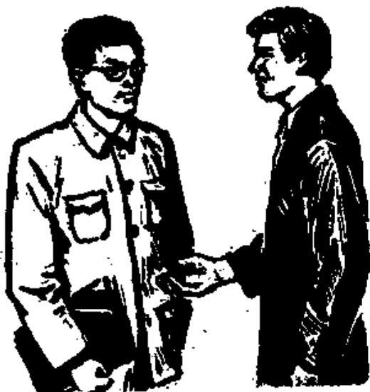

# 第七课 — Lesson 7

> OCR transcription; not manually verified. Source and confidence metadata are preserved per page.

<!-- source_pdf_page: 70; source_printed_page: 47; ocr_confidence: 0.9959 -->

## 一、会话 Conversation

A: Nín shì lǎoshī ma?

您①是老师吗？

B: Wǒ shì lǎoshī.

我是老师。

A: Nín shì nǎ guó rén?

您是哪国人？

B: Wǒ shì Zhōngguó rén.

我是中国人。

A: Nín guì xìng?

您贵姓②？

B: Wǒ xìng Wáng.

我姓王。

<!-- source_pdf_page: 71; source_printed_page: 48; ocr_confidence: 0.9891 -->

A: Tā shì lǎoshī ma?

他是老师吗?

B: Tā bú shì lǎoshī, shì xuésheng.

他不是老师，是学生。

A: Tā shì nǎ guó rén?

他是哪国人?

B: Tā shì Yīngguó rén.

他是英国人。

A: Tā jiào shénme míngzi?

他叫什么名字?

B: Tā jiào Hālì.

他叫哈利。

## 二、生词和汉字 New Words and Chinese Characters

|  1. nín | (代) 您 | polite form of 你  |
| --- | --- | --- |
|  2. nǎ | (代) 哪 | which  |
|  3. guó | (名) 国 | country  |
|  4. rén | (名) 人 | person  |
|  5. Zhōngguó | (专) 中国 | China  |
|  6. guì xìng | 贵姓 | (May I) ask your name?  |
|  7. xuésheng | (名) 学生 | student  |
|  8. Yīngguó | (专) 英国 | Britain  |
|  9. jiào | (动) 叫 | to call  |

<!-- source_pdf_page: 72; source_printed_page: 49; ocr_confidence: 0.9551 -->

10. mingzi (名) 名字 name
11. Hālì (专) 哈利 Harley

## 三、韵母和声母小结 Phonetics Summary

|  韵母 Finals | 单韵母 Simple finals  |   |   |   |   |
| --- | --- | --- | --- | --- | --- |
|   |  a[a] | o[o] | e[v] | ê[ɛ] | i[i]  |
|   |  u[u] | ü[y] | -i[ɪ][i] | er[ər] |   |
|   |  复韵母 Compound finals  |   |   |   |   |
|   |  ai[ai] | ei[ei] | ao[au] | ou[əu] |   |
|   |  ia[ia] | ie[iɛ] | iao[iau] | iou(-iu)[iəu] |   |
|  Finals | ua[ua] | uo[uo] | uai[uai] | uei(-ui)[uei] |   |
|   |  üe[yɛ] |  |  |  |   |
|   |  鼻韵母 Nasal finals  |   |   |   |   |
|   |  an[an] | en[ən] | ang[an] | eng[ən] | ong[uŋ]  |
|   |  ian[iɛn] | in[in] | iang[ian] | ing[iŋ] | iong[iun]  |
|   |  uan[uan] | uen(-un)[uən] |  | uang[uan] | ueng*[uən]  |
|  声母 Initials | üan[yan] | ün[yn] |  |  |   |
|   |  唇音 Labials b[p] |   | p[p'] | m[m] | f[f]  |
|   |  舌尖音 Alveolars d[t] |   | t[t'] | n[n] | l[l]  |
|   |  舌尖前音 Blade-alveolars z[tʃ] |   | c[tʃ'] | s[ʃ] |   |
|   |  舌尖后音 Blade-palatals zh[tʃ] |   | ch[tʃ'] | sh[ʃ] |   |
|   |  r[ʒ] |   |  |  |   |
|   |  舌面音 Alveolars j[tə] |   | q[tə'] | x[ə] |   |
|  舌根音 Velars g[k] |   | k[k'] | h[x] |  |   |

<!-- source_pdf_page: 73; source_printed_page: 50; ocr_confidence: 0.9846 -->

## 四、注释 Notes

#### ① “您”

“您”是第二人称代词“你”的尊称。对老年人或长辈讲话时称“您”。为了表示礼貌，对与自己年龄相仿的人，特别是初次见面时也可用“您”称呼。

您 is the polite form of 你 used to address old people or seniors. It is also used as a courteous form of address for people who are about the same age as oneself, especially when one meets them for the first time.

#### ② “您贵姓” May I ask your (honourable) name?

这是询问对方姓氏的一种客气的提问法。回答时可以说“我姓…”，也可以说全名“我叫…”。

This is a polite way of asking somebody's name. The answer is 我姓… or 我叫….

## 五、练习 Exercises

#### 1. 辨音 Sound discrimination

zh ch

zhīdao

chídào

zhǔxí

chūxí

Zhōngwén

chōngfèn

zh j

zhīshi

jǐqì

zhìdù

jìshù

zhèngquè

jǐngquè

ch q

chī fàn

qīxiàn

<!-- source_pdf_page: 74; source_printed_page: 51; ocr_confidence: 0.9846 -->

chuān yī

quǎntí

chūntiān

qúnzhòng

2. 双音节词语 Disyllabic words

(1) Xī'ān

kēxué

gōngchǎng

zhuānyè

chuānghu

(2) Cháng Jiāng

lúnchuán

mínzhǔ

róngyì

liángshì

(3) huǒchē

huǒchái

zhǎnlǎn

zhǔnbèi

zhěntou

(4) diànchē

jìn chéng

zhèngfǔ

shuì jiào

shìqíng

3. 三音节词语 Trisyllabic words

liúxuéshēng

dàshíguān

bàngōngshì

fēijīchǎng

4. 朗读会话 Read aloud the following conversation.

A: Nín hǎo!

B: Nín hǎo! Nín shì nǎ guó rén?

A: Wǒ shì Zhōngguó rén.

B: Nín guì xìng?

A: Wǒ xìng Wáng, jiào Wáng Yǒuwén.

Nín shì nǎ guó rén?

B: Wǒ shì Yīngguó rén.

A: Nín jiào shénme míngzi?

B: Wǒ jiǎo Hālì.

<!-- source_pdf_page: 75; source_printed_page: 52; ocr_confidence: 0.9896 -->

5. 汉字认读 Get to know Chinese characters.

A: 您是老师吗？
B: 我不是老师，我是学生。

A: 您是哪国人？
B: 我是中国人。

A: 您贵姓？
B: 我姓张。您是哪国人？

A: 我是英国人。
B: 您叫什么名字？

A: 我叫哈利。

## 汉字表 Table of Chinese Characters

> **Uncertainty:** OCR of character components and stroke forms is unreliable. This section is excluded from the default retrieval corpus.

|  1 | 您 | 你  |   |   |
| --- | --- | --- | --- | --- |
|   |  | 心  |   |   |
|  2 | 国 | 口 | 门国国 | 國  |
|   |  | 玉（王玉）  |   |   |
|  3 | 人 |   |   |   |
|  4 | 中 | 丨口口中  |   |   |

<!-- source_pdf_page: 76; source_printed_page: 53; ocr_confidence: 0.9946 -->

|  5 | 貴 | 卅 (卅卅) | 貴  |
| --- | --- | --- | --- |
|   |  | 贝 (丨丌贝贝) |   |
|  6 | 姓 | 女 |   |
|   |  | 生 |   |
|  7 | 英 | 艹 (艹艹) |   |
|   |  | 央 (丨丌央央) |   |
|  8 | 叫 | 口 |   |
|   |  | 丬 (丿丬) |   |
|  9 | 名 | 夕 (夕夕) |   |
|   |  | 口 |   |
|  10 | 哈 | 口 |   |
|   |  | 合 (人合) |   |
|  11 | 利 | 禾 (禾禾禾) |   |
|   |  | 刂 (刂刂) |   |
