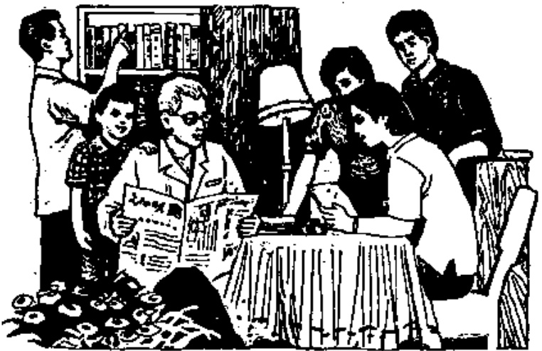

# 第八课 — Lesson 8

> OCR transcription; not manually verified. Source and confidence metadata are preserved per page.

<!-- source_pdf_page: 77; source_printed_page: 54; ocr_confidence: 0.9699 -->

## 一、会话 Conversation

A: Nǐ jiā yǒu jǐ kǒu rén?

你家有几口人?

B: Wǒ jiā yǒu liù kǒu rén: bàba, māma,

我家有六口人：爸爸、妈妈、

gēge, dìdì, mèimei hé wǒ.

哥哥、弟弟、妹妹和我。

A: Nǐ bàba zuò shénme gōngzuò?

你爸爸作什么工作?

B: Wǒ bàba shì dàifu.

我爸爸是大夫。

<!-- source_pdf_page: 78; source_printed_page: 55; ocr_confidence: 0.9405 -->

A: Ní māma ne?

你妈妈呢?

B: Wó māma shì lǎoshī.

我妈妈是老师。

A: Ní gēge gōngzuò ma?

你哥哥工作 吗?

B: Tā gōngzuò, tā shì gōngrén.

他工作, 他是工人。

A: Ní dìdì hé mèimei ne?

你弟弟和妹妹呢?

B: Tāmen dōu shì xuésheng.

他们都是学生。

## 二、生词和汉字 New Words and Chinese Characters

|  1. jiā | (名) | 家 | family  |
| --- | --- | --- | --- |
|  2. yóu | (动) | 有 | to have, there is / are  |
|  3. jí | (代) | 几 | how many, several  |
|  4. kǒu | (量) | 口 | *a measure word for wells, family members, etc.*  |
|  5. bàba | (名) | 爸爸 | papa, father  |
|  6. māma | (名) | 妈妈 | mama, mother  |
|  7. gēge | (名) | 哥哥 | elder brother  |

<!-- source_pdf_page: 79; source_printed_page: 56; ocr_confidence: 0.9849 -->

8. dìdì (名) 弟弟 younger brother
9. mèimei (名) 妹妹 younger sister
10. hé (连) 和 and
11. gōngzuò (动,名) 工作 to work; work, job
12. dàifu (名) 大夫 doctor
13. gōngrén (名) 工人 worker
14. dōu (副) 都 all
15. jiějie elder sister
16. zhíyuán staff
17. gōngchéngshǐ engineer

## 三、练习 Exercises

### 1. 轻声 Neutral tone

(1) 第一声加轻声 1st tone plus neutral tone
zhuōzi zhìshì
shūshu xiǎnsheng
(2) 第二声加轻声 2nd tone plus neutral tone
yéye tóufa
bízi késou
(3) 第三声加轻声 3rd tone plus neutral tone
wǎnshang nǎinai
sǎngzi nuǎnhuo
(4) 第四声加轻声 4th tone plus neutral tone
yìsi piàoliang
màozi fùqīn

<!-- source_pdf_page: 80; source_printed_page: 57; ocr_confidence: 0.9929 -->

### 2. 三音节词语 Trisyllabic words

|  pīngpāngqiú | shōuyǐnjī  |
| --- | --- |
|  kēxuéyuàn | yóuyǒngchí  |
|  yǔmáoqiú | dàshíguǎn  |
|  zhàoxiàngjī | yuèlǎnshì  |

### 3. 四音节连续 Four-syllable phrases

|  zēngjìn yóuyì | cānjiā yànhuì  |
| --- | --- |
|  hùxiāng bāngzhù | duànliàn shěntí  |
|  yǒuhǎo fǎngwèn | rèliè huānyíng  |
|  tǐyù bǐsài | wénhuà jiāoliú  |

### 4. 朗读会话 Read aloud the following conversation.

A: Ní hǎo!

B: Ní hǎo! Ní jiā yǒu jí kǒu rén?

A: Wǒ jiā yǒu sì kǒu rén: bàba, māma, jiějie hé wǒ.

B: Ní bàba zuò shénme gōngzuò?

A: Wǒ bàba shì gōngchéngshī.

B: Ní māma yě shì gōngchéngshī ma?

A: Bù, wǒ māma shì zhíyuán.

B: Ní jiějie ne?

A: Tā yě shì zhíyuán.

### 5. 汉字认读 Get to know Chinese characters.

A: 你家有几口人?

B: 我家有五口人: 爸爸、妈妈、弟弟、妹妹和我。

A: 你爸爸作什么工作?

<!-- source_pdf_page: 81; source_printed_page: 58; ocr_confidence: 0.9905 -->

B: 我爸爸是老师。

A: 你妈妈工作吗?

B: 她不工作。

A: 你弟弟和妹妹呢?

B: 他们都是学生。

## 汉字表 Table of Chinese Characters

> **Uncertainty:** OCR of character components and stroke forms is unreliable. This section is excluded from the default retrieval corpus.

|  1 | 家 | 宀  |   |
| --- | --- | --- | --- |
|   |  | 豕（一丕丐丐丐丐豕）  |   |
|  2 | 有 | 大（一大）  |   |
|   |  | 月（丨月月月）  |   |
|  3 | 几 | 丨几 | 幾  |
|  4 | 口 |   |   |
|  5 | 爸 | 父（丶丶丐父）  |   |
|   |  | 巴（丕丕丕巴）  |   |
|  6 | 妈 | 女 | 媽  |
|   |  | 马  |   |
|  7 | 哥 | 哥（一哥哥）  |   |

<!-- source_pdf_page: 82; source_printed_page: 59; ocr_confidence: 0.9749 -->

|   |  | 可  |
| --- | --- | --- |
|  8 | 弟 | “ ( ‘ ” )  |
|   |  | 弟 ( 一 二 三 弓 弟 )  |
|  9 | 妹 | 女  |
|   |  | 未 ( 一 二 丰 才 未 )  |
|  10 | 和 | 秆  |
|   |  | 口  |
|  11 | 工 | 一 丁 工  |
|  12 | 大 |   |
|  13 | 夫 | 一  |
|   |  | 大  |
|  14 | 都 | 尹  |
|   |  | 𠄎  |
|   |  | 𠄎  |

## 课堂用语 Classroom Expressions

1. Xiànzài shàngkè, jīntiān xuéxí dì ... kè.
Let's begin now. We're going to study Lesson ...today.
2. Qǐng dǎ kāi shū, fān dào dì ... yè.
Open your books please. Turn to page ...
3. Qǐng tīng wǒ niàn.

<!-- source_pdf_page: 83; source_printed_page: 60; ocr_confidence: 0.9893 -->

Listen to me while I read.

4. Qíng gēn wǒ niàn.

Read after me please.

5. Qíng nǐ niàn.

Read please.

6. Qíng zài niàn yí biàn.

Read again please.

7. Zhùyì fāyǐn, zhùyì shēngdiào.

Pay attention to pronunciation and tones.

8. Zhùyì bǐhuà, zhùyì bǐshùn.

Pay attention to strokes and stroke order.

9. Gēn wǒ shuō.

Say after me.

10. Zài shuō yí biàn.

Say it again.

11. Wǒ wèn, qíng nǐ huídá.

I'll ask, and you answer please.

12. Nǐ wèn, tā huídá.

You ask, he (she) answers.

13. Xiànzài tīngxiě, wǒ niàn, nǐmen xiě.

Let's have a dictation now. I'll read, you write.

14. Xiànzài liú zuòyè.

Here's the homework for today.

15. Qíng fùxí jiù kè, niàn kèwén.

Please review the previous lesson(s), and read the text(s).

16. Qíng yùxí shēngcí, yùxí xīn kèwén.

Please preview the new words and the text we are going to study.

<!-- source_pdf_page: 84; source_printed_page: 61; ocr_confidence: 0.9696 -->

17. Qing bǎ běnzi gěi wǒ.

Give me your exercise-books please.

18. Míngtiān cèyàn.

We're going to have a test tomorrow.

19. Xiànzài xiūxi.

Let's take a break.

20. Xiànzài xiàkè.

The class is over.
