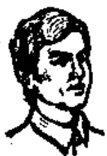

# 第九课 — Lesson 9

> OCR transcription; not manually verified. Source and confidence metadata are preserved per page.

<!-- source_pdf_page: 85; source_printed_page: 62; ocr_confidence: 0.9877 -->

我是学生。

他不是学生。

你是学生吗？

## 一、替换练习 Substitution Drills

1. 他是学生吗？

他是学生。

老师 工人

丈夫 工程师

2. 她①是工人吗？

她不是工人。

学生 老师

丈夫 英国人

3. 你是老师吗？

我不是老师，

我是学生。

他 她 他们

哈利 你们

她们 丁丈

<!-- source_pdf_page: 86; source_printed_page: 63; ocr_confidence: 0.9771 -->

4. 这是书吗?

这不是书, 那
是书。

纸 报 画报

本子 钢笔

铅笔 圆珠笔

5. 那是画报吗?

那不是画报,
那是本子。

钢笔, 铅笔

本子, 书

铅笔, 圆珠笔

## 二、课文 Text

(一)

A: 你是 学生 吗?

Nǐ shì xuéshēng ma?

B: 我是 学生。

Wǒ shì xuéshēng.

A: 他是 学生 吗?

Tā shì xuéshēng ma?

B: 他不是 学生, 他是老师。

Tā bú shì xuéshēng, tā shì lǎoshī.

A: 她也是老师吗?

Tā yě shì lǎoshī ma?

B: 不, 她不是老师, 她是大夫。

Bù, tā bú shì lǎoshī, tā shì dàifu.

<!-- source_pdf_page: 87; source_printed_page: 64; ocr_confidence: 0.9760 -->

(二)

Dīng Wén shì Zhōngguó rén, tā shì
丁文是中国人，他是
xuéshēng, tā xuéxi Yīngyǔ. Hālì shì Yīng
学生，他学习英语。哈利是英
guó rén, tā shì liú xuéshēng, tā xuéxi
国人，他是留学生，他学习
Hànyǔ. Dīng Wén hé Hālì shì péngyou,
汉语。丁文和②哈利是朋友，
tāmen zài Běijīng Yǔyán Xuéyuàn xuéxi.
他们在北京语言学院学习。

## 三、生词 New Words

1. 工程师 (名) gōngchéngshī engineer
2. 她 (代) tā she, her
3. 她们 (代) tāmen they, them
4. 丁文 (专) Dīng Wén Dīng Wen, a person's name
5. 书 (名) shū book
6. 纸 (名) zhí paper
7. 报 (名) bào newspaper
8. 画报 (名) huàbào pictorial

<!-- source_pdf_page: 88; source_printed_page: 65; ocr_confidence: 0.9855 -->

9. 本子 (名) běnzi note-book, exercise-book
10. 钢笔 (名) gāngbǐ pen
11. 铅笔 (名) qiānbǐ pencil
12. 圆珠笔 (名) yuánzhūbǐ ballpoint pen
13. 英语 (名) Yīngyǔ English
14. 留学生 (名) liúxuéshēng students studying abroad
15. 朋友 (名) péngyou friend
16. 在 (介) zài in, on, at
17. 北京语 (专) Běijīng Yǔyán Beijing Language
   言学院 Xuéyuàn Institute

## 补充生词 Additional Words

1. 德国 (专) Déguó Germany
2. 法国 (专) Fǎguó France
3. 美国 (专) Měiguó the United States of America
4. 日本 (专) Rìběn Japan

## 四、注释 Notes

① 代词“她” pronoun 她

第三人称代词“tā”书面上有三个汉字：一个是“他”，代表

<!-- source_pdf_page: 89; source_printed_page: 66; ocr_confidence: 0.9965 -->

男性；一个是“她”，代表女性，一个是“它”，代表人以外的事物。

The third person pronoun tā is represented by three characters: 他 which means “he”, 她 which means “she”, and 它 which means “it”.

### ② 连词“和” Conjunction 和

连词“和”一般只用于连接名词、代词或名词短语，不能连接分句，也很少连接动词或动词短语。“和”连接三个以上的词或词组时，只用在最后一处。如：“书、报和画报。”

The conjunction 和 can only connect nouns, pronouns or nominal phrases; it cannot connect clauses. It seldom connects verbs or verbal phrases. When it connects three or more words or phrases, 和 is placed between the last two, e.g. 书、报和画报。

## 五、语法 Grammar

### 1. 汉语的语序 Word order in Chinese

汉语语法没有明显的人称、时态、性、数、格等形态变化，在汉语里，语序作为一种语法手段，起着很重要的作用。汉语的语序，一般是主语在前，谓语在后；动词在前，宾语在后；修饰语在前，中心语在后。例如：

Chinese is not an inflectional language, so word order plays an important role in Chinese grammar. Usually, the subject precedes the predicate; the verb precedes the object; the modifier precedes the central elements, e.g.

你好！

我是学生，丁文也是学生。

<!-- source_pdf_page: 90; source_printed_page: 67; ocr_confidence: 0.9927 -->

### 2. “是”字句(一) The 是-sentence (1)

“是”和其他词或短语一起构成谓语的句子叫“是”字句，“是”一般轻读，“是”后边的词语是谓语的主要部分。“是”字句的否定式是在“是”前加“不”，例如：

A sentence containing a predicate which is composed of 是 plus a word or phrase is called a 是-sentence. Here, 是 is read in the neutral tone. The word or phrase coming directly after 是 is the main element in the predicate, e.g.

他是学生，他不是老师。

丁文是中国人，哈利不是中国人。

### 3. 用“吗”的疑问句 The interrogative sentence ending with 吗

在陈述句句尾加上表示疑问的语气助词“吗”，就成了疑问句。例如：

Adding the modal particle 吗 to a statement changes it into an interrogative sentence, e.g.

她是大夫吗？

他是英国人吗？

## 六、练习 Exercises

### 1. 把下列句子改成用“吗”的疑问句：

Change the following statements into interrogative sentences:

(1) 她是工程师。

(2) 她们是留学生。

<!-- source_pdf_page: 91; source_printed_page: 68; ocr_confidence: 0.9936 -->

(3) 哈利是英国人。

(4) 张老师是中国人。

(5) 这是纸。

(6) 那是报。

(7) 那是书。

(8) 这是本子。

(9) 这是钢笔。

(10) 那是圆珠笔。

2. 按照下列例子回答问题:

Answer the questions following the example:

例 Example:

这是钢笔吗? (铅笔)

这不是钢笔, 这是铅笔。

(1) 这是圆珠笔吗? (钢笔)

(2) 这是画报吗? (报)

(3) 那是书吗? (本子)

(4) 他是工人吗? (工程师)

(5) 他是老师吗? (留学生)

(6) 她是工程师吗? (大夫)

3. 根据课文(二)回答问题:

<!-- source_pdf_page: 92; source_printed_page: 69; ocr_confidence: 0.9951 -->

Answer the questions according to text (2):

(1) 丁文是中国人吗?
(2) 丁文是学生吗?
(3) 丁文学习英语吗?
(4) 哈利是英国人吗?
(5) 哈利是学生吗?
(6) 哈利学习什么?
(7) 丁文和哈利在哪儿学习?

4. 根据实际情况回答问题:

Give your own answers to the questions:

(1) 你是学生吗?
(2) 你是哪国人?
(3) 你叫什么名字?
(4) 你学习什么?
(5) 你在哪儿学习?

5. 朗读, 然后抄写下列对话, 并标上调号:

Read aloud and copy the following dialogue.

Put a proper tone-graph above each word:

A: 你好!
B: 你好!
A: 你是留学生吗?

<!-- source_pdf_page: 93; source_printed_page: 70; ocr_confidence: 0.9795 -->

B: 我是留学生。

A: 你是哪国人。

B: 我是英国人。

A: 你叫什么名字?

B: 我叫哈利。

A: 你学习什么?

B: 我学习汉语。你也是留学生吗?

A: 不, 我不是留学生, 我是中国学生。

B: 你叫什么名字?

A: 我叫丁文。

B: 你学习什么?

A: 我学习英语。

B: 你在哪儿学习?

A: 我在北京语言学院学习。

B: 我也在北京语言学院学习。

6. 根据拼音写出汉字:

Write the following phonetic transcriptions as Chinese characters:

师 {lǎoshí
gōngchéngshī} 语 {Yīngyǔ
Hànyǔ}

<!-- source_pdf_page: 94; source_printed_page: 71; ocr_confidence: 0.9585 -->

工 {gōngrén
gōngzuò
gōngchéngshī}

笔 {gāngbí
qiānbǐ
yuánzhūbǐ}

## 汉字表 Table of Chinese Characters

> **Uncertainty:** OCR of character components and stroke forms is unreliable. This section is excluded from the default retrieval corpus.

|  1 | 程 | 豸 |   |
| --- | --- | --- | --- |
|   |  | 呈\|口 |   |
|   |  | \|王 |   |
|  2 | 她 | 女 |   |
|   |  | 也 |   |
|  3 | 丁 | 一丁 |   |
|  4 | 书 | 丿丿书书 | 書  |
|  5 | 纸 | 纟 (𠂇纟纟) | 紙  |
|   |  | 氏 (𠂇氏氏) |   |
|  6 | 报 | 才 (𠂇才才) | 報  |
|   |  | 艮 (𠂇艮艮艮) |   |
|  7 | 画 | 一 | 畫  |
|   |  | 田 (𠂇田田田) |   |
|   |  | 𠂇 (𠂇𠂇) |   |

<!-- source_pdf_page: 95; source_printed_page: 72; ocr_confidence: 0.9848 -->

|  8 | 鋼 | 鋼 (ノノノノ) | 鋼  |
| --- | --- | --- | --- |
|   |  | 冈 (1 冂冈冈) |   |
|  9 | 笔 | 笔 (ノノノノ) | 筆  |
|   |  | 毛 (一二三毛) |   |
|  10 | 鉛 | 鉛 | 鉛  |
|   |  | 呂 (1 冂) |   |
|   |  | 口 |   |
|  11 | 圓 | 囗 | 圓  |
|   |  | 頁 |   |
|   |  | 贝 (1 冂贝贝) |   |
|  12 | 珠 | 玉 (一二玉玉) |   |
|   |  | 朱 (一二一牛朱朱) |   |
|  13 | 木 | 木 (一十才木) |   |
|   |  | 一 |   |
|  14 | 留 | 留 (一留) |   |
|   |  | 刀 (刀刀) |   |
|   |  | 田 |   |
|  15 | 朋 | 月 (八月月月) |   |

<!-- source_pdf_page: 96; source_printed_page: 73; ocr_confidence: 0.9877 -->

|   |  | 月  |
| --- | --- | --- |
|  16 | 友 | 一ナ友  |
|  17 | 在 | 一ナ在  |
|  18 | 北 | 丨丨丨北北  |
|  19 | 京 | 一  |
|   |  | 口  |
|   |  | 小  |
|  20 | 言 | 丶一二二言  |
|  21 | 院 | 阝（丿阝）  |
|   |  | 究丨宀  |
|   |  | 丨元（二元）  |
