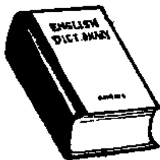
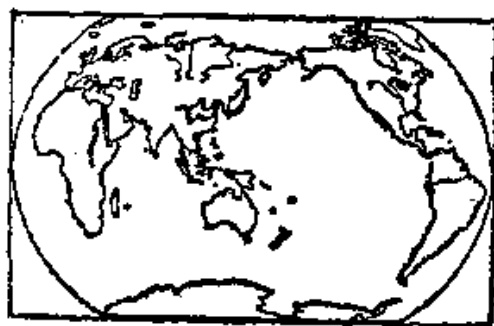

# 第十课 — Lesson 10

> OCR transcription; not manually verified. Source and confidence metadata are preserved per page.

<!-- source_pdf_page: 97; source_printed_page: 74; ocr_confidence: 0.9945 -->

这是中文画报。

这是我的书。

他是谁？

## 一、替换练习 Substitution Drills

1. 这是什么？
这是画报。

书 报 杂志
词典 地图

2. 这是什么画报？
这是中文①画报。

杂志，英文
词典，法文
地图，世界
报，法文

3. 他是谁？
他是丁文。

哈利 王工程师
马老师 张大夫

<!-- source_pdf_page: 98; source_printed_page: 75; ocr_confidence: 0.9856 -->

4. 这是谁的书？
这是我的书。

词典，她
杂志，他
本子，丁文
地图，哈利
钢笔，王老师

5. 谁是你们的老师？
王老师是我们的老
师。

他们，马老师
丁文，他
她，张老师

## 二、课文 Text

(一)

A: 这是词典吗？

Zhè shì cídiǎn ma?

B: 这是词典。

Zhè shì cídiǎn.

A: 这是什么词典？

Zhè shì shénme cídiǎn?

B: 这是英文词典。

Zhèshì Yīngwén cídiǎn.

<!-- source_pdf_page: 99; source_printed_page: 76; ocr_confidence: 0.9896 -->

A: 这是谁的词典?

Zhè shì shuí de cídiǎn?

B: 这是王老师的词典。

Zhè shì Wáng lǎoshī de cídiǎn.

A: 那是地图吗?

Nà shì dìtú ma?

B: 那是地图。

Nà shì dìtú.

A: 那是中国地图吗?

Nà shì Zhōngguó dìtú ma?

B: 不, 那不是中国地图,

Bù, nà bú shì Zhōngguó dìtú,

那是世界地图。

nà shì shìjiè dìtú.

A: 那是谁的地图?

Nà shì shuí de dìtú?

B: 那是哈利的地图。

Nà shì Hālì de dìtú.

(二)

这是我们的学校——北京语言学院。

Zhè shì wǒmen de xuéxiào — Běijīng Yǔyán Xuéyuàn.

<!-- source_pdf_page: 100; source_printed_page: 77; ocr_confidence: 0.9862 -->

我是英国留学生，我学习汉语。

Wǒ shì Yīngguó liú xuéshēng, wǒ xuéxí Hànyǔ.

丁文是我的朋友。他是中国学生，

Dīng Wén shì wǒ de péngyou. Tā shì Zhōngguó xuéshēng,

他学习英语。

tā xuéxí Yīngyǔ.

这是我们的教室，那是中国学生

Zhè shì wǒmen de jiàoshì, nà shì Zhōngguó xuéshēng

的教室。我们的老师是王老师。他们的

de jiàoshì. Wǒmen de lǎoshī shì Wáng lǎoshī. Tāmen de

老师是马老师。

lǎoshī shì Mǎ lǎoshī.

## 三、生词 New Words

|  1. 杂志 | (名) zázhì | magazine  |
| --- | --- | --- |
|  2. 词典 | (名) cídiǎn | dictionary  |
|  3. 地图 | (名) dìtú | map  |
|  4. 中文 | (名) Zhōngwén | Chinese  |
|  5. 英文 | (名) Yīngwén | English  |
|  6. 法文 | (名) Fǎwén | French  |
|  7. 世界 | (名) shìjiè | world  |
|  8. 谁 | (代) shuí | who  |
|  9. 的 | (助) de | structural particle  |

<!-- source_pdf_page: 101; source_printed_page: 78; ocr_confidence: 0.9887 -->

10. 马 (专) Mǎ Ma, a surname
11. 学校 (名) xuéxiào school
12. 教室 (名) jiàoshì classroom

## 补充生词 Additional Words

1. 阿拉伯文 (名) Ālābówén Arabic
2. 德文 (名) Déwén German
3. 俄文 (名) Éwén Russian
4. 西班牙文 (名) Xībānyáwén Spanish
5. 日文 (名) Riwén Japanese

## 四、注释 Notes

### ① “汉语”和“中文”

“汉语”指中国汉族的语言，也是中国各民族的共同语。“中文”一般指汉语的书面形式。这两个词的侧重点不同，如：“学习汉语”“中文画报”。“英语”和“英文”、“法语”和“法文”等，意义上也有同样的差别。

汉语 is the language of the Han nationality and also the common language of all the other nationalities in China. Generally speaking, 中文 refers to the Chinese written language. These two appellations have different emphases, e.g. 学习汉语, 中文画报. Similarly, 英语 is different from 英文, and 法语 from 法文.

## 五、语法 Grammar

### 1. 定语 Attributive

<!-- source_pdf_page: 102; source_printed_page: 79; ocr_confidence: 0.9986 -->

定语主要是修饰名词的，被修饰的成分叫中心语。名词、代词、形容词以及其他词类和短语都可以作定语。定语一定要放在中心语的前边。例如：

An attributive (i.e. adjectival modifier) is used to modify nouns. What is modified is known as the central word. A noun, pronoun, numeral, measure word or an adjective may function as an attributive, which must be placed before the central word, e.g.

这是中文书。

他是我的朋友。

哈利是英国留学生。

### 2. 结构助词“的” Structural particle 的

名词、代词作定语表示领属关系时，定语和中心语之间一般要用结构助词“的”。例如：

When indicating possession, a noun or pronoun taken as an attributive should be followed by the structural particle 的, e.g.

这是王老师的词典。

那是他的钢笔。

### 3. 用疑问代词的疑问句 Interrogative sentences in which an interrogative pronoun is used

用疑问代词的疑问句，词序跟陈述句一样，把陈述句中要提问的部分改成疑问代词，就成了疑问句。例如：

This kind of interrogative sentence (i.e. question) is formed by replacing the element in question in a statement with an interrogative pronoun. The sentence order remains the same, e.g.

<!-- source_pdf_page: 103; source_printed_page: 80; ocr_confidence: 0.9964 -->

他是马老师。

他是谁？

这是我的地图。

这是谁的地图？

## 六、练习 Exercises

1. 根据划线部分用疑问代词提问：

Ask questions on the underlined parts of the following sentences, using interrogative pronouns:

(1) 这是我的杂志。

(2) 那是他的词典。

(3) 丁文是我的朋友。

(4) 他学习英语。

(5) 这是世界地图。

(6) 哈利是英国人。

(7) 这是他们的学校。

(8) 那是留学生的教室。

2. 根据课文（二）回答问题：

Answer the questions according to the Text (2):

(1) 这是谁的学校？

(2) 你是留学生吗？

<!-- source_pdf_page: 104; source_printed_page: 81; ocr_confidence: 0.9941 -->

(3) 你学习什么？
(4) 丁文是谁？
(5) 丁文是哪国人？
(6) 丁文学习什么？
(7) 这是谁的教室？
(8) 那是谁的教室？
(9) 谁是你们的老师？
(10) 中国学生的老师是谁？

3. 朗读然后抄写下列对话，并标上调号：

Read aloud the following dialogue, and then copy it, giving the tone-graph for each of the characters:

A: 你好！

B: 你好！

A: 这是北京语言学院吗？

B: 是。你是语言学院的学生吗？

A: 不是。我的朋友是语言学院的学生。

B: 你的朋友叫什么名字？

A: 他叫丁文。

B: 他学习什么？

A: 他学习英语。

<!-- source_pdf_page: 105; source_printed_page: 82; ocr_confidence: 0.9716 -->

B: 他们的老师是谁?

A: 他们的老师是马老师。

4. 根据拼音写出汉字:

Write the following phonetic transcriptions as Chinese characters:

词 {shēngcí
cidiǎn}

儿 {zhèr
nàr
nǎr}

文 {Zhōngwén
Yīngwén
Fǎwén}

学 {xuésheng
xuéxí
xuéxiào
liúxuéshēng}

## 汉字表 Table of Chinese Characters

> **Uncertainty:** OCR of character components and stroke forms is unreliable. This section is excluded from the default retrieval corpus.

|  1 | 杂 | 九 | 雜  |
| --- | --- | --- | --- |
|   |  | ホ |   |
|  2 | 志 | 士 | 誌  |
|   |  | 心 |   |
|  3 | 典 | 丨冂冂冂典典典典典典典典典典典典典典典典典典典典典典典典典典典典典典典典典典典典典典典典典典典典典典典典典典典典典典典典典典典典典典典典典典典典典典典典典典典典典典典典典典典典典典典典典典典典典典典典典典典典 |   |
|  4 | 地 | 幺 |   |
|   |  | 也 |   |
|  5 | 图 | □ | 圖  |

<!-- source_pdf_page: 106; source_printed_page: 83; ocr_confidence: 0.9874 -->

|   |  | 冬 (ノク久冬冬)  |   |
| --- | --- | --- | --- |
|  6 | 法 | 氵  |   |
|   |  | 去  |   |
|  7 | 世 | 一十廿廿世  |   |
|  8 | 界 | 田  |   |
|   |  | 介 | (ノ八介介)  |
|  9 | 谁 | 氵 | 誰  |
|   |  | 隹  |   |
|  10 | 的 | 白 | (ノ白)  |
|   |  | 勺 | (ノ勺勺)  |
|  11 | 马 | 馬 | 馬  |
|  12 | 校 | 木  |   |
|   |  | 交 (一六六交)  |   |
|  13 | 教 | 才 (一十士才才才)  |   |
|   |  | 女 (ノレ女女)  |   |
|  14 | 室 | 户  |   |
|   |  | 至 (一二五至至)  |   |
