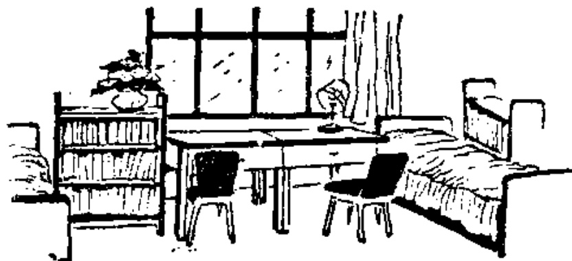

# 第十一课 — Lesson 11

> OCR transcription; not manually verified. Source and confidence metadata are preserved per page.

<!-- source_pdf_page: 107; source_printed_page: 84; ocr_confidence: 0.9956 -->

你有几本画报？

我有两本画报。

他没有英文杂志。

## 一、替换练习 Substitution Drills

1. 你有中文书吗？

我有中文书。

报 画报
杂志 词典

2. 他有中文报吗？

他没有中文报。

他有英文报。

中文杂志，英文杂志
英文词典，法文词典
世界地图，中国地图

3. 他有哥哥吗？

他有哥哥。

他有几个哥哥？

他有一①个哥哥。

弟弟 妹妹
姐姐

<!-- source_pdf_page: 108; source_printed_page: 85; ocr_confidence: 0.9832 -->

4. 你有画报吗?

我有画报。

你有几本画报?

我有两本画报。

5. 这是几支钢笔?

这是一支钢笔。

中文书 法文杂志

英文词典

法文书 中文词典

张, 画儿

把, 椅子

张, 桌子

个, 书架

张, 床

## 二、课文 Text

(一)

A: 这是几张桌子?

Zhè shì jí zhāng zhuōzi?

B: 这是九张桌子。

Zhè shì jiǔ zhāng zhuōzi.

A: 那是几把椅子?

Nà shì jí bǎ yizi?

B: 那是十把椅子。

Nà shì shí bǎ yizi.

<!-- source_pdf_page: 109; source_printed_page: 86; ocr_confidence: 0.9793 -->

A: 你有几支钢笔?

Nǐ yǒu jì zhī gāngbǐ?

B: 我有两支钢笔。

Wǒ yǒu liǎng zhī gāngbǐ.

A: 她有几个本子?

Tā yǒu jì ge běnzi?

B: 她有五个本子。

Tā yǒu wǔ ge běnzi.

(二)

丁文是中国学生。他有一个外国

Dīng Wén shì Zhōngguó xuéshēng. Tā yǒu yí ge wàiguó

朋友，叫哈利。哈利是英国留学生。

péngyou, jiào Hālì. Hālì shì Yīngguó liú xuéshēng.

丁文学习英语。他有两本英文书、

Dīng Wén xuéxí Yīngyǔ. Tā yǒu liǎng běn Yīngwén shū,

<!-- source_pdf_page: 110; source_printed_page: 87; ocr_confidence: 0.9626 -->

一本 英文 词典。他 没有 英文 杂志。

yì běn Yīngwén cídiǎn. Tā méiyǒu Yīngwén zázhì.

这是哈利的宿舍。这儿有两 张 床、

Zhè shì Hālì de sùshè. Zhèr yǒu liǎng zhāng chuáng,

两个柜子、两 张 桌子、两 把 椅子和两

liǎng ge guìzi, liǎng zhāng zhuōzi, liǎng bǎ yǐzi hé liǎng

个 书架。

ge shūjià.

## 三、生词 New Words

|  1. 没 | (副) méi | not, no  |
| --- | --- | --- |
|  2. 姐姐 | (名) jiějie | elder sister  |
|  3. 个 | (量) gè | *a measure word*  |
|  4. 本 | (量) běn | *a measure word for books*  |
|  5. 两 | (数) liǎng | two  |
|  6. 支 | (量) zhī | *a measure word for songs, pens, or things in the shape of a shaft*  |
|  7. 张 | (量) zhǎng | *a measure word for paper, tables, beds, mouths, etc.*  |
|  8. 画儿 | (名) huàr | picture, painting  |
|  9. 把 | (量) bǎ | *a measure word for*  |

<!-- source_pdf_page: 111; source_printed_page: 88; ocr_confidence: 0.9896 -->

things with a handle

10. 椅子 (名) yǐzi chair
11. 桌子 (名) zhuōzi desk, table
12. 书架 (名) shūjià bookshelf
13. 床 (名) chuáng bed
14. 外国 (名) wàiguó foreign country
15. 宿舍 (名) sùshè dormitory
16. 柜子 (名) guìzi wardrobe

## 补充生词 Additional Words

1. 电灯 (名) diàndēng light
2. 台灯 (名) táidēng table lamp
3.闹钟 (名) nàozhōng alarm clock
4. 手表 (名) shǒubiāo watch

## 四、注释 Notes

### ① “—”的变调 Tone changes of —

“—”的原调是第一声，如果后边有第四声或第四声变来的轻声音节时，“—”读第二声，如：“一个学生”（一课书）。如果后边是其他声调的音节，“—”读第四声，如：“一支钢笔”。

The original tone of — is the 1st tone, but if it is followed by the 4th tone or a neutral tone which was originally a 4th tone, — is read in the 2nd tone, e.g. 一个学生; if it is followed

<!-- source_pdf_page: 112; source_printed_page: 89; ocr_confidence: 0.9556 -->

by 1st, 2nd, or 3rd tone, 一 is read in the 4th tone, e.g. 一支钢笔.

### ② “二” 和 “两” 二 and 两

“二” 和 “两” 都表示 “2” 这个数目，在量词（或不需要量词的名词）前，一般用 “两” 不用 “二”，如：“两张桌子”“两把椅子”。

Both 二 and 两 represent the number 2. Before a measure word (or a noun which does not need a measure word,) 两 is used instead of 二, e.g. 两张桌子, 两把椅子.

## 五、语法 Grammar

### 1. “有”字句 The 有-sentence

动词“有”作谓语主要成分的句子常表示领有。例如：

有 taken as the predicate verb denotes the possession of something, e.g.

他有中文画报。

我有英文词典。

“有”字句也可以表示存在。例如：

有 also denotes the existence or presence of something, e.g.

这儿有几把椅子？

宿舍有几个书架？

“有”字句的否定式是在“有”前加副词“没”，不能用“不”。例如：

The negative form of the verb is shown by putting the ad-verb 没 (never 不) before the verb, e.g.

他没有中文画报。

<!-- source_pdf_page: 113; source_printed_page: 90; ocr_confidence: 0.9967 -->

### 我没有英文词典。

2. 数量词作定语 A numeral-measure word as attributive
在现代汉语里，数词一般不能直接修饰名词，数词和名词之间必须加量词。例如：

In Chinese, a numeral cannot normally modify a noun directly, so a measure word must be used in between, e.g.

丁文有一个外国朋友。

他有两本英文书。

名词都有特定的量词，不能随意组合。例如“本”是书、杂志等的量词；“支”是钢笔、铅笔等的量词；“张”是纸、报、桌子等的量词；“把”是椅子等的量词；“个”是学生、本子等的量词。量词“个”的应用范围最广。

In Chinese, every noun has its specific measure word. For example, 本 is the measure word for 书, 杂志, etc.; 支 is the measure word for 钢笔, 铅笔, etc.; 张 is the measure word for 纸, 报, 桌子, etc.; 把 is the measure word for 椅子 etc.; 个 is the measure word for 学生, 本子 etc.; 个 is the most widely used measure word in Chinese.

3. 疑问代词“几” Interrogative pronoun 几

提问“十”以下的数目，一般用“几”。因为“几”代替的是数词，所以在“几”和名词之间也要加量词。例如：

几 is normally used to ask about a number under 10. Because 几 stands for a numeral, a measure word must be used between it and the noun, e.g.

他有几个弟弟？

你有几本中文书？

<!-- source_pdf_page: 114; source_printed_page: 91; ocr_confidence: 0.9945 -->

## 六、练习 Exercises

1. 把括号内的数字改成汉字并填上适当的量词:

Change the following Arabic numerals in parentheses into Chinese characters and give a proper measure word for each of them:

(5) \_\_\_\_大夫

(3) \_\_\_\_留学生

(7) \_\_\_\_桌子

(6) \_\_\_\_椅子

(8) \_\_\_\_汉字

(2) \_\_\_\_生词

(2) \_\_\_\_学校

(1) \_\_\_\_名字

(5) \_\_\_\_教室

(10) \_\_\_\_柜子

(1) \_\_\_\_哥哥

(4) \_\_\_\_圆珠笔

2. 用量词填空, 并把句子改成疑问句:

Fill in the blanks with proper measure words and change the statements into questions:

例 Example:

这是五张报。

这是几张报?

(1) 这是七\_\_\_\_中文报。

(2) 那是十\_\_\_\_英文词典。

(3) 这是九\_\_\_\_法文杂志。

(4) 那是八\_\_\_\_书架。

<!-- source_pdf_page: 115; source_printed_page: 92; ocr_confidence: 0.9972 -->

(5) 这是四\_\_\_\_世界地图。

(6) 这是五\_\_\_\_画儿。

(7) 那是六\_\_\_\_纸。

(8) 这是三\_\_\_\_床。

(9) 那是两\_\_\_\_柜子。

例 Example:

我有十本英文书。

你有几本英文书？

(10) 我有三\_\_\_\_钢笔。

(11) 哈利有两\_\_\_\_英国地图。

(12) 他有一\_\_\_\_姐姐。

(13) 王老师有六\_\_\_\_英文词典。

(14) 我的朋友有七\_\_\_\_中国画儿。

3. 按照下列例子回答问题：

Answer the questions following the example:

例 Example:

你有纸吗？（本子）

我没有纸，我有本子。

(1) 你有法文杂志吗？（英文杂志）

(2) 她有妹妹吗？（姐姐）

<!-- source_pdf_page: 116; source_printed_page: 93; ocr_confidence: 0.9973 -->

(3) 马老师有法文书吗？（英文书）
(4) 他有世界地图吗？（中国地图）
(5) 王工程师有英文词典吗？（法文词典）

4. 根据课文（二）回答问题：

Answer the questions according to Text (2):

(1) 丁文是哪国人？
(2) 丁文有外国朋友吗？
(3) 丁文的外国朋友叫什么名字？
(4) 哈利是哪国人？
(5) 丁文学习什么？
(6) 丁文有英文书吗？
(7) 丁文有几本英文书？
(8) 丁文有英文词典吗？
(9) 丁文有几本英文词典？
(10) 丁文有英文杂志吗？
(11) 这是谁的宿舍？
(12) 这儿有几张床、几张桌子、几把椅子？

<!-- source_pdf_page: 117; source_printed_page: 94; ocr_confidence: 0.9819 -->

### (13) 这儿有几个柜子、几个书架？

5. 阅读下面短文并复述：

Read and retell the following passage:

我有一个中国朋友，他叫张民。他是北京语言学院的学生，他学习英语。他有九本英文书、两本英文词典和一张世界地图。

这是我朋友的宿舍。这儿有一张床、两把椅子、一个柜子和一个书架。晚上，(wǎnshang, in the evening),他在宿舍念生词，听录音。

6. 根据拼音写出汉字：

Write the following phonetic transcriptions as Chinese characters:

画 {huàbào
huàr

国 {Zhōngguó
wàiguó

子 {zhuōzi
yǐzi
guìzi
běnzi

汉 {Hànyǔ
hànzi

<!-- source_pdf_page: 118; source_printed_page: 95; ocr_confidence: 0.9965 -->

## 汉字表 Table of Chinese Characters

> **Uncertainty:** OCR of character components and stroke forms is unreliable. This section is excluded from the default retrieval corpus.

|  1 | 没 | 氵  |   |   |
| --- | --- | --- | --- | --- |
|   |  | 爻（ㄐㄧㄢˋ亨爻）  |   |   |
|  2 | 姐 | 女  |   |   |
|   |  | 且（ㄐㄇㄈㄐ且）  |   |   |
|  3 | 个 | 丿人个 |   | 個  |
|  4 | 两 | 一厂冋丙丙丙丙 |   | 兩  |
|  5 | 支 | 一十支支 |   | 枝  |
|  6 | 把 | 扌  |   |   |
|   |  | 巴  |   |   |
|  7 | 椅 | 杆  |   |   |
|   |  | 奇 | *  |   |
|   |  |  | 可  |   |
|  8 | 桌 | 丷 | 丶丶  |   |
|   |  | 日  |   |   |
|   |  | 木  |   |   |
|  9 | 架 | 加 | 力（ㄋ力）  |   |
|   |  |  | 口  |   |

<!-- source_pdf_page: 119; source_printed_page: 96; ocr_confidence: 0.9830 -->

|   |  | 木 |   |
| --- | --- | --- | --- |
|  10 | 床 | 广（丶丶广） |   |
|   |  | 木 |   |
|  11 | 外 | 夕（丿夕夕） |   |
|   |  | 卜（丨卜） |   |
|  12 | 宿 | 宀 |   |
|   |  | 佰 | 亻  |
|   |  |  | 百（一丿丫丐百百百）  |
|  13 | 舍 | 丿入入今今舍 |   |
|  14 | 柜 | 柿 | 櫃  |
|   |  | 巨（一厂巨巨巨） |   |
