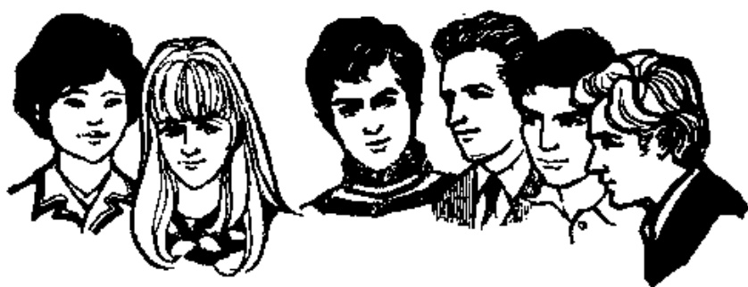

# 第十二课 — Lesson 12

> OCR transcription; not manually verified. Source and confidence metadata are preserved per page.

<!-- source_pdf_page: 120; source_printed_page: 97; ocr_confidence: 0.9833 -->

我们的学校很大。
这个生词难不难？
这个生词不难。

## 一、替换练习 Substitution Drills

1. 我们的学校很大。

教室 宿舍 屋子

2. 你的词典新不断？
我的词典很新。

屋子，干净
钢笔，好
朋友，多

3. 这个生词难不难？
这个生词很难。
这个生词不太难。

学校，大
大夫，忙
汉字，容易
教室，干净

<!-- source_pdf_page: 121; source_printed_page: 98; ocr_confidence: 0.9921 -->

4. 这个屋子大，
那个屋子小。

词，难，容易
宿舍，干净，脏
本子，新，旧
学生，努力，不努力

5. 你的爸爸是不是
工程师？
我的爸爸不是工
程师。

妈妈，大夫
哥哥，工人
姐姐，学生
老师，中国人

6. 你有没有新杂志？
我没有新杂志。

小，本子
旧，画报
干净，纸

## 二、课文 Text

(一)

A: 你学习什么？
Nǐ xuéxí shémé?

B: 我学习汉语。
Wǒ xuéxí Hànyǔ.

<!-- source_pdf_page: 122; source_printed_page: 99; ocr_confidence: 0.9843 -->

A: 汉语难不难?

Hànyǔ nán bu nán?

B: 不太难, 但是发音不容易。

Bú tài nán, dànshì fǎ yīn bù róngyi.

A: 你忙不忙?

Nǐ máng bu máng?

B: 很忙。你忙吗?

Hěn máng. Nǐ máng ma?

A: 我不太忙。你有没有汉语词典?

Wǒ bú tài máng. Nǐ yǒu méiyǒu Hànyǔ cídiǎn?

B: 有一本。

Yǒu yì běn.

A: 你的词典新不新?

Nǐ de cídiǎn xīn bu xīn?

B: 不新, 是一本旧词典。

Bù xīn, shì yì běn jiù cídiǎn.

### (二)

这是我们的教室。我们的教室很

Zhè shì wǒmen de jiàoshì. Wǒmen de jiàoshì hěn

大, 很干净。

dà, hěn gānjìng.

那是他们的教室。他们的教室不大。

Nà shì tāmen de jiàoshì. Tāmen de jiàoshì bú dà.

<!-- source_pdf_page: 123; source_printed_page: 100; ocr_confidence: 0.9919 -->

这是我们班①的同学。我们班男同学②

Zhè shì wǒmen bān de tóngxué. Wǒmen bān nán tóngxué

多，女同学少。

duō, nǚ tóngxué shǎo.

我们学习汉语，我们都很努力。

Wǒmen xuéxí Hànyǔ, wǒmen dōu hěn nǔlì.

## 三、生词 New Words

|  1. 大 | (形) dà | big, large  |
| --- | --- | --- |
|  2. 屋子 | (名) wūzi | room  |
|  3. 斑 | (形) xīn | new  |
|  4. 干净 | (形) gānjing | clean  |
|  5. 多 | (形) duō | many, numerous  |
|  6. 太 | (副) tài | too  |
|  7. 容易 | (形) róngyi | easy  |
|  8. 小 | (形) xiǎo | small, little  |
|  9. 脏 | (形) zǎng | dirty  |

<!-- source_pdf_page: 124; source_printed_page: 101; ocr_confidence: 0.9927 -->

10. 旧 (形) jiù old
11. 努力 (形) nǔlì hard
12. 但是 (连) dànshì but
13. 发音 (名) fāyǐn pronunciation
14. 班 (名) bān class
15. 同学 (名) tóngxué classmate, schoolmate
16. 男 (名) nán male
17. 女 (名) nǚ female
18. 少 (形) shǎo a little, a few

## 补充生词 Additional Words

1. 系 (名) xì department, faculty
2. 年级 (名) niánjí grade (year group)
3. 文科 (名) wénkē liberal arts
4. 工科 (名) gōngkē engineering
5. 理科 (名) líkē science

## 四、注释 Notes

### ① “的”的省略 Omission of 的

人称代词作定语，如果中心语是表示集体、单位或亲属等的名词，定语后的“的”可以不用，如：“我们班”“他哥哥”等。

The structural particle 的 may be omitted if the central word

<!-- source_pdf_page: 125; source_printed_page: 102; ocr_confidence: 0.9929 -->

modified by a personal pronoun stands for one's institution, workplace or relatives, etc., e.g. 我们班，他哥哥。

### ② “男” “女” 男 and 女

“男” “女” 一般不能单独用，作指人名词的定语。有区分性别的作用，如：“男学生” “女学生” “男大夫” “女大夫”。

男 and 女 cannot usually stand alone. They are used to modify nouns related to persons, to show genders, e.g. 男学生／女学生，男大夫／女大夫。

## 五、语法 Grammar

### 1. 形容词谓语句 Sentence with an adjective as its predicate

形容词谓语句是以形容词作谓语主要成分的句子。汉语形容词谓语句中不再用动词“是”。

例如：

This kind of sentence takes an adjective as its predicate. The verb 是 is no longer used before the adjective, e.g.

这本词典很好。

我们的教室很干净。

形容词单独作谓语，在形容词前常用副词“很”，“很”表示程度的意义已不明显，如果只用形容词作谓语，就带有比较的意思，常用在对比的句子里，例如：

If an adjective stands alone as the predicate in a sentence, the adverb 很 is often used before the adjective. In this case, 很 loses its force as an adverb of degree. If an adjective is used as a predicate without any modification, comparison is implied, e.g.

<!-- source_pdf_page: 126; source_printed_page: 103; ocr_confidence: 0.9995 -->

男学生多，女学生少。

2. 形容词谓语句的否定 Negation of a sentence with an adjective as its predicate

形容词谓语句的否定式是在谓语形容词前加否定副词“不”。例如：

The negative form of this kind of sentence is constructed by placing the adverb 不 before the adjective, e.g.

我的中文书不多。

张大夫不太忙。

3. 正反疑问句 Affirmative-negative question

把谓语中主要成分的肯定形式和否定形式并列起来，就构成正反疑问句，例如：

This kind of interrogative sentence is formed by putting together the affirmative and negative forms of the verb (or adjective), e.g.

张大夫忙不忙？

他是不是工程师？

你有没有英文词典？

“有”字句和“是”字句用正反疑问句提问，还可以有以下的形式：

The affirmative-negative question of a sentence with 有 or 是 can also be formed in the following way:

他是工程师不是？

你有英文词典没有？

<!-- source_pdf_page: 127; source_printed_page: 104; ocr_confidence: 0.9944 -->

4. 指示代词作定语 A demonstrative pronoun as an attributive

指示代词“这”“那”等作定语，定语与中心语之间一般也要用量词。例如：

When the demonstrative pronoun 这 or 那, etc. is used as an attributive, a measure word is generally used between the pronoun and the central word, e.g.

这本词典很好。

那个生词难不难？

## 六、练习 Exercises

1. 把下列陈述句改成正反疑问句：

Change the following statements into affirmative-negative questions:

例 Example:

这个教室很大。

这个教室大不大？

(1) 这个屋子很干净。

(2) 汉语不太难。

(3) 那张桌子很脏。

(4) 王大夫很忙。

(5) 那张地图很新。

(6) 那个柜子很大。

<!-- source_pdf_page: 128; source_printed_page: 105; ocr_confidence: 0.9958 -->

(7) 他是哈利的同学。
(8) 这是我的词典。
(9) 那是丁文的杂志。
(10) 他们班没有女同学。

2. 根据课文（二）回答问题：

Answer the questions according to the Text (2):

(1) 这是你们的教室吗？
(2) 你们的教室大不大？干净不干净？
(3) 那是谁的教室？
(4) 他们的教室大不大？
(5) 你们班女同学多不多？
(6) 你们班男同学多吗？
(7) 你们学习什么？
(8) 你们都很努力吗？

3. 根据实际情况回答问题：

Give your own answers to the questions:

(1) 你学习什么？
(2) 你们班的教室大不大？
(3) 你们班的同学多不多？
(4) 你们班有几个男同学？

<!-- source_pdf_page: 129; source_printed_page: 106; ocr_confidence: 0.9798 -->

(5) 你们班有没有女同学？有几个？

4. 阅读然后抄写下面短文并标上调号：

Read and then copy the following passage, giving a proper tone-graph for each of the characters:

王新在北京语言学院学习法语。他们班的学生不多，有四个女学生和三个男学生。法语不太容易，他们都很努力。王新的法文书很多，但是法文词典不多。

## 汉字表 Table of Chinese Characters

> **Uncertainty:** OCR of character components and stroke forms is unreliable. This section is excluded from the default retrieval corpus.

|  1 | 屋 | 尸 ( ㄧ ㄧ ㄧ )  |   |
| --- | --- | --- | --- |
|   |  | 至 ( ㄧ ㄧ ㄧ 至 )  |   |
|  2 | 新 | 亲 | 立  |
|   |  |  | 示  |
|   |  | 斤 ( ㄧ ㄧ ㄧ 斤 )  |   |
|  3 | 干 | 一 二 干 | 乾  |
|  4 | 净 | ； ( 丶 ； )  |   |
|   |  | 争 ( 丶 丶 丶 争 争 争 )  |   |
|  5 | 多 | 夕  |   |
|   |  | 夕  |   |

<!-- source_pdf_page: 130; source_printed_page: 107; ocr_confidence: 0.9880 -->

|  6 | 太 | 大太 |   |
| --- | --- | --- | --- |
|  7 | 容 | 宀 |   |
|   |  | 谷(‘宀’） |   |
|  8 | 易 | 日 |   |
|   |  | 勿(‘为’勿) |   |
|  9 | 小 | 丨丨小 |   |
|  10 | 脏 | 月 | 髒  |
|   |  | 庄(‘丨’庄) |   |
|  11 | 旧 | 丨 | 舊  |
|   |  | 日 |   |
|  12 | 努 | 奴 | 女  |
|   |  | 又 |   |
|   |  | 力(力) |   |
|  13 | 力 |  |   |
|  14 | 但 | 亻 |   |
|   |  | 旦(日旦) |   |
|  15 | 发 | 一少岁发发 | 發  |
|  16 | 班 | 丬 |   |

<!-- source_pdf_page: 131; source_printed_page: 108; ocr_confidence: 0.9943 -->

|   |  | 丿（丿丿）  |
| --- | --- | --- |
|   |  | 王  |
|  17 | 同 | 丿冂冂冂同同  |
|  18 | 男 | 田  |
|   |  | 力  |
|  19 | 女 |   |
|  20 | 少 | 丿丿少少  |
