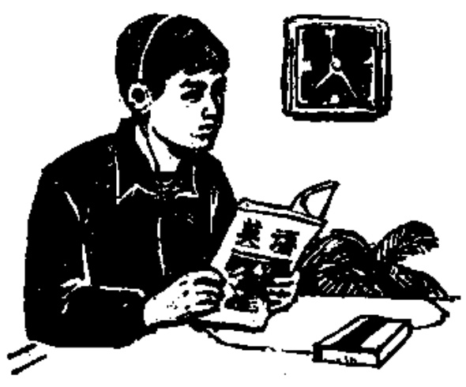

# 第十三课 — Lesson 13

> OCR transcription; not manually verified. Source and confidence metadata are preserved per page.

<!-- source_pdf_page: 132; source_printed_page: 109; ocr_confidence: 0.9868 -->

我们学习。
他看中文报。
他不看英文画报。

## 一、替换练习 Substitution Drills

1. 我们学习。

复习 预习 工作

2. 我看报。

书 杂志 画报
地图 电视

4. 你写不写汉字？
我写汉字。
他写汉字吗？
他不写汉字。

去，宿舍
看，电视
说，英语
听，录音

<!-- source_pdf_page: 133; source_printed_page: 110; ocr_confidence: 0.9917 -->

3. 他看英文画报吗？
他不看英文画报，
他看中文画报。

中文书，英文书
法文杂志 英文杂志
世界地图 中国地图

5. 晚上你作什么？
晚上我念课文。

听，录音
作，练习
复习，旧课
预习，新课

## 二、课文 Text

(一)

A: 你们学习什么？

Nǐmen xuéxí shénme?

B: 我们学习汉语。

Wǒmen xuéxí Hànyǔ.

A: 这是你们的教室吗？

Zhè shì nǐmen de jiàoshì ma?

B: 不是，那是我们的教室。

Bú shì, nà shì wǒmen de jiàoshì.

A: 你们班同学多不多？

Nǐmen bān tóngxué duō bu duō?

<!-- source_pdf_page: 134; source_printed_page: 111; ocr_confidence: 0.9674 -->

B: 不多, 我们 班有九个同学。

Bù duō, wǒmen bān yǒu jiǔ ge tóngxué.

A: 你们的老师是谁?

Nǐmen de lǎoshī shì shuí?

B: 王老师和张老师。

Wáng lǎoshī hé Zhāng lǎoshī.

A: 你们的老师说 不说 英语?

Nǐmen de lǎoshī shuō bu shuō Yīngyǔ?

B: 他们 不说 英语, 他们 说 汉语。

Tāmen bù shuō Yīngyǔ, tāmen shuō Hànyǔ.

A: 晚上, 你们作 什么?

Wǎnshang, nǐmen zuò shénme?

B: 晚上, 我们复习 生词, 念 课文, 听

Wǎnshang, wǒmen fùxi shēngcí, niàn kèwén, tīng

录音, 作练习。有时候, 我们 也 看

lù yīn, zuò liànxí. Yǒu shíhou, wǒmen yě kàn

电视。

diànshì.

### (二)

张力是北京大学的学生, 他学习

Zhāng Lì shì Běijīng Dàxué de xuésheng, tā xuéxí

英语。今天, 他们 有 英语 课。老师 说

Yīngyǔ. Jīntiān, tāmen yǒu Yīngyǔ kè. Lǎoshī shuō

<!-- source_pdf_page: 135; source_printed_page: 112; ocr_confidence: 0.9686 -->

英语，不说 汉语。

Yīngyǔ, bù shuō Hànyǔ.

老师 说：“同学们 好！”学生 说：

Lǎoshī shuō: “Tóngxuémen hǎo!” Xuésheng shuō:

“老师 好！”

“Lǎoshī hǎo!”

学生 学习 生词，念 课文。老师 问

Xuésheng xuéxi shēngcí, niàn kèwén. Lǎoshī wèn

问题，学生 回答。

wèntí, xuésheng huídá.

晚上，张 力复习 旧课，预习 新课，

Wǎnshang, Zhāng Lì fùxi jiù kè, yùxí xīn kè,

听录音，作 练习。有 时候，他也看 电视。

tīng lùyǐn, zuò liànxí. Yǒu shíhou, tā yě kàn diànshì.

<!-- source_pdf_page: 136; source_printed_page: 113; ocr_confidence: 0.9931 -->

## 三、生词 New Words

1. 复习 (动) fùxí to review
2. 预习 (动) yùxí to preview
3. 看 (动) kàn to look, to watch, to read
4. 电视 (名) diànshì T.V.
5. 说 (动) shuō to say, to speak
6. 晚上 (名) wǎnshang evening
7. 课文 (名) kèwén text
8. 练习 (名、动) liànxí exercise, to practise
9. 有时候 yōushíhou sometimes
10. 张力 (专) Zhāng Lì Zhang Li, a person's name
11. 北京大学 (专) Běijīng Dàxué Beijing University
12. 今天 (名) jīntiān today
13. 课 (名) kè lesson
14. 们 (尾) men a plural suffix
15. 问 (动) wèn to ask
16. 问题 (名) wèntí question
17. 回答 (动) huídà to answer

<!-- source_pdf_page: 137; source_printed_page: 114; ocr_confidence: 0.9943 -->

## 补充生词 Additional Words

1. 听写 (动) tīngxiě to dictate, to have a dictation

2. 复述 (动) fùshù to retell

3. 录音机 (名) lùyǐnjī tape-recorder

4. 磁带 (名) cídài magnetic tape

5. 录像 (名) lùxiàng video

## 四、注释 Notes

① 词尾“们” Plural suffix 们

“们”是表示复数的词尾，只用在指人的名词或代词后边。汉语的名词可以表示单数，也可以表示复数，所以，当上下文已经表明名词是复数时，后面不再用“们”。

The suffix 们 is used after a personal pronoun or a noun which indicates a person in order to show plurality. A noun in Chinese can indicate either the singular or the plural. If the context makes it clear that the noun is plural, 们 is not used.

## 五、语法 Grammar

1. 动词谓语句 Sentence with a verbal predicate

谓语主要成分是动词的句子叫动词谓语句。动词如果带宾语，宾语一般在动词的后边。例如：

This kind of sentence takes a verb as its predicate. If the verb takes an object, the object is usually placed after the verb, e.g.

<!-- source_pdf_page: 138; source_printed_page: 115; ocr_confidence: 0.9946 -->

他们工作。

我们学习汉语。

2. 动词谓语句的否定 Negation of a sentence with a verbal predicate

动词谓语句的一种否定形式是在谓语动词前加“不”，表示“经常不…”“不愿意…”“将不…”等意思。例如：

One of the negative forms of a sentence with a verbal predicate is constructed by using the adverb 不 before the verb, e.g.

他学习汉语，不学习法语。

我不看杂志，我看画报。

## 六、练习 Exercises

1. 给下面的动词配上宾语：

Give a proper object to each of the following verbs:

例 Example:

复习

复习生词

复习汉字

复习课文

复习旧课

(1) 学习

(2) 预习

(3) 作

(4) 看

(5) 说

(6) 念

<!-- source_pdf_page: 139; source_printed_page: 116; ocr_confidence: 0.9941 -->

(7)写

(8)听

(9)问

(10)回答

2. 根据课文（二）回答问题：

Answer the questions according to Text (2):

(1) 张力是哪个学校的学生？
(2) 张力学习什么？
(3) 今天他们有没有英语课？
(4) 他们的老师说不说英语？
(5) 谁问问题？谁回答？
(6) 晚上张力作什么？

3. 根据实际情况回答问题：

Give your own answers to the following questions:

(1) 你在哪个学校学习？
(2) 你们班同学多吗？
(3) 你们有几个老师？
(4) 你们的老师说不说英语？
(5) 你们今天有没有汉语课？
(6) 晚上你作什么？

4. 朗读并抄写下面短文：

Read and copy the following passage:

<!-- source_pdf_page: 140; source_printed_page: 117; ocr_confidence: 0.9906 -->

哈利和谢力是同学。晚上，哈利去谢力的宿舍。谢力的屋子不太大，但是很干净。

哈利：谢力，你好！

谢力：哈利，你好！

哈利：今天晚上你作什么？

谢力：我复习生词，念课文，写汉字，听录音，预习新课。你呢？

哈利：我也复习旧课，预习新课。我们一起 (yìqǐ together) 学习，好吗？我念生词，你写；你念课文，我听；我问问题，你回答；你问问题，我回答。

谢力：好，我们一起学习。

5. 根据拼音写出汉字：

Write the following phonetic transcriptions as Chinese characters:

学 {xuéxiào
xuéyuàn
dàxué

习 {xuéxí
fùxí
yùxí
liànxí

课 {Hànyǔ kè
Yīngyǔ kè
xīn kè
jiù kè

<!-- source_pdf_page: 141; source_printed_page: 118; ocr_confidence: 0.9943 -->

## 汉字表 Table of Chinese Characters

> **Uncertainty:** OCR of character components and stroke forms is unreliable. This section is excluded from the default retrieval corpus.

|  1 | 复 | ㄏㄠㄝㄝㄝㄝㄝㄝㄝㄝㄝㄝㄝㄝㄝㄝㄝㄝㄝㄝㄝㄝㄝㄝㄝㄝㄝㄝㄝㄝㄝㄝㄝㄝㄝㄝㄝㄝㄝㄝㄝㄝㄝㄝㄝㄝㄝㄝㄝㄝㄝㄝ | 復  |
| --- | --- | --- | --- |
|  2 | 预 | 子（ㄧㄧㄧ子） | 預  |
|   |  | 页（ㄧㄧㄧㄝㄝˋ页） |   |
|  3 | 看 | 丼（ㄧㄧ三丼） |   |
|   |  | 目（ㄐㄇㄐㄇ目） |   |
|  4 | 电 | ㄩㄇㄇㄇㄇ电 | 電  |
|  5 | 视 | 扌（ㄧㄧㄧㄝ） | 視  |
|   |  | 见（ㄐㄇㄐㄇ见） |   |
|  6 | 说 | 讠 | 說  |
|   |  | 兑（ㄧㄧㄝㄝㄝㄝㄝㄝ兑） |   |
|  7 | 晚 | 日 |   |
|   |  | 免（ㄏㄠㄝㄝㄝㄝㄝㄝ免） |   |
|  8 | 上 | 丨卜上 |   |
|  9 | 课 | 讠 | 課  |
|   |  | 果（ㄩㄇㄇㄇㄇㄇ果果） |   |
|  10 | 练 | 纟（ㄏㄠㄝ） | 練  |
|   |  | 东（ㄧㄥㄝㄝ东） |   |

<!-- source_pdf_page: 142; source_printed_page: 119; ocr_confidence: 0.9964 -->

|  11 | 时 | 日 | 時  |
| --- | --- | --- | --- |
|   |  | 寸 |   |
|  12 | 候 | 亻(丿亻亻) |   |
|   |  | 宀 |   |
|   |  | 矢(丿矢矢矢) |   |
|  13 | 今 | 丿八八今 |   |
|  14 | 问 | 门 | 問  |
|   |  | 口 |   |
|  15 | 题 | 是 | 題  |
|   |  | 页 |   |
|  16 | 回 | 口 |   |
|   |  | 口 | 冂冋回  |
|  17 | 答 | 𠄎(丿丿𠄎𠄎) |   |
|   |  | 合(丿八八合) |   |
