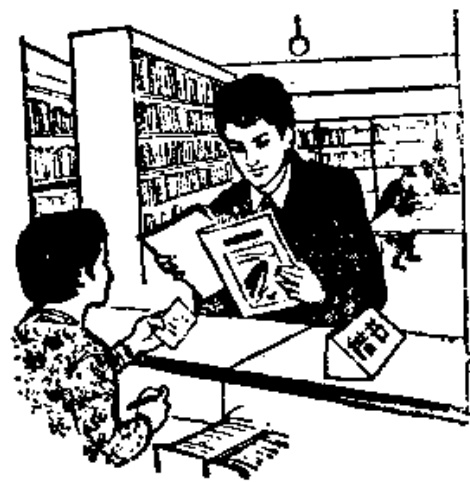

# 第十四课 — Lesson 14

> OCR transcription; not manually verified. Source and confidence metadata are preserved per page.

<!-- source_pdf_page: 143; source_printed_page: 120; ocr_confidence: 0.9981 -->

我常看中文画报。

我们是学生，他们也都是学生。

我们一起去教室。

## 一、替换练习 Substitution Drills

1. 你常看中文画报吗？
我常看中文画报。

看，电视
看，电影
去，图书馆
去，阅览室
借，书

2. 图书馆有中文书，也有外文书。

新杂志，旧杂志
中文报，外文报
中文画报，英文画报
英文小说，法文小说

<!-- source_pdf_page: 144; source_printed_page: 121; ocr_confidence: 0.9955 -->

3. 我看电影，他
也看电影，我
们都看电影。

听，录音
念，课文
作，练习
复习，旧课
预习，新课

4. 她们是学生，
你们也都是学
生。

工人 工程师
大夫 我的同学
留学生

5. 你们一起去哪儿？
我们一起去教室。

宿舍 图书馆
阅览室 北京大学
他家

6. 你们班只有男同学吗？

日本学生，外国留学生
中国同学，英国同学
男老师，女老师
英国老师，中国老师

<!-- source_pdf_page: 145; source_printed_page: 122; ocr_confidence: 0.9864 -->

不，我们班也有女同学。

## 二、课文 Text

(一)

A: 你去哪儿？

Nǐ qù nǎr?

B: 我去图书馆。你去不去？

Wǒ qù túshūguǎn. Nǐ qù bu qù?

A: 我也去。我们一起去，好吗？

Wǒ yě qù. Wǒmen yìqí qù, hǎo ma?

B: 好。

Hǎo.

A: 你常去图书馆吗？

Nǐ cháng qù túshūguǎn ma?

B: 常去。你也常去吗？

Cháng qù. Nǐ yě chángqù ma?

A: 我不常去。你借书吗？

Wǒ bù cháng qù. Nǐ jiè shū ma?

B: 我借书，也还书。

Wǒ jiè shū, yě huán shū.

A: 图书馆只有中文小说，没有

Túshūguǎn zhǐ yǒu Zhōngwén xiǎoshuǒ, méi yǒu

<!-- source_pdf_page: 146; source_printed_page: 123; ocr_confidence: 0.9706 -->

外文 小说 吗？

wàiwén xiǎoshuō ma?

B: 不，那儿有 中 文 小说，也有 外文

Bù, nàr yóu Zhōngwén xiǎoshuō, yě yóu wàiwén

小说。

xiǎoshuō.

(二)

这是阅览室。这儿有 中文 杂志，也有

Zhè shì yuèlǎnshì. Zhèr yóu Zhōngwén zázhì, yě yǒu

外文 杂志。

wàiwén zázhì.

一个 学生 问

Yí ge xuéshèng wèn

工作 人员：

gōngzuò rényuán:

“同志，这儿有

“Tóngzhì, zhèr yóu

英文 杂志吗？”

Yīngwén zázhì ma?”

“有。这些 都是 英文 杂志。”

“Yóu. Zhè xiē dōu shì Yīngwén zázhì.”

“那些也都是 英文 杂志吗？”

“Nà xiē yě dōu shì Yīngwén zázhì ma?”

<!-- source_pdf_page: 147; source_printed_page: 124; ocr_confidence: 0.9882 -->

“是的①，那些也都是英文杂志。”

“Shìde, nà xiē yě dōu shì Yīngwén zázhì.”

“哪些是新杂志？”

“Nǎ xiē shì xīn zázhì?”

“这些是新杂志，你看哪本？”

“Zhè xiē shì xīn zázhì, nǐ kàn nǎ běn?”

“我看这本。”

“Wǒ kàn zhè běn.”

阅览室很安静，也很干净。学生们

Yuèlǎnshì hěn ānjìng, yě hěn gānjìng. Xuéshengmen

常常②去阅览室。

chángcháng qù yuèlǎnshì.

## 三、生词 New Words

|  1. 常 | (副) cháng | often  |
| --- | --- | --- |
|  2. 电影 | (名) diànyǐng | film  |
|  3. 图书馆 | (名) túshūguǎn | library  |
|  4. 阅览室 | (名) yuèlǎnshì | reading-room  |
|  5. 借 | (动) jiè | to borrow, to lend  |
|  6. 外文 | (名) wàiwén | foreign language  |
|  7. 小说 | (名) xiǎoshuō | novel  |
|  8. 一起 | (副) yìqǐ | together  |
|  9. 只 | (副) zhǐ | only  |

<!-- source_pdf_page: 148; source_printed_page: 125; ocr_confidence: 0.9939 -->

10. 还 (动) huán to return
11. 人员 (名) rényuán (member of) personnel
12. 同志 (名) tóngzhì cómrade
13. 些 (量) xiē some
14. 安静 (形) ānjìng quiet
15. 常常 (副) chángcháng often

## 补充生词 Additional Words

1. 借书证 jièshūzhèng library card
2. 书名 (名) shūmíng title of a book
3. 目录 (名) mùlù catalogue
4. 日期 (名) rìqī date
5. 姓名 (名) xìngmíng full name

## 四、注释 Notes

### ① “是的”

在对话中，如果同意对方的提问，可以回答“是”，也可以回答“是的”，意思一样。

In conversation, when one agrees with another person, one may reply with 是 or 是的, which are the same in meaning.

### ② “常”和“常常”常 and 常常

副词“常”在句子中也可说成“常常”，意思一样。但“不常”不能说成“不常常”。

The adverb 常 can be repeated as 常常 in discourse, but the

<!-- source_pdf_page: 149; source_printed_page: 126; ocr_confidence: 0.9931 -->

negative form of 常常 is 不常, never 不常常.

## 五、语法 Grammar

### 1. 状语 Adverbial adjunct

在句子中, 动词、形容词前面的修饰成分叫状语, 被修饰的成分叫中心语。经常作状语的是副词、形容词等。例如:

An adverbial adjunct is a modifier used before a verb or an adjective which is called the central word. Adverbs and adjectives, etc., can be used as adverbial adjuncts, e.g.

他常看中文杂志。

我们一起去图书馆。

他们努力学习汉语。

### 2. “都”和“也” 都 and 也

“都”表示总括全部。所总括的对象一般放在“都”前。例如:

The adverb 都 refers inclusively to all that goes before it, e.g.

他们都看电视吗?

这些学生都很努力。

“也”表示两事相同。可以指主语, 也可以指谓语。例如:

The adverb 也 implies that two actions or events are similar. It may refer to either the subject or the predicate, e.g.

他写汉字, 我也写汉字。

我看中文画报, 也看英文画报。

“都”和“也”必须放在动词或形容词前, 不能放在主语前。

<!-- source_pdf_page: 150; source_printed_page: 127; ocr_confidence: 0.9921 -->

不能说“他学习汉语，也我学习汉语”；“都我们学习汉语”。

Both 都 and 也 must be placed before a verb or an adjective, and they cannot appear before the subject of a sentence. So it would be incorrect to say 他学习汉语，也我学习汉语，or 都我们学习汉语.

“都”和“也”并用时，“也”用在“都”前。例如：

When they are used together, 也 should precede 都, e.g.

她们去图书馆，我们也都去图书馆。

3. 用“……，好吗？”提问

Make a question with …, 好吗？

用“……，好吗？”提问，常常是用前边的陈述句部分提出建议，用“好吗”征求对方的同意。例如：

This kind of question is formed by a statement conveying a suggestion plus the tag 好吗 to solicit approval, e.g.

我们一起去图书馆，好吗？

我问问题，你回答，好吗？

4. 量词“些” Measure word 些

“些”表示不定的数量，常和“这”“那”等连用。例如：

The measure word 些 indicates an indefinite quantity.

It is often used together with 这，那，etc., e.g.

这些教室都很干净。

那些人都是我的朋友。

“些”只能和数词“一”结合，不能和其他数词连用。例如：

些 can only be used together with the numeral —. It

<!-- source_pdf_page: 151; source_printed_page: 128; ocr_confidence: 0.9891 -->

cannot be used together with any other numerals, e.g.

我有一些中文杂志。

他有一些外文小说。

## 六、练习 Exercises

1. 按照正确的语序把下列词语组成句子：

Rearrange the scrambled words and phrases, to form correct sentences:

(1) 不太大 我们的 图书馆

(2) 安静 很 阅览室

(3) 常 我们 中国 看 电影

(4) 汉语 和 都 哈利 我 学习

(5) 一起 我们 复习 和 课文 生词

(6) 借 常 张力 小说 外文

(7) 他们 去 一起 常 图书馆

(8) 看 他们 电视 晚上 一起 今天

2. 用“也”、“都”、“常”、“一起”、“只”填空：

Fill the blanks, with 也, 都, 常, 一起 or 只:

哈利是留学生，他学习汉语。哈利有一个同学，叫谢力。谢力____是留学生，他____学习汉语。

<!-- source_pdf_page: 152; source_printed_page: 129; ocr_confidence: 0.9910 -->

哈利____去图书馆，谢力____去图书馆。他们____借外文小说。今天哈利和谢力____去图书馆。哈利____还书，不借书。谢力借书，不还书。

3. 根据实际情况回答问题：

Give your own answers to the questions:

(1) 你们学校的图书馆大不大？
(2) 你们的图书馆有中文小说吗？
(3) 你常去图书馆吗？
(4) 你常去阅览室吗？
(5) 阅览室安静不安静？
(6) 阅览室有什么文杂志？
(7) 你常和谁一起去图书馆、阅览室？
(8) 你常借什么书？什么杂志？

4. 朗读下面对话：

Read the following dialogue:

### 在图书馆

A: 你好！

B: 你好！你借书吗？

A: 我借书，也还书。我还这本书。

<!-- source_pdf_page: 153; source_printed_page: 130; ocr_confidence: 0.9724 -->

B: 你借什么书?

A: 我借英文书。有英文小说吗?

B: 有。这些都是英文小说。你借几本?

A: 我借两本。

B: 你借哪两本?

A: 我借这两本。

B: 你只借英文小说吗?

A: 是的, 我只借英文小说。

5. 根据拼音写出汉字:

Write the following phonetic transcriptions as characters:

电 {diànyìng} 室 {jiàoshì} 图 {dìtú} {túshūguǎn}

## 汉字表 Table of Chinese Characters

> **Uncertainty:** OCR of character components and stroke forms is unreliable. This section is excluded from the default retrieval corpus.

|  1 | 常 | 广(ㄏㄧㄝˊ)  |   |
| --- | --- | --- | --- |
|   |  | 吊(ㄅㄇㄋ吊)  |   |
|  2 | 影 | 日  |   |
|   |  | 京  |   |
|   |  | 乡(ㄏㄠㄡ)  |   |
|  3 | 馆 | 馆(ㄏㄠ馆) | 館  |
|   |  | 官(宀宀宀宀官)  |   |

<!-- source_pdf_page: 154; source_printed_page: 131; ocr_confidence: 0.8314 -->

|  4 | 閏 | 门 | 閲  |
| --- | --- | --- | --- |
|   |  | 兌 |   |
|  5 | 覽 | 此 ( 丌 丌 此 此 ) | 覽  |
|   |  | 見 |   |
|  6 | 借 | 亻 |   |
|   |  | 昔 ( 一 一 一 一 一 昔 ) |   |
|  7 | 起 | 走 上 |   |
|   |  | 心 |   |
|   |  | 已 ( 一 已 ) |   |
|  8 | 只 | 口 |   |
|   |  | 八 |   |
|  9 | 还 | 不 | 還  |
|   |  | 辶 |   |
|  10 | 頁 |  | 頁  |
|  11 | 些 | 此 ( 丌 丌 丌 此 此 ) |   |
|   |  | 二 |   |
|  12 | 静 | 青 ( 一 一 一 一 一 青 ) |   |
|   |  | 爭 ( 丿 丶 丶 丶 丶 亭 ) |   |
