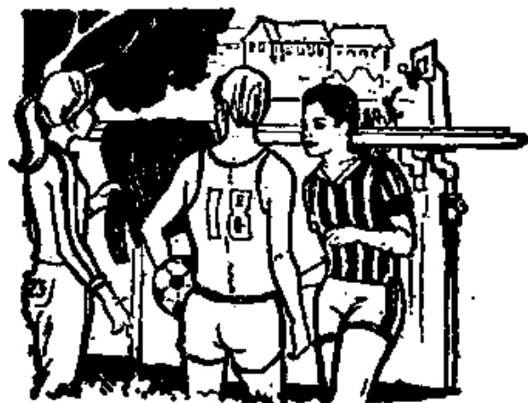

# 第十五课 — Lesson 15

> OCR transcription; not manually verified. Source and confidence metadata are preserved per page.

<!-- source_pdf_page: 155; source_printed_page: 132; ocr_confidence: 0.9963 -->

这支钢笔是他的。
你看电视还是看电影？

## 一、替换练习 Substitution Drills

1. 这支钢笔是
他的吗？
这支钢笔是
他的。

这本小说 这本杂志
这个本子 这本词典
这件毛衣 这张画儿

2. 这件毛衣是
谁的？
这件毛衣是
我的。

他 丁文 哈利
小王 张老师

3. 你的毛衣是不是新的？
我的毛衣不是新的。

旧 红 黄
蓝 白 黑

<!-- source_pdf_page: 156; source_printed_page: 133; ocr_confidence: 0.9726 -->

4. 你看电视还是看
电影？
我看电影。

复习生词，念课文
听录音，作练习
看画报，看杂志
去操场，去商店

5. 今天的电影是中文的还
是英文的？
今天的电影是中文的。

英文，法文
中国，外国
法国，中国
彩色，黑白

## 二、课文 Text

（一）

操场上①有一件毛衣。一个同学问：

Cāochǎng shang yǒu yí jiàn máoyī. Yí ge tóngxué wèn:

“哈利，这件毛衣是你的吗？”

“Hālì, zhè jiàn máoyī shì nǐ de ma?”

“不是，我的毛衣是蓝的，不是黑的。”

“Bú shì, wǒ de máoyī shì lánde, bú shì hēide.”

“这件毛衣是不是丁文的？他的毛衣

“Zhè jiàn máoyī shì bu shì Dīng Wén de? Tā de máoyī
是什么颜色的？”

shì shénme yánsède?”

<!-- source_pdf_page: 157; source_printed_page: 134; ocr_confidence: 0.9821 -->

“丁文有一件黑毛衣。他的毛衣是
“Dīng Wén yǒu yí jiàn hēimáoyī. Tā de máoyī shì
旧的，不是新的，这件不是他的。”
jiù de, bú shì xīn de, zhè jiàn bú shì tā de.”

“这件毛衣是谁的？”

“Zhè jiàn máoyī shì shuíde?”

“小王也有一件黑毛衣，这件毛衣是
“Xiǎo Wáng yě yǒu yí jiàn hēi máoyī, zhè jiàn máoyī shì
不是他的？”
bu shì tāde?”

（二）

A: 今天晚上有电影，你看吗？

Jīntiān wǎnshang yǒu diànyíng, ní kàn ma?

B: 什么电影？是中文的还是英文的？

Shénme diànyíng? Shì Zhōngwén de hái shì Yīngwén de?

<!-- source_pdf_page: 158; source_printed_page: 135; ocr_confidence: 0.9862 -->

A: 是中文的。

Shì Zhōngwén de.

B: 是彩色的还是黑白的？

Shì cǎisède háishì hēibáide?

A: 是彩色的。小王说这个电影很有

Shì cǎisède. Xiǎo Wáng shuō zhège diànyíng hěn yǒu

意思，你看不看？

yìsi, nǐ kàn bu kàn?

B: 我想看，可是没有票。

Wǒ xiǎng kàn, kěshì méi yǒu piào.

A: 没关系，小王有三张票，我们和

Méi guānxi, Xiǎo Wáng yǒu sān zhāng piào, wǒmen hé

他一起去。

tā yìqí qù.

## 三、生词 New Words

|  1. 件 | (量) jiàn | *a measure word for clothes, luggage, etc.*  |
| --- | --- | --- |
|  2. 毛衣 | (名) máoyǐ | sweater, pullover, knitted woollen jacket  |
|  3. 小王 | (专) Xiǎo Wáng | Xiao (Little) Wang  |
|  4. 红 | (形) hóng | red  |
|  5. 黄 | (形) huáng | yellow  |
|  6. 蓝 | (形) lán | blue  |

<!-- source_pdf_page: 159; source_printed_page: 136; ocr_confidence: 0.9875 -->

7. 白 (形) bái white
8. 黑 (形) hēi black
9. 还是 (连) háishì or
10. 操场 (名) cāochǎng playground
11. 商店 (名) shāngdiàn shop
12. 法国 (专) Fǎguó France
13. 彩色 (名) cǎisè colour
14. 黑白 (名) hēibái black-and-white
15. 上 (名) shàng up, above
16. 颜色 (名) yánsè colour
17. 有意思 yǒu yìsi interesting
18. 想 (动、能动) xiǎng to want, think
19. 可是 (连) kěshì but
20. 票 (名) piào ticket
21. 没关系 méi guānxi It doesn't matter.

## 补充生词 Additional Words

1. 绿 (形) lù green
2. 深(绿) (形) shēn(lù) dark (green)
3. 浅(绿) (形) qiǎn(lù) light (green)
4. 灰 (形) huí grey

<!-- source_pdf_page: 160; source_printed_page: 137; ocr_confidence: 0.9804 -->

5. 紫

(形) zi

purple

## 四、注释 Notes

### ① 操场上

“上”用在名词后，表示处所，指名词所代表的物体的表面或顶部。如“桌子上”，“柜子上”。

used after a noun indicates the surface or top of what the noun represents, e.g. 桌子上，柜子上。

## 五、语法 Grammar

### 1. “是”字句(二) The 是-sentence (2)

名词、人称代词、形容词等后边加上“的”，可以组成“的”字短语，“的”字短语使用起来相当于一个名词。“是”字句(二)的谓语就是由“是”加“的”字短语构成的。例如：

A noun, personal pronoun or an adjective plus 的 forms a 的-phrase which is equivalent to a noun and can be used as a part of the predicate of a 是-sentence, e.g.

这本小说是老师的。

(老师的 = 老师的小说)

那件毛衣是他的。

(他的 = 他的毛衣)

“是”字句(二)的否定式和“是”字句(一)一样，也是在“是”前加“不”。例如：

The negative form of both type one and type two of the 是-sentence is constructed by putting 不 before 是, e.g.

<!-- source_pdf_page: 161; source_printed_page: 138; ocr_confidence: 0.9797 -->

这本小说不是老师的。

那件毛衣不是他的。

### 2. 选择疑问句 Choice-type question

提问时，用连词“还是”连接两种可能的答案，由回答的人选择其中之一。这种问句叫选择疑问句。例如：

The choice-type question is composed of two (or three) alternatives connected by 还是. It requires making a choice between them, e.g.

你去还是他去？

——他去。

你去教室还是去图书馆？

——我去教室。

## 六、练习 Exercises

### 1. 仿照例子回答问题：

Answer the questions, following the example:

例 Example:

这本书是老师的吗？（我的）

这本书不是老师的，这本书是我的。

(1) 这件红毛衣是丁文的吗？（小张的）

(2) 这张票是你的吗？（小王的）

<!-- source_pdf_page: 162; source_printed_page: 139; ocr_confidence: 0.9916 -->

(3) 你的毛衣是不是黄颜色的？（蓝颜色）
(4) 今天的电影是彩色的吗？（黑白的）
(5) 这些画报是新的吗？（旧的）
(6) 你家的电视是黑白的吗？（彩色的）

2. 仿照例子造选择题问句并回答:

Make choice-type questions and then give the answers, following the example:

例 Example:

杂志 英文的 法文的

这本杂志是英文的还是法文的？

这本杂志是法文的。

(1) 教室 中国同学的 外国留学生的
(2) 电影 黑白的 彩色的
(3) 毛衣 你的 丁文的
(4) 张力 学习法语 学习英语
(5) 你 去宿舍 去商店
(6) 你们 看电影 看电视

3. 根据课文（一）（二）回答问题：

Answer the questions according to texts (1) and (2):

(1) 哪儿有一件毛衣？

<!-- source_pdf_page: 163; source_printed_page: 140; ocr_confidence: 0.9935 -->

(2) 那件毛衣是什么颜色的？
(3) 哈利的毛衣是什么颜色的？
(4) 丁文有没有黑毛衣？
(5) 丁文的黑毛衣是新的还是旧的？
(6) 那件毛衣是不是丁文的？
(7) 今天晚上的电影是中文的还是英文的？
(8) 今天晚上的电影是彩色的还是黑白的？
(9) 谁说这个电影很有意思？
(10) 你想不想看？
(11) 你有没有票？
(12) 谁有票？
(13) 你们和谁一起去看电影？

4. 根据实际情况回答问题：

Give your own answers to the questions:

(1) 你有没有钢笔？你的钢笔是什么颜色的？
(2) 你有没有圆珠笔？你的圆珠笔是什

<!-- source_pdf_page: 164; source_printed_page: 141; ocr_confidence: 0.9927 -->

么颜色的？

(3) 你的钢笔和圆珠笔是新的还是旧的？

(4) 你们宿舍有电视吗？是黑白的还是彩色的？

(5) 你常看电影还是常看电视？

5. 根据拼音写出汉字：

Write the following phonetic transcriptions as Chinese characters:

|  色 | {yánsè cǎisè} | 是 | {dànshì kěshì háishì} | 同 | {tóngzhì tóngxué}  |
| --- | --- | --- | --- | --- | --- |

## 汉字表 Table of Chinese Characters

> **Uncertainty:** OCR of character components and stroke forms is unreliable. This section is excluded from the default retrieval corpus.

|  1 | 件 | 亻 |   |
| --- | --- | --- | --- |
|   |  | 牛（ㄧㄧ二牛） |   |
|  2 | 毛 |  |   |
|  3 | 衣 | ㄧㄧ六衣衣 |   |
|  4 | 紅 | 紅 | 紅  |

<!-- source_pdf_page: 165; source_printed_page: 142; ocr_confidence: 0.9871 -->

|   |  | 工 |   |
| --- | --- | --- | --- |
|  5 | 黄 | 盐（一七盐） |   |
|   |  | 由（一口曰由由） |   |
|   |  | 八 |   |
|  6 | 蓝 | 盐（一七蓝） | 蓝  |
|   |  | 蓝 |   |
|   |  | 亚（一口曰亚亚） |   |
|  7 | 白 |  |   |
|  8 | 黑 | 黑（一口曰黑黑黑黑黑） |   |
|   |  | 黑（一口黑黑黑） |   |
|  9 | 棕 | 棕 |   |
|   |  | 品（品品） |   |
|   |  | 木 |   |
|  10 | 墙 | 墙 | 墙  |
|   |  | 墙（墙墙） |   |
|  11 | 商 | 商商商商商商 |   |
|  12 | 店 | 店 |   |
|   |  | 店（店店） |   |
