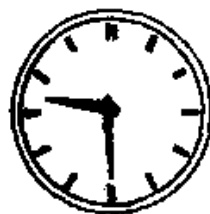

# 第十七课 — Lesson 17

> OCR transcription; not manually verified. Source and confidence metadata are preserved per page.

<!-- source_pdf_page: 181; source_printed_page: 158; ocr_confidence: 0.9900 -->

现在九点半。
我们上午八点半上课。
他身体很好。

## 一、替换练习 Substitution Drills

1. 现在九点（钟）？

现在九点半。

|  6:20 六点二十（分）  |
| --- |
|  7:15 七点十五（分）  |
|  七点一刻  |
|  9:05 九点（零）五分  |
|  10:30 十点三十  |
|  十点半  |

|  8:12  |
| --- |
|  9:30  |
|  10:05  |
|  11:35  |
|  20:30  |
|  12:45  |

<!-- source_pdf_page: 182; source_printed_page: 159; ocr_confidence: 0.9900 -->

9:45 九点四十五（分）

九点三刻

差一刻十点

11:50 十一点五十（分）

十二点差十分

2:55 两点五十五（分）

差五分三点

2:50

3:15

2. 你们上午几点上课？

我们上午八点半上课。

早上，起床，六点半

早上，吃早饭，七点

上午，去教室，八点二十

中午，下课，十一点五十

中午，吃午饭，十二点

3. 今天你们什么时候听录音？

我们下午两点半听录音。

<!-- source_pdf_page: 183; source_printed_page: 160; ocr_confidence: 0.9889 -->

锻炼身体，下午四点十分
去商店，下午五点
吃晚饭，六点
看电影，晚上七点一刻

4. 他身体怎么样？
他身体很好。

工作，好
学习，努力

## 二、课文 Text

张力是北京大学的学生。北京大学
Zhāng Lì shì Běijīng Dàxué de xuésheng. Běijīng Dàxué
很大，学生很多。

hěn dà, xuésheng hěn duō.

张力学习英语。他早上六点十分
Zhāng Lì xuéxí Yīngyǔ. Tā zǎoshang liù diǎn shí fēn
起床，六点三刻吃早饭，七点半去教
qí chuáng, liù diǎn sān kè chī zǎo fàn, qí diǎn bàn qù jiào
室，八点钟上课。

shì, bā diǎn zhōng shàng kè.

他上午有四节课，差十分十二点下
Tā shàngwǔ yǒu sì jié kè, chà shí fēn shí'èr diǎn xià

<!-- source_pdf_page: 184; source_printed_page: 161; ocr_confidence: 0.9656 -->

课，十二点吃午饭。下午四点一刻，张力
kè, shí'èr diǎn chī wǔ fàn. Xiàwǔ sì diǎn yí kè, Zhāng Lì

和同学们一起去操场锻炼身体。

hé tóngxuémen yíqì qù cāochǎng duànliàn shēntí.

晚上他作练习，听录音。有时候，他

Wǎnshang tā zuò liànxí, tīng lùyīn. Yǒu shíhou, tā

也看电视或者看电影。他十点半睡觉。

yě kàn diànshì huòzhě kàn diànyíng. Tā shí diǎn bàn shuìjiào.

张力身体很好，学习也很努力。

Zhāng Lì shēntí hěn hǎo, xuéxí yě hěn nǔlì.

## 三、生词 New Words

|  1. 现在 | (名) xiànzài | now  |
| --- | --- | --- |
|  2. 点(钟) | (量) diǎn(zhōng) | o'clock  |
|  3. 半 | (数) bàn | half  |
|  4. 分 | (量) fēn | minute  |
|  5. 刻 | (量) kè | quarter  |
|  6. 差 | (动) chà | to be short of  |
|  7. 上午 | (名) shàngwǔ | morning  |
|  8. 上(课) | (动) shàng(kè) | to attend (class), to give (a lesson)  |
|  9. 早上 | (名) zǎoshang | morning  |

<!-- source_pdf_page: 185; source_printed_page: 162; ocr_confidence: 0.9927 -->

10. 起床 qí chuáng to get up, to get out of bed
11. 吃 (动) chī to eat
12. 早饭 (名) zǎofàn breakfast
13. 中午 (名) zhōngwǔ noon
14. 下(课) (动) xià(kè) (of class) to be over
15. 午饭 (名) wǔfàn lunch
16. 时候 (名) shíhou time
17. 下午 (名) xiàwǔ afternoon
18. 锻炼 (动) duànliàn to do physical exercises
19. 晚饭 (名) wǎnfàn supper
20. 节 (量) jié a measure word, period, length
21. 或者 (连) huòzhě or
22. 睡觉 shuǐjiào sleep

## 补充生词 Additional Words

1. 秒 (量) miǎo second
2. 中餐 (名) zhōngcān Chinese food
3. 西餐 (名) xīcān Western food
4. 面包 (名) miànbāo bread
5. 牛奶 (名) niúnǎi milk

<!-- source_pdf_page: 186; source_printed_page: 163; ocr_confidence: 0.9992 -->

## 四、语法 Grammar

#### 1. 名词谓语句 Sentence with a noun as its predicate

由名词、名词短语、数量词等作谓语主要成分的句子叫名词谓语句。例如：

This kind of sentence takes a noun, a nominal phrase or a numeral-measure word as its predicate, e.g.

你哪儿人？

——我北京人。

现在九点二十五分。

一件毛衣二十四块八（毛）。

名词谓语句的否定式要在名词谓语前加“不是”。例如：

The negative form of this kind of sentence is constructed by putting 不是 before the predicate, e.g.

我不是北京人。

现在不是九点二十五分。

#### 2. 主谓谓语句 Sentence with a subject-predicate construction as its predicate

由主谓结构作谓语主要成分的句子叫主谓谓语句。例如：

This kind of sentence takes a subject-predicate construction as its predicate, e.g.

他身体好。

我们学校留学生很多。

这种句子的特点是全句的主语和主谓结构里的主语所指的人

<!-- source_pdf_page: 187; source_printed_page: 164; ocr_confidence: 0.9944 -->

或事物有一定的关系，后者常常是属于前者的。

The subject of the sentence and the subject of the subject-predicate construction are closely related, and the latter usually belongs to or is part of the former.

## 五、练习 Exercises

1. 用汉语说出下列时间：

Say the following units of time in Chinese:

( 1 ) 2:00 ( 2 ) 9:10 ( 3 ) 8:20
( 4 ) 10:2 ( 5 ) 3:05 ( 6 ) 4:15
( 7 ) 6:30 ( 8 ) 7:45 ( 9 ) 5:55
( 10 ) 9:07 ( 11 ) 11:40 ( 12 ) 12:59

2. 按照括号里的时间用汉字填空并提问：

Fill in the blanks with the Chinese characters for the units of time in parentheses, and then ask questions about the passage:

小王和小白都是北京语言学院的学生，他们都学习英语。他们早上____（6:00）起床，____（6:15）预习新课，____（6:55）吃早饭，____（7:45）去教室，____（8:00）上课。他们上午上四节课，____（12:00）下课。____（12:10）吃午

<!-- source_pdf_page: 188; source_printed_page: 165; ocr_confidence: 0.9935 -->

饭。下午____（4:00）锻炼身体，____（6:00）吃晚饭。晚上____（7:15）在宿舍复习课文，作练习。有时候他们也看电影或者电视。他们晚上____（10:30）或者____（10:40）睡觉。小王和小白学习很好，身体也很好。

3. 按照实际情况回答问题：

Give your own answers to the following questions.

(1) 你早上几点起床？
(2) 你早上锻炼身体吗？几点锻炼？
(3) 你几点吃早饭？
(4) 你上午上几节课？
(5) 你上午几点上课？几点下课？
(6) 中午你几点吃午饭？
(7) 你下午和晚上有课吗？有几节课？
(8) 你下午锻炼身体吗？几点锻炼？
(9) 你几点吃晚饭？
(10) 晚上你看电影或者电视吗？

<!-- source_pdf_page: 189; source_printed_page: 166; ocr_confidence: 0.9632 -->

(11) 你下午作练习还是晚上作练习？

(12) 晚上你什么时候睡觉？

4. 仿照课文写出你一天的生活。

Write a short passage on your daily life, imitating the text.

5. 根据拼音写出下列空格中的汉字：

Fill in the blanks with appropriate characters according to the given phonetic transcriptions:

kè {上_____
八点三_____

yán {语____学院
____色

jiàn {再_____
两____衣服

xi {东_____
没关_____

liàn {____习
微_____

diǎn {词_____
八____（钟）

zài {现_____
____见

diàn {商_____
____影

jiè {世_____
____书

shí {有____候
七点四_____

shì {电_____
教_____

jiào {睡_____
____室
你____什么名字

<!-- source_pdf_page: 190; source_printed_page: 167; ocr_confidence: 0.9958 -->

## 汉字表 Table of Chinese Characters

> **Uncertainty:** OCR of character components and stroke forms is unreliable. This section is excluded from the default retrieval corpus.

|  1 | 现 | 王 | 現  |
| --- | --- | --- | --- |
|   |  | 見 |   |
|  2 | 点 | 占 | 點  |
|   |  | 𠂇 |   |
|  3 | 半 | 𠂇 𠂇 三半 |   |
|  4 | 刻 | 亥（𠂇 一一 𠂇 亥 亥亥） |   |
|   |  | 𠂇 |   |
|  5 | 差 | 差（𠂇 𠂇 三三 𠂇 差） |   |
|   |  | 二 |   |
|  6 | 午 | 午 𠂇 一一 午 |   |
|  7 | 早 | 日 |   |
|   |  | 十 |   |
|  8 | 吃 | 口 |   |
|   |  | 乞（𠂇 一乞） |   |
|  9 | 饭 | 饣 | 飯  |
|   |  | 反（𠂇 厅 反） |   |
|  10 | 鍛 | 鍛 | 鍛  |
