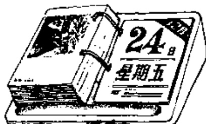

# 第十八课 — Lesson 18

> OCR transcription; not manually verified. Source and confidence metadata are preserved per page.

<!-- source_pdf_page: 192; source_printed_page: 169; ocr_confidence: 0.9987 -->

今天星期一。

张老师教我们汉语。

## 一、替换练习 Substitution Drills

1. 今年是一九八七年。

去年，一九八六年

明年，一九八八年

2. 今天几月几号（日）？

（昨天几月几号？

明天几月几号？）

今天十月十九号（日）。

二月十号

三月八号

五月四号

六月二十号

十一月三号

十二月一号

<!-- source_pdf_page: 193; source_printed_page: 170; ocr_confidence: 0.9956 -->

3. 今天星期几？

今天星期一。

|  星期二 | 星期三  |
| --- | --- |
|  星期四 | 星期五  |
|  星期六 | 星期日（星期天）  |

4. 你们星期几有体育课？

我们星期二有体育课。

|  汉语课， | 星期一  |
| --- | --- |
|  语法课， | 星期三  |
|  复习课， | 星期四  |
|  张老师的课， | 星期五  |
|  王老师的课， | 星期六  |

5. 张老师教你们什么？

张老师教我们汉语。

|  语法 | 汉字  |
| --- | --- |
|  课文 | 体育  |
|  中国文化 |   |

<!-- source_pdf_page: 194; source_printed_page: 171; ocr_confidence: 0.9805 -->

6. 王老师教他们英语吗？
王老师不教他们英语。

|  德语 | 法语  |
| --- | --- |
|  汉语 | 体育  |
|  语法 | 课文  |

## 二、课文 Text

(一)

一年①有十二个月。这十二个月是：一月、
Yì nián yǒu shí'èr ge yuè. Zhè shí'èr ge yuè shì: Yīyuè,
二月、三月、四月、五月、六月、七月、
Èryuè, Sānyuè, Shiyuè, Wǔyuè, Liùyuè, Qīyuè,
八月、九月、十月、十一月、十二月。
Bāyuè, Jiǔyuè, Shiyuè, Shiyīyuè, Shí'èryuè.

一个星期有七天。这七天是：星期一、
Yíge xīngqī yǒu qī tiān. Zhè qī tiān shì: Xīngqīyǐ,
星期二、星期三、星期四、星期五、星期六、
Xīngqī'èr, Xīngqīsān, Xīngqīsì, Xīngqīwǔ, Xīngqīliù,
星期日（星期天）。
Xīngqīrì (Xīngqītiān).

(二)

A: 今天（几月）几号？

Jīntiān (jí yuè) jí hào?

B: 今天十二月二十四号。

Jīntiān Shí'èryuè èrshíshì hào.

<!-- source_pdf_page: 195; source_printed_page: 172; ocr_confidence: 0.9718 -->

A: 今天星期几?

Jīntiān Xīngqīji?

B: 今天星期五。

Jīntiān Xīngqīwǔ.

A: 上午 你们有几节课?

Shàngwǔ nǐmen yǒu jí jié kè?

B: 有四节课，都是汉语课。

Yǒu sì jié kè, dōu shì Hànyǔ kè.

A: 谁教 你们汉语?

Shuǐ jiāo nǐmen Hànyǔ?

B: 张老师教我们 生词 和语法，王

Zhāng lǎoshī jiāo wǒmen shēngcí hé yǔfǎ, Wáng

老师教 我们课文和汉字。

lǎoshī jiāo wǒmen kèwén hé hànzi.

A: 你们星期几有体育课?

Nǐmen xīngqī jí yǒu tiyù kè?

B: 星期二下午有体育课。

Xīngqī'èr xiàwǔ yǒu tiyù kè.

A: 谁教 你们体育?

Shuǐ jiāo nǐmen tiyù?

B: 丁老师。

Dīng lǎoshī.

A: 星期日你们 作什么?

Xīngqīrì nǐmen zuò shénme?

<!-- source_pdf_page: 196; source_printed_page: 173; ocr_confidence: 0.9821 -->

B: 星期日我们休息。我们常常去

Xīngqīrì wǒmen xiūxi. Wǒmen chángcháng qù

看电影或者去公园玩儿。

kàn diànyíng huòzhě qù gōngyuán wánr.

## 三、生词 New Words

|  1. 今年 | (名) jīnnián | this year  |
| --- | --- | --- |
|  2. 年 | (名) nián | year  |
|  3. 去年 | (名) qùnián | last year  |
|  4. 明年 | (名) míngnián | next year  |
|  5. 月 | (名) yuè | month  |
|  6. 号 | (名) hào | date, day of the month (colloq.)  |
|  7. 日 | (名) rì | date, day of the month  |
|  8. 昨天 | (名) zuó tiān | yesterday  |
|  9. 明天 | (名) míngtiān | tomorrow  |
|  10. 星期 | (名) xīngqī | week  |
|  11. 星期日 | (名) Xīngqīrì | Sunday  |
|  12. 星期天 | (名) Xīngqītiān | Sunday (colloq.)  |
|  13. 体育 | (名) tǐyù | physical education  |
|  14. 语法 | (名) yǔfǎ | grammar  |
|  15. 教 | (动) jiāo | to teach  |

<!-- source_pdf_page: 197; source_printed_page: 174; ocr_confidence: 0.9839 -->

16. 文化 (名) wénhuà culture
17. 德语 (名) Déyǔ German
18. 法语 (名) Fǎyǔ French
19. 天 (名) tiān day
20. 休息 (动) xiūxi to take a rest
21. 公园 (名) gōngyuán park
22. 玩儿 (动) wánr to have fun, to carry out any leisure activity

## 补充生词 Additional Words

1. 上星期 (名) shàngxīngqī last week
2. 下星期 (名) xiàxīngqī next week
3. 上月 (名) shàngyuè last month
4. 下月 (名) xiàyuè next month

## 四、注释 Notes

### ① “年” “天” 等具有量词性质的名词

Nouns with the characteristics of measure words 年, 天
“年” “天” 等名词具有量词性质, 前边有数词修饰时, 中间不能加量词。如“一年”不能说“一个年”。

Noun such as 年, 天 partake of the nature of a measure word, so, when they are modified by a numeral, no measure word is used after that numeral, e.g. 一年 cannot be said as 一个年.

<!-- source_pdf_page: 198; source_printed_page: 175; ocr_confidence: 0.9902 -->

## 五、语法 Grammar

1. 年、月、日和星期 年, 月, 日 and 星期

汉语年份的读法一般是直接读出数字加年。例如:

A calendar year is expressed by saying the number of the specific year in telephone style (that is, simply listing the digits) in front of 年, e.g.

一九八七年 (yìjiǔbāqīnián)

一九九〇年 (yìjiǔjiǔlíngnián)

汉语十二个月的名称是数字加月。例如:

The names of the twelve months of the year are expressed by putting the number of the specific month in front of 月, e.g.

一月 二月 三月 四月

五月 六月 七月 八月

九月 十月 十一月 十二月

汉语日的读法是数字加日。例如:

The names of dates are expressed by putting the specific number in front of 日, e.g.

一日 二日 三日 ……………… 十日

十一日 十二日 十三日 ………… 二十日

二十一日 二十二日 二十三日 …三十日

三十一日

在口语里, “日”常常说“号”。

<!-- source_pdf_page: 199; source_printed_page: 176; ocr_confidence: 0.9916 -->

In spoken Chinese, 号 is often used instead of 日 to express dates.

一个星期的名称是:

The names of the days of the week are as follows:

星期一 星期二 星期三

星期四 星期五 星期六

星期日 (星期天)

2. 年、月、日、时的顺序 The order of 年, 月, 日, 时
年、月、日、时连在一起, 顺序是: 年——月——日——时
例如:

When given together, the year, month, day and hour are arranged as follows:

一九八七年十月五日下午六时

3. 双宾语动词谓语句 Sentence with a verb taking two objects

动词谓语句中有的谓语动词可以带两个宾语, 间接宾语 (一般是指人的) 在前, 直接宾语 (一般是指事物的) 在后。例如:

The verb in this kind of sentence takes two objects one of which is the indirect object (animate), and the other of which is the direct object (inanimate), e.g.

王老师教他们汉语。

他给我一张电影票。

汉语里能带两个宾语的动词很少, 主要有“教”“送”
“给”“借”“还”“问”等。并不是任何一个动词都可以带双
宾语。不能说“他买我一本书”, “老师讲我们汉语”。

<!-- source_pdf_page: 200; source_printed_page: 177; ocr_confidence: 0.9941 -->

There are not many of this kind of double-object verbs in Chinese. The most frequently used are 教, 送, 给, 借, 还, 问, etc. By no means can all verbs take two objects, so, we cannot say, for example, 他买我一本书 or 老师讲 (jiǎng, to lecture) 我们汉语.

## 六、练习 Exercises

1. 根据下面句子的划线部分提问:

Ask questions on the underlined parts of the following sentences:

(1) 今天星期三。
(2) 明天十月二十二号。
(3) 早上我们八点钟上课。
(4) 丁文一九八九年去英国。
(5) 我们一个星期有二十节汉语课。
(6) 张老师教我们中国文化课。
(7) 我们星期四下午有体育课。
(8) 白老师教中国学生英语。

2. 根据实际情况回答问题:

Give your own answers to the following questions:

(1) 今天是几月几号?
(2) 今天星期几?

<!-- source_pdf_page: 201; source_printed_page: 178; ocr_confidence: 0.9915 -->

(3) 现在几点钟？
(4) 你们今天有汉语课吗？
(5) 你们一个星期有几节汉语课？
(6) 谁教你们汉语？
(7) 你们有没有体育课？星期几有？
(8) 你常去公园玩儿吗？星期几去？

3. 按照正确的语序把下列词语组成句子：

Make sentences with the following groups of words and phrases:

(1) 他们班 张老师 体育 教
(2) 白老师 语法 教 我们班
(3) 丁文 一张 电影票 他 给
(4) 小王 还 丁文 钢笔 一支
(5) 哈利 借 书 两本 图书馆
(6) 阅览室 一本 借 杂志 王新
(7) 中国文化课 那个班 马老师 教
(8) 问 他 我 问题 三个
(9) 给 售贷员 我 十块钱
(10) 三块二 售贷员 我 找

<!-- source_pdf_page: 202; source_printed_page: 179; ocr_confidence: 0.9964 -->

### 4. 阅读下面短文并复述:

Read and retell the following passage:

今天是十月二十三号，星期五。我们上午有四节课：两节汉语课，两节中国文化课。白老师教我们汉语，丁老师上中国文化课。下午我们有两节体育课，张老师教我们体育。明天是星期六，下午没有课，我们休息。明天我和同学一起去公园玩儿。

## 汉字表 Table of Chinese Characters

> **Uncertainty:** OCR of character components and stroke forms is unreliable. This section is excluded from the default retrieval corpus.

|  1 | 年 | 一九二三年  |   |
| --- | --- | --- | --- |
|  2 | 明 | 日  |   |
|   |  | 月  |   |
|  3 | 月 |   |   |
|  4 | 号 | 一二三号 | 號  |
|  5 | 日 |   |   |
|  6 | 昨 | 日  |   |
|   |  | 午  |   |

<!-- source_pdf_page: 203; source_printed_page: 180; ocr_confidence: 0.9926 -->

|  7 | 星 | 日 |   |
| --- | --- | --- | --- |
|   |  | 生 |   |
|  8 | 期 | 其（一七廿廿廿廿其其） |   |
|   |  | 月 |   |
|  9 | 育 | 去（一六去） |   |
|   |  | 月 |   |
|  10 | 化 | 丿丿化 |   |
|  11 | 德 | 亻 |   |
|   |  | 憲（一六憲憲憲憲憲憲） |   |
|  12 | 休 | 亻 |   |
|   |  | 木 |   |
|  13 | 息 | 自（丿自自自自） |   |
|   |  | 心 |   |
|  14 | 公 | 丿八公公 |   |
|  15 | 國 | 囗 | 圓  |
|   |  | 元（一二元） | 冂冈國  |
|  16 | 玩 | 乚 |   |
|   |  | 元 |   |
