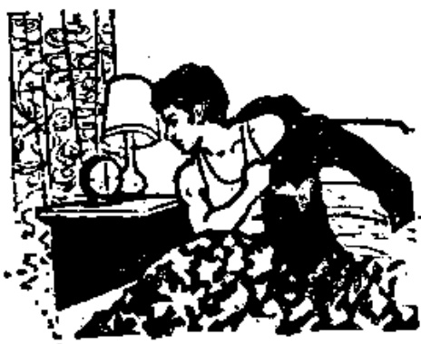
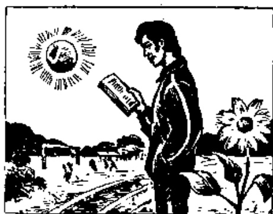
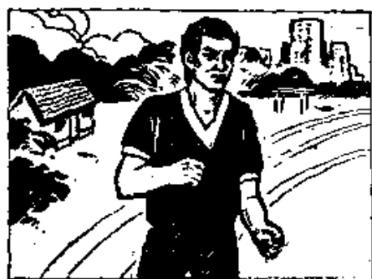

# 第二十课 — Lesson 20

> OCR transcription; not manually verified. Source and confidence metadata are preserved per page.

<!-- source_pdf_page: 216; source_printed_page: 193; ocr_confidence: 0.9704 -->

他起得很早。
他写汉字写得不快。
你课文念得熟不熟？

## 一、替换练习 Substitution Drills

哈利六点起床，
他起得很早。
马丁八点起床，
他起得不早，
他起得很晚。

1. 他睡得晚吗？
他睡得很晚。
他睡得不晚。

来， 早
去， 晚
跑， 快
回答， 对

<!-- source_pdf_page: 217; source_printed_page: 194; ocr_confidence: 0.9980 -->

2. 哈利学习什么？

他学习汉语。

他学得怎么样？

他学得很好。

丁文，英语
张力，法语
他哥哥，德语

3. 哈利念课文念得怎么样？

他念课文念得很好。

写，汉字
作，练习
回答，问题
说，汉语

4. 他写汉字写得快吗？

他写汉字写得很快。

他写汉字写得不快。

念生词，清楚
念课文，熟
翻译句子，对
踢足球，好
跑步，快

5. 安娜课文念得熟不熟？

<!-- source_pdf_page: 218; source_printed_page: 195; ocr_confidence: 0.9768 -->

她课文念得很熟。
她课文念得不熟。

问题，回答，对
生词，写，清楚
句子，翻译，好
练，作，认真

## 二、课文 Text

哈利学习汉语，他
Hālì xuéxí Hànyǔ, tā
很努力，他学得很好。
hěn nǔlì, tā xué de hěn hǎo.

早上，哈利起得很
Zǎoshang, Hālì qí de hěn
早。他常常在操
zǎo. Tā chángcháng zài cǎo

场念课文，他课文念得很熟。
chǎng niàn kèwén, tā kèwén niàn de hěn shú.

上午八点上课。哈利七点三刻来
Shàngwǔ bā diǎn shàng kè. Hālì qí diǎn sān kè lái
教室，他来得很早。老师问问题，他回答
jiǎoshì, tā lái de hěn zǎo. Lǎoshì wèn wèntí, tā huí dá

<!-- source_pdf_page: 219; source_printed_page: 196; ocr_confidence: 0.9711 -->

得 很对，翻译句子也翻译得很好。

de hěn duì, fānyì jùzi yě fānyì de hěn hǎo.

下午，哈利跟 同学

Xiàwǔ, Hālì gēn tóngxué

一起锻炼 身体。他跑

yìqí duànliàn shēntí. Tā pǎo

得不 慢，足球踢得很

de bú màn, zúqiú tí de hěn

好，排球打得也不错。

hǎo, pàiqiú dà de yě búcuò.

晚上，他在宿舍学习。他练习作得很

Wǎnshang, tā zài sùshè xuéxí. Tā liànxi zuò de hěn

认真，汉字写得很清楚。他十点半睡觉，

rènzhēn, Hànzì xiě de hěn qīngchu. Tā shídiǎn bàn shuì jiào,

他睡得不晚。

tā shuì de bù wǎn.

星期日，哈利常跟同学一起进城。

Xīngqīrì, Hālì cháng gēn tóngxué yìqí jìn chéng.

他们买东西，看电影，或者去公园

Tāmen mǎi dōngxi, kàn diànyíng, huòzhě qù gōngyuán

玩儿。他们玩儿得很高兴。

wánr. Tāmen wánr de hěn gāoxìng.

<!-- source_pdf_page: 220; source_printed_page: 197; ocr_confidence: 0.9908 -->

## 三、生词 New Words

1. 起(床) (动) qí(chuàng) to get up
2. 得 (助) de a structural particle
3. 早 (形) zǎo early
4. 马丁 (专) Mǎdīng Martin
5. 晚 (形) wǎn late
6. 来 (动) lái to come
7. 跑 (动) pǎo to run
8. 快 (形) kuài quick, fast
9. 对 (形) duì right, correct
10. 学 (动) xué to learn, to study
11. 清楚 (形) qīngchu clear
12. 熟 (形) shú fluent, skilled
13. 翻译 (动) fānyì to translate, to interpret
14. 句子 (名) jùzi sentence
15. 踢 (动) tī to kick, to play (football)
16. 足球 (名) zúqiú football
17. 跑步 pǎobù to run (as an exercise)
18. 安娜 (专) Ānnà Anna

<!-- source_pdf_page: 221; source_printed_page: 198; ocr_confidence: 0.9887 -->

19. 认真 (形) rènzhēn conscientious
20. 慢 (形) màn slow
21. 排球 (名) páiqiú volleyball
22. 打(球) (动) dǎ(qiú) to play (a ball game)
23. 不错 (形) búcuò not bad
24. 高兴 (形) gāoxìng glad

## 补充生词 Additional Words

1. 篮球 (名) lánqiú basketball
2. 棒球 (名) bàngqiú baseball
3. 乒乓球 (名) pīngpāngqiú table-tennis
4. 羽毛球 (名) yǔmáoqiú badminton
5. 网球 (名) wǎngqiú tennis
6. 太极拳 (名) tàijíquán Taijiquan, a kind of traditional Chinese shadow boxing

## 四、语法 Grammar

### 1. 程度补语 Complement of degree

在汉语里, 动词或形容词后边的补充说明成分叫补语, 被补充说明的动词或形容词是中心语。有一种补语是用来说明动作达到的程度或动作的情态的, 叫程度补语。程度补语和动词之间要用结构助词“得”连接。简单的程度补语一般由形容词充任。动词带程度补语所表示的一般是经常的或者已成事实的情况。例如:

<!-- source_pdf_page: 222; source_printed_page: 199; ocr_confidence: 0.9998 -->

In Chinese, a complement is a supplementary element that is used after a verb or an adjective for further qualification. The qualified verb or adjective is called the central word. One type of complement, which is called a complement of degree, shows the degree an action reaches or the manner in which it is done. The structural particle 得 must be used between the complement of degree and the verb. The simple complement of degree is usually formed by an adjective. The verb with a complement of degree usually indicates a habitual or completed action, e.g.

他睡得很晚。

哈利念得很清楚。

带程度补语的动词谓语句，否定式要把“不”放在程度补语前边，不能放在动词前边。例如：

The negative form of this kind of sentence is constructed by placing the adverb 不 between the complement and the particle 得. Do not put the adverb 不 in front of the verb, e.g.

我写得不快。

他睡得不晚。

这种句子的正反疑问式是并列补语的肯定式和否定式。例如：

The affirmative-negative question is formed by putting the complement in the affirmative-negative form, e.g.

他睡得晚不晚？

马丁学得好不好？

<!-- source_pdf_page: 223; source_printed_page: 200; ocr_confidence: 0.9992 -->

2. 动词后带宾语和程度补语 Verbs with both an object and a complement of degree.

动词后如果有宾语又有程度补语时，必须在宾语后重复动词。词序如下：

主语——动词——宾语——重复动词——得——程度补语

When a verb takes both an object and a complement of degree, the verb should be reduplicated after the object. The word order is as follows:

Subject-verb-object-reduplicated verb-得-complement of degree

For example:

安娜念课文念得很清楚。

她回答问题回答得很对。

3. 前置宾语 Preposed object

为了强调宾语或者宾语比较复杂时，可以把宾语提到动词的前边或者主语的前边。带程度补语的句子如果有前置宾语，就不需要重复动词。例如：

An object can be put before the verb or the subject if the object is to be stressed or when it is a complicated one. When a sentence with a complement of degree contains a preposed object, the verb is not repeated, e.g.

她生词念得很好，课文念得不太熟。

老师的问题他回答得很对。

## 五、练习 Exercises

1. 用已给的词加上适当的形容词作带程度补语的句子：

<!-- source_pdf_page: 224; source_printed_page: 201; ocr_confidence: 0.9951 -->

Use the words given below to make sentences with the complement of degree, adding appropriate adjectives:

例 Example:

念 课文

他念课文念得熟不熟？

他念课文念得很熟。

(1) 起 床
(2) 睡 觉
(3) 跑 步
(4) 踢 足球
(5) 说 汉语
(6) 打 排球
(7) 翻译 句子
(8) 回答 问题

2. 根据课文回答问题:

Answer the questions according to the text:

(1) 哈利学习什么？他学得怎么样？
(2) 早上他起得早吗？他常在哪儿念课文？课文念得熟不熟？
(3) 上午几点上课？他什么时候来教

<!-- source_pdf_page: 225; source_printed_page: 202; ocr_confidence: 0.9890 -->

室？他来得早不早？

(4) 老师问问题，他回答得对不对？翻译句子翻译得怎么样？

(5) 下午他锻炼身体吗？他跑得快不快？足球踢得怎么样？排球打得怎么样？

(6) 他晚上作什么？

(7) 他练习作得怎么样？汉字写得怎么样？

(8) 他睡得晚不晚？他几点睡觉？

(9) 星期日哈利作什么？

### 3. 根据实际情况回答问题：

Give your own answers to the following questions:

(1) 你学习什么？你学得怎么样？

(2) 你说汉语说得怎么样？汉字写得怎么样？

(3) 你常打球吗？常打什么球？你打球打得怎么样？

(4) 晚上你睡得晚吗？你几点睡觉？

<!-- source_pdf_page: 226; source_printed_page: 203; ocr_confidence: 0.9850 -->

(5) 星期日你作什么?

4. 朗读然后抄写下面对话并标上调号:

Read and copy the following dialogue, marking proper tone-graphs above the characters:

A. 你是新同学吗?

B. 是, 我是新同学, 我叫马丁。

A. 我叫哈利。哪位老师教你们?

B. 白老师和丁老师教我们。我们学得很快, 一天学一课。

A. 你的老师说汉话说得快不快?

B. 他们说得不太快, 我们听得很清楚。

A. 你说汉话说得很好, 你学得很不错。

B. 我说得不好。

## 汉字表 Table of Chinese Characters

> **Uncertainty:** OCR of character components and stroke forms is unreliable. This section is excluded from the default retrieval corpus.

|  1 | 得 | 行 |   |
| --- | --- | --- | --- |
|   |  | 寻( ㄅ ㄅ ㄅ ㄅ ㄅ ) |   |
|  2 | 来 | 一 一 一 一 平 平 来 来 | 來  |
|  3 | 跑 | 跑 |   |
|   |  | 包( ㄅ ㄅ ㄅ ㄅ ) 包 |   |

<!-- source_pdf_page: 227; source_printed_page: 204; ocr_confidence: 0.9591 -->

|  4 | 快 | 十  |
| --- | --- | --- |
|   |  | 夹（ㄧㄧㄅ夹）  |
|  5 | 楚 | 林（ㄊㄧ）  |
|   |  | 疋（ㄧㄧㄧ疋疋）  |
|  6 | 熟 | 孰（ㄧㄧㄝㄞ孰孰）  |
|   |  | ...  |
|  7 | 翻 | 番（ㄑㄧㄝㄞ乖乖番）  |
|   |  | 羽（ㄔㄔㄔ羽羽羽）  |
|  8 | 译 | 讠（ㄧˋ）^{譯}  |
|   |  | 辜（ㄅㄡㄠㄠ辜）  |
|  9 | 句 | ㄅㄅㄅ  |
|  10 | 踢 | ㄓ  |
|   |  | 易（ㄐㄩㄐㄩㄐㄧㄝˋ）  |
|  11 | 足 | ㄩ  |
|   |  | ㄤ（ㄧㄧㄝㄤ）  |
|  12 | 球 | ㄊ  |
|   |  | 求（ㄧㄔㄔㄔㄔ求）  |
|  13 | 步 | ㄓ（ㄧㄐㄩㄓ）  |

<!-- source_pdf_page: 228; source_printed_page: 205; ocr_confidence: 0.8542 -->

|   |  | 少 |   |
| --- | --- | --- | --- |
|  14 | 娜 | 女 |   |
|   |  | 那 |   |
|  15 | 认 | ㄛ | 認  |
|   |  | 人 |   |
|  16 | 真 | 一 一 广 市 市 市 直 真 真 |   |
|  17 | 慢 | ㄔ |   |
|   |  | 曼 | ㄇ  |
|   |  |  | 四  |
|   |  |  | 又  |
|  18 | 排 | ㄔ |   |
|   |  | 非 ( 一 二 三 非 非 非 非 非 ) |   |
|  19 | 打 | ㄔ |   |
|   |  | 丁 |   |
|  20 | 错 | ㄅ | 錯  |
|   |  | 善 |   |
|  21 | 高 | 一 一 一 广 高 高 |   |
|  22 | 兴 | 一 一 一 一 兴 兴 | 興  |
