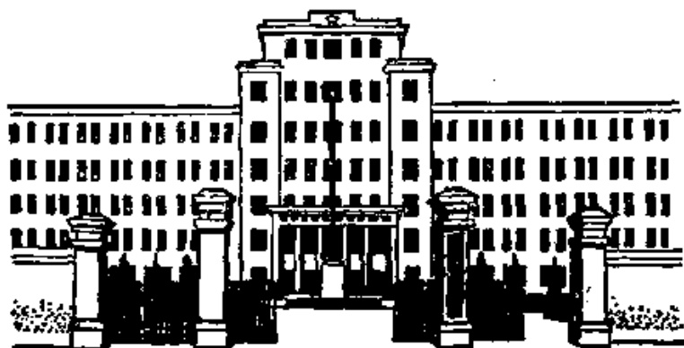
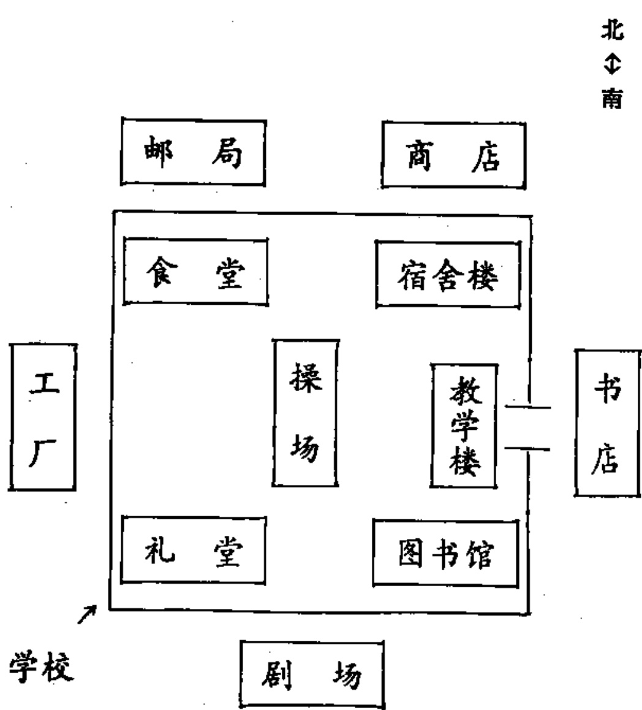

# 第二十一课 · 我们的学校 — Lesson 21

> OCR transcription; not manually verified. Source and confidence metadata are preserved per page.

<!-- source_pdf_page: 229; source_printed_page: 206; ocr_confidence: 0.9799 -->

礼堂在图书馆西边。
学校前边是工厂。
桌子上有一些书。

## 一、替换练习 Substitution Drills

1. 你们学校的礼堂在哪儿？

在食堂北边。

图书馆西边

办公楼南边

宿舍楼东边

图书馆和宿舍楼中间

2. 哈利在哪儿？

哈利在里边。

<!-- source_pdf_page: 230; source_printed_page: 207; ocr_confidence: 0.9919 -->

丁文，外边
马丁，前边
安娜，后边
地图，上边
画儿，下边

3. 桌子上有什么？

桌子上有一本词典。

床上，一件衬衣
书架上，很多外文小说
阅览室里，画报和杂志
屋子里，桌子和椅子

4. 北边是什么地方？
北边是工厂。

西边，剧场
前边，邮局
后边，商店
礼堂西边，食堂

<!-- source_pdf_page: 231; source_printed_page: 208; ocr_confidence: 0.9900 -->

5. 前边的剧场大不大？
前边的剧场不很大。

东边的邮局
西边的商店
后边的操场
里边的屋子

## 二、课文 Text

### 我们的学校

我们的学校离清华大学不远，在清
Wǒmen de xuéxiào li Qīnghuá Dàxué bù yuǎn, zài Qīng
华大学的东边。学校里有教学楼、办公
huá Dàxué de dōngbian. Xuéxiào li yǒu jiàoxué lóu, bàngōng
楼、图书馆楼和很多宿舍楼。

lóu, túshūguǎn lóu hé hěn duō sùshè lóu.

办公楼的东边是教学楼。教学楼里

Bàngōng lóu de dōngbian shì jiàoxué lóu. Jiàoxué lóu li

<!-- source_pdf_page: 232; source_printed_page: 209; ocr_confidence: 0.9755 -->

有很多教室，还有两个电影厅：一个
yǒu hěn duō jiàoshi, hái yǒu liǎng ge diànyíngtīng; yí ge
在楼上，一个在楼下。

zài lóushàng, yí ge zài lóuxià.

教学楼南边是图书馆楼。宿舍楼在图

Jiàoxuélóu nánbian shì túshūguǎn lóu. Sùshè lóu zài tú

书馆楼西边。礼堂和食堂在图书馆和
shūguǎn lóu xībian. Litáng hé shítáng zài túshūguǎn hé

宿舍楼中间。宿舍楼北边有两个操
sùshè lóu zhōngjiān. Sùshè lóu běibian yǒu liǎng ge cāo

场：一个小操场，一个大操场；大操
chǎng; yí ge xiǎo cāochǎng, yí ge dà cāochǎng; dà cāo

场在小操场的北边。

chǎng zài xiǎo cāochǎng de běibian.

学校前边有一些工厂，后边有一

Xuéxiào qiánbian yǒu yì xiē gōngchǎng, hòubian yǒu yí
个剧场，南边有一个邮局，东边和西边
ge jùchǎng, nánbian yǒu yí ge yóujú, dōngbian hé xībian
有不少商店。

yǒu bù shǎo shāngdiàn.

我们学校有很多外国留学生，也

Wǒmen xuéxiào yǒu hěn duō wàiguó liúxuéshēng, yě
有很多中国学生。

yǒu hěn duō Zhōngguó xuésheng.

<!-- source_pdf_page: 233; source_printed_page: 210; ocr_confidence: 0.9982 -->

## 三、生词 New Words

|  1. 在 | (动) zài | there is/are  |
| --- | --- | --- |
|  2. 礼堂 | (名) lǐtáng | auditorium  |
|  3. 食堂 | (名) shítáng | dining-hall, canteen  |
|  4. 北边 | (名) běibian | north  |
|  5. 西边 | (名) xībian | west  |
|  6. 办公 | bàngōng | to do office work  |
|  7. 楼 | (名) lóu | building  |
|  8. 南边 | (名) nánb'àn | south  |
|  9. 东边 | (名) dōngbian | east  |
|  10. 中间 | (名) zhōngjiān | middle  |
|  11. 里边 | (名) líbian | inside  |
|  12. 外边 | (名) wàibian | outside  |
|  13. 前边 | (名) qiánbian | front  |
|  14. 后边 | (名) hòubian | back  |
|  15. 上边 | (名) shàngbian | above  |
|  16. 下边 | (名) xiàbian | below, under  |
|  17. 里 | (名) lí | inside  |
|  18. 工厂 | (名) gōngchǎng | factory  |
|  19. 剧场 | (名) jùchǎng | theatre  |
|  20. 邮局 | (名) yóujú | post office  |

<!-- source_pdf_page: 234; source_printed_page: 211; ocr_confidence: 0.9888 -->

|  21. 教学 | jiàoxué | to teach, teaching  |
| --- | --- | --- |
|  22. 厅 | (名) tīng | hall  |
|  23. 楼上 | lóu shàng | upstairs  |
|  24. 楼下 | lóu xià | downstairs  |

## 补充生词 Additional Words

|  1. 银行 | (名) yínháng | bank  |
| --- | --- | --- |
|  2. 洗衣店 | (名) xíyīdiàn | laundry  |
|  3. 理发馆 | (名) lífàguǎn | hairdresser's  |
|  4. 餐厅 | (名) cāntīng | dining hall  |
|  5. 浴室 | (名) yùshì | bathroom  |

## 四、注释 Notes

#### ① 方位词 Words of location

表示方位的名词叫方位词，方位词有单音的，有双音的。双音的如“前边”“后边”“上边”“下边”“里边”“外边”等；单音的如“里”“外”“上”“下”“前”“后”等。双音的方位词可以加在别的名词后边，也可以单独用；单音的方位词主要是加在名词后边，不能单独用。

Place words are nouns used to show direction and position. Monosyllabic words of location like 里，外，上，下，前，后，etc. can only occur attached to other nouns, while disyllabic words of location such as 前边，后边，上边，下边，里边，外边，

<!-- source_pdf_page: 235; source_printed_page: 212; ocr_confidence: 0.9943 -->

etc. can be used either independently or together with other nouns.

## 五、语法 Grammar

### 1. 动词“在” Verb 在

“在”是介词，也是动词。动词“在”的宾语一般是表示处所的名词或代词。例如：

在 is both a preposition and a verb. The object of the verb 在 is usually a noun or pronoun indicating place, e.g.

安娜在哪儿？

老师不在家，他在学校。

如果“在”的宾语是指人的名词或代词，要在后边加“这儿”或“那儿”，使它表示处所。例如：

If the object of the verb 在 is a noun or pronoun referring to a person, it must take 这儿 or 那儿 after it to show location, e.g.

我的本子在老师那儿。

昨天他们都在我这儿。

### 2. “有”和“是”表示存在有 and 是 indicating existence

动词“有”和“是”也可以表示存在。表示存在的“有”和“是”作谓语主要成分时，句子的词序是：

The verbs 有 and 是 can indicate existence. When they are used as the main constituent of the predicate, the word order of the sentence is as follows:

表示方位、处所的名词——“有”或“是”——存在的人或事物。例如：

<!-- source_pdf_page: 236; source_printed_page: 213; ocr_confidence: 0.9875 -->

Noun denoting position or place ——有 or 是——the person or thing that exists, e.g.

操场上有一件毛衣。

屋子里没有人。

宿舍前边是一个大操场。

桌子上是一本汉语词典。

用“有”时只表示某处存在着事物，用“是”时表示说话人已知某处存在着事物，而要进一步说明这事物是什么。

A sentence with 有 refers to the existence and/or location of an object or being; a sentence with 是 concerns its identity.

## 六、练习 Exercises

1. 用动词“在”、“有”、“是”填空：

Fill in the blanks with 在，有 or 是：

(1) 北京大学\_\_\_\_清华大学西边。

(2) 书架上\_\_\_\_很多书，上边\_\_\_\_中文书，下边\_\_\_\_外文书。

(3) 这是我的宿舍。宿舍里\_\_\_\_床、桌子、椅子、书架和柜子。屋子里，东边\_\_\_\_床。桌子\_\_\_\_屋子中间，桌子后边\_\_\_\_两把椅子。柜子和书

<!-- source_pdf_page: 237; source_printed_page: 214; ocr_confidence: 0.9807 -->

架都____屋子的西边。

(4) 他们学校____人民大学北边。学校
里____很多楼，东边的____教学
楼，西边的____宿舍楼。

2. 根据课文内容用方位词填空：

Fill in the blanks with appropriate words of location
according to the text:

我们学校在清华大学____。学校
____有很多楼。教学楼____是办公楼。
图书馆楼在教学楼____，在宿舍楼____。
宿舍楼和图书馆楼____是礼堂和食堂。
学校里有两个操场，都在宿舍楼____。
小操场在大操场____。

学校____有工厂、剧场、邮局和商
店。学校____是邮局，____和____是商
店。

3. 朗读下面对话：

Read aloud the following dialogues:

A: 你们学校离哪个学校近？

B: 我们学校离清华大学不远。

<!-- source_pdf_page: 238; source_printed_page: 215; ocr_confidence: 0.9877 -->

A. 你们学校的教学楼在什么地方？

B. 教学楼在图书馆楼北边，办公楼东边。

A. 教学楼里只有教室吗？

B. 不，教学楼里还有两个电影厅。

A. 电影厅在楼上还是在楼下？

B. 一个在楼上，一个在楼下。

A. 你们的宿舍也在学校里边吗？

B. 对，也在学校里边。我们的宿舍在操场南边。

A. 你们在哪儿吃饭？

B. 我们学校有食堂。学生食堂在宿舍楼东边，离宿舍不远。

A. 你们在哪儿买东西？

B. 学校外边有不少商店。星期日我们也常进城买东西。

A. 你们学校离城里远吗？

B. 我们学校离城里不近。

<!-- source_pdf_page: 239; source_printed_page: 216; ocr_confidence: 0.9749 -->

4. 根据下面的图用方位词说说各个地方的位置:

Explain the positions of the different places shown below,
using words of location:

<!-- source_pdf_page: 240; source_printed_page: 217; ocr_confidence: 0.9898 -->

## 汉字表 Table of Chinese Characters

> **Uncertainty:** OCR of character components and stroke forms is unreliable. This section is excluded from the default retrieval corpus.

|  1 | 礼 | 衤 | 禮  |
| --- | --- | --- | --- |
|   |  | 乚 |   |
|  2 | 堂 | 堂 |   |
|   |  | 口 |   |
|   |  | 土 |   |
|  3 | 食 | 丿丿今令令令令令令令 |   |
|  4 | 边 | 力 | 邊  |
|   |  | 辶 |   |
|  5 | 办 | 了力办办 | 辦  |
|  6 | 楼 | 朴 | 樓  |
|   |  | 娄 | 米（一一一半米）  |
|   |  | 女 |   |
|  7 | 间 | 门 | 間  |
|   |  | 日 |   |
|  8 | 前 | 廿 | 廿前前前前前前  |
|  9 | 后 | 厂厂厂后 | 後  |
|  10 | 厂 |  | 廠  |

<!-- source_pdf_page: 241; source_printed_page: 218; ocr_confidence: 0.9925 -->

|  11 | 剧 | 居（フフ尸尸尸居） | 劇  |
| --- | --- | --- | --- |
|   |  | 丂 |   |
|  12 | 邮 | 由 | 郵  |
|   |  | 乍 |   |
|  13 | 局 | フフ尸尸局 |   |
|  14 | 厅 | 厂 | 廳  |
|   |  | 丁 |   |
