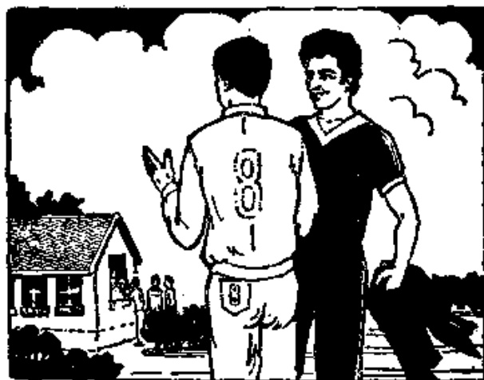

# 第二十二课 · 借球 — Lesson 22

> OCR transcription; not manually verified. Source and confidence metadata are preserved per page.

<!-- source_pdf_page: 242; source_printed_page: 219; ocr_confidence: 0.9852 -->

我要借小说。

我不想进城。

你会不会说汉语？

## 一、替换练习 Substitution Drills

1. 你想进城吗？

我不想进城，我想在家休息。

去阅览室，看电视

去商店，去操场

参加比赛，看比赛

回学校，去电影院

2. 你要借小说吗？

不，我不想借小说，我要借杂志。

<!-- source_pdf_page: 243; source_printed_page: 220; ocr_confidence: 0.9979 -->

买，衬衣，毛衣
着，画报，杂志
复习，语法，课文
打，篮球，排球

3. 你会不会说汉语？

我会说汉语。
他会不会？
他不会。

说英语 说法语
打篮球 打网球
打乒乓球 踢足球

4. 你能翻译这个句子吗？
我能翻译。

些，生词
篇，文章
本，小说

5. 明天你能跟我一起上街吗？

可以，我能跟你一起去。

<!-- source_pdf_page: 244; source_printed_page: 221; ocr_confidence: 0.9782 -->

去体育馆
去商店
参加足球比赛
去公园
去体育场

6. 这个词她会不会念？
这个词她会念。
这个词她不会念。

句子，翻译
汉字，写
问题，回答

## 二、课文 Text

### 借球

宿舍楼 前边 有个小操场。这儿可以
Sùshè lóu qiánbian yǒu ge xiǎo cāochǎng. Zhèr kěyǐ
打篮球，可以打排球，也可以打网球。小
dǎ lánqiú, kěyǐ dǎ páiqiú, yě kěyǐ dǎ wǎngqiú. Xiǎo
操场 北边 有个大操场，那儿可以踢足
cāochǎng běibian yǒu ge dà cāochǎng, nàr kěyǐ tǐ zú
球。
qiú.

<!-- source_pdf_page: 245; source_printed_page: 222; ocr_confidence: 0.9792 -->

哈利喜欢踢足球。下午四点半，他要去

Hālì xǐhuan tī zúqiú. Xiàwǔ sǐdiǎn bàn, tā yào qù

操场，丁文问他：

cāocháng, Dīng Wén wèn tā:

“哈利，你要去打篮球吗？”

Hālì, nǐ yào qù dǎ lánqiú ma?”

“不，我不想打篮球，我想踢足

“Bù, wǒ bù xiǎng dǎ lánqiú, wǒ xiǎng tī zú

球。你去吗？”

qiú. Nǐ qù ma?”

“我要去打篮球。明天参加比赛，

“Wǒ yào qù dǎ lánqiú. Míngtiān cānjiā bǐsài,

今天我们要一块儿练习。”

jǐntiān wǒmen yào yíkuàir liànxí.”

“你这儿有球吗？”

“Nǐ zhèr yǒu qiú ma?”

<!-- source_pdf_page: 246; source_printed_page: 223; ocr_confidence: 0.9847 -->

“没有。可以去体育室借。”

“Méi yòu. Kéyǐ qù tǐyùshì jiè.”

“体育室在哪儿？”

“Tǐyùshì zài nǎr?”

“在操场旁边的屋子里。”

“Zài cāochǎng pángbiān de wūzi li.”

“左边的还是右边的？”

“Zuǒbiande háishì yòubiande?”

“左边的。”

“Zuǒbiande.”

“现在能借吗？”

“Xiànzài néng jiè ma?”

“可以借。”

“Kěyǐ jiè.”

“好，谢谢你！”

“Hǎo, xièxie nǐ!”

“不用谢①！”

“Búyòng xiè!”

## 三、生词 New Words

1. 参加 (动) cānjiā to take part in
2. 比赛(名、动) bǐsài match; to compete
3. 电影院(名) diànyǐngyuàn cinema

<!-- source_pdf_page: 247; source_printed_page: 224; ocr_confidence: 0.9945 -->

4. 要 (能动) yào to want; must, should
5. 篮球 (名) lánqiú basketball
6. 会 (能动) huì to know how to
7. 网球 (名) wǎngqiú tennis
8. 乒乓球 (名) pīngpāngqiú table tennis
9. 能 (能动) néng can, to be able to
10. 篇 (量) piān a measure word for literary works
11. 文章 (名) wénzhāng article
12. 可以 (能动) kěyǐ may, can
13. 体育馆 (名) tǐyùguǎn gymnasium
14. 体育场 (名) tǐyùchǎng stadium
15. 球 (名) qiú ball
16. 喜欢 (动) xǐhuan to like
17. 一块儿 (副) yíkuàir together
18. 体育室 (名) tǐyùshì physical education office
19. 旁边 (名) pángbiān side
20. 左边 (名) zuǒbian left
21. 右边 (名) yòubian right
22. 不用 (副) búyòng there is no need to

<!-- source_pdf_page: 248; source_printed_page: 225; ocr_confidence: 0.9869 -->

## 补充生词 Additional Words

|  1. 游泳 | yóu yǒng | to swim  |
| --- | --- | --- |
|  2. 滑泳 | huá bǐng | to skate  |
|  3. 游泳衣 | yóuyǒngyī | swimming suit  |
|  4. 游泳裤 | yóuyǒngkù | swimming trunks  |

## 四、注释 Notes

### ① 不用谢

当别人对你说“谢谢”时，你可以回答“不用谢”或者“不谢”。也可以回答“不客气 (bú kèqi)”。

When somebody says 谢谢 to you, you may reply with 不用谢，不谢，or 不客气 (bú kèqi)。

## 五、语法 Grammar

### 1. 能愿动词 Auxiliary verbs

能愿动词是动词中的一类。能愿动词经常用在动词或形容词前，表示愿望或可能等。

Auxiliary verbs precede the main verb or adjective and serve to show the speaker's wish, or to indicate possibility, etc.

(1) 要 能愿动词“要”表示愿望。例如：

The auxiliary verb 要 is used to express desire, e.g.

我要买一些衣服。

我要借一本小说。

表示这种意思的“要”，否定时用“不想”。如：

The negative form of 要 used in this sense is 不想, e.g.

<!-- source_pdf_page: 249; source_printed_page: 226; ocr_confidence: 0.9919 -->

你要借小说吗？

——我不想借小说，我要借一本杂志。

“要”还可以表示需要、应该。如：

要 also means “need” or “should”, e.g.

宿舍楼里要安静。

表示这种意思的“要”，否定时用“不用”。如：

The negative form of 要 used in this sense is 不用，e.g.

这个词要翻译吗？

——这个词很容易，不用翻译。

（2）会 能愿动词“会”表示通过学习掌握一种技能。

如：

The auxiliary verb 会 means “I know how to”, i.e. to have a certain skill acquired through practice, e.g.

他会说英语。

我不会打网球，你教我，好吗？

（3）能 能愿动词“能”可以表示具备某种能力，有时跟“会”意思相同。如：

The auxiliary verb 能 means “be able to”. Sometimes, 能 is interchangeable with 会, e.g.

他能说英语。（可以用“会”）

“能”还可以表示恢复某种能力或达到某种水平，“会”没有这个意思。如：

能 can also indicate that a certain ability has been regained

<!-- source_pdf_page: 250; source_printed_page: 227; ocr_confidence: 0.9948 -->

or has reached a certain degree whereas 会 does not have this meaning, e.g.

他病(bing, illness) 好了, 能上课。

你会游泳(yóuyǒng, swim) 吗? (可以用“能”)

——我会。

你能游八百米(mí, metre)吗? (不能用“会”)

——我不能。

(4) 可以 能愿动词“可以”表示环境或情理上许可。

“能”也有这个意思。如:

The auxiliary verb 可以 is used to indicate that permission is granted after circumstances, or conditions have been considered. 能 also conveys this meaning, e.g.

我们可以从这儿走吗? (可以用“能”)

那个大操场可以打篮球吗?

——不能打篮球, 只能踢足球。

### 2. 用能愿动词的注意事项

Points for attention when using the auxiliary verbs

(1) 除个别情况外, 能愿动词只能用“不”否定。

The auxiliary verbs can only be negated by 不 except in some exceptional cases.

(2) 带能愿动词的句子, 正反疑问形式如下:

The affirmative-negative question form of this kind of sentence is as follows:

<!-- source_pdf_page: 251; source_printed_page: 228; ocr_confidence: 0.9929 -->

你会不会说汉语？

你会说汉语不会？

（3）能愿动词一般不能重叠，不能带动态助词“了”
“着”“过”。

Auxiliary verbs cannot be reduplicated, nor can they take
the aspectual particles 了 (le), 着 (zhe), 过 (guo).

## 六、练习 Exercises

1. 把下面的陈述句改成疑问句：

Change the following statements into questions:

例 Example:

我会打排球。

你会打排球吗？

你会不会打排球？

(1) 丁文会打乒乓球。
(2) 他会说德语。
(3) 我会说汉语。
(4) 他哥哥想看足球比赛。
(5) 明天小王不能参加网球比赛。
(6) 现在可以借球。
(7) 我要借篮球。
(8) 宿舍前边的操场可以踢足球。

<!-- source_pdf_page: 252; source_printed_page: 229; ocr_confidence: 0.9904 -->

2. 用“想”、“要”、“能”、“可以”填空：

Fill in the blanks with 想，要，能，可以：

安娜____进城买衣服，她问马丁：

“马丁，你____不____跟我一块儿进城”？

“你____进城作什么？”

“我____买一件毛衣。”

“我也____进城买衣服，可是我今天不____去”。

“为什么今天不____去”？

“今天下午我____参加足球比赛。我们明天一起去____吗？”

“____，明天下午我们一块儿去。”

3. 根据课文回答问题：

Answer the questions according to the text:

(1) 小操场在哪儿？那儿可以打什么球？

(2) 大操场在哪儿？那儿能踢足球吗？

(3) 谁喜欢踢足球？

(4) 下午四点半，哈利要去哪儿？他去那儿作什么？

<!-- source_pdf_page: 253; source_printed_page: 230; ocr_confidence: 0.9925 -->

(5) 丁文想打什么球？
(6) 丁文有球吗？
(7) 什么地方可以借球？现在能借吗？
(8) 体育室在哪儿？

4. 把下面的对话改成短文：

Change the following dialogue into a passage of continuous prose:

A: 你喜欢打乒乓球吗？
B: 我喜欢，但是我不太会打，我很想学。
A: 马丁会不会打乒乓球？
B: 会，他打得很好，他要教我。
A: 马丁会不会打网球？
B: 不太会，他打得不太好。我很喜欢打网球，常常参加比赛。我要教马丁打网球。
A: 那很好，马丁教你打乒乓球，你教他打网球。
B: 是的。

<!-- source_pdf_page: 254; source_printed_page: 231; ocr_confidence: 0.9949 -->

## 汉字表 Table of Chinese Characters

> **Uncertainty:** OCR of character components and stroke forms is unreliable. This section is excluded from the default retrieval corpus.

|  1 | 参 | ㄙㄨㄥㄞ大参 | 参  |
| --- | --- | --- | --- |
|  2 | 加 | 力 |   |
|   |  | 口 |   |
|  3 | 比 | ㄧㄤㄥ比 |   |
|  4 | 赛 | 宀 | 赛  |
|   |  | 共（一二七七七八共） |   |
|   |  | 贝 |   |
|  5 | 篮 | 竝 | 篮  |
|   |  | 监 |   |
|  6 | 会 | 人 | 會  |
|   |  | 云（一二云云） |   |
|  7 | 网 | 丨门闪闪闪闪 | 網  |
|  8 | 丘 | 丘（一七七丘丘） |   |
|   |  | 、 |   |
|  9 | 兵 | 丘 |   |
|   |  | 、 |   |
|  10 | 能 | ㄙㄨㄚㄚㄚㄚㄚㄚㄚㄚㄚ |   |

<!-- source_pdf_page: 255; source_printed_page: 232; ocr_confidence: 0.8354 -->

|  11 | 篇 | 𠄎  |
| --- | --- | --- |
|   |  | 扁  |
|  12 | 章 | 立  |
|   |  | 早  |
|  13 | 以 | レ 𠄎 以 以  |
|  14 | 喜 | 一 𠄎 𠄎 𠄎 𠄎 𠄎 𠄎 𠄎 𠄎 𠄎 𠄎  |
|  15 | 欢 | 𠄎  |
|   |  | 欠 ( 𠄎 𠄎 𠄎 欠 )  |
|  16 | 旁 | 𠄎 𠄎 𠄎 𠄎 𠄎 𠄎 𠄎 𠄎 𠄎 𠄎  |
|  17 | 左 | 𠄎 ( 一 𠄎 )  |
|   |  | 工  |
|  18 | 右 | 𠄎  |
|   |  | 口  |
