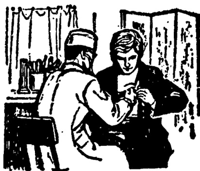

# 第二十三课 · 哈利病了 — Lesson 23

> OCR transcription; not manually verified. Source and confidence metadata are preserved per page.

<!-- source_pdf_page: 11; source_printed_page: 1; ocr_confidence: 0.9940 -->

昨天我进城了。

哈利没（有）来。

## 一、替换练习 Substitution Drills

1. 安娜在宿舍吗？

不在。

她去哪儿了？

她去图书馆了。

操场 礼堂

食堂 邮局

医院

2. 你去哪儿了？①

我去商店了。

你买什么了？

我买水果了。

苹果 糖

啤酒 汽水

3. 哈利来了吗？

哈利没（有）来。

走 去 睡

<!-- source_pdf_page: 12; source_printed_page: 2; ocr_confidence: 0.9928 -->

4. 昨天你作什么了？
昨天我进城了。

看电影 去公园
去朋友那儿
参加足球比赛

5. 你复习课文了没有？
我没复习课文。
（我还没复习呢。）

念，生词
听，录音
作，练习
翻译，句子

6. 马丁为什么没来？
他觉得不舒服。
病了吗？
他感冒了。

病 发烧

## 二、课文 Text

### 哈利病了

现在八点钟，已经上课了。同学们都
进教室了，张老师也来了。哈利还没有
来。张老师问：

“哈利去哪儿了？为什么没有来？”

<!-- source_pdf_page: 13; source_printed_page: 3; ocr_confidence: 0.9953 -->

“他病了。”一个同学回答。

“他去医院了吗？”

“去了。昨天上午他觉得不舒服，下午去医院了。”

“大夫给他药了吗？”

“给了。”

“他吃药了没有？”

“吃了。”

“今天早上他觉得怎么样？起床了吗？”

“还没有呢。今天早上他头疼，发烧，没起床。”

“他什么病，大夫说了吗？”

“大夫说了，是感冒。”

“可能他穿得太少③。你们一定要注

<!-- source_pdf_page: 14; source_printed_page: 4; ocr_confidence: 0.9870 -->

意，別感冒。”

## 三、生词 New Words

|  1. 了 | (语助) le | *a modal particle*  |
| --- | --- | --- |
|  2. 医院 | (名) yīyuàn | hospital  |
|  3. 水果 | (名) shuíguǒ | fruit  |
|  4. 苹果 | (名) píngguǒ | apple  |
|  5. 糖 | (名) táng | sweets, sugar  |
|  6. 啤酒 | (名) píjiǔ | beer  |
|  7. 汽水 | (名) qìshuǐ | fizzy drink, soda water  |
|  8. 走 | (动) zǒu | to walk, to leave  |
|  9. 觉得 | (动) juéde | to feel  |
|  10. 舒服 | (形) shūfu | comfortable  |
|  11. 病 | (动) bìng | to fall ill  |
|  12. 感冒 | (动) gǎnmào | to catch cold  |
|  13. 发烧 | fāshāo | to have a fever  |
|  14. 已经 | (副) yǐjīng | already  |
|  15. 药 | (名) yào | medicine  |
|  16. 头 | (名) tóu | head  |
|  17. 疼 | (动) téng | to ache, pain  |

<!-- source_pdf_page: 15; source_printed_page: 5; ocr_confidence: 0.9907 -->

18. 可能 (副) kěnéng maybe, perhaps
19. 穿 (动) chuān to wear, to put on
20. 一定 (副) yídìng certainly
21. 注意 (动) zhùyì to pay attention to
22. 别 (副) bié *used to formulate the imperative, don't*

## 补充生词 Additional Words

1. 香蕉 (名) xiāngjiāo banana
2. 橘子 (名) júzi orange
3. 梨 (名) lí pear
4. 巧克力 (名) qiǎokèlì chocolate
5. 罐头 (名) guàntou can, tin

## 四、注释 Notes

① “你去哪儿了” 在中国，这是朋友或熟人之间打招呼的常用语。

In China 你去哪儿了 is a common greeting among friends or acquaintances.

② 副词“可能” 副词“可能”表示估计，比“也许”的语气肯定。可用在主语前，也可用在动词前。

The adverb 可能 is used before or after the subject to express surmise. It implies a higher degree of probability than 也许.

<!-- source_pdf_page: 16; source_printed_page: 6; ocr_confidence: 0.9944 -->

## 五、语法 Grammar

### 1. 语气助词“了”（一） The modal particle 了（1）

语气助词“了”可以表示几种不同的语气。本课讲的“了”，是表示某个动作或某一情况肯定已经发生。试比较下面两组对话：

The modal particle 了 has various functions. In this lesson we discuss the use of 了 as an aspectual particle, showing completed action. Compare the following two groups of dialogues below.

|  (1) | 你去哪儿？ 我去商店。 你买什么？ 我买水果。 | (2) | 你去哪儿了？ 我去商店了。 你买什么了？ 我买水果了。  |
| --- | --- | --- | --- |

第（1）组对话没有用“了”，表示“去商店”、“买水果”的动作还没有实现。第（2）组对话用了“了”，表示上述动作肯定已经发生。

The absence of 了 in group (1) shows that the actions have not yet happened, while its use in group (2) shows that the actions are completed.

### 2. 带语气助词“了”（一）句的否定式

Negative form of sentences with the modal particle 了 (1)

带语气助词“了”（一）的句子，否定时在动词前面加上“没有”或“没”，去掉“了”。例如：

The negative form of a sentence with the modal particle 了 (1) is constructed by putting the adverb 没有 or 没 before the

<!-- source_pdf_page: 17; source_printed_page: 7; ocr_confidence: 0.9931 -->

verb and omitting 了, e.g.

哈利来了吗？

——他没（有）来。

你看电影了吗？

——我没（有）看。

有时用“还没（有）…呢”表示还没开始或者还没完成的动作。“呢”是语气助词。例如：

Sometimes the construction 还没（没）…呢，in which 呢 is a modal particle, is used to show that an action has not started or has not yet been completed, e.g.

你复习课文了吗？

——我还没复习呢。

他去医院了吗？

——还没有呢。

3. 带语气助词“了”（一）句的正反疑问式

The affirmative-negative question with modal particle 了 (1)

带语气助词“了”（一）的句子，正反疑问式如下：

The form of such a question is as follows:

昨天你看电影了没有？

——我看了。

哈利来了没有？

<!-- source_pdf_page: 18; source_printed_page: 8; ocr_confidence: 0.9926 -->

——没有。

“没有”在句尾时不能省为“没”。

没有 at the end of a sentence cannot be shortened to 没。

## 六、练习 Exercises

1. 完成下列对话：

Complete the following dialogue:

A: 小王，\_\_\_\_\_\_\_\_\_\_\_\_\_\_\_\_\_\_\_\_?

B: 我去商店了。

A: \_\_\_\_\_\_\_\_\_\_\_\_\_\_\_\_\_\_\_\_?

B: 我买苹果了。

A: 你没买汽水吗？

B: \_\_\_\_\_\_\_\_\_\_\_\_\_\_\_\_\_\_\_\_，啤酒也买了。

A: \_\_\_\_\_\_\_\_\_\_\_\_\_\_\_\_\_\_\_\_?

B: 我没买。我不喜欢吃糖，你想买吗？

A: \_\_\_\_\_\_\_\_\_\_\_\_\_\_\_\_\_\_\_\_，还想买一些水果。今天下午你还去商店吗？

B: \_\_\_\_\_\_\_\_\_\_\_\_\_\_\_\_\_\_\_\_，我可以和你一起去。

A: 太好了，下午我们一起去。

2. 把下面带“吗”的疑问句改为正反疑问句，然后作否定的回

<!-- source_pdf_page: 19; source_printed_page: 9; ocr_confidence: 0.9893 -->

答：

Change the following questions with 吗 into affirmative — negative questions, and then give negative answers to them:

(1) 今天的语法你复习了吗？
(2) 昨天你进城了吗？
(3) 你借的那本杂志还了吗？
(4) 翻译句子练习你作了吗？
(5) 昨天晚上的电影你看了吗？
(6) 星期日你在城里买衣服了吗？

3. 把下面句子里的肯定式改为否定式，否定式改为肯定式：
Change the affirmative sentences into negative ones and vice versa:

(1) 昨天晚上哈利看电视了。
(2) 安娜想买苹果。
(3) 小王打乒乓球打得很好。
(4) 马丁参加昨天的足球比赛了。
(5) 他弟弟没去医院。
(6) 明天他去朋友家。
(7) 那个医院离他家很远。
(8) 他走了，今天没有来上课。
(9) 她没发烧，能上课。

<!-- source_pdf_page: 20; source_printed_page: 10; ocr_confidence: 0.9948 -->

(10) 小张病了，头疼。

4. 根据课文回答问题：

Answer the questions according to the text:

(1) 现在几点了？上课了没有？
(2) 张老师来教室了没有？
(3) 哈利来了吗？为什么？
(4) 哈利去医院了吗？
(5) 大夫给哈利药了没有？他吃药了吗？
(6) 今天早上哈利起床了吗？他觉得怎么样？
(7) 哈利什么病？大夫说了吗？

## 汉字表 Table of Chinese Characters

> **Uncertainty:** OCR of character components and stroke forms is unreliable. This section is excluded from the default retrieval corpus.

|  1 | 了 | ㄧ了 |   |
| --- | --- | --- | --- |
|  2 | 医 | ㄈ（ㄧㄅ） | 酱  |
|   |  | 矢（ㄏㄧㄝ矢） |   |
|  3 | 水 | ㄐㄒ水 |   |
|  4 | 果 |  |   |

<!-- source_pdf_page: 21; source_printed_page: 11; ocr_confidence: 0.9856 -->

|  5 | 苹 | 苹 | 頻  |
| --- | --- | --- | --- |
|   |  | 一二三平 |   |
|  6 | 糖 | 一一二半米 |   |
|   |  | 廣廣廣廣廣 |   |
|  7 | 啤 | 口 |   |
|   |  | 韋（ㄏㄨㄣㄣㄣㄣㄣ韋） |   |
|  8 | 酒 | 酒 |   |
|   |  | 酉（ㄧㄧㄡㄣㄣㄣㄣ） |   |
|  9 | 汽 | 汽 |   |
|   |  | 气（ㄏㄨㄣㄣㄣ） |   |
|  10 | 走 | 土 |   |
|   |  | 走 |   |
|  11 | 舒 | 舍 |   |
|   |  | 子（ㄧㄧㄡㄧㄧ） |   |
|  12 | 病 | 疒（ㄧㄧㄡㄧㄧ） |   |
|   |  | 丙（ㄧㄧㄡㄣㄣ丙） |   |
|  13 | 感 | 一ㄧㄧㄡㄣㄣ感感感 |   |
|  14 | 冒 | 日（ㄧㄣㄣㄣ） |   |
|   |  | 目 |   |

<!-- source_pdf_page: 22; source_printed_page: 12; ocr_confidence: 0.9896 -->

|  15 | 烧 | 火 |   |
| --- | --- | --- | --- |
|   |  | 尧（一火又又尧尧尧） |   |
|  16 | 已 | 一二已 |   |
|  17 | 经 | 纟 | 經  |
|   |  | 至（二又又至） |   |
|  18 | 药 | 艹 | 藥  |
|   |  | 约纟 |   |
|   |  | 艹 |   |
|  19 | 头 | 丶丶丶丶丶丶丶丶丶丶丶丶丶丶丶丶丶丶丶丶丶丶丶丶丶丶丶丶丶丶丶丶丶丶丶丶丶丶丶丶丶丶丶丶丶丶丶丶丶丶丶 | 頭  |
|  20 | 疼 | 疒 |   |
|   |  | 疔 |   |
|  19 | 头 | 丶丶丶丶丶丶丶丶丶丶丶丶丶丶丶丶丶丶丶丶丶丶丶丶丶丶丶丶丶丶丶丶丶丶丶丶丶丶丶丶丶丶丶丶丶丶丶丶丶 |   |
|  20 | 疼 | 疒 |   |
|   |  | 冬（一夕冬冬冬） |   |
|  21 | 穿 | 穴（一穴穴穴） |   |
|   |  | 牙（一口牙牙） |   |
|  22 | 定 | 穴 |   |
|   |  | 疋 |   |
|  23 | 注 | 注 |   |
|   |  | 主（主） |   |
|  24 | 意 | 立 |   |
|   |  | 日 |   |
|   |  | 心 |   |
