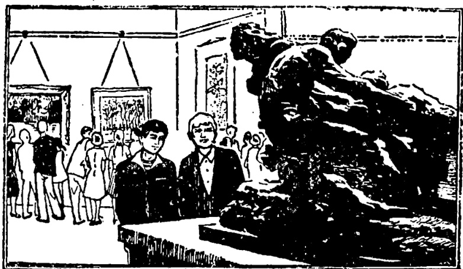

# 第二十四课 · 看展览 — Lesson 24

> OCR transcription; not manually verified. Source and confidence metadata are preserved per page.

<!-- source_pdf_page: 23; source_printed_page: 13; ocr_confidence: 0.9989 -->

我买了三本书。
我们吃了饭就进城。
我们两点出发，三点才到。

## 一、替换练习 Substitution Drills

1. 你买什么了？
我买书了。
你买了几本书？
我买了三本（书）。

本子，个
画片，张
衣服，件
啤酒，瓶
苹果，斤

2. 昨天你们参观了什么地方？
昨天我们参观了一个工厂。

学校 医院
博物馆

<!-- source_pdf_page: 24; source_printed_page: 14; ocr_confidence: 0.9871 -->

3. 你们看了展览去哪儿了？
我们看了展览就回学校了。

看，电影，回家
买，东西，回宿舍
吃，饭，上街
下，课，去小卖部

4. 明天你吃了早饭去哪儿？
明天我吃了早饭就去公园。

买，东西，去展览馆
看，球赛，去商店
下，课，去电影院
参观，展览，回学校

5. 展览馆不远，我们两点出发，两点一刻就到了。

<!-- source_pdf_page: 25; source_printed_page: 15; ocr_confidence: 0.9770 -->

那个工厂，八点， 八点二十
体育馆， 六点半， 六点五十
人民剧场，六点四十，七点
清华大学，两点半， 两点三刻

6. 展览馆很远，我们两点出发，三点才到。

友谊商店， 一点， 两点一刻
工人体育场，六点， 七点十分
大使馆， 八点半，九点半
天坛公园， 八点， 九点一刻

## 二、课文 Text

### 看展览

昨天下午，我们去参观了。我们看了
一个展览。展览馆离学校不太远。我们两
点出发，两点二十就到了。

到了展览馆，我们就开始参观。展览

<!-- source_pdf_page: 26; source_printed_page: 16; ocr_confidence: 0.9965 -->

馆的工作人员很热情，他们给我们介绍了很多情况。我们一共看了六个展览室，我们提了一些问题，讲解员都回答了。

展览馆旁边有个小卖部，我们在那儿买了一些画片和别的纪念品。五点半我们才回学校。

我觉得这个展览很有意思。看了展览，我们了解了不少情况。

## 三、生词 New Words

|  1. 了 | (动助) le | *a modal particle*  |
| --- | --- | --- |
|  2. 画片 | (名) huàpiàn | small reproductions of paintings  |

<!-- source_pdf_page: 27; source_printed_page: 17; ocr_confidence: 0.9822 -->

3. 瓶 (量) píng bottle
4. 斤 (量) jīn *jin, a Chinese unit of weight (= 1/2 kg.)*
5. 参观 (动) cānguān to visit
6. 博物馆 (名) bówùguǎn museum
7. 展览 (名、动) zhǎnlǎn exhibition; to exhibit
8. 就 (副) jiù then
9. 小卖部 (名) xiǎomàibù a small shop attached to a hotel, a school, etc.
10. 展览馆 (名) zhǎnlǎnguǎn exhibition hall
11. 球赛 (名) qiúsài ball game
12. 出发 (动) chūfā to start out
13. 到 (动) dào to arrive
14. 人民 (专) Rénmín Jùchǎng People's Theatre
    剧场
15. 才 (副) cái then and only then
16. 天坛 (专) Tiāntán the Temple of Heaven
    公园 Gōngyuán Park
17. 开始 (动) kāishǐ to begin
18. 热情 (形) rèqíng cordial, enthusiastic

<!-- source_pdf_page: 28; source_printed_page: 18; ocr_confidence: 0.9943 -->

19. 给 (介) gěi for, to
20. 介绍 (动) jièshào to introduce
21. 情况 (名) qíngkuàng situation
22. 提 (动) tí to put forward
23. 讲解员 (名) jiǎngjiěyuán guide
24. 纪念品 (名) jìniànpín souvenir
25. 了解 (动) liǎojiě to understand

## 补充生词 Additional Words

1. 展品 (名) zhǎnpín exhibits
2. 工艺品 (名) gōngyìpín craft products
3. 图片 (名) túpiàn picture, photograph
4. 图表 (名) túbiǎo chart
5. 实物 (名) shíwù real object

## 四、语法 Grammar

### 1. 动态助词“了” The aspectual particle 了

一个动作可以处在进行、持续、完成等不同的阶段。动作的不同阶段可以由动态助词或副词等表示。动态助词“了”用在动词后边可以表示动作的完成。带动态助词“了”的动词后边如果有宾语，宾语常带数量词或其他定语。例如：

The Chinese verbal aspect—progressive, continuous, perfect tense etc., is indicated by the use of an aspectual particle, adverb

<!-- source_pdf_page: 29; source_printed_page: 19; ocr_confidence: 0.9983 -->

or other modifier. The aspectual particle 了 added to a verb shows the completion of an action. If a verb with the aspectual particle 了 takes an object, the object is usually qualified by a numeral-measure word or another attributive, e.g.

他买了三本书。

看了这个展览，我们了解了不少情况。

发生在过去的动作，如果不需要着重说明动作已经完成时，动词后不加“了”。例如：

When a past action is a habitual one or there is no need to emphasize its completion, 了 is not used after the verb, e.g.

去年他常常来。

一九八三年他在北京工作。

### 2. 带动态助词“了”的句子的否定

The negative form of sentences with an aspectual particle 了.

带动态助词“了”的句子的否定式，是在动词前用“没”（或“没有”），去掉“了”。例如：

The negative form of such a sentence is made up by putting 没 or 没有 before the verb and omitting 了, e.g.

他买了几张画片？

——我没买画片。

### 3 “才”和“就” The adverbs 才 and 就

“才”和“就”都是副词。“才”表示动作发生得晚，或进

<!-- source_pdf_page: 30; source_printed_page: 20; ocr_confidence: 0.9920 -->

行得不顺利。例如：

Both 才 and 就 are adverbs. 才 is used to show that an action is happening later than expected or considered appropriate, or occurs with difficulty, e.g.

电影九点开始，九点一刻他才来。

天坛公园很远，我们两点出发，三点才到。

“就”表示动作发生得早或进行得顺利。例如：

就 is used to show that an action happens earlier than expected or goes without a hitch. e.g.

电影九点开始，八点三刻他就来了。

展览馆很近，我们两点出发，两点一刻就到了。

如果表示两个动作连续发生，第二个动作紧接第一个动作，第一个动词后边加动态助词“了”，第二个动词用“就”引出。例如：

When two actions happen in succession, the aspectual particle is added to the first verb, and the second verb is introduced by the adverb 就, e.g.

他下了课就回宿舍了。

表示将来发生的动作也可以用这种句子。例如：

This construction may also be used to refer to the future, e.g.

明天吃了饭我就去图书馆。

<!-- source_pdf_page: 31; source_printed_page: 21; ocr_confidence: 0.9871 -->

## 五、练习 Exercises

1. 用给的一组词作带动态助词“了”的句子：

Make sentences with the aspectual particle 了, using the words given:

(1) 参观 博物馆
(2) 买 啤酒
(3) 借 书
(4) 看 电影
(5) 介绍 情况
(6) 看 展览室

2. 用“才”和“就”填空：

Fill in the blanks with 才 or 就：

(1) 参观九点开始，他九点十分__到。
(2) 展览室不太多，我们看得很快，
四点半__回学校了。
(3) 小王病了，觉得很不舒服，晚上
八点__睡了。
(4) 他昨天睡得很晚，十二点钟__睡。
(5) 今天上午参观博物馆，八点出发，
他七点半__来了。

<!-- source_pdf_page: 32; source_printed_page: 22; ocr_confidence: 0.9956 -->

(6) 剧场离学校很近，走十五分钟__到了。

3. 根据课文回答问题：

Answer the questions according to the text:

(1) 昨天下午你们作什么了？
(2) 展览馆离学校远不远？
(3) 你们几点出发？几点到了展览馆？
(4) 到了展览馆你们就开始参观吗？
(5) 展览馆的工作人员热情不热情？
(6) 谁给你们介绍情况了？
(7) 你们一共看了几个展览室？
(8) 讲解员回答你们的问题了吗？
(9) 展览馆有小卖部吗？小卖部在哪儿？
(10) 你们买纪念品了吗？在哪儿买的？
(11) 你们几点钟回学校了？
(12) 你觉得这个展览怎么样？

4. 把本课课文改成对话。

Rewrite the text as a dialogue.

<!-- source_pdf_page: 33; source_printed_page: 23; ocr_confidence: 0.9707 -->

## 汉字表 Table of Chinese Characters

> **Uncertainty:** OCR of character components and stroke forms is unreliable. This section is excluded from the default retrieval corpus.

|  1 | 片 | 丿尸尸尸片  |   |
| --- | --- | --- | --- |
|  2 | 瓶 | 并（丿尸尸兰并）  |   |
|   |  | 瓦（一厂瓦瓦）  |   |
|  3 | 斤 |   |   |
|  4 | 观 | 又 | 觇  |
|   |  | 见  |   |
|  5 | 博 | 卄  |   |
|   |  | 專（一厂丌丌丌丌丌專專專）  |   |
|  6 | 物 | 卄  |   |
|   |  | 勿  |   |
|  7 | 展 | 尸  |   |
|   |  | 良（一尸尸兰芒芒良）  |   |
|  8 | 就 | 京  |   |
|   |  | 尤（一尸尤尤）  |   |
|  9 | 卖 | 十 | 賣  |
|   |  | 买  |   |
|  10 | 部 | 吾（𠵼吾）  |   |

<!-- source_pdf_page: 34; source_printed_page: 24; ocr_confidence: 0.9952 -->

|   |  | 卩 |   |
| --- | --- | --- | --- |
|  11 | 出 | 一一中出出 |   |
|  12 | 到 | 至（五至） |   |
|   |  | 卩 |   |
|  13 | 才 | 一才才 |   |
|  14 | 坛 | 土 | 壇  |
|   |  | 云（一二云云） |   |
|  15 | 开 | 一二开开 |   |
|  16 | 始 | 女 |   |
|   |  | 台（台台） |   |
|  17 | 热 | 执（扌执执） | 熱  |
|   |  | 灬 |   |
|  18 | 情 | 忄 |   |
|   |  | 青 |   |
|  19 | 介 |  |   |
|  20 | 绍 | 丝 | 绍  |
|   |  | 召（召召） |   |
|  21 | 况 | 氵 |   |

<!-- source_pdf_page: 35; source_printed_page: 25; ocr_confidence: 0.9888 -->

|   |  | 兄（ㄅ兄）  |   |
| --- | --- | --- | --- |
|  22 | 提 | 扌  |   |
|   |  | 是  |   |
|  23 | 讲 | 讠 | 講  |
|   |  | 井（ㄧ二井井）  |   |
|  24 | 解 | 角（ㄏㄨ角角角角角）  |   |
|   |  | 斗 | 刀  |
|   |  |  | 牛  |
|  25 | 纪 | 纟 | 紀  |
|   |  | 己  |   |
|  26 | 品 | 品品  |   |
