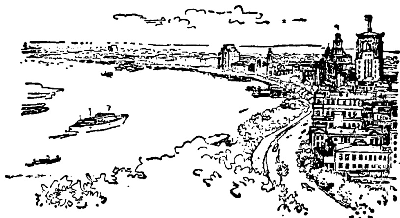

# 第二十五课 · 去旅行 — Lesson 25

> OCR transcription; not manually verified. Source and confidence metadata are preserved per page.

<!-- source_pdf_page: 36; source_printed_page: 26; ocr_confidence: 0.9927 -->

他去上海旅行。

每个学生都有两个本子。

## 一、替换练习 Substitution Drills

1. 你去哪儿？

我去上海。

你去上海作什么？

我去上海旅行。

|  城里， | 买东西  |
| --- | --- |
|  清华大学， | 找同学  |
|  天津， | 参观工业展览  |
|  南京， | 参观农业展览  |

清华大学，找同学

天津， 参观工业展览

南京， 参观农业展览

2. 你坐火车去上海吗？

不，我坐飞机去。

<!-- source_pdf_page: 37; source_printed_page: 27; ocr_confidence: 0.9906 -->

飞机，广州， 火车
汽车，那个城市，船
火车，南京， 飞机
船， 那儿， 汽车

3. 他们用钢笔写字吗？

不，他们用毛笔写字。

铅笔，作练习， 圆珠笔
英语，谈话， 汉语
汉语，介绍情况，英语
法语，打电话， 汉语

4. 哪个房间是你的？

左边第二个房间是我的。

张，桌子
把，椅子
个，位子

5. 每个学生有几个本子？

每个学生（都）有两个本子。

<!-- source_pdf_page: 38; source_printed_page: 28; ocr_confidence: 0.9767 -->

楼， 阅览室，三
班， 学生， 十
屋子， 书架， 两
宿舍楼， 电视， 五

## 二、课文 Text

### 去旅行

每年夏天或者冬天，学校常组织留学生去别的城市旅行。今年哈利去上海旅行。他去上海，这是第二次。

上海是中国最大的① 工业城市。那儿有很多工厂，商店也很多。上海有个很大的工业展览馆，每天都有很多人②去那儿参观。

哈利很喜欢旅行。他认为，旅行可以了解中国的情况，而且还能练习用汉语谈话。

<!-- source_pdf_page: 39; source_printed_page: 29; ocr_confidence: 0.9815 -->

哈利从北京出发，先坐火车去南京，
再从南京去上海。从上海他还要坐飞机去
广州和别的城市。

## 三、生词 New Words

1. 上海 (专) Shànghǎi Shanghai
2. 旅行 (动) lǚxíng to travel, tour
3. 找 (动) zhǎo to look for
4. 天津 (专) Tiānjīn Tianjin (Tientsin)
5. 工业 (名) gōngyè industry
6. 南京 (专) Nàngjīng Nanjing (Nanking)
7. 农业 (名) nóngyè agriculture
8. 坐 (动) zuò to sit, to travel by

<!-- source_pdf_page: 40; source_printed_page: 30; ocr_confidence: 0.9954 -->

9. 火车 (名) huóchē train
10. 飞机 (名) fēijī plane
11. 广州 (专) Guǎngzhōu Guangzhou (Canton)
12. 汽车 (名) qìchē car
13. 城市 (名) chéngshì city
14. 船 (名) chuán ship, boat
15. 用 (动) yòng to use
16. 字 (名) zì character (graphic sign)
17. 毛笔 (名) máobǐ Chinese writing brush
18. 谈(话) (动) tán(huà) to talk
19. 话 (名) huà words, utterances
20. 打(电话) (动) dǎ(diànhuà) to make (a telephone call)
21. 电话 (名) diànhuà telephone
22. 房间 (名) fángjiān room
23. 第 (头) dì a prefix for ordinal numbers
24. 位子 (名) wèizi seat
25. 每 (代) měi every, each
26. 夏天 (名) xiàtiān summer
27. 冬天 (名) dōngtiān winter
28. 组织 (动) zǔzhǐ to organize

<!-- source_pdf_page: 41; source_printed_page: 31; ocr_confidence: 0.9889 -->

29. 次 (量) cì a verbal measure word, time
30. 最 (副) zuì most
31. 认为 (动) rènwéi to think, to consider
32. 而且 (连) érqiě moreover
33. 先 (副) xiān first
34. 再 (副) zài again

## 补充生词 Additional Words

1. 车票 (名) chēpiào train or bus ticket
2. 机票 (名) jīpiào plane ticket
3. 船票 (名) chuánpiào ship ticket
4. 票价 (名) piàojià ticket price, fare
5. 售票处 (名) shòupiàochù booking office

## 四、注释 Notes

### ① 复杂的定语 The complex attributive

形容词作定语，形容词前有其他副词修饰时，定语和中心语之间一定要加“的”。

When an adjective used as an attributive is itself qualified by an adverb, the structural particle 的 must be used between the attributive and the central word.

### ② “多” (或“少”) 作定语多 (or 少) used as an

<!-- source_pdf_page: 42; source_printed_page: 32; ocr_confidence: 0.9975 -->

attributive

形容词“多”（或“少”）作定语修饰名词时，前边一定加其他修饰语。如“很多人”“这么多书”。

When the adjective 多 (or 少) is used as an attributive to modify a noun, there must be another modifier before 多, e.g. 很多人，这么多书。

## 五、语法 Grammar

### 1. 连动句 Multi-verbal sentences

谓语中连用两个以上的动词说明一个主语的句子，叫连动句。连用的几个动词先后顺序是固定的，一般不能改变。例如：

A multi-verbal sentence is one in which the predicate contains two or more verbs in succession governed by a common subject. The verbs are arranged in a fixed order which cannot normally be changed, e.g.

明天他去天津旅行。

我去友谊商店买东西。

他坐飞机去上海。

### 2. 指代词“每” The demonstrative pronoun 每

指示代词“每”修饰名词时，中间要加量词。例如：

When the demonstrative pronoun 每 is used to modify a noun, a measure word must be put between 每 and the noun, e.g.

每个班有五十个学生。

<!-- source_pdf_page: 43; source_printed_page: 33; ocr_confidence: 0.9972 -->

每课书有十七个或者十八个生词。

个别名词和“每”连用时中间不加量词。如：“每天”“每年”。

A very few nouns are used together with 每 without any measure word in between, e.g. 每天, 每年.

“每”与副词“都”搭配, 强调没有例外。例如:

每 used together with the adverb 都 emphasizes that there is no exception, e.g.

每个学生都作练习了。

每天下午他都打球。

### 3. 序数 The ordinal number

在数词前加词头“第”, 可以表序数。例如: “第一” “第二次” “第四阅览室” “第二十五课”。

第 prefixed to a numeral indicates that this is an ordinal number, e.g. 第一, 第二次, 第四阅览室 and 第二十五课.

## 六、练习 Exercises

### 1. 选择恰当的词组填入以下句子的空白中:

Fill in the blanks with the phrases given:

|  买水果 | 用汉语 | 写汉字  |
| --- | --- | --- |
|  打电话 | 坐飞机 | 看球赛  |
|  去南京 | 坐火车 |   |

<!-- source_pdf_page: 44; source_printed_page: 34; ocr_confidence: 0.9969 -->

(1) “很喜欢南京，今年我要____旅行。
(2) 我的房间没有电话，我朋友的房间有电话，我常去他那儿____。
(3) 昨天下午他去体育馆____了。
(4) 我常常用毛笔____。
(5) 我们常常____跟中国朋友谈话。
(6) 今天下午我要跟玛丽去商店____。
(7) 飞机快，火车慢，我____去广州。
(8) 他认为坐火车旅行可以多了解情况，今年夏天他想____去旅行。

2. 用“每”和所给的词语作问句并回答：

Make questions with 每 and the given words, and answer them:

例 Example:

教室

桌子

每个教室有几（多少）张桌子？

每个教室（都）有十张桌子。

(1) 宿舍

床

(2) 楼

房间

<!-- source_pdf_page: 45; source_printed_page: 35; ocr_confidence: 0.9912 -->

(3) 阅览室 位子
(4) 馆 展览室
(5) 课 生词
(6) 年 星期天

3. 根据课文回答问题:

Answer the questions according to the text:

(1) 学校常常组织留学生去别的城市
旅行吗?
(2) 今年哈利去哪儿旅行?
(3) 哈利是第几次去上海?
(4) 上海是一个什么样的城市?
(5) 上海的工厂和商店多不多?
(6) 上海有工业展览馆吗?
(7) 每天都有很多人去工业展览馆参
观吗?
(8) 哈利喜欢不喜欢旅行? 为什么?
(9) 哈利怎么去上海?
(10) 哈利还去别的城市吗?

4. 根据实际情况改写下面短文:

<!-- source_pdf_page: 46; source_printed_page: 36; ocr_confidence: 0.9974 -->

Rewrite the following passage to describe your own plans:

下个月有五个星期天。第一个星期天是三月二日，我坐火车去一个小城市，去看我的朋友。第二个星期天是三月九日，我去体育馆看篮球比赛。第三个星期天是三月十六日，我跟朋友一起去文化公园玩儿。第四个星期天是三月二十三日，我跟同学坐汽车去农业展览馆参观。第五个星期天是三月三十日，我不去别的地方，在家休息。

## 汉字表 Table of Chinese Characters

> **Uncertainty:** OCR of character components and stroke forms is unreliable. This section is excluded from the default retrieval corpus.

|  1 | 旅 | 方（ˋㄧㄝ方） |   |
| --- | --- | --- | --- |
|   |  | 良（ˊㄧㄝㄝㄝ） |   |
|  2 | 行 | 行 |   |
|   |  | 于 |   |
|  3 | 津 | 沁 |   |
|   |  | 津（ˋㄧㄝㄝㄝ） |   |
|  4 | 业 | 丨卩卩业 | 業  |

<!-- source_pdf_page: 47; source_printed_page: 37; ocr_confidence: 0.9901 -->

|  5 | 农 | ，一一一一一一一一一农 | 農  |
| --- | --- | --- | --- |
|  6 | 坐 | 乂 |   |
|   |  | 上 |   |
|  7 | 火 | 、一一一火 |   |
|  8 | 车 | 一一一一车 | 車  |
|  9 | 飞 | 飞飞飞 | 飛  |
|  10 | 机 | 木 | 機  |
|   |  | 几 |   |
|  11 | 广 |  | 廣  |
|  12 | 州 | ，リリリリリリ州 |   |
|  13 | 市 | 、一一一市 |   |
|  14 | 船 | 舟（丿舟舟舟舟） |   |
|   |  | 呂 |   |
|  15 | 谈 | 讠 | 談  |
|   |  | 夷 |   |
|  16 | 话 | 話 | 話  |
|   |  | 舌千 |   |
|   |  | 口 |   |
|  17 | 房 | 户（户） |   |
|   |  | 方 |   |

<!-- source_pdf_page: 48; source_printed_page: 38; ocr_confidence: 0.9899 -->

|  18 | 第 | 然 |   |
| --- | --- | --- | --- |
|   |  | 弗 |   |
|  19 | 每 | 亻 |   |
|   |  | 母（丿母母母母） |   |
|  20 | 夏 | 酉（一丁丁酉酉酉酉酉） |   |
|   |  | 夂（丿夂夂） |   |
|  21 | 冬 |  |   |
|  22 | 組 | 纟 | 組  |
|   |  | 且（丨卩日且） |   |
|  23 | 织 | 纟 | 織  |
|   |  | 只（口只） |   |
|  24 | 次 | 冫 |   |
|   |  | 夂（丿夂夂） |   |
|  25 | 最 | 冖 |   |
|   |  | 取（一丁丁酉酉酉酉取） |   |
|  26 | 而 | 一丁丁丙丙丙丙丙丙丙丙丙丙丙丙丙丙丙丙丙丙丙丙丙丙丙丙丙丙丙丙丙丙丙丙丙丙丙丙丙丙丙丙丙丙丙丙丙丙丙丙丙丙丙丙丙丙丙丙丙丙丙丙丙丙丙丙丙丙丙丙丙丙丙丙丙丙丙丙丙丙丙丙丙丙丙丙丙丙丙丙丙丙丙丙丙丙丙丙丙丙丙丙 |   |
|  27 | 且 |  |   |
|  28 | 先 | 丿丿丿丿丿丿先 |   |
