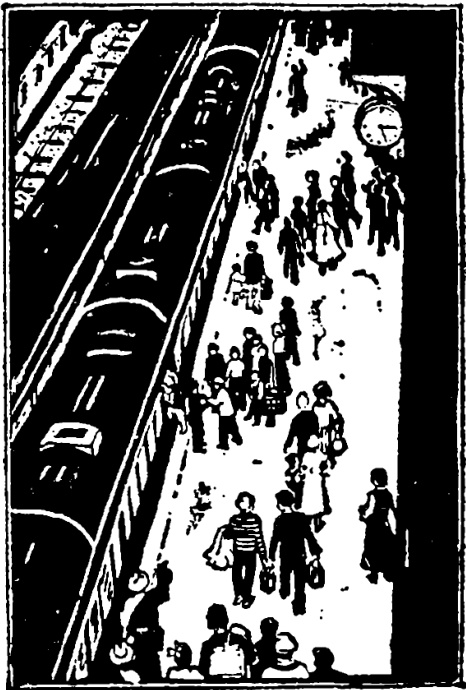

# 第二十六课 · 去火车站 — Lesson 26

> OCR transcription; not manually verified. Source and confidence metadata are preserved per page.

<!-- source_pdf_page: 49; source_printed_page: 39; ocr_confidence: 0.9975 -->

商店里买东西的人很多。
他们从七月十五号起放假。
我们从八点半到十二点半上课。

## 一、替换练习 Substitution Drills

1. 那本小说很有意思，买的人很多。

个，电影，看
个，展览，参观
个，地方，去
场，比赛，看

2. 街上骑自行车的人多吗？
街上骑自行车的人很多。

<!-- source_pdf_page: 50; source_printed_page: 40; ocr_confidence: 0.9966 -->

商店里，买东西
火车站，送客人
汽车站，等汽车
邮局，打电报
上一站，下车
下一站，下车

3. 他骑的那辆自行车是新的。

买，自行车，黑
开，汽车，旧
坐，汽车，蓝

4. 他们从什么时候起放假？
他们从七月十五号起放假。

学习中文，九月十号
开始上课，明天
早上锻练，三月一号

<!-- source_pdf_page: 51; source_printed_page: 41; ocr_confidence: 0.9794 -->

5. 我们从八点半到十二点半上课。

|  七月十五号， | 八月三十一号， | 放假  |
| --- | --- | --- |
|  七月二十五号， | 八月十四号， | 去旅行  |
|  今年九月， | 明年七月， | 学汉语  |

6. 他们两个人很热情地握手。

|  认真， | 作练习  |
| --- | --- |
|  安静， | 看书  |
|  注意， | 听介绍  |
|  高兴， | 看球赛  |

## 二、课文 Text

### 去火车站

马丁给汉斯打了个电话，他告诉汉斯，
从今天起，他们学校放假了。他要坐火车
去旅行。他坐的火车下午三点钟开。

<!-- source_pdf_page: 52; source_printed_page: 42; ocr_confidence: 0.9952 -->

汉斯去火车站送马丁。他不想坐公共汽车，因为汽车上人太多，他要骑自行车去。汉斯有一辆新买的自行车。

汉斯吃了午饭就去火车站了。街上骑自行车的人很多。从学校到火车站很远，汉斯一点从学校出发，两点二十才到。

汉斯在火车站等马丁。这一天，去车站①的人很多，有坐火车去外地的，有送朋友的，也有接客人的。两点半，马丁来了，汉斯跟他热情地握手。

马丁上了火车，汉斯对他说：“回北京的时候，你先给我打个电报，我来车站接你。”

<!-- source_pdf_page: 53; source_printed_page: 43; ocr_confidence: 0.9930 -->

## 三、生词 New Words

1. 场 (量) chǎng *a measure word for games, performances*
2. 骑 (动) qí to ride
3. 自行车 (名) zìxíngchē bicycle
4. 火车站 (名) huǒchēzhàn railway station
5. 送 (动) sòng to see (sb.) off
6. 客人 (名) kèren guest
7. 汽车站 (名) qìchēzhàn bus stop
8. 等 (动) děng to wait
9. 电报 (名) diànbào telegram
10. 上 (形) shàng last
11. 站 (名) zhàn station
12. 下 (车) (动) xià(chē) to get off
13. 下 (形) xià next
14. 辆 (量) liàng *a measure word for vehicles*
15. 开 (车) (动) kāi(chē) to drive, to start
16. 从…起 cóng…qǐ from…on
17. 放假 fàngjià to have a holiday
18. 从…到 cóng…dào from…to…

<!-- source_pdf_page: 54; source_printed_page: 44; ocr_confidence: 0.9831 -->

19. 地 (助) de a structural particle
20. 握 (手) (动) wò(shǒu) to shake (hands)
21. 手 (名) shǒu hand
22. 汉斯 (专) Hànsī Hans, name of a person
23. 告诉 (动) gàosu to tell
24. 公共汽车 gōnggòng (public) bus
qìchē
25. 因为 (连) yīnwèi because
26. 外地 (名) wàidì places within a country
other than where one is
27. 接 (动) jiē to meet (be present at
the arrival of)
28. 上 (车) (动) shàng(chē) to get on (a bus)
29. 对 (介) duì to

## 补充生词 Additional Words

1. 候车室 (名) hòuchēshì waiting-room
2. 进站口 (名) jìnzhànkǒu entrance of a railway station
3. 出站口 (名) chūzhànkǒu exit of a railway

<!-- source_pdf_page: 55; source_printed_page: 45; ocr_confidence: 0.9905 -->

station
4. 站台 (名) zhàntái platform
5. 出租汽车 chūzūqìchē taxi

## 四、注释 Notes

### ① “车站”

“火车站” “汽车站” 都可省略为“车站”。

Both 火车站 and 汽车站 can be shortened to 车站.

## 五、语法 Grammar

1. 结构助词“的”(二) The structural particle 的动词、动词短语和主谓词组作定语, 定语和中心语之间一定要用“的”。例如:

When a verb, verbal phrase or subject-predicate construction is used as an attributive, 的 must be put between the attributive and the central word, e.g.

这本词典很好, 买的人很多。

去上海旅行的学生已经走了。

跑得快的人可以参加这次比赛。

这是我们上课的教室。

2. “从…起”和“从…到” 从…起 and 从…到

“从…起”和“从…到”是两个常用的结构, 可以表示时

<!-- source_pdf_page: 56; source_printed_page: 46; ocr_confidence: 0.9977 -->

间，也可以表示地点。例如：

Both 从…起 and 从…到 are common constructions which may refer to time, place or distance, e.g.

从今天起，我们学习第二十六课。
从下一站起，还有五站就是展览馆。
下午从四点到五点我们打球。
从这儿到友谊商店很远。

3. 结构助词“地” The structural particle 地

动词或形容词前有状语修饰时，状语和中心语之间有时要用“地”。双音节形容词作状语一般要用“地”，作状语的形容词前有程度副词，“地”一般不能省略。如：

When a verb or an adjective is pre-modified by an adverbial, 地 must in certain cases be used between the adverbial and the central word. When a disyllabic adjective is used as an adverbial, 地 is usually needed. When an adjectival adverbial is pre-modified by an adverb of degree, 地 usually cannot be omitted, e.g.

她高兴地说：安娜到中国来了。
他们很注意地听讲解员介绍情况。

## 六、练习 Exercises

1. 下面的句子都需要加一个结构助词“的”，请加在恰当的地方：

<!-- source_pdf_page: 57; source_printed_page: 47; ocr_confidence: 0.9735 -->

Put the missing structural particle 的 in its correct place
in each of the following sentences:

(1) 九月二十号来中国留学生已经开始上课了。
(2) 你说那个电影我还没看呢。
(3) 城外骑自行车人不太多。
(4) 在汽车站等车那些学生都是北京大学的。
(5) 用汉语跟中国人谈话那个外国人是清华大学的学生。
(6) 和他热情握手那个同志是北京展览馆的讲解员。
(7) 去年旅行，我去那个城市是中国最大的城市。
(8) 我们要去参观展览是工业展览，不是农业展览。
2. 把下面每组的两个句子改为带结构助词“的”的一个句子：
Combine each pair of sentences into one sentence using the structural particle 的：
例 Example;

<!-- source_pdf_page: 58; source_printed_page: 48; ocr_confidence: 0.9950 -->

那个学生看画报。
那个学生是我的朋友。
那个看画报的学生是我的朋友。

(1) 他买了一辆自行车。
那辆自行车是蓝颜色的。

(2) 他翻译了那个句子。
那个句子很难。

(3) 那个学生在邮局打电报。
那个学生叫谢力。

(4) 我看了一个中国电影。
那个电影很有意思。

(5) 那个学生在火车站接客人。
他是我的朋友汉斯。

(6) 那些学生下公共汽车。
那些学生是北京语言学院的。

3. 选择恰当的词组填入下面句子的空格中：
Fill in the blanks with the phrases given:

从放假的第二天起 从这一站到下一站

<!-- source_pdf_page: 59; source_printed_page: 49; ocr_confidence: 0.9901 -->

从下一课起 从十二点半到一点半
从这儿到火车站 从九月一号开学起
从左边起 从今年夏天到明年夏天

(1) ____，他们每天骑自行车去学校。
(2) ____这两站很近，只有半公里。
(3) 不太远，____我们不用坐汽车去。
(4) ____他们去上海旅行。
(5) ____他去南京学习。
(6) ____第三辆是我们坐的汽车。
(7) 每天中午____在宿舍休息。
(8) ____我们每课多学五个生词。

4. 根据课文回答问题：

Answer the questions according to the text:

(1) 马丁给汉斯打电话，告诉汉斯什么？
(2) 汉斯去火车站作什么？
(3) 汉斯去火车站坐车去还是骑自行车去？

<!-- source_pdf_page: 60; source_printed_page: 50; ocr_confidence: 0.9929 -->

(4) 学校离火车站近吗？
(5) 汉斯几点出发？几点到火车站？
(6) 汉斯到了火车站马丁也到了吗？
(7) 这一天车站上的人多不多？
(8) 马丁什么时候到了火车站？
(9) 马丁上了火车，汉斯对他说什么？

## 汉字表 Table of Chinese Characters

> **Uncertainty:** OCR of character components and stroke forms is unreliable. This section is excluded from the default retrieval corpus.

|  1 | 騎 | 马 | 騎  |
| --- | --- | --- | --- |
|   |  | 奇（*奇）  |   |
|  2 | 自 |   |   |
|  3 | 站 | 立（ˋˋˋˋˋˋ立）  |   |
|   |  | 占（ˋˋˋˋˋˋ占）  |   |
|  4 | 送 | 关（ˇ关）  |   |
|   |  | 辶  |   |
|  5 | 客 | 宀  |   |
|   |  | 各（久各）  |   |
|  6 | 等 | 艹  |   |

<!-- source_pdf_page: 61; source_printed_page: 51; ocr_confidence: 0.9885 -->

|   |  | 寺（⼟寺）  |   |
| --- | --- | --- | --- |
|  7 | 輛 | 车 | 輛  |
|   |  | 两  |   |
|  8 | 放 | 方  |   |
|   |  | 攴  |   |
|  9 | 假 | 冂  |   |
|   |  | 段（⺌⺍⺎⺏⺐⺑⺒⺓段）  |   |
|  10 | 握 | 扌  |   |
|   |  | 屋（尸屋）  |   |
|  11 | 手 | ⺌⺌手  |   |
|  12 | 斯 | 其  |   |
|   |  | 斤  |   |
|  11 | 告 | ⺏⺓告  |   |
|  12 | 訴 | 讠 | 訴  |
|   |  | 斥（⺏尸斥斥）  |   |
|  13 | 因 | 囗  |   |
|   |  | 大  |   |
|  14 | 接 | 扌  |   |
|   |  | 妾（立妾）  |   |
