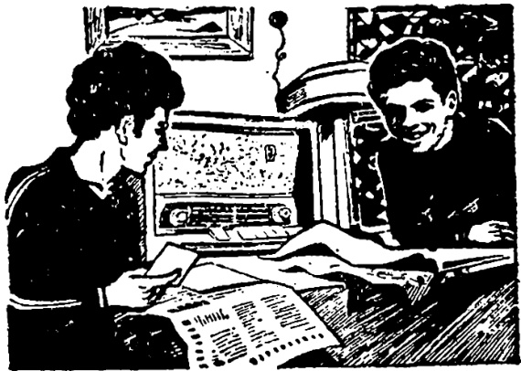

# 第二十七课 · 听广播 — Lesson 27

> OCR transcription; not manually verified. Source and confidence metadata are preserved per page.

<!-- source_pdf_page: 62; source_printed_page: 52; ocr_confidence: 0.9973 -->

你听懂这个故事了吗？

这个问题他没回答对，回答错了。

## 一、替换练习 Substitution Drills

1. 这篇课文你看了吗？

我看了。

你看完了吗？

我看完了。

他看完了吗？

他没看完，只看了一半。

2. 你听懂这个故事了吗？

这个故事不难，我听懂了。

念 学

翻译 预习

复习

<!-- source_pdf_page: 63; source_printed_page: 53; ocr_confidence: 0.9743 -->

看，本，小说

听，个，广播节目

看，本，《科学小故事》

3. 这个问题他回答对了吗？

没有。这个问题他没回答对，他回答错了。

汉字， 写

生词， 念

练习， 作

句子， 翻译

4. 刚才他写的字你看见① 了吗？

我没注意看，没看见。

唱， 歌， 听

写， 句子， 看

说， 话， 听

提， 意见， 听

<!-- source_pdf_page: 64; source_printed_page: 54; ocr_confidence: 0.9988 -->

5. 你们几点回到了学校？

我们五点回到了学校。

|  他们的汽车， | 开  |
| --- | --- |
|  那些同学， | 走  |
|  排球队， | 来  |

6. 这十个句子，你翻译到第几个了？

我翻译到第五个了。

|  练习， | 作  |
| --- | --- |
|  生词， | 写  |
|  问题， | 回答  |

7. 汉斯关上门，打开了窗户。

|  收音机， | 电视机  |
| --- | --- |
|  电视， | 窗户  |
|  窗户， | 录音机  |

<!-- source_pdf_page: 65; source_printed_page: 55; ocr_confidence: 0.9686 -->

## 二、课文 Text

### 听广播

吃完晚饭，我和汉斯回到宿舍。我打开收音机，想听音乐。收音机里广播的是个小故事。我对汉斯说：“汉斯，快来听，是小故事，很有意思。”

听完广播，我关上收音机，问汉斯：
“怎么样，刚才的故事听懂了吗？”

“听懂了一些，没都听懂。”

“我也没都听懂。你常听广播吗？

“我常听，我常听天气预报。”

<!-- source_pdf_page: 66; source_printed_page: 56; ocr_confidence: 0.9701 -->

“明天天气怎么样？”

“明天：晴，最高气温14度。”

我们还没说完，听见丁文在外边叫
我，我开开门问他：

“丁文，什么事？”

“快来看电视，今天的节目是排球
赛，中国队对美国队。”

我们说：“这个节目不能不②看。”

说完，我们三个一块儿去电视室了。

## 三、生词 New Words

|  1. 完 | (动) wán | to finish  |
| --- | --- | --- |
|  2. 一半 | (名) yíbàn | half  |
|  3. 懂 | (动) dǒng | to understand  |
|  4. 故事 | (名) gùshì | story  |
|  5. 广播 | (动) guǎngbō | to broadcast  |
|  6. 节目 | (名) jiémù | programme  |
|  7. 科学 | (名、形) kēxué | science; scientific  |
|  8. 错 | (形) cuò | wrong  |

<!-- source_pdf_page: 67; source_printed_page: 57; ocr_confidence: 0.9977 -->

|  9. 刚才 | (名) | gǎngcái | just now  |
| --- | --- | --- | --- |
|  10. 看见 |  | kànjiàn | to see, catch sight of  |
|  11. 见 | (动) | jiàn | to see  |
|  12. 唱(歌) | (动) | chàng(gē) | sing (a song)  |
|  13. 歌 | (名) | gē | song  |
|  14. 意见 | (名) | yìjiàn | opinion  |
|  15. 队 | (名) | duì | team  |
|  16. 关 | (动) | guān | to turn off, to close  |
|  17. 门 | (名) | mén | door  |
|  18. 打(开) | (动) | dǎ(kāi) | to turn (on, to open)  |
|  19. 开 | (动) | kāi | to open  |
|  20. 窗户 | (名) | chuānghu | window  |
|  21. 收音机 | (名) | shōuyīnjī | radio  |
|  22. 电视机 | (名) | diànshìjī | T.V. set  |
|  23. 录音机 | (名) | lùyīnjī | tape recorder  |
|  24. 音乐 | (名) | yīnyuè | music  |
|  25. 天气 | (名) | tiānqì | weather  |
|  26. 预报 | (动) | yùbào | to forecast  |
|  27. 晴 | (形) | qíng | clear  |
|  28. 高 | (形) | gāo | high  |
|  29. 气温 | (名) | qìwēn | temperature  |

<!-- source_pdf_page: 68; source_printed_page: 58; ocr_confidence: 0.9853 -->

|  30. 度 | (量) dù | degréé  |
| --- | --- | --- |
|  31. 叫 | (动) jiào | to call  |
|  32. 美国 | (专) Měiguó | the United States of America  |
|  33. 事 | (名) shì | thing, business  |
|  34. 对 | (动) duì | to confront, to compete  |

### 补充生课 Additional Words

|  1. 阴 | (形) yīn | overcast  |
| --- | --- | --- |
|  2. 低 | (形) dī | low  |
|  3. 摄氏 | (专) Shèshì | Celsius  |
|  4. 零 | (数) líng | zero  |
|  5. 零下 | língxià | below zero  |

## 四、注释 Notes

① “看见” “见” 常在“看”或“听”之后作结果补语。“看见”的意思是“看到”；“听见”的意思是“听到”。

见 is often used after 看 or 听 as a complement of result. 看见 means 看到, and 听见 means 听到.

② “不能不” 连用两次否定, 意思是肯定的, 而且语气比较强。“不能不看”意思是“一定要看”。

Double negation is an emphatic way of indicating

<!-- source_pdf_page: 69; source_printed_page: 59; ocr_confidence: 0.9985 -->

affirmation so 不能不看 means 一定要看.

## 五、语法 Grammar

### 1. 结果补语 The complement of result

说明动作结果的补语叫结果补语。结果补语由动词或形容词充任。结果补语和动词结合得很紧，在句中很象一个词。如果有动态助词“了”或宾语，必须放在结果补语后边。例如：

A resultative complement can be formed by a verb or an adjective. It is so closely connected with the foregoing verb or adjective, that the verb-complement construction might almost be regarded as a single word. The aspectual particle 了 or object, if there is any in the sentence, must be put after the resultative complement, e.g.

他的话我都听懂了。

你写完这些汉字了吗？

我一定要学好汉语。

因为有了结果的动作一般总是完成了的，所以带结果补语的句子否定式一般也用“没（有）”。表示尚未完成时，也可以用“还没（有）…呢”。例如：

还没（有）may be used in a negative sentence with a resultative complement. A sentence of this kind often has a verb indicating a completed action. The structure 没（有）…呢 may be used if the action has not yet been performed or completed, e.g.

<!-- source_pdf_page: 70; source_printed_page: 60; ocr_confidence: 0.9989 -->

昨天你看见汉斯了没有？

——我没看见。

这本小说你看完没看完？

——没看完。

### 2. “到”作结果补语到 as a resultative complement

“到”作结果补语，可以表示人或事物通过动作达到某地点，可以表示动作持续到某时间，也可以表示某动作达到了目的。例如：

到 used as a resultative complement indicates that somebody or something has reached a certain place through the action indicated by the main verb, or an action has continued until a certain point in time, or that an action has attained its goal, e.g.

哈利上个月去上海旅行，昨天回到了北京。

我们学到下午四点，四点以后去打球。

我买到那本小说了。

### 3. “上”作结果补语上 as a resultative complement

“上”作结果补语，表示动作完成后产生合拢、达到目的等结果，有时也表示存在或添加于某处的意思。例如：

上 used as a resultative complement indicates that the completion of an action has produced a certain result such as the connection of two things or the attainment of a purpose.

<!-- source_pdf_page: 71; source_printed_page: 61; ocr_confidence: 0.9830 -->

Sometimes it indicates existence or the addition of sth. to sth. else,
e.g.

他关上门，打开了电视机。
请你在这儿写上你的名字。

## 六、练习 Exercises

1. 把下列陈述句改为疑问句，并用否定式回答：

Change the following statements into questions, and give
negative answers:

例 Example:

他作完练习了。

他作完练习了没有？

他没作完练习。

(1) 他听懂这个故事了。
(2) 他们参观完工业展览会了。
(3) 收音机里广播完天气预报了。
(4) 我看清楚那些汉字了。
(5) 哈利关上窗户了。
(6) 我听见他说的话了。
(7) 去上海旅行的同学已经回到学校了。

<!-- source_pdf_page: 72; source_printed_page: 62; ocr_confidence: 0.9883 -->

(8) 老师问的问题她回答对了。

2. 用 A 组词作动词, B 组词作结果补语, 可以搭配出哪些动补结构的词组?

Make as many verb + resultative complement constructions as you can, using the words in group A as main verbs and those in group B as resultative complements:

A: 看 听 写 念 说

B: 完 懂 见 错 清 楚

3. 根据课文回答问题:

Answer the following questions according to the text:

(1) 吃完晚饭你去哪儿了?

(2) 你打开收音机想听什么?

(3) 收音机里广播的是什么?

(4) 你们能听懂吗?

(5) 汉斯常听广播吗? 他常听什么广播?

(6) 天气预报说, 明天天气怎么样?

(7) 你们说话的时候谁在外边叫你?

(8) 丁文找你有什么事?

(9) 你们都去看电视了吗? 电视里是

<!-- source_pdf_page: 73; source_printed_page: 63; ocr_confidence: 0.9891 -->

### 什么节目？

4. 给下面的短文填上恰当的结果补语：

Put a suitable resultative complement in each of the blanks:

昨天下午我去工人体育场看球赛了。
回____学校，在宿舍楼前边看____了丁
力。丁力对我说：

“你去哪儿了？马丁给你来电话了，
我没找____你。”

“我去看球了。马丁回北京了吗？他
说什么了？”

“他说晚上再给你打电话。”

“谢谢你。”

吃____晚饭，马丁来电话了，他说：

“我昨天从上海回____北京了。两个
星期没看____你，很想去你那儿玩儿。这
个星期日你有事吗？”

“没事，你几点钟来？”

“我早上八点骑自行车从学校出发，
八点二十就可以骑____。你的房间是八楼

<!-- source_pdf_page: 74; source_printed_page: 64; ocr_confidence: 0.9930 -->

二一四号，我没说____吧？”

“不对，不是二一四号，是二一二号，听____了吗？八楼二一二号，别找____了房间。”

“好，听____了，不会找____。再见！”

“再见！”

## 汉字表 Table of Chinese Characters

> **Uncertainty:** OCR of character components and stroke forms is unreliable. This section is excluded from the default retrieval corpus.

|  1 | 完 | 宀  |   |
| --- | --- | --- | --- |
|   |  | 元  |   |
|  2 | 懂 | 忄  |   |
|   |  | 董 | 艹  |
|   |  |  | 重(一二六六六六六六六六六六六六六六六六六六六六六六六六六六六六六六六六六六六六六六六六六六六六六六六六六六六六六六六六六六六六六六六六六六六六六六六六六六六六六六六六六六六六六六六六六六六六六六六六六六  |
|  3 | 故 | 古  |   |
|   |  | 攵  |   |
|  4 | 事 | 一二六六六六六六六六六六六六六六六六六六六六六六六六六六六六六六六六六六六六六六六六六六六六六六六六六六六六六六六六六六六六六六六六六六六六六六六六六六六六六六六六六六六六六六六六六六六六  |   |
|  5 | 播 | 扌  |   |

<!-- source_pdf_page: 75; source_printed_page: 65; ocr_confidence: 0.9935 -->

|   |  | 番 |   |
| --- | --- | --- | --- |
|  6 | 目 |  |   |
|  7 | 科 | 禾 |   |
|   |  | 斗( 丶 丶 ) |   |
|  8 | 剛 | 冈 | 剛  |
|   |  | 刂 |   |
|  9 | 唱 | 口 |   |
|   |  | 昌 |   |
|  10 | 歌 | 哥 |   |
|   |  | 欠 |   |
|  11 | 队 | 阝 | 隊  |
|   |  | 人 |   |
|  12 | 关 |  | 鬪  |
|  13 | 窗 | 穴 |   |
|   |  | 囱 |   |
|  14 | 户 |  |   |
|  15 | 收 | 丩(丶丩) |   |
|   |  | 攵 |   |

<!-- source_pdf_page: 76; source_printed_page: 66; ocr_confidence: 0.9870 -->

|  16 | 乐 | 一二千乐乐 | 樂  |
| --- | --- | --- | --- |
|  17 | 气 |  | 氣  |
|  18 | 晴 | 日 |   |
|   |  | 青 |   |
|  19 | 溫 | 氵 |   |
|   |  | 盅（日盅） |   |
|  20 | 度 | 广 |   |
|   |  | 艾（一一一一艾） |   |
|  21 | 美 | 兰（一一一兰兰兰兰兰兰兰兰） |   |
|   |  | 大 |   |
