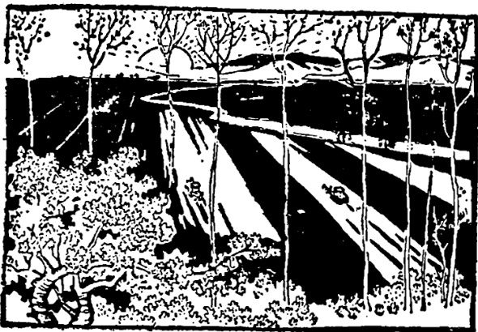
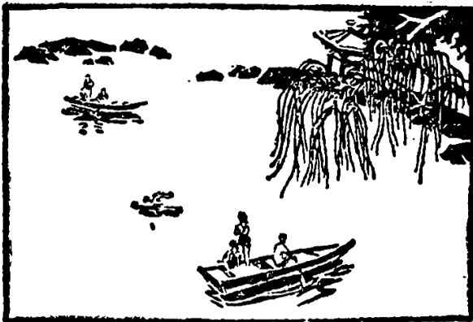
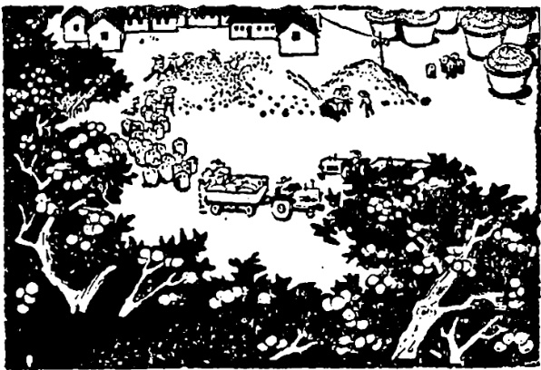
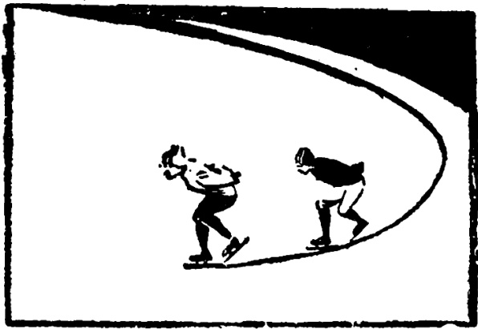

# 第二十八课 · 北京的四季 — Lesson 28

> OCR transcription; not manually verified. Source and confidence metadata are preserved per page.

<!-- source_pdf_page: 77; source_printed_page: 67; ocr_confidence: 0.9981 -->

现在是秋天了。
中秋节快要到了。

## 一、替换练习 Substitution Drills

1. 他以前是学生，现在是老师了。

售货员，干部
农民，工人
护士，大夫

2. 现在是秋天了，天气不热了。

夏天，热
春天，暖和
冬天，冷
秋天，凉快

<!-- source_pdf_page: 78; source_printed_page: 68; ocr_confidence: 0.9994 -->

3. 刚才下雨，现在不下了。

下雪，不下

刮风，不刮

很热，凉快

4. 六点半了，该起床了。

八点半，上课

四点半，去锻炼

六点，吃晚饭

十点半，睡觉

5. 春天了，去公园的人多了，

外边，不冷

天气，暖和

早上锻炼的人，多

6. 快走，要下雨了。

<!-- source_pdf_page: 79; source_printed_page: 69; ocr_confidence: 0.9733 -->

刮风 上课
开车

7. 来北京以前他学习英语，来北京以后他学习汉语了。

不爱锻炼， 爱锻炼
常常感冒， 不感冒
身体不好， 身体好

## 二、课文 Text

### 北京的四季

一年有四个季节：春天、夏天、秋天、冬天。

北京从三月到五月是春天，六月到八月是夏天，九月到十一月是秋天，十二月到二月是冬天。

到了春天，天气暖和了，人们都喜欢

<!-- source_pdf_page: 80; source_printed_page: 70; ocr_confidence: 0.9907 -->

去公园玩儿。夏天天气热。七、八月常常

下雨。北京的冬天很冷，常常刮风，不常下雪。秋天天气最好，不冷也不热，不刮风也很少下雨。

<!-- source_pdf_page: 81; source_printed_page: 71; ocr_confidence: 0.9993 -->

现在是秋天了，国庆节和中秋节都快要到了。每年的公历十月一日是中国国庆节，农历八月十五是中秋节。这两个节常常离得很近。大家都说，中秋节的月亮最圆，最好看。中秋节晚上，全家人在一起，一边吃月饼，一边赏月。

<!-- source_pdf_page: 82; source_printed_page: 72; ocr_confidence: 0.9987 -->

## 三、生词 New Words

|  1. 以前 | (名) | yíqián | before  |
| --- | --- | --- | --- |
|  2. 干部 | (名) | gànbù | cadre  |
|  3. 农民 | (名) | nóngmín | peasant  |
|  4. 护士 | (名) | hùshi | nurse  |
|  5. 热 | (形) | rè | hot  |
|  6. 秋天 | (名) | qiūtiān | autumn  |
|  7. 春天 | (名) | chūntiān | spring  |
|  8. 暖和 | (形) | nuǎnhuo | warm  |
|  9. 冷 | (形) | lěng | cold  |
|  10. 凉快 | (形) | liángkuai | cool  |
|  11. 下(雨) |  | xià(yǔ) | (of rain, etc.) to fall  |
|  12. 雨 | (名) | yǔ | rain  |
|  13. 雪 | (名) | xuě | snow  |
|  14. 刮(风) | (动) | guā(fēng) | to blow  |
|  15. 风 | (名) | fēng | wind  |
|  16. 该 | (能动) | gāi | ought to, should  |
|  17. 要…了 |  | yào...le | will  |
|  18. 以后 | (名) | yíhòu | later on, in the future  |

<!-- source_pdf_page: 83; source_printed_page: 73; ocr_confidence: 0.9851 -->

19. 爱 (动) ài to like, to love
20. 季 (名) jì season
21. 季节 (名) jìjié season
22. 国庆 (节) (名) Guóqìng(jié) National Day
23. 中秋 (节) (名) Zhōngqiū(jié) Mid-Autumn Festival
24. 节 (名) jié festival
25. 公历 (名) gōnglì the Gregorian calendar
26. 农历 (名) nónglì the Chinese lunar calendar
27. 大家 (代) dàjiā everybody
28. 月亮 (名) yuèliang moon
29. 圆 (名) yuán round
30. 全 (形、副) quán whole
31. 一边…一边… yìbiān … yìbiān indicates concurrent actions
32. 月饼 (名) yuèbing moon cake
33. 赏月 shǎngyuè to enjoy looking at the moon

<!-- source_pdf_page: 84; source_printed_page: 74; ocr_confidence: 0.9859 -->

## 补充生词 Additional Words

|  1. 凉 | (形) | liáng | cool  |
| --- | --- | --- | --- |
|  2. 云 | (名) | yún | cloud  |
|  3. 太阳 | (名) | tàiyang | sun  |
|  4. 星 | (名) | xīng | star  |
|  5. 天空 | (名) | tiāngkōng | sky  |

## 四、注释 Notes

### ① “以前”和“以后” 以前 and 以后

“以前”和“以后”用来表示时间，可以单独用，也可以用在动词或动词短语之后。如：“以前他在广州学习。”“吃晚饭以前他不在宿舍，我吃完晚饭以后再去找他。”

Both 以前 and 以后 can be used alone or after a verb or verbal phrase to indicate time, e.g. 以前他在广州学习；吃晚饭以前他不在宿舍，我吃完晚饭以后再去找他。

## 五、语法 Grammar

### 1. 语气助词“了”(二) The modal particle 了(2)

语气助词“了”的第二个用法，是用在句尾，表示一种新情况的出现。例如：

The second usage of the modal particle 了 is to show that a new situation has appeared, e.g.

他以前是工人，现在是大学生了。

<!-- source_pdf_page: 85; source_printed_page: 75; ocr_confidence: 0.9885 -->

现在是冬天了，天气冷了。

他要去看朋友，不跟我们去看电影了。

### 2. “要...了”格式 The construction 要...了

如果要表示一个动作或情况很快就要发生，就用“要…了”这个格式。“要”表示将要，“了”是语气助词。例如：

The 要…了 construction is used to indicate that something is about to happen. Here 要 indicates futurity and 了 is a modal particle, e.g.

汽车要开了。

冬天要到了。

“要”前还可以加上“就”或“快”，构成“就要…了”“快要…了”，表示时间紧迫。例如：

要 may be preceded by 就 or 快. 就要…了 or 快要…了 means that something will happen very soon.

冬天就要到了。

天气快要冷了。

“就要…了”“快要…了”也可以省为“就…了”“快…了”。“就要…了”前面可以加表示时间的词语，“快要…了”不能。例如：

就要…了 and 快要…了 may be simplified as 就…了 and 快…了. 就要…了 can be preceded by a time phrase, but 快要…了 cannot, e.g.

<!-- source_pdf_page: 86; source_printed_page: 76; ocr_confidence: 0.9809 -->

火车五点钟就要开了。

我们明天就要学习第二十九课了。

## 六、练习 Exercises

1. 用“就要…了”、“快要…了”、“快…了”改写句子：Rewrite the following sentences with 就要…了，快要…了 or 快…了：例 Example:

排球赛四点半开始了，现在是四点二十，我们该去操场了。

排球赛就要开始了，我们该去操场了。

排球赛快要开始了，我们该去操场了。

排球赛快开始了，我们该去操场了。

(1) 还有两天就是中秋节了，该去买月饼了。
(2) 汽车两点半开，现在已经两点二十五了，我们快点儿跑。

<!-- source_pdf_page: 87; source_printed_page: 77; ocr_confidence: 0.9979 -->

(3) 现在已经是十月下半月了，你该去买冬天穿的衣服了。

(4) 这本书一共二十五课，他们已经学到第二十三课了。

(5) 六点钟吃晚饭，现在已经五点三刻了，我不跟你去打乒乓球了。

(6) 一月二十五号开始放假，今天是一月二十三号，放假以后你想作什么？

(7) 音乐节目七点开始，现在已经六点五十九分了，快打开收音机吧！

(8) 从上海来的火车两点半到，现在已经两点十分了，我们快进站吧！

2. 根据下面句子上下文的意思，翻译列出的词：

Translate the listed words according to their contexts:

(1) 今天是五号，小王前天，也就是三号就到北京了。

<!-- source_pdf_page: 88; source_printed_page: 78; ocr_confidence: 0.9962 -->

(2) 今天是农历八月十三，后天就是中秋节了。

(3) 今天星期三，明天星期四，后天星期五，大后天星期六下午，我们去公园玩儿。

(4) 今天是九号，昨天八号，前天七号，大前天是六号，那天我在家，没有进城。

(5) 今年是1988年，去年是1987年，前年是1986年。

(6) 这个星期上完课，下星期再上一个星期，下下星期开始放假。

前天

大前天

后天

大后天

前年

下星期

下下星期

<!-- source_pdf_page: 89; source_printed_page: 79; ocr_confidence: 0.9867 -->

3. 根据课文回答问题:

Answer the questions according to the text:

(1) 北京一年有哪几个季节?
(2) 北京的春天是从几月到几月? 天气暖和不暖和? 人们喜欢去哪儿玩儿?
(3) 北京从几月到几月是夏天? 夏天天气怎么样?
(4) 北京从几月到几月是秋天? 秋天天气好吗?
(5) 北京从几月到几月是冬天? 冬天天气冷不冷? 刮不刮风? 下不下雪?
(6) 现在北京是什么季节?
(7) 中国的国庆节是几月几号?
(8) 农历八月十五是什么节?
(9) 中国的国庆节和中秋节离得远吗?
(10) 中国人怎么样过 (guò celebrate) 中

<!-- source_pdf_page: 90; source_printed_page: 80; ocr_confidence: 0.9616 -->

### 秋节？

4. 根据实际情况回答问题：

Give your own answers to the questions:

(1) 请介绍你们城市的天气。
(2) 请介绍你们国家的一个节日，你们怎么过这个节日？

## 汉字表 Table of Chinese Characters

> **Uncertainty:** OCR of character components and stroke forms is unreliable. This section is excluded from the default retrieval corpus.

|  1 | 护 | 扌 | 護  |
| --- | --- | --- | --- |
|   |  | 戶 |   |
|  2 | 士 |  |   |
|  3 | 秋 | 禾 |   |
|   |  | 火 |   |
|  4 | 春 | 夭（一二三夭夭） |   |
|   |  | 日 |   |
|  5 | 暖 | 日 |   |
|   |  | 爰（一一一一一一一一一爰爰爰） |   |
|  6 | 冷 | 冫 |   |

<!-- source_pdf_page: 91; source_printed_page: 81; ocr_confidence: 0.9590 -->

|   |  | 令 |   |
| --- | --- | --- | --- |
|  7 | 凉 | 冫 |   |
|   |  | 京 |   |
|  8 | 雨 |  |   |
|  9 | 雪 | 雨 |   |
|   |  | ヨ（コヨヨ） |   |
|  10 | 刮 | 舌 | 颺  |
|   |  | 刂 |   |
|  11 | 风 | 几风风 | 風  |
|  12 | 该 | 讠 | 該  |
|   |  | 、一、二、三、五、六、七、八、九、十、十一、十二、十三、十四、十五、十六、十七、十八、十九、二十、二十一、二十二、二十三、二十四、二十五、二十六、二十七、二十八、二十九、三十、三十一、三十二、三十三、三十四、三十五、三十六、三十七、三十八、三十九、四十、四十一、四十二、四十三、四十四、四十五、四十六、四十七、四十八、四十九、五十、五十一、五十二、五十三、五十四、五十五、五十六、五十七、五十八、五十九、六十、六十一、六十二、六十三、六十四、六十五、六十六、六十七、六十八、六十九、七十、七十一、七十二、七十三、七十四、七十五、七十六、七十七、七十八、七十九、八十、八十一、八十二、八十三、八十四、八十五、八十六、八十七、八十八、八十九、九十、九十一、九十二、九十三、九十四、九十五、九十六、九十七、九十八、九十九、一百零 | 愛  |
|   | 季 | 禾（ノ二千禾禾） |   |
|   |  | 子 |   |
|  14 | 庆 | 广 | 慶  |
|   |  | 大 |   |
|  15 | 历 | 厂 | 歴  |
|   |  | 力 |   |
|  16 | 亮 | 、一、二、三、四、五、六、七、八、九、十、十一、十二、十三、十四、十五、十六、十七、十八、十九、二十、二十一、二十二、二十三、二十四、二十五、二十六、二十七、二十八、二十九、三十、三十一、三十二、三十三、三十四、三十五、三十六、三十七、三十八、三十九、四十、四十一、四十二、四十三、四十四、四十五、四十六、四十七、四十八、四十九、五十、五十一、五十二、五十三、五十四、五十五、五十六、五十七、五十八、五十九、六十、六十一、六十二、六十三、六十四、六十五、六十六、六十七、六十八、六十九、七十、七十一、七十二、七十三、七十四、七十五、七十六、七十七、七十八、七十九、八十、八十一、八十二、八十三、八十四、八十五、八十六、八十七、八十八、八十九、九十、九十一、九十二、九十三、九十四、九十五、九十六、九十七、九十八、九十九、一百零 | 歴  |

<!-- source_pdf_page: 92; source_printed_page: 82; ocr_confidence: 0.9874 -->

|  17 | 全 | 人  |   |
| --- | --- | --- | --- |
|   |  | 王  |   |
|  18 | 饼 | 饣 | 餅  |
|   |  | 并  |   |
|  19 | 赏 | 赏 | 赏  |
|   |  | 贝  |   |
