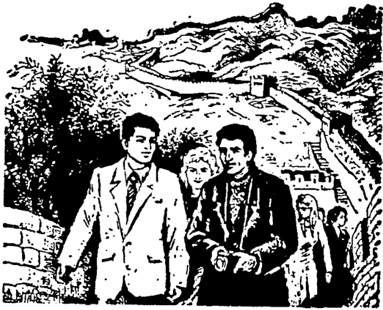

# 第二十九课 · 去长城 — Lesson 29

> OCR transcription; not manually verified. Source and confidence metadata are preserved per page.

<!-- source_pdf_page: 93; source_printed_page: 83; ocr_confidence: 0.9986 -->

哈利进来了。

他回宿舍去了。

他带来了一些水果。

## 一、替换练习 Substitution Drills

1. 我在宿舍看书的时候，哈利进来了。

|  教室 | 屋子里  |
| --- | --- |
|  阅览室 | 图书馆  |

2. （马丁和汉斯都在外边，马丁问汉斯：）哈利在宿舍吗？

——在。他刚进去。

|  食堂 | 礼堂  |
| --- | --- |
|  电影室 | 乒乓球室  |

<!-- source_pdf_page: 94; source_printed_page: 84; ocr_confidence: 0.9737 -->

3. 这儿好看极了，你快上来吧。

下 出

进 过

4. 马丁在吗？

他刚走，回宿舍去了。

进， 城

到， 长城

上， 楼

下， 楼

到， 对面屋子

5. 汉斯在你们这儿吗？

不在，他没到我们这儿来。

宿舍 房间

教室 家

<!-- source_pdf_page: 95; source_printed_page: 85; ocr_confidence: 0.9722 -->

6. 安娜去长城了吗？

去长城了。

她带照相机去吗？

带去了。

面包 水果

毛衣 吃的

7. 玛丽从商店买来一件衣服。

图书馆，借，一本小说

家里，带，一些画片

小卖部，买，一些水果

## 二、课文 Text

### 去长城

来中国以后，我早就想到长城去玩儿。一个星期天的早上，我起床以后，刚刷完牙，洗完脸，哈利从外边进来了。他说：“学校有汽车去长城。今天天气不错，我们到长城去玩吧！”汉斯问：“现在去，什么时候能回来？”“下午四五点

<!-- source_pdf_page: 96; source_printed_page: 86; ocr_confidence: 0.9992 -->

钟就能回来。”

八点钟，我们出发了。汽车开得很快，一个半小时以后，开始爬山了。汽车一会儿上去，一会儿下来，我们坐在汽车里往外看，路两边有山，有树，非常好看。

到了长城下边，汉斯说：“长城真高！我们上去吧①，看谁第一个爬到最上边。”“好吧②！”说完，我们一起往上爬。哈利最先爬到顶上。他站在那儿大声

<!-- source_pdf_page: 97; source_printed_page: 87; ocr_confidence: 0.9941 -->

喊：“你们快上来，这儿好看极了。”我们说：“马上就上去。”

我们到了上边，汉斯说：“你们看啊，对面也很不错，我们过去吧。”“等一会儿，我们先在这儿照儿张相。”“啊，”哈利说，“我的照相机总在汽车上了，没带来。”

## 三、生词 New Words

|  1. 刚 | (副) | gāng | just (now)  |
| --- | --- | --- | --- |
|  2. 极了 |  | jíle | extremely  |
|  3. 吧 | (助) | ba | *a modal particle*  |
|  4. 出 | (动) | chū | to go out  |
|  5. 过 | (动) | guò | to pass by  |
|  6. 长城 | (专) | Chángchéng | the Great Wall  |
|  7. 对面 | (名) | duìmiàn | opposite  |
|  8. 带 | (动) | dài | to take, bring along  |
|  9. 照相机 | (名) | zhàoxiàngjī | camera  |
|  10. 面包 | (名) | miànbāo | bread  |

<!-- source_pdf_page: 98; source_printed_page: 88; ocr_confidence: 0.9985 -->

|  11. | 玛丽 | (专) | Mǎlì | Mary  |
| --- | --- | --- | --- | --- |
|  12. | 刷(牙) | (动) | shuā(yá) | to brush (teeth)  |
|  13. | 牙 | (名) | yá | tooth  |
|  14. | 洗(脸) | (动) | xǐ(liǎn) | wash (face)  |
|  15. | 脸 | (名) | liǎn | face  |
|  16. | 小时 | (名) | xiǎoshí | hour  |
|  17. | 爬 | (动) | pá | to climb  |
|  18. | 山 | (名) | shān | hill, mountain  |
|  19. | 一会儿 | (名) | yíhuìr | a moment  |
|  20. | 往 | (介) | wǎng | to, toward  |
|  21. | 外 | (名) | wài | outside  |
|  22. | 路 | (名) | lù | road, way  |
|  23. | 边 | (名) | biān | side  |
|  24. | 树 | (名) | shù | tree  |
|  25. | 非常 | (副) | fēicháng | extremely  |
|  26. | 真 | (形) | zhēn | real  |
|  27. | 顶 | (名) | dìng | top  |
|  28. | 站 | (动) | zhàn | to stand  |
|  29. | 大声 | (名) | dàshēng | loud voice  |
|  30. | 喊 | (动) | hǎn | to shout  |
|  31. | 马上 | (副) | mǎshàng | at once  |

<!-- source_pdf_page: 99; source_printed_page: 89; ocr_confidence: 0.9867 -->

32. 啊 (叹) à a modal particle
33. 照(相)(动) zhào(xiàng) to take (a photo)
34. 相 (名) xiàng photograph
35. 忘 (动) wàng to forget

## 补充生词 Additional Words

1. 眼睛 (名) yǎnjing eye
2. 眉毛 (名) méimao eyebrow
3. 鼻子 (名) bízi nose
4. 嘴 (名) zuǐ mouth
5. 耳朵 (名) ěrduo ear

## 四、注释 Notes

① 语气助词“吧” The modal particle 吧

“吧”用在句尾，可以表示请求、命令、商量等语气。

The modal particle 吧 used at the end of a sentence indicates request, command, suggestion, etc.

② “好吧”

“好吧”表示答应、同意对方的请求或建议。

好吧 indicates agreement.

## 五、语法 Grammar

1. 简单趋向补语 The simple directional complement

<!-- source_pdf_page: 100; source_printed_page: 90; ocr_confidence: 0.9993 -->

动词“来”和“去”放在其他动词后边作补语，表示趋向，叫简单趋向补语。如果动作是朝着说话人进行的，就用“来”，如果是朝着相反方向进行的，就用“去”。例如：

The verbs 来 and 去 may be put after another verb as a simple directional complement. 来 indicates movement towards the speaker, and 去 indicates movement away from the speaker, e.g.

你们都进来吧。（说话人在里边）
他不在家，他出去了。（说话人在家里）

2. 简单趋向补语与宾语的位置 The position of the simple directional complement and the object

如果动词有宾语，宾语是表示处所的词或词组，要放在动词和“来”“去”之间。例如：

If the verb takes as its object a word or phrase indicating place, the object should be put between the verb and the complement 来 or 去, e.g.

下午我到图书馆去。

明天他要到我家来。

如果宾语不是表示处所的词或词组，既可以放在动词和“来”“去”之间，也可以放在“来”“去”之后。例如：

If the object is not a word or phrase indicating place, the object may be put either between the verb and the complement 来 or 去, or after the complement, e.g.

<!-- source_pdf_page: 101; source_printed_page: 91; ocr_confidence: 0.9954 -->

他要带一些水果去。

他要带去一些水果。

这种句子的动词如果带动态助词“了”，“了”的位置如下：

If the aspectual particle 了 is used in a sentence with a directional complement, it may be put in the following positions:

他带了一些水果去。

他带去了一些水果。

3. “在”作结果补语 在 as a resultative complement

动词“在”作结果补语，表示人或事物通过动作停留于某处。

例如：

The verb 在 used as a resultative complement indicates that sb. or sth. comes to rest at a certain place by means of the action indicated by the main verb, e.g.

上课的时候，他坐在前边。

我的照相机放在汽车上了。

## 六、练习 Exercises

1. 用上括号里的词语并加“来”或“去”完成句子：

Complete the following sentences, using the words in parentheses plus 来 or 去：

(1) \_\_\_\_，我去车站接他。（从上海

<!-- source_pdf_page: 102; source_printed_page: 92; ocr_confidence: 0.9652 -->

回)

(2) 你找小王吗? 他不在, ____。
(到长城)
(3) 你去医院看小张吗? 你给他____。
(带 一些水果)
(4) 昨天他进城了, ____。(买录音机)
(5) ____, 这两本书不太难, 我们都能看懂。(从图书馆 借)
(6) 快上课了, ____。(进 教室)
(7) 谢力的宿舍在楼上, 刚才我看见他____。(上 楼)

2. 根据课文回答问题:

Answer the questions according to the text:

(1) 来中国以后, 你早就想到哪儿去玩?
(2) 星期日早上, 哈利什么时候从外边进来了?
(3) 哈利从外边进来, 对你们说什

<!-- source_pdf_page: 103; source_printed_page: 93; ocr_confidence: 0.9935 -->

么？

(4) 哈利说，早上去长城什么时候能回来？
(5) 他们几点从学校出发了？
(6) 汽车开得快不快？
(7) 汽车什么时候开始爬山？
(8) 你们坐在汽车里往外看，看见了什么？
(9) 到了长城，谁第一个爬到顶上？
(10) 你们在长城上照相了没有？为什么？

3. 用“来”或“去”填空，然后用所给的词语作问句：

Fill in the blanks with 来 or 去，and then ask questions on the text using the key of words given:

昨天下午三点半体育馆有球赛，我和哈利两点钟就出发到体育馆____了。

到了那儿，我们见到了很多以前的同学，高兴极了，没有马上进里边____。哈利从小卖部买____了一些水果和汽水。我

<!-- source_pdf_page: 104; source_printed_page: 94; ocr_confidence: 0.9935 -->

们一边吃一边谈话，三点二十我们才进____。

看球赛的人很多。我和哈利没坐在一起。哈利坐在东边，我坐在他的对面。过了一会儿，排球队进____了。三点半比赛开始。两个队都打得不错。他们打到五点半才打完。

六点一刻，我和哈利回到了学校，回____以后，我们就到食堂____吃晚饭了。

(1) 跟谁 体育馆
(2) 几点 出发
(3) 为什么 马上进去
(4) 小卖部 买
(5) 什么时候 里边
(6) 比赛 开始
(7) 两个队 打
(8) 几点 回到

4. 用“来”或“去”填空并进行会话：

Fill in the blanks with 来 or 去 and act out the dialogue:

<!-- source_pdf_page: 105; source_printed_page: 95; ocr_confidence: 0.9937 -->

A: 安娜, 安娜!

B: 谁啊? 进____吧! 玛丽, 是你。
你起得真早, 我刚刷完牙, 洗完
脸。

A: 今天天气不错, 我们到长城____
玩儿吧。

B: 我早就想到长城____玩儿, 但是
长城离这儿很远, 现在去, 下午
能回____吗?

A: 坐火车去, 下午六点半一定能回
____。

B: 好, 走吧! 我们不能回____吃午
饭, 带一些吃的东西____吧!

A: 还应该带一些水果____。

B: 对, 我想带照相机____。在长城
顶上照几张相, 一定很好看。

A: 来中国以前, 我朋友告诉我, 回
国的时候一定给他带一些长城的
照片____。这一次我们一定多照

<!-- source_pdf_page: 106; source_printed_page: 96; ocr_confidence: 0.9704 -->

一些。

B: 好,我现在就到食堂____,买完东西就出发。

## 汉字表 Table of Chinese Characters

> **Uncertainty:** OCR of character components and stroke forms is unreliable. This section is excluded from the default retrieval corpus.

|  1 | 板 | 木 | 極  |
| --- | --- | --- | --- |
|   |  | 及(丿及)  |   |
|  2 | 吧 | 口  |   |
|   |  | 巴  |   |
|  3 | 过 | 寸 | 過  |
|   |  | 辶  |   |
|  4 | 长 |  | 長  |
|  5 | 面 | 一丿丿丿丿而而而面  |   |
|  6 | 带 | 一乚乚乚乚乚带带 | 带  |
|  7 | 照 | 昭(昭昭昭)  |   |
|   |  | ...  |   |
|  8 | 相 | 木  |   |
|   |  | 目  |   |
|  9 | 包 | 勺  |   |

<!-- source_pdf_page: 107; source_printed_page: 97; ocr_confidence: 0.9930 -->

|   |  | 已 |   |
| --- | --- | --- | --- |
|  10 | 玛 | 玕 | 瑪  |
|   |  | 马 |   |
|  11 | 丽 | 丽 | 麗  |
|  12 | 刷 | 刷(尸吊) |   |
|   |  | 刂 |   |
|  13 | 牙 | 一二于牙 |   |
|  14 | 洗 | 汙 |   |
|   |  | 先 |   |
|  15 | 脸 | 月 | 腋  |
|   |  | 金(丿八个个个金) |   |
|  16 | 爬 | 爪(丿斤爪) |   |
|   |  | 巴 |   |
|  17 | 山 | 丨山 |   |
|  18 | 往 | 往 |   |
|   |  | 主 |   |
|  19 | 路 | 路 |   |
|   |  | 各(久各) |   |

<!-- source_pdf_page: 108; source_printed_page: 98; ocr_confidence: 0.9901 -->

|  20 | 树 | 木 | 樹  |
| --- | --- | --- | --- |
|   |  | 又 |   |
|   |  | 寸 |   |
|  21 | 非 | 丨丨丨丨丨丨卅非 |   |
|  22 | 顶 | 丁 | 顶  |
|   |  | 页 |   |
|  23 | 声 | 一十十韦韦韦声 | 聲  |
|  24 | 喊 | 口 |   |
|   |  | 咸 |   |
|  25 | 啊 | 口 |   |
|   |  | 阿(𠂇阿) |   |
|  26 | 忘 | 亡(、一亡) |   |
|   |  | 心 |   |
