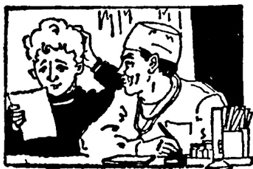

# 第三十课 · 一张药方（小话剧） — Lesson 30

> OCR transcription; not manually verified. Source and confidence metadata are preserved per page.

<!-- source_pdf_page: 109; source_printed_page: 99; ocr_confidence: 0.9678 -->

这本小说很有意思，你可以看看。
来中国以后，我去过两次长城。
你介绍一下那儿的情况吧。

## 一、替换练习 Substitution Drills

### 1. 这本书有意思吗？

很有意思，你可以看看。

|  这个电影， | 看  |
| --- | --- |
|  这个广播节目， | 听  |
|  打乒乓球， | 学  |
|  爬山， | 试  |

他身体不太好，应该检查检查。

休息 运动 锻练

<!-- source_pdf_page: 110; source_printed_page: 100; ocr_confidence: 0.9963 -->

2. 这个字你会写吗？

会写，这个字我们学过。

这个歌， 唱

这课课文， 翻译

这个生词， 念

来中国以前，你学过汉语吗？

没有，来中国以前我没学过汉语。

看， 中国电影

听， 中国广播

吃， 中国饭

3. 来中国以后，你去过长城没有？

去过。

去过几次长城？

去过两次。

<!-- source_pdf_page: 111; source_printed_page: 101; ocr_confidence: 0.9875 -->

去，北海公园
参观，工厂
着，展览
去，农村

4. 你在这儿等一下，我马上就回来。

坐，休息

我们都没去过那儿，你介绍一下那儿的情况吧。

谈说告诉我们

5. 今天的生词我要再写一遍。

课文，念
录音，听
语法，复习

<!-- source_pdf_page: 112; source_printed_page: 102; ocr_confidence: 0.9577 -->

## 二、课文 Text

### 一张药方

（小话剧）

学生B找大夫A看病

A：你怎么了？哪儿疼？

B：不觉得疼，只觉得不舒服。

A：哪儿不舒服？

B：头、肚子、腿……我也不知道。

A：你到医务室来过吗？

B：来过，上星期来过一次。

A：大夫给你开过药吗？

B：开过一些药片，一天三次，每次一片。吃了药还不行①。

A：以前你得过什么病？

B：得过感冒，没得过别的病。

A：发烧吗？试试表吧。

<!-- source_pdf_page: 113; source_printed_page: 103; ocr_confidence: 0.9913 -->

B: 我在宿舍试过了，三十六度五

（36.5℃），不发烧。

A: 我给你检查一下儿。这儿疼吗？

B: 不疼。

A: 这儿疼吗？

B: 也不疼。

A: 吃东西怎么样？

B: 喜欢吃的，就吃得多，不爱吃的，
就吃得少。

A: 睡觉怎么样？

B: 有时候睡得好，有时候睡得不好。

A: 晚上几点睡？

B: 有时候九点，有时候十二点半。

A: 早上几点起床？

B: 有时候五点，有时候八点。

A: 下午锻炼身体吗？

<!-- source_pdf_page: 114; source_printed_page: 104; ocr_confidence: 0.9849 -->

B. 以前锻炼过，现在冷了，不愿意出去了。

A. 我给你开张药方。你按药方去作，就可以治好自己的病。（大夫开药方）

好，你念念吧。

B. 你的病，不太重，
打针、吃药都没用；
按时睡觉时起，
早上、下午多运动。

## 三、生词 New Words

1. 试(表) (动) shì (biǎo) to take (a temperature)
2. 应该 (能动) yīnggāi should
3. 检查 (动) jiǎnchá to examine, to check up
4. 运动 (动) yùndòng to take exercise
5. 过 (助) guo an aspectual particle
6. 农村 (名) nóngcūn countryside

<!-- source_pdf_page: 115; source_printed_page: 105; ocr_confidence: 0.9964 -->

|  7. 下儿 | (量) xiàr | *a verbal measure word*, time  |
| --- | --- | --- |
|  8. 遍 | (量) biàn | *a verbal measure word*, time  |
|  9. 药方 | (名) yàofāng | prescription  |
|  10. 话剧 | (名) huàjù | play  |
|  11. 看病 | kànbìng | getting medical consultation  |
|  12. 怎么 | (代) zěnme | how  |
|  13. 肚子 | (名) dùzi | stomach, belly  |
|  14. 腿 | (名) tuǐ | leg  |
|  15. 知道 | (动) zhīdao | to know  |
|  16. 医务室 | (名) yīwùshì | infirmary, clinic  |
|  17. 开药 | kāi yào | to write out a prescription  |
|  18. 药片 | (名) yàopiàn | medicinal tablet  |
|  19. 片 | (量) piàn | tablet  |
|  20. 行 | (形) xíng | right  |
|  21. 得(病) | (动) dé(bìng) | to contract (a disease)  |
|  22. 表 | (名) biǎo | clinical thermometer  |
|  23. 愿意 | (能动) yuànyì | willing  |
|  24. 按 | (介) àn | in accordance with  |

<!-- source_pdf_page: 116; source_printed_page: 106; ocr_confidence: 0.9799 -->

|  25. 治 | (动) zhì | to cure, to treat (a disease)  |
| --- | --- | --- |
|  26. 自己 | (代) zìjǐ | self  |
|  27. 重 | (形) zhòng | serious, heavy  |
|  28. 打针 | dǎ zhēn | to give (have) an injection  |
|  29. 没用 | méiyòng | useless  |
|  30. 按时 | ànshí | in time  |

## 补充生词 Additional Words

|  1. 脖子 | (名) bózi | neck  |
| --- | --- | --- |
|  2. 胸 | (名) xiōng | chest  |
|  3. 腰 | (名) yāo | waist  |
|  4. 脚 | (名) jiǎo | foot  |
|  5. 体温表 | (名) tiwēnbiǎo | clinical thermometer  |
|  6. 药水 | (名) yàoshuǐ | liquid medicine  |

## 四、注释 Notes

#### ① “不行”

形容词“行”有“可以”的意思，“不行”常用的意思是“不可以”。这里“不行”是“不好”的意思。

The adjective 行 means 可以，so 不行 means 不可以。

<!-- source_pdf_page: 117; source_printed_page: 107; ocr_confidence: 0.9938 -->

Here 不行 means 不好.

## 五、语法 Grammar

### 1. 动词重叠 The duplication of verbs

有一部分动词可以重叠，动词重叠表示动作经历的时间短、轻松或尝试等意义。双音节动词重叠时，以词为单位即按 A B A B 的方式重叠。单音节动词重叠，中间可以加“一”，如有动态助词“了”，“了”放在重叠的动词中间。例如：

Some verbs may be duplicated to show a brief, casual or repeated action, or to express the idea of giving sth. a try. The duplicated formula of a disyllabic verb is ABAB. As for a monosyllabic verb, — or the aspectual particle 了, if there is any, may be placed between the verbs to be repeated, e.g.

这课的生词很多，我要多复习复习。

这本小说很有意思，你可以看看。

这篇课文请你念一念。

他给我们说了说上海的情况。

### 2. 动态助词“过” The aspectual particle 过

动态助词“过”表示某种动作曾在过去发生，重点是说明有过这种经历。例如：

The aspectual particle 过 is used to indicate that something has happened or has been experienced at some time in the past, e.g.

这本小说我看过。

<!-- source_pdf_page: 118; source_printed_page: 108; ocr_confidence: 0.9988 -->

我们去过那个公园。

否定式用“没（有）…过”。例如：

Its negative form is constructed by placing 没（有）before the main verb of the sentence, e.g.

他没（有）去过长城。

那本小说我没看过。

正反疑问式是：

Its affirmative-negative form is:

那个地方你去过没有？

那个电影你看过没有？

3. 动量词“次”“遍”“下儿” The verbal measure words 次，遍，下儿

动量词表示动作行为的量。动量词和数词结合，用在动词的后边作动量补语。“次”是一个常用的动量词。例如：

A numeral and a verbal measure word may be used together after a verb as a complement of frequency. 次 is a commonly used verbal measure word indicating the number of times an action takes place, e.g.

上星期他来过两次。

那个展览我们参观过一次。

动词的宾语如果是名词，动量补语一般放在宾语之前；如果宾语是代词，动量补语一般放在宾语之后。例如：

When the object of the verb is a noun, the complement of

<!-- source_pdf_page: 119; source_printed_page: 109; ocr_confidence: 0.9952 -->

frequency is usually placed before the object; when the object is a pronoun, the complement of frequency is usually placed after the object.

上个月我检查过一次身体。

这个问题我问过他一次。

“遍”和“次”的用法一样，但“遍”强调一个动作从开始到结束的全过程。例如：

遍 can be used in the same way as 次, but 遍 emphasizes the course of an action from the beginning to the end. e.g.

那本小说他看过三遍。

请你再说一遍。

“下儿”可以表示具体的动量，如“他敲 (qiāo knock) 了三下儿门”。“下儿”也可以和“一”连用，表示动作经历的时间短，和动词重叠的作用相当。例如：

下儿 is a verbal measure word referring to the number of times an action takes place, e.g. 他敲 (qiāo, knock) 了三下儿门。下儿 used together with — indicates that an action lasts for only a short time, and has a comparable function similar to the duplicated verb, e.g:

请你介绍一下儿学校的情况。

你在这儿等一下儿，他马上就来。

<!-- source_pdf_page: 120; source_printed_page: 110; ocr_confidence: 0.9931 -->

## 六、练习 Exercises

1. 选择下列动词的重叠式填入句子空格中:

Fill in the blanks with the duplicated form of the following verbs:

|  看 | 洗 | 试 | 听 | 买  |
| --- | --- | --- | --- | --- |
|  提 | 唱 | 介绍 | 休息 |   |
|  检查 | 玩儿 | 翻译 |  |   |

(1) 他可能发烧了, 给他____表吧。
(2) 星期日我想去公园____。
(3) 我腿疼, 我要到医务室去____。
(4) 你的腿没病, ____就好了, 不用打针吃药。
(5) 看完展览请大家____意见。
(6) 星期六下午, 我有时候____音乐, 有时候____衣服, 有时候上街____东西。
(7) 大家都说这个话剧好, 我一定要____。
(8) 你去过农村, 你能不能给我们____那儿的情况?

<!-- source_pdf_page: 121; source_printed_page: 111; ocr_confidence: 0.9911 -->

(9) 这个歌你学过，你能不能给我们____？

(10) 这个故事很难懂，你给我们____吧。

2. 回答下列问句，用上括号里的词：

Answer the questions using the words in parentheses:

(1) 你参观过这个城市的博物馆吗？
（一次）

(2) 这本小说你看过吗？（两遍）

(3) 来中国以前你学过中国歌吗？（三个）

(4) 你今年检查过身体吗？（一次）

(5) 城里的友谊商店你去过吗？（三次）

(6) 你在学校旁边的饭馆吃过饭吗？
（四次）

3. 用“次”或“遍”填空：

Fill in the blanks with 次 or 遍：

(1) 那个城市很不错，我去过两____。

(2) 这个故事很有意思，我想再听一

<!-- source_pdf_page: 122; source_printed_page: 112; ocr_confidence: 0.9898 -->

____。
(3) 我听了三____录音，还没听懂。
(4) 以前我没去过长城，这是第一____。
(5) 来中国以后我去过一____农村，这是第二____。
(6) 作完练习应该检查一____。
(7) 红药片每天吃三____，每____吃两片。白药片每天吃一____，每____吃一片，睡觉以前吃，不要吃错了。
(8) 大夫，我没听清楚，您再说一____，好吗？

4. 根据课文回答问题：

Answer the questions according to the text:

(1) 那个学生为什么去医务室？
(2) 他以前去过医务室吗？
(3) 大夫给他开过药吗？
(4) 他吃了药以后怎么样？
(5) 以前他得过什么病？

<!-- source_pdf_page: 123; source_printed_page: 113; ocr_confidence: 0.9914 -->

(6) 他试过表吗？发烧吗？
(7) 大夫给他检查了没有？
(8) 大夫问了他一些什么问题？
(9) 大夫给他开药方了没有？
(10) 药方上写的什么？

## 汉字表 Table of Chinese Characters

> **Uncertainty:** OCR of character components and stroke forms is unreliable. This section is excluded from the default retrieval corpus.

|  1 | 试 | i | 試  |
| --- | --- | --- | --- |
|   |  | 式（一二二三式）  |   |
|  2 | 应 | 应（一）广广广广应 | 應  |
|  3 | 检 | 木 | 檢  |
|   |  | 金  |   |
|  4 | 查 | 木  |   |
|   |  | 日  |   |
|   |  | 一  |   |
|  5 | 运 | 云 | 運  |
|   |  | 亠  |   |
|  6 | 动 | 云 | 動  |
|   |  | 力  |   |

<!-- source_pdf_page: 124; source_printed_page: 114; ocr_confidence: 0.9865 -->

|  7 | 村 | 木  |   |
| --- | --- | --- | --- |
|   |  | 寸  |   |
|  8 | 遍 | 扁（丶丶丶丶户户户户扁扁扁扁）  |   |
|   |  | 乚  |   |
|  9 | 肚 | 月  |   |
|   |  | 土  |   |
|  10 | 腿 | 月  |   |
|   |  | 退 | 艮  |
|   |  |  | 乚  |
|  11 | 知 | 矢  |   |
|   |  | 口  |   |
|  12 | 道 | 首（丶丶丶丶丫丫首首首首）  |   |
|   |  | 乚  |   |
|  13 | 务 | 久 | 務  |
|   |  | 力  |   |
|  14 | 表 | 一＝キョキョキョキョキョ  |   |
|  15 | 愿 | 原（一厂厂厂厂厂厂厂厂厂） | 願  |
|   |  | 心  |   |

<!-- source_pdf_page: 125; source_printed_page: 115; ocr_confidence: 0.9857 -->

|  16 | 按 | 扌 |   |
| --- | --- | --- | --- |
|   |  | 安 |   |
|  17 | 治 | 治 |   |
|   |  | 台 |   |
|  18 | 已 |  |   |
|  19 | 重 |  |   |
|  20 | 针 | 针 | 針  |
|   |  | 针 |   |
