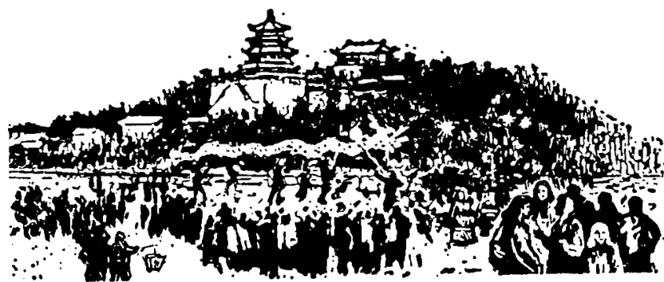
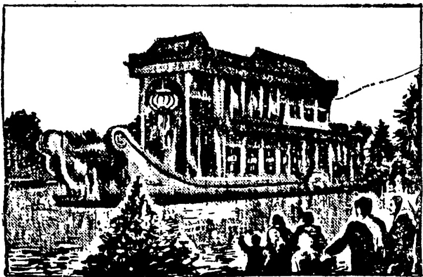

# 第三十一课 · 春节 — Lesson 31

> OCR transcription; not manually verified. Source and confidence metadata are preserved per page.

<!-- source_pdf_page: 126; source_printed_page: 116; ocr_confidence: 0.9602 -->

中国朋友请我们去公园。
这些学生正在上课（呢）。

## 一、替换练习 Substitution Drills

1. 大夫让（叫）你作什么？

大夫让（叫）我休息。

|  试表 | 吃药  |
| --- | --- |
|  打针 | 多运动  |

2. 这些学生正在作什么？

这些学生正在上课。

|  听广播 | 看电视  |
| --- | --- |
|  打排球 | 唱歌  |
|  准备节目 |   |

<!-- source_pdf_page: 127; source_printed_page: 117; ocr_confidence: 0.9896 -->

3. 他们在看杂技吗？

他们没看杂技，他们看歌舞呢。

唱歌， 跳舞

看节目，表演节目

开会， 一起谈话

学习， 玩儿

4. 你们到颐和园门口的时候，小朋友们正在作什么呢？

我们到颐和园门口的时候，他们正在放鞭炮呢。

唱歌 表演节目

照相 一起玩儿

5. 我正在看报的时候，丁文来了。

吃饭 打球 看小说 听音乐

<!-- source_pdf_page: 128; source_printed_page: 118; ocr_confidence: 0.9771 -->

## 二、课文 Text

### 春节

春节是农历的新年，是中国最大的传统节日。初三①这一天，中国朋友请我们去颐和园玩儿。

进了公园大门，看见很多小朋友，有的正在放鞭炮，有的在唱歌、跳舞，他们玩儿得高兴极了。

那天人们都放假，公园里人多极了，有工人、农民、解放军、干部②，也有很多老师和学生。他们有的在着杂技，有的

<!-- source_pdf_page: 129; source_printed_page: 119; ocr_confidence: 0.8992 -->

在听音乐，有的在一起说笑，还有的在一起吃东西。

中国朋友让我们到公园北边去看看。那儿一些农民正在表演节目。他们有的在玩龙灯，有的在跳“狮子舞”。演员们一边跳，一边喊，表演得好极了。演完，大家都热烈鼓掌，欢迎他们再演一个。

我们正在看节目的时候，听见旁边有人鼓掌。中国朋友告诉我们，那边一些运动员正在表演武术呢。

<!-- source_pdf_page: 130; source_printed_page: 120; ocr_confidence: 0.9854 -->

这一天，我们跟中国朋友一起，过得特别愉快。

## 三、生词 New Words

|  1. 让 | (动) | ràng | to let  |
| --- | --- | --- | --- |
|  2. 正 | (副) | zhèng | *an adverb indicating an action in progress*  |
|  3. 在 | (副) | zài | same as 正  |
|  4. 准备 | (动) | zhǔnbèi | to prepare  |
|  5. 杂技 | (名) | záji | acrobatics  |
|  6. 歌舞 | (名) | gēwǔ | song and dance  |
|  7. 跳舞 |  | tiào wǔ | dance  |
|  8. 表演 | (动) | biǎoyǎn | to perform  |
|  9. 开会 |  | kāi huì | to have a meeting  |
|  10. 门口 | (名) | ménkǒu | doorway  |
|  11. 放 | (动) | fàng | to let off  |
|  12. 鞭炮 | (名) | biānpào | firecrackers  |
|  13. 春节 | (名) | Chūnjié | Spring Festival  |
|  14. 新年 | (名) | xīnnián | New Year  |
|  15. 传统 | (名) | chuántǒng | tradition  |

<!-- source_pdf_page: 131; source_printed_page: 121; ocr_confidence: 0.9969 -->

|  16. 节日 | (名) jiérì | festival  |
| --- | --- | --- |
|  17. 初 | (头) chū | *prefix for the first ten days of the lunar month*  |
|  18. 请 | (动) qǐng | to invite  |
|  19. 大门 | (名) dàmén | gate  |
|  20. 有的 | (代) yóude | some  |
|  21. 解放军 | (名) jiěfàngjūn | liberation army, the PLA  |
|  22. 笑 | (动) xiào | to laugh, to smile  |
|  23. 龙灯 | (名) lóngdēng | dragon lantern  |
|  24. 狮子舞 | (名) shīziwǔ | lion dance  |
|  25. 演员 | (名) yǎnyuán | actor, actress  |
|  26. 演 | (动) yǎn | to perform  |
|  27. 热烈 | (形) rèliè | warm  |
|  28. 鼓掌 | (动) gǔzhǎng | to applaud  |
|  29. 欢迎 | (名) huān yíng | to welcome  |
|  30. 运动员 | (名) yùndòngyuán | athlete, sportsman  |
|  31. 武术 | (名) wǔshù | *wushu*, martial arts (general term for various kinds of Chinese traditional shadow boxing and fencing)  |

<!-- source_pdf_page: 132; source_printed_page: 122; ocr_confidence: 0.9908 -->

32. 特别 (形) tèbié special
33. 愉快 (形) yúkuài happy

## 补充生词 Additional Words

1. 独唱 (动) dúchàng sing a solo
2. 合唱 (动) héchàng sing in chorus
3. 烟火 (名) yānhuǒ fireworks
4. 贺年片 (名) hènianpiàn New Year's card
5. 电灯 (名) diàndēng light

## 四、注释 Notes

### ① 词头“初” The prefix 初

“初”用在数词1—10前头，可以表示农历每个月上旬的日期，公历一般不这样说。

The prefix 初 used before 1—10 indicates the first ten days of a month in the Chinese lunar calendar. It is not used this way with reference to the Gregorian calendar.

### ② “有”表示列举有 indicating enumeration.

“有”用在并列的名词前表示列举。如：“参加大会的有学生、工人、农民、干部等。”

有 used before nouns indicates enumeration, listing, e.g. 参加大会的有学生,工人,农民,干部等.

<!-- source_pdf_page: 133; source_printed_page: 123; ocr_confidence: 0.9993 -->

## 五、语法 Grammar

### 1. 兼语句 The pivotal sentence

有一种动词谓语句，谓语是由两个动词短语构成的，前一个动词的宾语又是后一个动词的施事，这种句子叫兼语句。兼语句的前一个动词常常是带有使令意义的“请”“让”“叫”等。例如：

The pivotal sentence is one in which the object of the first predicate verb is at the same time the subject of the second predicate verb. The first predicate verb is often a causative verb as 请，让，叫 etc., e.g.

我请他来我家玩儿。
他让我在这儿等他。
老师叫我翻译课文。

### 2. 动作的进行 Action in progress

要表示一个动作正在进行，可在动词前加副词“正”“在”“正在”或在句尾加语气助词“呢”。“正”“在”“正在”也可以和“呢”同时用。例如：

To indicate action in progress, an adverb such as 正，在，or 正在 should be used before the verb, or the modal particle 呢 should be used at the end of a sentence. 正，在 or 正在 can also be used together with 呢 in this construction, e.g.

他们正找你呢。
同学们在上课呢。
他们跳舞呢。

<!-- source_pdf_page: 134; source_printed_page: 124; ocr_confidence: 0.9927 -->

王大夫正在给他看病呢。

否定式用“没（有）”。“没有”单独用时“有”不能省略。例如：

The negative form is constructed with 没(有). When 没有 is used alone in a negative reply, 有 cannot be omitted, e.g.

他们在跳舞吗？

——他们没跳舞，他们唱歌呢。

（没有，他们唱歌呢。）

一个进行的动作可以发生在现在，也可以发生在过去或将来。例如：

Progressive constructions may refer to a time either in the past, at the present or in the future, e.g.

昨天他来的时候，我正听音乐呢。

（过去 in the past）

明天晚上你去找他，他一定在看电视。

## 六、练习 Exercises

### 1. 根据划线部分用疑问代词提问：

Ask questions on the underlined parts of the following sentences, using interrogative pronouns:

<!-- source_pdf_page: 135; source_printed_page: 125; ocr_confidence: 0.9827 -->

（1）我们请哈利参加篮球比赛。
（2）他请马丁从城里给他买一本新词典。
（3）讲解员让我们给展览提意见。
（4）汉斯叫我去北大（北京大学）看排球赛。
（5）他想请张老师谈谈这个问题。
（6）我们让丁文介绍一下上海的情况。
（7）丁文的哥哥打了一个电报，他让丁文明天下午去火车站接他。
（8）王大夫叫谢力去医院检查身体。

2. 把下面的词组扩展成句子（用上“…的时候，…正在…”）：
Expand the following groups of phrases into sentences, using …的时候，or…正在…：

例 Example:

去宿舍 复习课文
昨天我去他宿舍的时候，他正在
复习课文。

<!-- source_pdf_page: 136; source_printed_page: 126; ocr_confidence: 0.9924 -->

(1) 去找他 开会
(2) 给他送杂技票 准备节目
(3) 去小王家 吃晚饭
(4) 来到公园南边 表演武术
(5) 到宿舍 洗脸、刷牙
(6) 听音乐 跳舞
(7) 到公园门口 放鞭炮
(8) 找他 打电话
(9) 下雨 到我这儿来
(10) 看歌舞节目 叫我

3. 根据课文回答问题:

Answer the questions according to the text:

(1) 春节是中国的什么节日?
(2) 初三那天中国朋友请你们去哪儿玩儿?
(3) 进了公园大门, 你们看见什么了?
(4) 那天公园里的人多不多? 他们正在作什么?
(5) 请你说一说公园北边的情况。

<!-- source_pdf_page: 137; source_printed_page: 127; ocr_confidence: 0.9956 -->

(6) 你们正在看节目的时候，运动员们正在表演什么？

4. 阅读短文后，给后面的句子画符号，对的画（+），不对的画（-）。

Read the passage, and then mark the following sentences true or false, by using (+) or (-).

张新让小王初二到他家去玩儿。小王只知道张新家在鼓楼大街，但是忘了多少号。

到了鼓楼大街，小王开始一家一家地问。他找到第一家，看见一个小朋友正在门口放鞭炮，就问：

“小朋友，你家在这儿吗？”

“在这儿。”

“你有个哥哥叫张新吗？

“我没有哥哥，我有一个姐姐，她叫王红。”

小王到第二家去问：

“请问，张新家是不是在这儿？他是大学生，是我的同学。”

<!-- source_pdf_page: 138; source_printed_page: 128; ocr_confidence: 0.9902 -->

“这儿没有叫张新的，有一个张元，他不是学生，是个演员。他也不在家，出去了。”

小王到第三家去问的时候，这一家人正在看电视，电视里正在演狮子舞。他们说他们不知道张新这个人。

到了第四家，小王看见一个女同志正在洗衣服。这个女同志说，这是张新的家，张新是她弟弟。

(1) 小王找了四家才找到张新的家。

( )

(2) 到第一家的时候，张新看见一个小朋友正在屋子里放鞭炮。

( )

(3) 那个小朋友说，他有一个哥哥叫王红。( )

(4) 到第二家的时候，一个叫张元的解放军正从里边出来。

( )

<!-- source_pdf_page: 139; source_printed_page: 129; ocr_confidence: 0.9900 -->

(5) 第三家一家人正在看电视的时候，小王来了。这儿不是张新的家。（ ）

(6) 小王到第四家，正在洗衣服的女同志是张新的姐姐。（ ）

## 汉字表 Table of Chinese Characters

> **Uncertainty:** OCR of character components and stroke forms is unreliable. This section is excluded from the default retrieval corpus.

|  1 | 让 | 讠 | 讓  |
| --- | --- | --- | --- |
|   |  | 上 |   |
|  2 | 正 | 一ㄇㄒㄓ正 |   |
|  3 | 准 | 冫 | 準  |
|   |  | 隹 |   |
|  4 | 备 | 久 | 備  |
|   |  | 田 |   |
|  5 | 技 | 扌 |   |
|   |  | 支 |   |
|  6 | 舞 | 血（ㄏㄨㄥㄥㄥㄥㄥㄥ） |   |
|   |  | 舛 夕 |   |

<!-- source_pdf_page: 140; source_printed_page: 130; ocr_confidence: 0.9860 -->

|   |  |  | 牛 |   |
| --- | --- | --- | --- | --- |
|  7 | 跳 | 丑 |  |   |
|   |  | 兆 | (丿丿丿兆兆兆) |   |
|  8 | 演 | 亥 |  |   |
|   |  | 寅 | 宀 |   |
|   |  |  | 西(一西) |   |
|   |  |  | 八 |   |
|  9 | 鞭 | 革 | (一七七七七七七七七七) |   |
|   |  | 便 | 亻 |   |
|   |  |  | 更(一一一一一一一更) |   |
|  10 | 炮 | 火 |  |   |
|   |  | 包 |  |   |
|  11 | 传 | 亻 |  | 傳  |
|   |  | 专 | (一二二二二二二二) |   |
|  12 | 统 | 纟 |  | 統  |
|   |  | 充 | (一一一一一一一充) |   |
|  13 | 初 | 朳 |  |   |
|   |  | 刀 |  |   |

<!-- source_pdf_page: 141; source_printed_page: 131; ocr_confidence: 0.9904 -->

|  14 | 请 | 讠 | 請  |
| --- | --- | --- | --- |
|   |  | 青 |   |
|  15 | 军 | 冖 | 軍  |
|   |  | 车 |   |
|  16 | 笑 | 笑 |   |
|   |  | 天（一二天天） |   |
|  17 | 龙 | 一ナ九龙龙 | 龍  |
|  18 | 狮 | 牙（丿牙牙） | 獅  |
|   |  | 师 |   |
|  19 | 烈 | 列 | 歹（一歹）  |
|   |  |  | 刂  |
|   |  | 爪 |   |
|  20 | 鼓 | 壺 | 卩  |
|   |  |  | 豆（一二三三豆）  |
|   |  | 支 |   |
|  21 | 灯 | 火 |   |
|   |  | 丁 |   |
|  22 | 掌 | 堂 |   |
|   |  | 手 |   |

<!-- source_pdf_page: 142; source_printed_page: 132; ocr_confidence: 0.8119 -->

|  23 | 迎 | 卯 ( 丿 卯 卯 )  |   |
| --- | --- | --- | --- |
|   |  | 亠  |   |
|  24 | 武 | 一 二 千 千 丘 丘 武 武  |   |
|  25 | 术 | 木 术 | 衛  |
|  26 | 特 | 斗  |   |
|   |  | 寺  |   |
|  27 | 愉 | 忄  |   |
|   |  | 俞 | 入 ( 丿 入 入 )  |
|   |  | 刑 ( 月 刑 )  |   |
