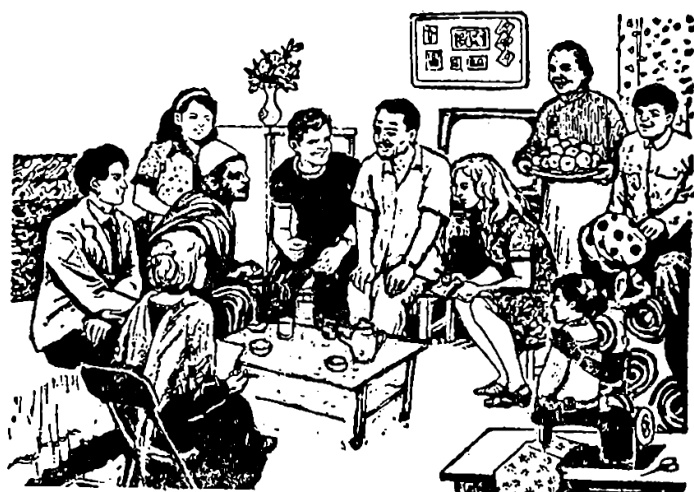

# 第三十二课 · 访问农民家庭 — Lesson 32

> OCR transcription; not manually verified. Source and confidence metadata are preserved per page.

<!-- source_pdf_page: 143; source_printed_page: 133; ocr_confidence: 0.9835 -->

桌子上放着收音机。

墙上挂着七、八张照片。

## 一、替换练习 Substitution Drills

1. 桌子上放着什么？

桌子上放着收音机。

衣柜上， 一只箱子

衣柜里， 一些衣服

桌子两边， 两把椅子

小桌上， 收录机

2. 窗户开着没有？

窗户开着呢。

<!-- source_pdf_page: 144; source_printed_page: 134; ocr_confidence: 0.9981 -->

窗户没开着。

门
箱子
衣柜

收音机
录音机
电视机

3. 他们坐着看报。

站，看球赛
笑，谈话
走，去清华大学
跑，去操场

4. 孩子们唱着歌在路上走。

跳，舞， 欢迎客人
穿，新衣服，去公园
看，书， 回答问题

5. 墙上挂着什么？
墙上挂着几张画儿。

两、三，地图
十几， 照片
四、五，画片

<!-- source_pdf_page: 145; source_printed_page: 135; ocr_confidence: 0.9833 -->

6. 这些屋子能住多少人？

这些屋子能住五、六十个人。

|  十五、六 | 几百  |
| --- | --- |
|  七十几 | 八十多  |

## 二、课文 Text

### 访问农民家庭

十多个外国朋友，访问了农民王国华的家。

王国华和他爱人去劳动了，他父亲和母亲在家。看见外国朋友来了，他们很高兴，握着客人们的手说：“欢迎，欢迎！”

他们请客人到屋里坐。屋子的门和窗户都开着，屋子里很干净，也很整齐。

外边的屋子里，中间放着一张桌子。桌子两边有几把椅子，桌子上放着电视机。

里边是王国华和他爱人住的屋子。墙

<!-- source_pdf_page: 146; source_printed_page: 136; ocr_confidence: 0.9971 -->

上挂着几张画儿和七、八张照片。床的左边是桌子，右边是一个衣柜。桌子上放着收音机。床对面放着两只箱子。王国华的小女儿，穿着一件红毛衣，正坐在床上玩儿。她看见客人，立刻高兴地下床来，对客人们说：“叔叔阿姨$^{①}$好！”

王国华的爸爸给客人们介绍了一下儿他家的情况。他说：“这几年大家生活好了，今年又是丰收。手里有了钱，盖了不少新房子，我们家的房子也是新盖的。现在大家都积极劳动，努力建设新农村。”

客人要走的时候，王国华的爸爸笑着

<!-- source_pdf_page: 147; source_printed_page: 137; ocr_confidence: 0.9973 -->

说：“欢迎你们以后再来。”

## 三、生词 New Words

|  1. 放 | (动) | fàng | to put, to place  |
| --- | --- | --- | --- |
|  2. 着 | (助) | zhe | *an aspect particle*  |
|  3. 衣柜 | (名) | yǐguì | wardrobe  |
|  4. 只 | (量) | zhǐ | *a measure word for some utensils, boats, animals, etc.*  |
|  5. 箱子 | (名) | xiāngzi | suitcase, trunk  |
|  6. 收录机 | (名) | shōulùjǐ | radio cassette recorder  |
|  7. 孩子 | (名) | háizi | child  |
|  8. 墙 | (名) | qiáng | wall  |
|  9. 挂 | (动) | guà | to hang  |
|  10. 照片 | (名) | zhàopiàn | photo  |
|  11. 住 | (动) | zhù | to live  |
|  12. 多 | (数) | duō | many, more than  |
|  13. 访问 | (动) | fǎngwèn | to visit  |
|  14. 家庭 | (名) | jiātíng | family  |
|  15. 王国华 | (专) | Wáng Guóhuá | Wang Guohua, *a person's name*  |

<!-- source_pdf_page: 148; source_printed_page: 138; ocr_confidence: 0.9868 -->

16. 爱人 (名) àirén husband or wife
17. 劳动 (动) láodòng to do physical labour
18. 父亲 (名) fùqin father
19. 母亲 (名) mǔqin mother
20. 整齐 (形) zhěngqí neat
21. 女儿 (名) nǚ'ér daughter
22. 立刻 (副) likè at once
23. 叔叔 (名) shūshu uncle
24. 阿姨 (名) āyí aunt
25. 生活 (名) shēnghuó life
26. 盖 (动) gài to build
27. 房子 (名) fángzi house
28. 丰收 (动、名)fēngshōu to have a good harvest; harvest
29. 积极 (形) jījí active
30. 建设 (动) jiànshè to construct

## 补充生词 Additional Words

1. 院子 (名) yuànzi courtyard
2. 厨房 (名) chúfáng kitchen
3. 浴室 (名) yùshì bathroom

<!-- source_pdf_page: 149; source_printed_page: 139; ocr_confidence: 0.9935 -->

4. 厕所 (名) cèsuǒ toilet
5. 卫生间 (名) wèishēngjiān toilet

## 四、注释 Notes

### ①“叔叔、阿姨”

中国儿童对跟自己的父、母年纪差不多、没有亲属关系的男人、妇女的亲切的称呼。

叔叔 is a polite form of address used by a young person or child for a man about his or her father's age, and similarly 阿姨 for a woman about his or her mother's age.

## 五、语法 Grammar

### 1. 动态助词“着” The aspectual particle 着

“着”用在动词后，表示动作或状态的持续。例如：

The aspectual particle 着 may be used after a verb to show the continuation of an action or a state, e.g.

桌子上放着收音机。

孩子们都穿着好看的新衣服。

否定式用“没（有）…着”。例如：

The negative form is constructed with 没（有）…着, e.g.

屋子的窗户开着，门没（有）开着。

墙上没挂着照片，只挂着一张地图。

<!-- source_pdf_page: 150; source_printed_page: 140; ocr_confidence: 0.9974 -->

正反疑问式是：

The affirmative-negative question form is:

录音机开着没有？

你带着词典没有？

动词带动态助词“着”，也可以表示行为的方式。例如：

The aspectual particle 着 may also be used to indicate the manner in which an action is performed, e.g.

她们站着唱歌。

展览馆比较近，我们走着去吧。

动态助词“着”也可以和表示动作进行的“正”“在”“呢”等连用。例如：

The aspectual particle 着 can be used together with 正，在 or 呢 to show action in progress, e.g.

他正吃着饭呢。

外边下着雨呢，我们不出去了。

2. 概数 Approximate numbers

汉语里表示概数的方法有以下几种：

In Chinese, there are several ways to show approximate numbers:

(1) 把两个相邻的数目连在一起用。例如：

Putting two consecutive numbers together, e.g.

墙上挂着三、四张照片。

他们班有二、三十个学生。

<!-- source_pdf_page: 151; source_printed_page: 141; ocr_confidence: 0.9984 -->

(2) 用“几”表示十以下的不确定的数目。例如：

Using 几 to indicate an indefinite number under ten, e.g.

屋子里有几张桌子。

书架上放着几十本中文书。

我们已经学了几百个生词了。

(3) 数量词后用“多”，表示不确定的零数。例如：“二十多”“一百多”。“多”表示整数时，用在量词前。例如：

多 can be used after a numeral to indicate “more than”, e.g. 二十多，一百多。When 多 is used to represent a whole number, it is placed before the measure word, e.g.

这件衬衣十多块钱。

二十多年以前，他也是个学校的学生。

“多”表示整数以下的零数时，用在量词之后。例如：

When 多 is used to represent an odd number (i.e. less than one), it is placed after the measure word, e.g.

这件衬衣十块多钱。

他买了三斤多水果。

3. “再”和“又”再 and 又

“再”和“又”都表示动作的重复，但是二者是不同的。

Both 再 and 又 indicate the repetition of an action, but there are some differences.

“又”表示动作或情况的重复已经实现。如：

又 indicates the repetition of an action which has already

<!-- source_pdf_page: 152; source_printed_page: 142; ocr_confidence: 0.9954 -->

taken place, e.g.

他昨天来了，今天又来了。

今年又是丰收。

一个动作或情况虽然尚未重复，但是说话人非常肯定重复一定实现时，也用“又”。如：

又 can also be used to indicate the repetition of an action or a situation which has not yet been repeated, but which the speaker is absolutely sure will be repeated, e.g.

明天又是星期六了。

安娜回国以后，又可以见到玛丽了。

“再”表示动作或情况的重复尚未实现。如：

再 indicates the repetition which has not yet happened, e.g.

欢迎你们以后再来。

他回国了。他说明年再到中国来。

## 六、练习 Exercises

1. 用适当的动词加“着”填空：

Fill in the blanks with suitable verbs and 着：

(1) 墙上____几张照片。

(2) 桌子上____一个收录机。

(3) 屋子的门____，但是窗户____。

<!-- source_pdf_page: 153; source_printed_page: 143; ocr_confidence: 0.9961 -->

(4) 那个孩子——一件红毛衣，特别好看。
(5) 这几本书都是哈利的，书上都——他的名字。
(6) 公园离这儿不远，不用坐车，也不用骑车，我们可以——去。
(7) 我们到了门口，工作人员——我们的手说：“欢迎，欢迎！”
(8) 外边——风，——雨，不要出去了。

2. 用概数加名量词或动量词填空：

Fill in the blanks with approximate numbers plus nominal or verbal measure words:

(1) 到中国以后，他们访问过——农民家庭。
(2) 他回国的时候，带了——箱子。
(3) 衣柜里挂着——衣服。
(4) 门口站着——孩子，他们都穿着干净、整齐的衣服。
(5) 他用了——钱买了一个收录机。

<!-- source_pdf_page: 154; source_printed_page: 144; ocr_confidence: 0.9958 -->

(6) 今天他家请客, 请了____客人。
(7) 长城离这儿有____公里。
(8) 这篇课文我念了____, 还没有念熟。

3. 根据课文回答问题:

Answer the questions according to the text:

(1) 谁访问了农民王国华的家?
(2) 王国华和他爱人在不在家? 谁在家?
(3) 王国华的父亲和母亲为什么很高兴?
(4) 他们握着客人们的手说什么?
(5) 他们的屋子怎么样?
(6) 外边的屋子有些什么东西?
(7) 里边是谁的屋子? 有些什么东西?
(8) 王国华的小女儿穿着一件什么衣服? 她对客人说什么?
(9) 王国华家的生活情况怎么样?
(10) 客人要走的时候, 王国华的父亲说什么?

<!-- source_pdf_page: 155; source_printed_page: 145; ocr_confidence: 0.9953 -->

### 4. 阅读短文后回答问题：

Read the passage and answer the questions:

丁文的哥哥在北京工作，他父亲、母亲都在上海。上个月他母亲来北京，住在他哥哥家。

丁文请小王去他哥哥家玩儿。星期日，小王骑着自行车去了。看见小王来了，丁文高兴地说：“快到屋里坐。”

他们先走进外边的屋子，这个屋子的门和窗户都开着。屋子里很干净，东西不太多，但是很整齐。屋子中间放着一张桌子，桌子两边有两把椅子。桌子上放着水果、糖和汽水。

一会儿，丁文的妈妈笑着从外边进来了。丁文立刻站起来对妈妈说：“这是我的同学。”丁文的妈妈握着小王的手说：“你叫什么名字？”小王没听懂她的话。丁文说：“我妈妈是上海人，不会说北京话，她问你叫什么名字？”小王笑着说：“我叫王中。”

<!-- source_pdf_page: 156; source_printed_page: 146; ocr_confidence: 0.9992 -->

他们正谈着话，丁文的哥哥从里边的屋子走出来。他哥哥说：“到里屋看电视吧，节目就要开始了。”

里屋的门和窗户也开着。墙上挂着他们一家人的照片。床旁边放着一个大衣柜。衣柜对面有一个书架，书架上放着很多书、杂志和画报，有中文的，也有外文的。

十点钟，电视节目开始了，有歌舞，有杂技。演员们都演得不错。

下午三点钟，小王要走了。丁文一家人都热情地说：“欢迎你以后常来。”

（1）丁文哥哥家的两个屋子里有些什么东西？
（2）丁文的母亲跟小王说话，小王听懂了吗？为什么？
（3）电视节目什么时候开始？有什么节目？
（4）小王走的时候是几点钟？丁文一家人对他说什么？

<!-- source_pdf_page: 157; source_printed_page: 147; ocr_confidence: 0.9497 -->

## 汉字表 Table of Chinese Characters

> **Uncertainty:** OCR of character components and stroke forms is unreliable. This section is excluded from the default retrieval corpus.

|  1 | 着 | 芦 ( 丶 丶 丶 丶 芦 )  |   |   |
| --- | --- | --- | --- | --- |
|   |  | 目  |   |   |
|  2 | 箱 | 竹  |   |   |
|   |  | 相 | 木  |   |
|   |  |  | 目  |   |
|  3 | 孩 | 子  |   |   |
|   |  | 亥  |   |   |
|  4 | 墙 | 土 |   | 墙  |
|   |  | 齒 | 虫 ( 一 十 十 卩 虫 )  |   |
|   |  |  | 回  |   |
|  5 | 挂 | 扌 |   | 掛  |
|   |  | 圭 ( 土 圭 )  |   |   |
|  6 | 住 | 亻  |   |   |
|   |  | 主  |   |   |
|  7 | 访 | 讠 |   | 訪  |
|   |  | 方  |   |   |
|  8 | 庭 | 广  |   |   |
|   |  | 廷 ( 一 二 千 圭 廷 廷 )  |   |   |

<!-- source_pdf_page: 158; source_printed_page: 148; ocr_confidence: 0.9963 -->

|  9 | 劳 | 艹 | 劳  |
| --- | --- | --- | --- |
|   |  | 冖 |   |
|   |  | 力 |   |
|  10 | 父 |  |   |
|  11 | 亲 | 立 | 親  |
|   |  | 木 |   |
|  12 | 母 |  |   |
|  13 | 整 | 敕 | 束  |
|   |  |  | 攵  |
|   |  | 正 |   |
|  14 | 齐 | 文 | 齊  |
|   |  | 丿 |   |
|  15 | 立 |  |   |
|  16 | 叔 | よ（上よ） |   |
|   |  | 又 |   |
|  17 | 阿 | 阡 |   |
|   |  | 可 |   |
|  18 | 姨 | 女 |   |
|   |  | 夷（一二三三夷夷） |   |

<!-- source_pdf_page: 159; source_printed_page: 149; ocr_confidence: 0.9951 -->

|  19 | 活 | 氵 |   |
| --- | --- | --- | --- |
|   |  | 舌 |   |
|  20 | 盖 | 盖 | 盖  |
|   |  | 皿 |   |
|  21 | 丰 | 一二三丰 | 豐  |
|  22 | 积 | 积 | 積  |
|   |  | 只 |   |
|  23 | 建 | 聿 |   |
|   |  | 夂 |   |
|  24 | 設 | 設 | 設  |
|   |  | 足 |   |
