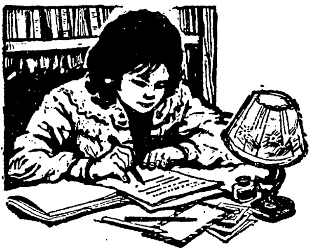
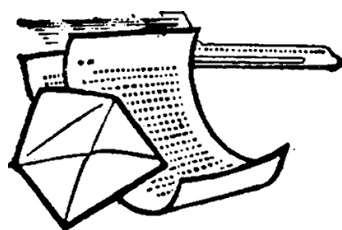

# 第三十三课 · 一封信 — Lesson 33

> OCR transcription; not manually verified. Source and confidence metadata are preserved per page.

<!-- source_pdf_page: 160; source_printed_page: 150; ocr_confidence: 0.9833 -->

我们坐飞机坐了四个小时。
他写了二十五分钟汉字。
她毕业已经两年了。

## 一、替换练习 Substitution Drills

中午，我从十二点三刻睡到一点三刻，我睡了一个小时。

1. 刚才你睡了几个小时？
刚才我睡了一个小时。

复习，两
劳动，三
工作，四
等，半

2. 比赛进行了多长时间？
比赛进行了一个半钟头。

<!-- source_pdf_page: 161; source_printed_page: 151; ocr_confidence: 0.9854 -->

代表大会，一个星期
讨论会，一个上午
节目表演，两个半钟头
参观，三个钟头

3. 你们坐飞机坐了多①长时间？
我们坐飞机坐了四个小时。

坐火车，二十四个小时
坐汽车，三刻钟
划船，一个半小时
开会，两个小时

4. 你念了多长时间（的）课文？
我念了二十五分钟（的）课文。

写，汉字，半个钟头
学，汉语，三个月
看，电视，一个半钟头
打，球，四十分钟

<!-- source_pdf_page: 162; source_printed_page: 152; ocr_confidence: 0.9661 -->

5. 昨天的练习你作了多长时间？

昨天的练习我作了一个小时。

那本小说，看，两天

这些句子，翻译，四十分钟

那段录音，听，半个小时

6. 她毕业已经差不多两年了。

回国 来北京

去南方 在北方工作

## 二、课文 Text

### 一封信

<!-- source_pdf_page: 163; source_printed_page: 153; ocr_confidence: 0.9957 -->

洋子同学：

你好！来中国以后，没有立刻给你写信，请原谅。你最近忙不忙？身体好吗？

到中国已经三个月了。从东京到北京，我们坐飞机坐了四个多小时。到了学校，没有立刻上课，先休息了几天。我们到北京有名的公园玩了几次，在颐和园、北海和天坛照了一些照片，现在寄给你几张。

最近我们学习比较紧张。每天上午上四节汉语课，每节课五十分钟。中午休息一个小时。下午有时候听录音、看录相，有时候有辅导。晚上要在宿舍复习三个钟头。我们先在北京语言学院学一年汉语，以后再去别的大学学习。

刚到北京的时候，我不太习惯这儿的天气，病了几天。现在我比较注意锻炼身体，早上跑二十分钟步，下午打一个小时

<!-- source_pdf_page: 164; source_printed_page: 154; ocr_confidence: 0.9932 -->

球，或者参加别的体育活动。

最近有什么新消息？学校有什么变化？请下次来信介绍一下。

时间不早了，就写到这儿。等着你的回信。

祝

学习进步，身体健康！

你的朋友

友子 2月15日晚

## 三、生词 New Words

|  1. 进行 | (动) | jìnxíng | t c y , , on  |
| --- | --- | --- | --- |
|  2. 多 | (副) | duō | how  |
|  3. 长 | (形) | cháng | long  |
|  4. 时间 | (名) | shíjiān | time  |
|  5. 钟头 | (名) | zhōngtóu | hour  |

<!-- source_pdf_page: 165; source_printed_page: 155; ocr_confidence: 0.9977 -->

|  6. 代表 | (名) | dàibiǎo | representative  |
| --- | --- | --- | --- |
|  7. 讨论 | (动) | tǎolùn | to discuss  |
|  8. 划船 |  | huá chuán | to go boating, row  |
|  9. 段 | (量) | duàn | section, part, paragraph  |
|  10. 毕业 |  | bìyè | to graduate; graduation  |
|  11. 差不多 | (形) | chàbuduō | more or less  |
|  12. 南方 | (名) | nánfāng | the South  |
|  13. 北方 | (名) | běifāng | the North  |
|  14. 封 | (量) | fēng | *a measure word for letters*  |
|  15. 信 | (名) | xìn | letter  |
|  16. 洋子 | (专) | Yángzí | Ioko, *a person's name*  |
|  17. 原谅 | (动) | yuánliàng | to excuse  |
|  18. 最近 | (名) | zuìjìn | recent  |
|  19. 东京 | (专) | Dōngjīng | Tokyo  |
|  20. 有名 | (形) | yǒumíng | famous  |
|  21. 寄 | (动) | jì | to post, to mail  |
|  22. 比较 | (副) | bíjiào | comparatively  |
|  23. 紧张 | (形) | jìnzhāng | intense, busy  |
|  24. 录相 |  | lùxiàng | video  |

<!-- source_pdf_page: 166; source_printed_page: 156; ocr_confidence: 0.9814 -->

|  25. 辅导 | (名、动) fǔdǎo | coaching; to coach  |
| --- | --- | --- |
|  26. 习惯 | (动、名) xíguàn | to be used to; habit  |
|  27. 活动 | (名) huódòng | activity  |
|  28. 消息 | (名) xiāoxi | news  |
|  29. 变化 | (名、动) biànhuà | change; to change  |
|  30. 回信 | (名) huíxìn | letter in reply  |
|  31. 祝 | (动) zhù | to wish  |
|  32. 进步 | (形) jìnbù | progressive  |
|  33. 健康 | (形) jiànkāng | healthy  |
|  34. 友子 | (专) Yǒuzí | Ponoko, *a person's name*  |

## 补充生词 Additional Words

|  1. 邮票 | (名) yóupiào | stamp  |
| --- | --- | --- |
|  2. 信封 | (名) xìnfēng | envelope  |
|  3. 地址 | (名) dìzhí | address  |
|  4. 挂号 | guàhào | registered  |
|  5. 收信人 | shōuxìnrén | recipient  |
|  6. 寄信人 | jìxìnrén | sender  |

## 四、注释 Notes

①副词“多” The adverb 多

副词“多”用在形容词（多为单音节的）前，可以询问程度

<!-- source_pdf_page: 167; source_printed_page: 157; ocr_confidence: 0.9897 -->

或数量。“多”前可以加“有”。如：“那座楼（有）多高？”
“你学汉语学了多长时间？”

The adverb 多 is used before a monosyllabic adjective to inquire about degree or quantity. 多 can be preceded by 有, e.g. 那座楼（有）多高？你学汉语学了多长时间？

## 五、语法 Grammar

### 1. 时量补语（一） The complement of duration (1)

时量补语用来说明一个动作或一种状态持续多长时间。例如：

The complement of duration shows the length of time an action or a state continues, e.g.

他病了两天，没有来上课。

这课课文他念了二十分钟。

如果动词后带宾语，一般要重复动词，时量补语放在重复的动词后边。例如：

When the verb takes an object, the verb is usually repeated, and the complement of duration is put after its second occurrence. e.g.

洋子学汉语学了半年。

我们看电视看了一个半小时。

副词或能愿动词要放在重复的动词之前。如：

An adverb or an auxiliary verb must be placed before the repetition of the verb, e.g.

昨天我们打球只打了半个小时。

<!-- source_pdf_page: 168; source_printed_page: 158; ocr_confidence: 0.9976 -->

他写汉字要写两个钟头。

如果宾语不是人称代词，表示时间的词语还可以放在动词和宾语中间（它和宾语之间可以加“的”）。例如：

Provided the object is not by a personal pronoun, the expression of duration can be put between the verb and the object which is sometimes preceded by 的，e.g.

我听了二十分钟（的）广播。

我们上了四个小时（的）课。

### 2. 时量补语（二） The complement of duration (2)

有些动词表示的动作是不能持续的，如“毕业”“离开”“来”“去”等。这类动词要表示动作发生到某时（或说话时）的一段时间，也可以用时量补语。例如：

Some verbs like 毕业，离开，来 or 去 etc. indicate events which cannot be continuous. These verbs may still take a complement of duration to show the length of time elapsed from the occurrence of the event to the time when the speaker talks about it or to some other point in time, e.g.

他大学毕业已经三年了。

他来的时候，我已经起床一个小时了。

### 3. “给”作结果补语给 as a complement of result

“给”作结果补语，表示施事者通过动作把某一事物交付某人或集体。例如：

给 used as a resultative complement shows that something has been given or transferred to a person or body of people

<!-- source_pdf_page: 169; source_printed_page: 159; ocr_confidence: 0.9859 -->

through the action, denoted by the main verb, e.g.

他送给我一张照片。

那个大学寄给我们学校很多书。

## 六、练习 Exercises

1. 按照下面的例子改写句子:

Rewrite the sentences following the example:

例 Example:

昨天晚上我看电视看了两个小时。

昨天晚上我看了两个小时电视。

(1) 晚饭以后，我常常听音乐听半个小时。
(2) 大学毕业以后，他在这儿教法语教了四年。
(3) 上午他们开会开了半天。
(4) 上星期日天气不好，刮风刮了一天。
(5) 星期六下午她写信写了一个半小时，一共写了三封。

例 Example:

<!-- source_pdf_page: 170; source_printed_page: 160; ocr_confidence: 0.9956 -->

今天我预习了二十分钟生词。

今天我预习生词预习了二十分钟。

(6) 玛丽在公园划了一个小时船。
(7) 她跳了两个小时舞，还想再跳。
(8) 外边下了一个小时雨了，还在下。
(9) 他发了三天烧了，现在病还没好。
(10) 昨天我在他那儿看了一个半小时的录相。

2. 选择适当的词组填入句子空格中，然后就时间补语提问：

Fill in the blanks, with the phrases given, and then ask questions based on the complement of duration:

例 Example:

昨天下午我看足球赛看了三个钟头，没去打排球。

昨天下午你看足球赛看了多长时间？

昨天下午你看了多长时间足球赛？

住了十年了

教了四年书了

进行了两个半小时

爬山爬了三刻钟

<!-- source_pdf_page: 171; source_printed_page: 161; ocr_confidence: 0.9949 -->

辅导一个小时 写两个钟头毛笔字
开了两个小时讨论会

(1) 星期日上午他在公园里_______。
(2) 他在北京_______，已经习惯这儿的生活了。
(3) 毕业以后，他已经_______，是个很不错的老师了。
(4) 代表们_______。
(5) 排球赛_______。
(6) 每天下午老师都给我们_______。
(7) 他很喜欢写汉字，每天都_______。

3. 根据课文回答问题：

Answer the questions according to the text:

(1) 友子给谁写信？
(2) 谁是收信人？谁是寄信人？
(3) 友子到中国有多长时间了？
(4) 从东京到北京要坐几个小时的飞机？
(5) 友子到北京以后休息了没有？
(6) 友子寄给洋子一些什么照片？

<!-- source_pdf_page: 172; source_printed_page: 162; ocr_confidence: 0.9969 -->

(7) 请你说一说友子一天的学习生活。
(8) 友子现在在哪儿学习汉语？她要学多长时间？以后再到哪儿去学习。
(9) 友子刚刚到北京的时候，为什么病了？
(10) 现在友子注意锻炼身体吗？她怎么锻炼？

4. 根据实际情况回答问题：

Give your own answers to the questions:

(1) 你每星期上几个小时汉语课？
(2) 你已经学了多长时间汉语了？
(3) 你准备学几年汉语？
(4) 你每天什么时候念课文？念多长时间？
(5) 你每天什么时候锻炼身体？锻炼多长时间？
(6) 你学完第一本汉语书已经多长时间了？

<!-- source_pdf_page: 173; source_printed_page: 163; ocr_confidence: 0.9980 -->

## 汉字表 Table of Chinese Characters

> **Uncertainty:** OCR of character components and stroke forms is unreliable. This section is excluded from the default retrieval corpus.

|  1 | 代 | 亻 |   |
| --- | --- | --- | --- |
|   |  | 亠 |   |
|  2 | 讨 | 讠 | 討  |
|   |  | 寸 |   |
|  3 | 论 | 讠 | 論  |
|   |  | 合（丿入合） |   |
|  4 | 划 | 戈 |   |
|   |  | 刂 |   |
|  5 | 段 | 昴 |   |
|   |  | 艮 |   |
|  6 | 毕 | 比 | 畢  |
|   |  | 十 |   |
|  7 | 封 | 圭 |   |
|   |  | 寸 |   |
|  8 | 信 | 亻 |   |
|   |  | 言 |   |
|  9 | 洋 | 沁 |   |
|   |  | 羊（丿乂乂乂乂羊） |   |

<!-- source_pdf_page: 174; source_printed_page: 164; ocr_confidence: 0.9901 -->

|  10 | 原 |   |   |
| --- | --- | --- | --- |
|  11 | 諒 | i | 諒  |
|   |  | 京  |   |
|  12 | 寄 | 宀  |   |
|   |  | 奇 | 大  |
|   |  |  | 可  |
|  13 | 较 | 车 | 較  |
|   |  | 交（丶丶丶丶丶交）  |   |
|  14 | 紧 | 叹（𠂇） | 緊  |
|   |  | 系  |   |
|  15 | 辅 | 车 | 輔  |
|   |  | 甫（一厂丶丶丶丶丶甫）  |   |
|  16 | 导 | 已 | 導  |
|   |  | 寸  |   |
|  17 | 慣 | 忄 | 慣  |
|   |  | 贯 | 贯  |
|   |  |  | 贝  |
|  18 | 消 | 汀  |   |
|   |  | 肖（丶丶丶丶丶肖肖肖）  |   |

<!-- source_pdf_page: 175; source_printed_page: 165; ocr_confidence: 0.9851 -->

|  19 | 变 | ホ | 變  |
| --- | --- | --- | --- |
|   |  | 又 |   |
|  20 | 化 |  |   |
|  21 | 祝 | ネ |   |
|   |  | 兄 | 口  |
|   |  |  | 儿  |
|  22 | 健 | 亻 |   |
|   |  | 建 |   |
|  23 | 康 | 广 |   |
|   |  | 束（フヨヨ中中中中中） |   |
