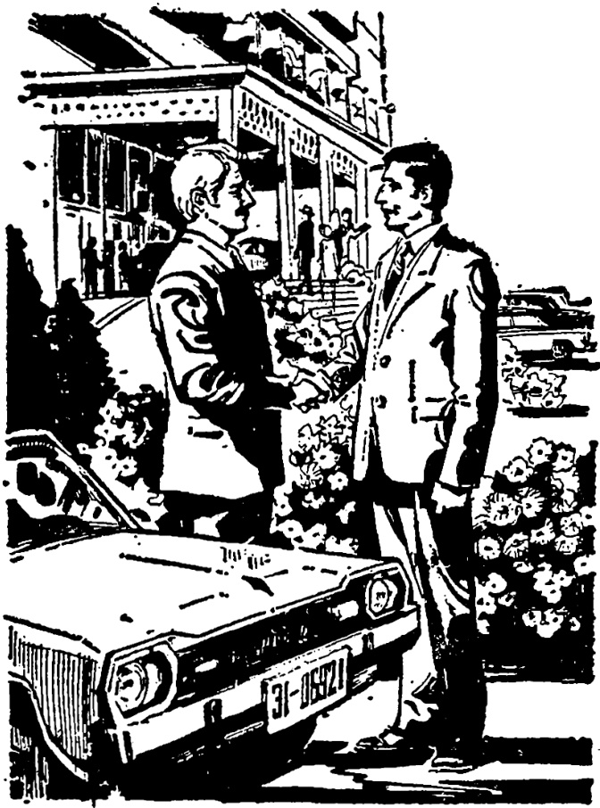

# 第三十四课 · 遇见老朋友 — Lesson 34

> OCR transcription; not manually verified. Source and confidence metadata are preserved per page.

<!-- source_pdf_page: 176; source_printed_page: 166; ocr_confidence: 0.9865 -->

张力是从上海来的。
他是去年毕业的。

## 一、替换练习 Substitution Drills

1. 你是什么时候来的？
我是今年九月来的。

|  去年十月 | 上月二十五号  |
| --- | --- |
|  昨天下午 | 前天晚上  |

2. 张力是哪儿来的？
张力是从上海来的。

|  南方 | 东北  |
| --- | --- |
|  工厂 | 农村  |

3. 安娜是不是坐飞机来的？
她不是坐飞机来的，是坐火车来的。

<!-- source_pdf_page: 177; source_printed_page: 167; ocr_confidence: 0.9900 -->

坐车①， 骑自行车
坐地铁， 走着
坐公共汽车，坐出租汽车
一个人， 跟代表团一起

4. 国际足球赛是在哪儿举行的？
是在北京举行的。

运动会， 学校的运动场
毕业典礼， 礼堂
学术报告会， 研究所
轻工业展览会， 天津

5. 他是什么时候毕业的？
他是去年毕业的。

参观展览，前天
参加比赛，上星期
到中国， 前年

<!-- source_pdf_page: 178; source_printed_page: 168; ocr_confidence: 0.9838 -->

## 二、课文 Text

### 遇见老朋友

星期日，汉斯在北京饭店门口遇见了老朋友格林。

汉斯：格林，你好！你是什么时候来中国的？

格林：我是上月二十五号来的，在上海住了一个星期，是前天到的北京。

汉斯：你是坐飞机从上海来的吗？

格林：不是坐飞机来的，是坐火车来的。

汉斯：你是一个人来的吗？

格林：不是，我是跟代表团一起来的，我负责代表团的翻译工作。

汉斯：你大学已经毕业了吗？

格林：是的，我是今年夏天毕业的。现在在一个研究所工作。

汉斯：你们代表团准备在中国住多长时间？

格林：代表团团长说，大概要住一个月。

168\*

<!-- source_pdf_page: 179; source_printed_page: 169; ocr_confidence: 0.9985 -->

北京正在举行一个国际展览会。参加这个展览会的代表团，是从各个国家②来的。会上还将进行学术讨论，我们团长准备了一篇报告。

汉斯：你们的代表团就住在北京饭店吗？

格林：是的，我的房间是1216号③。

<!-- source_pdf_page: 180; source_printed_page: 170; ocr_confidence: 0.9977 -->

到我房间里坐坐吧，休息一下，喝杯茶。我还要请你介绍介绍北京的情况呢！

汉斯：有位同学在里边等我，我是跟他一起来的。我先去告诉他一下再去找你。

格林：好吧，我在房间等你。

## 三、生词 New Words

|  1. 前天 | (名) qiántiān | the day before yesterday  |
| --- | --- | --- |
|  2. 东北 | (专) Dōngběi | Northeast China  |
|  3. 车 | (名) chē | vehicle  |
|  4. 地铁 | (名) dìtiě | subway, underground railway  |
|  5. 出租汽车 | chūzū qìchē | taxi  |
|  6. 代表团 | (名) dàibiǎotuán | delegation  |
|  7. 国际 | (名) guójì | international  |
|  8. 举行 | (动) jǔxíng | to hold  |
|  9. 运动会 | (名) yùndònghuì | sports meet  |

<!-- source_pdf_page: 181; source_printed_page: 171; ocr_confidence: 0.9949 -->

10. 运动场 (名) yùndòngchǎng sports ground
11. 典礼 (名) diǎnlí ceremony
12. 学术 (名) xuéshù learning, academic, science
13. 报告 (名、动) bàogào report; to give a report
14. 研究所 (名) yánjiūsuǒ research institute
15. 轻工业 (名) qīnggōngyè light industry
16. 前年 (名) qiánnián the year before last
17. 遇见 yùjiàn to meet
18. 老 (形) lǎo old
19. 北京饭店 (专) Běijīng Fàndiàn Beijing Hotel
20. 格林 (专) Gélín Green
21. 负责 (动) fùzé to be responsible for
22. 团长 (名) tuánzhǎng head of a delegation
23. 大概 (副) dàgài probably, approximately
24. 各 (代) gè each
25. 国家 (名) guójiā state, country
26. 将 (副) jiāng will
27. 喝 (动) hē to drink
28. 杯 (量) bēi cup, glass

<!-- source_pdf_page: 182; source_printed_page: 172; ocr_confidence: 0.9916 -->

29. 茶 (名) chá tea

## 补充生词 Additional Words

1. 服务员 (名) fúwùyuán attendant
2. 服务台 (名) fúwùtái information desk
3. 电梯 (名) diàntī elevator, lift
4. 餐厅 (名) cāntīng dining-hall
5. 咖啡 (名) kāfēi coffee

## 四、注释 Notes

### ① “坐车”

“车”是各种车辆的总称。在具体的语言环境里，可以指汽车、公共汽车、火车、自行车等。

车 is a general name meaning “vehicle”. It may refer to a car, a bus, a train or a bicycle according to the specific context.

### ② “各”

指代词“各”指某一范围内的所有个体。用在名词或量词前。如：“各家”“各地”“各个学校”“各个工厂”等。

The demonstrative pronoun 各 used before a noun or a measure word refers to every individual entity within a certain scope, e.g. 各家, 各地, 各个学校, 各个工厂, etc.

### ③ “1216号” “The number 1216”

在号码中，“1”为了避免与“7”读音相混，常读作“yāo”。

In counting, 1 is often read as yāo in order to avoid the

<!-- source_pdf_page: 183; source_printed_page: 173; ocr_confidence: 0.9909 -->

confusion between 1 and 7.

## 五、语法 Grammar

### 1. “是…的” 格式 The construction 是…的

对一个已经发生了的动作，要强调说明动作发生的时间、地点、或动作的方式等，就用“是…的”这个格式。“是”放在要强调说明的词语前（也可以省略），“的”放在句尾。例如：

The time, place or manner of an action which has taken place can be emphasized by the construction 是…的. 是 (sometimes optional) is put before the word to be emphasized, and 的 at the end of the sentence, e.g.

格林是前天来的。

展览会是在北京举行的。

他们是跟代表团一起来的。

如果动词有宾语，宾语是名词时，常常放在“的”后。例如：

If there is any nominal object, it is often put after 的, e.g.

他们是在公园照的相。

我们是坐飞机去的上海。

宾语也可以在“的”前，尤其宾语是代词时，更是如此。例如：

However, the object may also be placed before 的. This is especially common with a pronominal object, e.g.

<!-- source_pdf_page: 184; source_printed_page: 174; ocr_confidence: 0.9869 -->

他是一九八六年上大学的
我是在礼堂门口遇见他的。

否定式是“不是…的”，“是”不能省略。如：

The negative form of the construction 是…的 is 不是…的，
in which 是 can never be omitted, e.g.

他不是跟汉斯一起来的。

我们不是在剧场看的节目，是在礼堂看
的。

2. 副词“就” The adverb 就

“就”的一个用法是表示肯定客观事实或强调事实正是如
此。例如：

The adverb 就 has different meanings one of which is to
affirm or emphasize a matter of fact, e.g.

他就是张力的哥哥。

我们就住在这个饭店。

## 六、练习 Exercises

1. 根据下列句子的划线部分提问：

Ask questions on the underlined parts of the following sentences:

(1) 她是上星期二下午去语言研究所
的。

<!-- source_pdf_page: 185; source_printed_page: 175; ocr_confidence: 0.9825 -->

(2) 我是坐地铁去火车站的。
(3) 我朋友是坐出租汽车去北京饭店的。
(4) 他是前年大学毕业的。
(5) 1987年的全国运动会是在广州(Guǎngzhōu)举行的。
(6) 去年的毕业典礼是在礼堂举行的。
(7) 前天他是在科学会堂作的学术报告。
(8) 他们国家的体育代表团是前天到这儿的。
(9) 我是在东京遇见老同学的。
(10) 他是和他姐姐一起去东北的。

2. 用下列词组作“是…的”格式的否定式句子:

Make negative sentences with the construction 是…的, using the following groups of words:

例 Example:

今年九月十五号

我不是今年九月十五号来北京的,
我是九月二十号来的。

<!-- source_pdf_page: 186; source_printed_page: 176; ocr_confidence: 0.9880 -->

(1) 坐飞机
(2) 从东北
(3) 前年夏天
(4) 在长城饭店
(5) 跟老朋友一起
(6) 坐出租汽车
(7) 一个人
(8) 上个星期天

3. 根据课文回答问题:

Answer the questions according to the text:

(1) 汉斯是什么时候遇见格林的?
(2) 汉斯是在什么地方遇见格林的?
(3) 格林是什么时候来中国的?
(4) 到北京以前, 格林在什么地方住了一个星期?
(5) 格林是什么时候到的北京?
(6) 格林大学毕业了没有?
(7) 格林是什么时候毕业的?
(8) 格林现在在哪儿工作? 他在代表团

<!-- source_pdf_page: 187; source_printed_page: 177; ocr_confidence: 0.9864 -->

里作什么工作？

(9) 这个代表团要在中国住多长时间？
参加什么活动？

(10) 代表团住在什么地方？格林的房间
是多少号？

(11) 汉斯是一个人去北京饭店的吗？

4. 把本文改为叙述体。

Change the text from a dialogue into a narrative.

## 汉字表 Table of Chinese Characters

> **Uncertainty:** OCR of character components and stroke forms is unreliable. This section is excluded from the default retrieval corpus.

|  1 | 铁 | 钅 | 鐵  |
| --- | --- | --- | --- |
|   |  | 失（ㄧㄧㄝ失）  |   |
|  2 | 租 | 禾  |   |
|   |  | 且  |   |
|  3 | 团 | 囗 | 團  |
|   |  | 才  |   |
|  4 | 际 | 阝 | 際  |
|   |  | 示（二示）  |   |
|  5 | 举 | 兴（ㄧㄧㄝ兴兴） | 舉  |
|   |  | 丰  |   |

<!-- source_pdf_page: 188; source_printed_page: 178; ocr_confidence: 0.8855 -->

|  6 | 研 | 石（ㄧㄧ石） | 研  |
| --- | --- | --- | --- |
|   |  | 开（ㄧ二开开）  |   |
|  7 | 究 | 穴  |   |
|   |  | 九  |   |
|  8 | 所 | 戶（ㄏㄧ戶戶）  |   |
|   |  | 斤  |   |
|  9 | 轻 | 车 | 輕  |
|   |  | 丕  |   |
|  10 | 遇 | 禺（ㄣㄢㄣㄢㄣ冑禺禺禺禺）  |   |
|   |  | 乚  |   |
|  11 | 格 | 木  |   |
|   |  | 各  |   |
|  12 | 林 | 木  |   |
|   |  | 木  |   |
|  13 | 负 | 〃（〃〃） | 負  |
|   |  | 贝  |   |
|  14 | 責 | 𠂇 | 責  |
|   |  | 贝  |   |
|  15 | 概 | 木  |   |

<!-- source_pdf_page: 189; source_printed_page: 179; ocr_confidence: 0.8605 -->

|   |  | 既 | 且 ( ㄋ ㄋ ㄋ 且 且 )  |
| --- | --- | --- | --- |
|   |  |  | 无 ( ㄋ ㄋ 买 无 )  |
|  16 | 各 |   |   |
|  17 | 将 | 斗 ( 丶 斗 ) | 将  |
|   |  | 争 | 夕  |
|   |  |  | 寸  |
|  18 | 喝 | 口 |   |
|   |  | 曷 | 日  |
|   |  |  | 匈 ( 丶 匹 匹 )  |
|  19 | 杯 | 木 |   |
|   |  | 不 |   |
|  20 | 茶 | 艹 |   |
|   |  | 人 |   |
|   |  | 木 |   |
