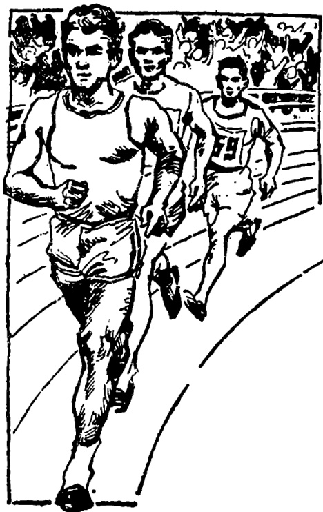

# 第三十五课 · 运动会 — Lesson 35

> OCR transcription; not manually verified. Source and confidence metadata are preserved per page.

<!-- source_pdf_page: 190; source_printed_page: 180; ocr_confidence: 0.9532 -->

丁文从楼上跑下来了。
汽车开进学校来了。
他从桌子里拿出来一本书。

## 一、替换练习 Substitution Drills

1. 丁文从楼上跑下来了。

外边，进来
楼下，上来
屋里，出去
操场，回来

2. 幼儿园的孩子从那边跑过来了。

运动员的队伍，走
哈利， 追
汽车， 开
运动员， 跑

<!-- source_pdf_page: 191; source_printed_page: 181; ocr_confidence: 0.9954 -->

3. 他走进教室去了。

出，学校
上，主席台
回，家
下，楼

4. 他从桌子里拿出一本书来。

桌子上，起
书架上，下
楼下，上
外边，进
汉斯那儿，回
张力那儿，过

5. 他从箱子里找出来两件衣服。

别的屋子，拿进，一把椅子
楼下，带上，三瓶汽水
商店，买回，一个照相机
提包里，拿出，一件礼物

<!-- source_pdf_page: 192; source_printed_page: 182; ocr_confidence: 0.9159 -->

## 二、课文 Text

### 运动会

几辆大汽车开进学校来了。这些人是来参加运动会的①。

运动会八点开始。七点五十分，运动员集合了。这时候，哈利还没有来，大家都很着急。同学们让我跑回宿舍去找他。我刚跑到楼门口，哈利从楼上跑下来了。我对他说：“快，大家都在等你呢。”

八点钟，运动员的队伍走进操场来了。大家精神饱满，走得非常整齐。当队伍走过主席台的时候，很多观众都站起来鼓掌。

运动项目开始了。运动员有的跑，有的跳；观众有的鼓掌，有

<!-- source_pdf_page: 193; source_printed_page: 183; ocr_confidence: 0.9836 -->

的喊“加油”，运动场上热闹极了。

哈利参加的项目是八百米赛跑。他跑完第一圈的时候，忽然摔倒了。大夫刚要跑过去看，哈利自己爬起来，又追了上去。最后，哈利得了第三名。一个同学跑过去，举起照相机来，给哈利照了一张相，全场观众都热烈鼓掌。

运动会进行了一天。最后，体操队给大家作了表演。

## 三、生词 New Words

1. 幼儿园 (名) yòu'éryuán kindergarten
2. 队伍 (名) duìwù a procession of people, contingent
3. 追 (动) zhuǐ to run after, to pursue
4. 主席台 (名) zhǔxítái rostrum
5. 拿 (动) ná to take, to hold
6. 提包 (名) tíbāo handbag, bag
7. 礼物 (名) lìwù present, gift
8. 集合 (名) jíhé to rally, to assemble

<!-- source_pdf_page: 194; source_printed_page: 184; ocr_confidence: 0.9954 -->

|  9. | 着急 | (形) | zháojí | be worried  |
| --- | --- | --- | --- | --- |
|  10. | 精神 | (名) | jīngshen | spirit  |
|  11. | 饱满 |  | bǎomǎn | full (of vigour, etc.)  |
|  12. | 当…的 时候 |  | dāng … de shíhou | when  |
|  13. | 观众 | (名) | guānzhòng | audience, spectator  |
|  14. | 项目 | (名) | xiàngmù | event  |
|  15. | 跳 | (动) | tiào | jump  |
|  16. | 加油 |  | jiāyóu | to cheer (players) on  |
|  17. | 热闹 | (形) | rènao | bustling, astir  |
|  18. | 米 | (量) | mǐ | metre  |
|  19. | 赛跑 | (名) | sàipǎo | race  |
|  20. | 圈 | (量) | quān | circle  |
|  21. | 忽然 | (副) | hūrán | suddenly  |
|  22. | 摔 | (动) | shuāi | to fall, to lose one's balance  |
|  23. | 倒 | (动) | dǎo | to fall down  |
|  24. | 又 | (副) | yòu | again, once more  |
|  25. | 最后 | (名) | zuìhòu | last, at last  |
|  26. | 名 | (名) | míng | place (used in competition)  |

<!-- source_pdf_page: 195; source_printed_page: 185; ocr_confidence: 0.9872 -->

27. 举 (动) jǔ to hold up, to raise
28. 休操队 (名) tícāoduì gymnastics team

## 补充生词 Additional Words

1. 跳高 (名) tiàogāo high jump
2. 跳远 (名) tiàoyuǎn long jump
3. 跳水 (名) tiàoshuǐ diving
4. 游泳 (名、动) yóuyǒng swimming; to swim
5. 裁判 (名) cáipàn referee, umpire

## 四、注释 Notes

① “这些人是来参加运动会的。”

这个句子的谓语“是来参加运动会的”表示动作的目的。

The predicate of the sentence is 是来参加运动会的 indicating the purpose of the action.

## 五、语法 Grammar

1. 复合趋向补语 The compound directional complement

动词“上、下、进、出、回、过、起”等后面加上“来”或“去”，可作另一动词的补语，叫作复合趋向补语。

复合趋向补语中的“来”“去”的使用规律跟简单趋向补语“来”和“去”一样。例如：

<!-- source_pdf_page: 196; source_printed_page: 186; ocr_confidence: 0.9951 -->

The compound directional complement is formed by verbs such as 上, 下, 进, 出, 回, 过 or 起 plus 来 or 去.

In a compound directional complement, 来 or 去 is used in the same way as in the simple directional complement, e.g.

我在楼上，看见他从楼下跑上来了。

图书馆的老师说，那本小说已经借出去了。

如果宾语是表示处所的词语，一定要放在“来”或“去”之前。例如：

If the object of the sentence indicates location, this object should be put before 来 or 去, e.g.

汽车开进学校来了。

我想爬上长城去看看。

如果宾语是事物，不是处所，则可在“来”“去”之前，也可在“来”“去”之后。例如：

If the object indicates a thing, not a location, it can be put either before or after 来 or, 去, e.g.

他从书架上拿下一本书来。

他从书架上拿下来一本书。

2. “了”和复合趋向补语 了 and the compound directional complement

如果动词后没有宾语，动态助词“了”可以放在动词之后。例如：

<!-- source_pdf_page: 197; source_printed_page: 187; ocr_confidence: 0.9956 -->

If there is no object after the main verb, the aspectual particle 了 can be put directly after it, e.g.

他说完话站了起来。

他在外边站了一会儿，就走了进去。

“了”也可以放在复合趋向补语之后。如：

了 can also be put after the compound directional complement, e.g.

他走进去了。

他说完话站起来了。

如果动词后有宾语，“了”一般放在句尾。也可以放在复合趋向补语之后宾语之前，这时“了”可以省略。例如：

If there is an object after the verb, 了 is usually put at the end of the sentence. But 了 can also be put between the complement and the object. In this case 了 may be omitted, e.g.

姐姐买回水果来了。

哥哥买回来（了）一个彩色电视机。

## 六、练习 Exercises

1. 将下列句子空白中填入适当的复合趋向补语：

Fill in the blanks with suitable compound directional complements:

(1) 张力昨天从商店买____一个很好看的提包。

<!-- source_pdf_page: 198; source_printed_page: 188; ocr_confidence: 0.9964 -->

(2) 他从书架上拿____一本外文杂志，看了看又放____了。

(3) 从操场回宿舍的时候，我看见安娜走____图书馆____了。

(4) 小王要回家的时候对他朋友说：
“我家离这儿不远，不用坐车，我走____。”

(5) 我们要进博物馆门口的时候，小白从后边追____，对我们说：“请等一等，我和你们一起进去。”

(6) 我跟哈利正谈着话，一辆汽车从我旁边很快地开____了。

(7) 孩子摔倒了，妈妈让他自己爬____。

(8) 我在楼下叫汉斯，他听到以后立刻从楼上跑____了。

2. 根据下面句子的内容，指出说话人的位置：

Indicate where the speakers are according to the contexts:

(1) 一辆汽车开进学校大门去了。

(2) 这是谁的箱子和提包？请拿进屋

<!-- source_pdf_page: 199; source_printed_page: 189; ocr_confidence: 0.9951 -->

里去吧。

(3) 刚才我看见丁文从宿舍楼跑出去了，他说他去操场。
(4) 礼物在楼上我的屋子里，你等一下儿，我这就跑上去拿。
(5) 在幼儿园门口，孩子们跳着舞欢迎外国客人，客人们鼓着掌走进去了。
(6) 大家正热闹地谈着话，小王从楼下拿上来一些汽水。
(7) 我正在看书，小白跑进来说：“下雨了。”
(8) 他拿着一张画儿走进房间里去了。

3. 阅读下面短文，找出里边的复合趋向补语：

Read the following passage and find the compound directional complements:

星期日，马丁和汉斯去公园玩儿。进了公园，他们先去爬山。马丁第一个爬上去了。很快，汉斯也爬上去了。在山顶上玩儿了一会儿，他们一起从山后边跑了下来。

<!-- source_pdf_page: 200; source_printed_page: 190; ocr_confidence: 0.9941 -->

下来以后，他们又开始划船。他们从山下边划过去，划到很远的地方，一个钟头以后才划回来。

下午，他们一边谈话一边从公园走出来。这时候，对面开过来一辆汽车，一个人下了车，往他这儿走过来。马丁看清楚这个人以后，立刻跑过去跟他握手。这是马丁的一个老朋友，他是跟代表团一起来中国访问的。

4. 根据课文回答问题：

Answer the questions according to the text:

(1) 运动会几点开始？
(2) 运动员什么时候集合？
(3) 同学们为什么让你回宿舍去？
(4) 你在哪儿遇见了哈利？
(5) 运动员的队伍是什么时候走进操场的？
(6) 运动员队伍走得整齐不整齐？
(7) 当运动员队伍走过主席台的时候，观众们怎么样？

<!-- source_pdf_page: 201; source_printed_page: 191; ocr_confidence: 0.9939 -->

(8) 请你说一说运动项目开始以后运动场上的情况。
(9) 哈利参加的是什么项目？
(10) 全场观众为什么热烈鼓掌？
(11) 运动会进行了多长时间？
(12) 最后谁给大家作了表演？

## 汉字表 Table of Chinese Characters

> **Uncertainty:** OCR of character components and stroke forms is unreliable. This section is excluded from the default retrieval corpus.

|  1 | 幼 | 么  |   |
| --- | --- | --- | --- |
|   |  | 力  |   |
|  2 | 伍 | 亻  |   |
|   |  | 五  |   |
|  3 | 追 | 自（亻亻巾自自）  |   |
|   |  | 乚  |   |
|  4 | 主 |   |   |
|  5 | 席 | 广  |   |
|   |  | 节 | 宀  |
|   |  |  | 巾  |
|  6 | 台 | 臺  |   |
|  7 | 拿 | 合（人人合）  |   |

<!-- source_pdf_page: 202; source_printed_page: 192; ocr_confidence: 0.7868 -->

|   |  | 手 |   |
| --- | --- | --- | --- |
|  8 | 集 | 住 |   |
|   |  | 木 |   |
|  9 | 合 |  |   |
|  10 | 急 | 刍 ( 〃 〃 〃 〃 |   |
|   |  | 心 |   |
|  11 | 精 | 米 |   |
|   |  | 青 |   |
|  12 | 神 | 禾 |   |
|   |  | 申 ( 1 7 7 日 申 ) |   |
|  13 | 饱 | 饣 | 饱  |
|   |  | 色 |   |
|  14 | 満 | 氵 | 滿  |
|   |  | 荷 | 艹  |
|   |  |  | 丙  |
|  15 | 当 | 卅 | 當  |
|   |  | 卅 ( 7 7 7 ) |   |
|  16 | 众 | 人 〃 众 | 衆  |

<!-- source_pdf_page: 203; source_printed_page: 193; ocr_confidence: 0.9897 -->

|  17 | 項 | 工 | 項  |
| --- | --- | --- | --- |
|   |  | 页 |   |
|  18 | 油 | 氵 |   |
|   |  | 由 |   |
|  19 | 闹 | 门 | 闊  |
|   |  | 市 |   |
|  20 | 米 |  |   |
|  21 | 圈 | 口 |   |
|   |  | 卷（一一一二三半米卷） |   |
|  22 | 忽 | 勿（丿勿勿） |   |
|   |  | 心 |   |
|  23 | 然 | 狀（丿夕夕夕夕好狀狀） |   |
|   |  | 灬 |   |
|  24 | 摔 | 扌 |   |
|   |  | 率（一一一二二二二二二二二二二二二率） |   |
|  25 | 倒 | 亻 |   |
|   |  | 到 |   |
|  26 | 又 | 冂又 |   |
