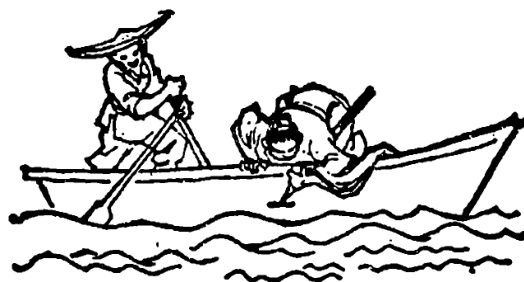

# 第三十六课 · 刻舟求剑 — Lesson 36

> OCR transcription; not manually verified. Source and confidence metadata are preserved per page.

<!-- source_pdf_page: 204; source_printed_page: 194; ocr_confidence: 0.9829 -->

他看得懂《人民日报》。
声音太小，我听不清楚。
这些练习半小时作得完作不完？

## 一、替换练习 Substitution Drills

1. 这张报你看过吗？

看过。
看得懂吗？
看得懂。

那段录音， 听
这本小说， 看
那个中国电影，看

2. 你看得见前边的东西吗？
天太黑了，看不见。

河 树
船 山

3. 耳机里的声音你听得见听不见？
听得见，但是听不清楚。

<!-- source_pdf_page: 205; source_printed_page: 195; ocr_confidence: 0.9939 -->

收音机 录音机 电视机 电话

4. 你能借得着那本书吗？

我想，能借得着。

买，《中国历史故事》
找，昨天丢的表
猜，这个谜语

5. 这些作业半小时作得完作不完？

赶快作，可能作得完。

汉字，写
课文，看
句子，翻译
问题，回答

6. 昨天天气比较热，今天凉快一点儿了。

<!-- source_pdf_page: 206; source_printed_page: 196; ocr_confidence: 0.9810 -->

天气，冷，暖和

生词，多，少

课文，难，容易

语法，复杂，简单

7. 这件衣服有一点儿短。

这本书，厚（薄）

耳机里的声音，不清楚

这个屋子，小

这个句子，长

## 二、课文 Text

### 刻舟求剑

上课的时候，老师让我们听录音。老师说：“这是一个成语故事，生词不太多，看你们听得懂听不懂。”①

大家戴上耳机，开始听了。哈利说：“老师，我耳机里的声音有一点儿不清

<!-- source_pdf_page: 207; source_printed_page: 197; ocr_confidence: 0.9928 -->

楚。”

老师问：“听得见吗？”

“听得见，可是听不清楚。”

老师问别的同学听得清楚听不清楚，大家都说听得清楚。老师对哈利说：“你的耳机可能坏了，换个耳机试试。”

哈利说：“不用换了，现在能听清楚了。”

这是中国古时候的故事。从前，有个人坐船过河，船走到河中间，不小心，他

的剑掉到水里去了。他马上在船边上作了一个记号。他说：“我的剑是从这儿掉下

去的。”船到了岸边，这个人立刻从作记号的地方跳到水里去找他的剑。

听完以后，老师让我们用汉语说一说故事的内容。老师还问我们：“这个人当

<!-- source_pdf_page: 208; source_printed_page: 198; ocr_confidence: 0.9947 -->

然找不着他的剑。这个成语故事的含义是什么呢？”

很多同学举手要求回答。老师看了看表说：“快下课了，回答不完了，下一节课再请你们回答。”

## 三、生词 New Words

|  1. 天 | (名) | tiān | sky  |
| --- | --- | --- | --- |
|  2. 河 | (名) | hé | river  |
|  3. 耳机 | (名) | ěrjī | earphone, headphone  |
|  4. 声音 | (名) | shēngyīn | voice, sound  |
|  5. 着 | (动) | zháo | *used as a complement, indicates that one gets what one needs or achieves one's goal*  |
|  6. 历史 | (名) | lìshǐ | history  |
|  7. 丢 | (动) | diū | to lose  |
|  8. 表 | (名) | biǎo | watch  |
|  9. 猜 | (动) | cāi | to guess  |
|  10. 谜语 | (名) | míyǔ | riddle  |

<!-- source_pdf_page: 209; source_printed_page: 199; ocr_confidence: 0.9948 -->

11. 作业 (名) zuòyè homework
12. 赶快 (副) gǎnkuài quickly
13. 一点儿 (形) yìdiǎnr a little
14. 复杂 (形) fùzá complicated, complex
15. 简单 (形) jiǎndān simple
16. 有一点儿 yǒuyìdiǎnr a little
17. 短 (形) duǎn short
18. 厚 (形) hòu thick
19. 薄 (形) báo thin
20. 刻舟求剑 kèzhōu qiújiàn to carve a mark on the gunwale of a moving boat where a sword was lost overboard — ridiculous stupidity
21. 成语 (名) chéngyǔ idiom
22. 戴 (动) dài to put on, to wear
23. 坏 (形) huài broken down
24. 换 (动) huàn to change, to exchange
25. 古 (名) gǔ ancient
26. 从前 (名) cóngqián before
27. 小心 (形) xiǎoxīn careful

<!-- source_pdf_page: 210; source_printed_page: 200; ocr_confidence: 0.9915 -->

28. 剑 (名) jiàn sword
29. 掉 (动) diào to drop
30. 水 (名) shuǐ water
31. 记号 (名) jìhào mark
32. 岸 (名) àn bank
33. 内容 (名) nèiróng contents
34. 当然 (形) dāngrán certainly, of course
35. 含义 (名) hányi implication
36. 要求 (动、名) yāoqiú to request; requirement

## 补充生词 Additional Words

1. 复述 (动) fùshù to retell
2. 听写 (动) tīngxiě to have a dictation
3. 改写 (动) gǎixiě to rewrite
4. 填空 (动) tiánkòng to fill in blanks
5. 造句 (动) zàojù to make sentences

## 四、注释 Notes

① “看你们听得懂听不懂”

这里的“看”表示“试一试”。也可以用重叠式“看看”。

Here 看, which can be repeated as 看看, means “to try”.

<!-- source_pdf_page: 211; source_printed_page: 201; ocr_confidence: 0.9986 -->

## 五、语法 Grammar

### 1. 可能补语 The potential complement

可能补语表示可能。在结果补语或趋向补语前加“得”，就可以构成可能补语。否定式用“不”代替“得”。例如：

The potential complement indicates possibility. It is formed by placing 得 between the verb and the resultative or directional complement. Its negative form is constructed by replacing 得 with 不, e.g.

这些汉字半小时写得完吗？

那座山不高，我们爬得上去。

前边的字我看不清楚。

他们去参观了，五点以前回不来。

动词带宾语时，宾语放在可能补语之后。如果宾语较长，则往往用前置宾语。例如：

The object of the verb should be put after the potential complement. If the object is particularly long, it may be placed before the subject, e.g.

我听得懂他的话。

耳机里的声音你听得清楚吗？

动词带可能补语的正反疑问式是：

The affirmative-negative question forms of the verb taking a potential complement are shown in the following examples:

你猜得着猜不着这个谜语？

<!-- source_pdf_page: 212; source_printed_page: 202; ocr_confidence: 0.9984 -->

### 那座山很高，你上得去上不去？

2. 可能补语和能愿动词 The potential complement and auxiliary verbs.

虽然可能补语和“能”“可以”都表示可能，但是“能”“可以”还表示环境或情理上的许可。因此，可能补语并不能代替所有句子中的“能”或“可以”。如“我可以进去吗？”就不能说成“我进得去吗？”

有时为了加重语气，在用可能补语的句子中，也可以再用上“能”或“可以”。例如：

Although both the potential complement and the auxiliary verb can express possibility, only auxiliary verbs such as 能 or 可能 can express permission as well. So, the potential complement cannot replace the auxiliary verb in all cases. For example 我可以进去吗 (May I come in?) cannot be replaced by 我进得去吗 (Is it physically possible for me to get in?).

Moreover, to intensify the tone of the sentence, 能 or 可以 can also be used together with the potential complement, e.g.

这篇文章不长，一个小时能看得完。
我们早上八点出发，中午可以回得来。

3. “一点儿”和“有一点儿”一点儿 and 有一点儿
数量词“一点儿”和“一些”的意思一样，口语中“一点儿”用得更多。如果不在句首，“一”常常省去。例如：

The numeral-measure word 一点儿 means the same as 一些 but 一点儿 is more often used in spoken Chinese. If it does not occur at the beginning of a sentence, — in 一点儿 is usually

<!-- source_pdf_page: 213; source_printed_page: 203; ocr_confidence: 0.9889 -->

omitted, e.g.

这件衣服短（一）点儿。

我想买（一）点儿东西。

副词“有一点儿”常作状语修饰形容词或动词，表示程度不高，多用于不如意的事情。例如：

The adverb 有一点儿 means “a little”. It is often used as an adverbial adjunct before an adjective or a verb and implies that something is not quite satisfactory, e.g.

这件衣服有（一）点儿短。

他有（一）点儿想去，还没最后决定 (juéiding decide)。

“一点儿”不能用在形容词或动词前，不能说“这件衣服一点儿短。”

一点儿 cannot be used before an adjective or a verb, so it would be incorrect to say, for example, 这件衣服一点儿短。

## 六、练习 Exercises

### 1. 用动词加可能补语填空：

Fill in the blanks with suitable verbs plus potential complements:

(1) 天太黑了，我____前边墙上的字。

(2) 电话机不好，请你大点儿声音，

<!-- source_pdf_page: 214; source_printed_page: 204; ocr_confidence: 0.9939 -->

我____你说的话。

(3) 广播的这个小故事比较容易，我们都____。
(4) 公园后边的那座山不太高，我想她一定____。
(5) 门太小了，这辆大汽车____吗？
(6) 要参观的东西太多了，一个钟头可能____。
(7) 你让他明天晚上去找我，我告诉他我的房间号了，他一定____。
(8) 这篇文章内容复杂，生词多，我还____。

2. 把下面的疑问句改成带可能补语的疑问句并回答：
Change the following questions into questions with potential complements, and then give the answers:

例 Example:

你一个小时能作完今天的作业吗？

你一个小时作得完今天的作业吗？——作得完（作不完）。

<!-- source_pdf_page: 215; source_printed_page: 205; ocr_confidence: 0.9937 -->

听得懂

(1) 你能听懂《刻舟求剑》这个成语故事吗？

(2) 那个人能找着掉到河里的剑吗？

(3) 他摔坏了腿，能跑完八百米吗？

(4) 你能借到一本历史故事书吗？

(5) 河对面的岸上有什么东西，你能看清楚吗？

(6) 他作的这些记号是什么含义，你能看懂吗？

(7) 这个节目十五分钟能演完吗？

(8) 我们能追上前边的队伍吗？

3. 用“一点儿”或“有一点儿”填空：

Fill in the blanks with 一点儿 or 有一点儿：

(1) 这件毛衣____小，我想换一件大____的。

(2) 下雪了，路不好走，小心____，别摔倒了。

(3) 这本书内容____难，有没有容易____的？

(4) 你作作业的时候认真____，就不

<!-- source_pdf_page: 216; source_printed_page: 206; ocr_confidence: 0.9958 -->

会有这么多错字了。

(5) 我想买一张大____的地图，小的看不清楚。
(6) 今天的天气____热，我穿得太多了。
(7) 时间不多了，请你说得简单____。
(8) 今天我觉得____不舒服，不能跟你们一起进城了。

4. 根据课文回答问题：

Answer the questions according to the text:

(1) 上课的时候，老师让你们作什么？
(2) 这段录音说的是什么内容？
(3) 哈利听得见耳机里的声音吗？
(4) 哈利听得清楚耳机里的声音吗？
(5) 别的同学听得清楚耳机里的声音吗？
(6) 老师让哈利换一个耳机，哈利换了吗？为什么？
(7) 《刻舟求剑》是什么时候的故事？

<!-- source_pdf_page: 217; source_printed_page: 207; ocr_confidence: 0.9871 -->

(8) 请你简单地说一说《刻舟求剑》故事的内容。
(9) 听完故事，老师问了一个什么问题？
(10) 你们回答了吗？为什么？

## 汉字表 Table of Chinese Characters

> **Uncertainty:** OCR of character components and stroke forms is unreliable. This section is excluded from the default retrieval corpus.

<!-- source_pdf_page: 218; source_printed_page: 208; ocr_confidence: 0.7685 -->

|  8 | 简 | 简 | 簡  |
| --- | --- | --- | --- |
|   |  | 间 |   |
|  9 | 单 | 丶丶丶丶丶丶丶丶丶丶丶丶丶丶丶丶丶丶丶丶丶丶丶丶丶丶丶丶丶丶丶丶丶丶丶丶丶丶丶丶丶丶丶丶丶丶丶丶丶丶 | 單  |
|  10 | 短 | 短 |   |
|   |  | 豆 |   |
|  11 | 厚 | 厂 |   |
|   |  | 曰 |   |
|   |  | 子 |   |
|  12 | 薄 | 艹 |   |
|   |  | 氵 |   |
|   |  | 專(二、厂、曰、曰、曰、曰、曰、曰、曰、曰、曰、曰、曰、曰、曰、曰、曰、曰、曰、曰、曰、曰、曰、曰、曰、曰、曰、曰、曰、曰、曰、曰、曰、曰、曰、曰、曰、曰、曰、曰、曰、曰、曰、曰、曰、曰、曰、曰、曰、曰、曰、 |   |
|  13 | 舟 |  |   |
|  14 | 求 | 一寸寸寸寸寸寸寸寸寸寸寸寸寸寸寸寸寸寸寸寸寸寸寸寸寸寸寸寸寸寸寸寸寸寸寸寸寸寸寸寸寸寸寸寸寸寸寸寸寸寸寸寸寸寸寸寸寸寸寸寸寸寸寸寸寸寸寸寸寸寸寸寸寸寸寸寸寸寸寸寸寸寸寸寸寸寸寸寸寸寸寸寸寸寸寸寸寸寸 |   |
|  15 | 剑 | 金 | 剑  |
|   |  | 刂 |   |
|  16 | 成 |  |   |
|  17 | 戴 | 一丶一丶一丶一丶一丶一丶一丶一丶一丶一丶一丶一丶一丶一丶一丶一丶一丶一丶一丶一丶一丶一丶一丶一丶一丶一丶一丶一丶一丶一丶一丶一丶一丶一丶 |   |
|  18 | 坏 | 上 | 壞  |
|   |  | 不 |   |

<!-- source_pdf_page: 219; source_printed_page: 209; ocr_confidence: 0.9956 -->

|  19 | 换 | 扌 |   |
| --- | --- | --- | --- |
|   |  | 奂(丶丶丶丶丶丶丶丶丶丶丶丶丶丶丶丶丶丶丶丶丶丶丶丶丶丶丶丶丶丶丶丶丶丶丶丶丶丶丶丶丶丶丶丶丶丶丶丶丶丶丶 |   |
|  20 | 古 |  |   |
|  21 | 心 |  |   |
|  22 | 掉 | 扌 |   |
|   |  | 卓(丶丶丶丶丶丶丶丶丶丶丶丶丶丶丶丶丶丶丶丶丶丶丶丶丶丶丶丶丶丶丶丶丶丶丶丶丶丶丶丶丶丶丶丶丶丶丶丶丵 |   |
|  23 | 记 | 氵 | 記  |
|   |  | 己 |   |
|  24 | 岸 | 山 |   |
|   |  | 厂 |   |
|   |  | 干 |   |
|  25 | 内 |  |   |
|  26 | 含 | 今 |   |
|   |  | 口 |   |
|  27 | 义 | 丿义义 | 義  |
