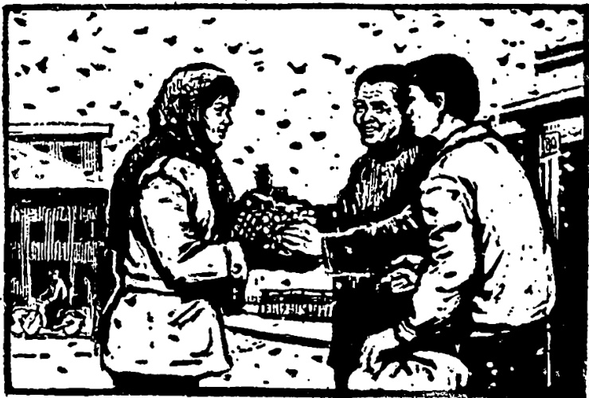

# 第三十七课 · 互相帮助 — Lesson 37

> OCR transcription; not manually verified. Source and confidence metadata are preserved per page.

<!-- source_pdf_page: 220; source_printed_page: 210; ocr_confidence: 0.9782 -->

我把那篇小说翻译完了。
你把这些东西送去。

## 一、替换练习 Substitution Drills

1. 你把那篇小说翻译完了吗？

我把那篇小说翻译完了。

（翻译完了。）

|  那篇文章， | 翻译完  |
| --- | --- |
|  昨天的课文， | 念熟  |
|  明天的课， | 准备好  |
|  收音机， | 打开  |

2. 请你把那本书给他。

<!-- source_pdf_page: 221; source_printed_page: 211; ocr_confidence: 0.9919 -->

那包东西，给
这件事，通知
这个消息，告诉

3. 你把这些东西送去吧。

这封信，寄
照相机，拿
这些花儿，带
孩子，抱

4. 请你把这袋粮食扛进来。

拿过来 搬出去
扛起来 放下去

5. 你把身上的雪扫扫。

要带的东西，准备
那儿的情况，介绍
课文的意思，讲
这个句子，分析

<!-- source_pdf_page: 222; source_printed_page: 212; ocr_confidence: 0.9803 -->

## 二、课文 Text

### 互相帮助

新年快要到了，谢刚休假回家看母亲。

出了车站，就下起雪来①。快到家的时候，雪下得更大了。这时候，他看见前边有个女同志，扛着一袋粮食，手里还抱着一包东西，走起路来十分困难。谢刚立刻跑过去说：“同志，你把粮食给我，我帮你扛。”“谢谢。”女同志看了看谢刚，把粮食给了他。

女同志一边走，一边问谢刚：“同志，你去哪儿？”

“我休假回家看母亲。我家就在前边，中山路八十号。”

“你是谢大娘的儿子吧？”

“你怎么知道？……”

“已经到八十号了，快进去吧。”

<!-- source_pdf_page: 223; source_printed_page: 213; ocr_confidence: 0.9943 -->

“不，我先把你的东西送去，再回家。”

“你快把粮食扛进去吧。这些粮食……”

谢刚的母亲谢大娘，听见外边有人说话，赶快从屋里走出来。

“啊，是兰英来了。快把东西放下，把身上的雪扫扫，到屋里坐。”接着，谢大娘对儿子说：“孩子，你不认识她吧？这是商店的李兰英同志。她是来给我们家

送粮食的。她看我年纪大了，买东西不方便，你又②不在家，为了照顾我，每个月

<!-- source_pdf_page: 224; source_printed_page: 214; ocr_confidence: 0.9934 -->

都把粮食和别的该买的东西，送到家来……”

听了妈妈的话，谢刚非常感动。他把粮食放下，握着李兰英的手说：“谢谢你的关心和帮助。”李兰英笑着说：“不用客气，刚才不是你帮我扛的粮食吗？③”

## 三、生词 New Words

|  1. 把 | (介) bǎ | *a preposition showing disposal*  |
| --- | --- | --- |
|  2. 文章 | (名) wénzhāng | article  |
|  3. 包 | (量) bāo | pack, bundle, parcel  |
|  4. 通知 | (动,名) tōngzhī | to notify; notice  |
|  5. 花儿 | (名) huār | flower  |
|  6. 抱 | (动) bào | to carry in one's arm, to embrace  |
|  7. 袋 | (量) dài | sack, bag  |
|  8. 粮食 | (名) liángshì | grain  |
|  9. 扛 | (动) káng | to carry on one's shoulder  |
|  10. 搬 | (动) bān | to move, to remove  |

<!-- source_pdf_page: 225; source_printed_page: 215; ocr_confidence: 0.9902 -->

11. 身 (名) shēn (shang) body
(上)
12. 扫 (动) sǎo to sweep
13. 意思 (名) yìsi meaning, sense
14. 讲 (动) jiǎng to explain, to talk
15. 分析 (动) fēnxī to analyze
16. 互相 (副) hùxiāng each other
17. 帮助 (动) bāngzhù to help
18. 谢刚 (专) Xiè Gāng Xie Gang, a person's name
19. 休假 xiūjià be on holiday; be on leave
20. 更 (副) gèng even, still
21. 十分 (副) shífēn very
22. 困难 (名、形) kùnnan difficulty; difficult
23. 帮 (动) bāng to help
24. 中山路 (专) Zhōngshān Lù Zhongshan Road
25. 大娘 (名) dànìáng aunty, aunt (respectful form of address for an elderly woman)
26. 儿子 (名) érzi son
27. 接着 (连) jiēzhe after, following

<!-- source_pdf_page: 226; source_printed_page: 216; ocr_confidence: 0.9809 -->

28. 认识 (动) rènshi to recognize, to know
29. 李兰英 (专) Lǐ Lánying Li Lanying, a person's name
30. 年纪 (名) niánjì age
31. 方便 (形) fāngbiàn convenient
32. 为了 (介) wèile for
33. 照顾 (动) zhàogu to take care of
34. 感动 (形、动) gǎndòng moving, touching; to touch sb.'s heart
35. 关心 (动) guānxīn to show concern, care for
36. 客气 (形) kèqi polite

## 补充生词 Additional Words

1. 面 (名) miàn(fēn) flour
(粉)
2. 大米 (名) dàmǐ rice
3. 鱼 (名) yú fish
4. 鸡蛋 (名) jīdàn egg
5. 蔬菜 (名) shūcài vegetable

<!-- source_pdf_page: 227; source_printed_page: 217; ocr_confidence: 0.9941 -->

## 四、注释 Notes

#### ① “起来”的引申意义 The extended usage of 起来

复合趋向补语“起来”有一种引申意义，即表示动作开始并继续。如“笑起来”“鼓起掌来”“走起路来”。

The compound directional complement 起来 here indicates the beginning of an action and its continuation, e.g. 笑起来，鼓起掌来，走起路来.

#### ② “又”表示两种情况同时存在又 indicating that two conditions coexist

在课文里，表示谢大娘年纪大，儿子不在家两个原因同时存在。

In the text, 又 indicates that there are two coexisting reasons. One is that Aunt Xie was old, the other is that her son was not at home.

#### ③ “不是…吗？”

用“不是…吗”的反问句，来强调肯定。如：“不要找了，这不是你的表吗？”

不是…吗 is a kind of rhetorical question used to give emphasis to an affirmation, e.g. 不要找了，这不是你的表吗？

## 五、语法 Grammar

#### 1. “把”字句（一） The 把-sentence (I)

“把”字句是动词谓语句的一种。试比较下列两组句子：

The sentence with 把 is a type of verbal-predicate sentence. Compare the following two groups of sentences:

<!-- source_pdf_page: 228; source_printed_page: 218; ocr_confidence: 0.9918 -->

(1) {我作完了练习。
他准备好了那篇学术报告。

(2) {我把练习作完了。
他把那篇学术报告准备好了。

两组句子表达的意思基本相同。第（1）组只是一般的叙述，第（2）组还有强调主语通过动作对宾语进行处置以及处置的结果的意思。当要强调说明动作对某事物有所处置时，就用“把”字句。“把”字句的词序如下：

主语——把——宾语（受处置的事物）——动词——其他成分（处置的结果）例如：

The above two groups of sentences are basically the same in meaning, but the first group of sentences are simple statements while the second group of 把- sentences emphasize “disposal” ——what is done to the object, or how it ends up as a result of this. The word order of the 把- sentence is as follows.

Subject—把—object (the thing disposed of) — verb — other elements (the result of disposal), e.g.

我把那篇小说翻译完了。

你把这些东西拿去吧。

2. 使用“把”字句要注意的事项 Points of attention when using the 把- sentence

（1）“把”的宾语在意义上就是主要动词的受事，一般它是说话人心目中已确定的。

The object of the preposition 把 is the receiver of the action

<!-- source_pdf_page: 229; source_printed_page: 219; ocr_confidence: 0.9955 -->

expressed by the main verb.

The object is normally something specific and concrete.

(2) 动词后一般带有“了”“补语”“宾语”或者动词本身重叠,说明怎样处置或处置的结果(不能带可能补语)。

The predicate verb is generally followed by 了, a complement, an object, or the repeated form of the predicate verb to indicate how something is handled or dealt with or the result of this. It cannot be followed by a potential complement.

(3) 主要动词一定是及物的,而且是有处置意义的。有些动词,如“有”“在”“是”“觉得”“来”“去”等,都不能作“把”字句的主要动词。

The main verb must be transitive, and it must imply disposal, so verbs like 有, 在, 是, 觉得, 来, 去 etc. can not be used as the main verb of a 把-sentence.

3. 能愿动词和否定词在“把”字句中的位置,

The position of the auxiliary verb and the negative word in the 把-sentence

在“把”字句中,能愿动词和否定词都要放在“把”之前。如:

In the 把-sentence, the auxiliary verb or the negative word should be put before 把, e.g.

今天晚上有大风,应该把窗户关好。
我没把照相机带来,不能照相了。

## 六、练习 Exercises

1. 把下列句子改成“把”字句:

Change the following sentences into 把-sentences:

<!-- source_pdf_page: 230; source_printed_page: 220; ocr_confidence: 0.9843 -->

(1) 他作完作业了。
(2) 我没通知他开会的事。
(3) 请你给丁文这个包。
(4) 请你讲一下儿这个词的意思。
(5) 他吃药了吗？
(6) 张大娘扫了扫身上的雪。
(7) 我们讨论讨论昨天听的报告吧！
(8) 屋子里太热，应该打开窗户。

2. 把下列句子改成不带“把”的句子：

Change the following into 把-sentences:

(1) 请你把这个句子分析一下儿。
(2) 老大娘把孩子抱起来就走了。
(3) 我把球借来了，我们去打球吧。
(4) 天气冷了，他还没把冬天的衣服找出来。
(5) 外边下雨了，该把那几袋粮食扛进去了。
(6) 请同学们把书拿出来。
(7) 张大娘病了，为了把大娘照顾好，她这个星期天没休息。

<!-- source_pdf_page: 231; source_printed_page: 221; ocr_confidence: 0.9957 -->

(8) 请你把这件礼物带给他，谢谢他对我们的关心和帮助。

3. 根据课文回答问题：

Answer the questions on the text:

(1) 为什么李兰英想，她遇到的人可能是谢大娘的儿子？
(2) 为什么谢大娘听到外边有人说话，赶快从屋里走出来？
(3) 谢刚和李兰英，谁帮助了谁？
(4) 介绍一下课文里的三个人。

4. 把本篇课文改成小话剧。

Change the text into a short play.

## 汉字表 Table of Chinese Characters

> **Uncertainty:** OCR of character components and stroke forms is unreliable. This section is excluded from the default retrieval corpus.

|  1 | 章 | 立  |
| --- | --- | --- |
|   |  | 早  |
|  2 | 通 | 甬  |
|   |  | 辶  |
|  3 | 花 | 艹  |

<!-- source_pdf_page: 232; source_printed_page: 222; ocr_confidence: 0.9873 -->

|   |  | 化 |   |
| --- | --- | --- | --- |
|  4 | 抱 | 扑 |   |
|   |  | 包 |   |
|  5 | 袋 | 代 |   |
|   |  | 衣 |   |
|  6 | 粮 | 米 | 糧  |
|   |  | 良（𠄎良） |   |
|  7 | 扛 | 扑 |   |
|   |  | 工 |   |
|  8 | 搬 | 扑 |   |
|   |  | 般 | 舟  |
|   |  |  | 𠄎  |
|  9 | 扫 | 扑 | 掃  |
|   |  | 扫 |   |
|  10 | 析 | 木 |   |
|   |  | 斤 |   |
|  11 | 互 | 三 | 五  |
|  12 | 帮 | 邦 | 帮  |
|   |  |  | 𠄎  |

<!-- source_pdf_page: 233; source_printed_page: 223; ocr_confidence: 0.9933 -->

|   |  | 巾 |   |
| --- | --- | --- | --- |
|  13 | 助 | 卩 |   |
|   |  | 力 |   |
|  14 | 戚 | 占 | 戰  |
|   |  | 戈 |   |
|  15 | 更 | 一ㄏㄋㄌㄌㄌ更 |   |
|  16 | 困 | 囗 |   |
|   |  | 木 |   |
|  17 | 娘 | 女 |   |
|   |  | 良 |   |
|  18 | 识 | 讠 | 讖  |
|   |  | 只 |   |
|  19 | 李 | 木 |   |
|   |  | 子 |   |
|  20 | 兰 | 丶丶丶丶 | 蘭  |
|  21 | 便 | 亻 |   |
|   |  | 更 |   |
|  22 | 顏 | 卩（一厂乍卩） | 顏  |
|   |  | 页 |   |
