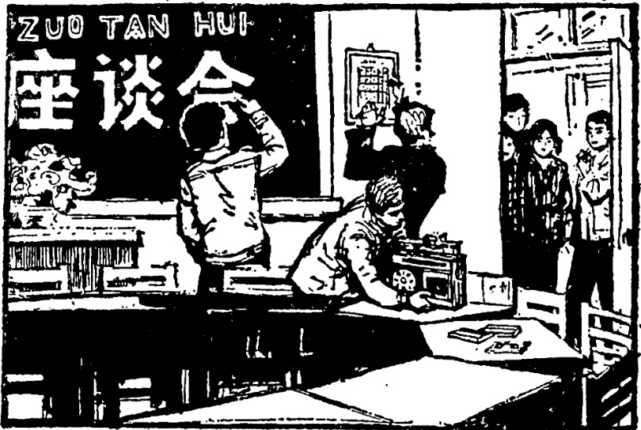

# 第三十八课 · 布置会场 — Lesson 38

> OCR transcription; not manually verified. Source and confidence metadata are preserved per page.

<!-- source_pdf_page: 234; source_printed_page: 224; ocr_confidence: 0.9864 -->

他们把桌子搬到外边去了。
你把录音机放在这儿。

## 一、替换练习 Substitution Drills

1. 他们把讲桌搬到外边去了。

病人，送，医院
粮食，扛，屋里
照片，寄，朋友那儿
汽车，开，长城
孩子，送，幼儿园

2. 请你把花儿摆在桌子上。

<!-- source_pdf_page: 235; source_printed_page: 225; ocr_confidence: 0.9932 -->

大衣，放，衣柜里
帽子，挂，衣架上
汽车，停，门口
这件事，记，本子上

3. 请把钢笔$^{huán}$还给他。

这封信，寄
这张照片，送
这些水果，带
这些钱，交

4. 我们准备把桌子摆成圆形。

这篇文章，翻译，英文
这件事，编，故事
这儿，布置，会场
这些纸，作，花儿
这本小说，改，话剧

<!-- source_pdf_page: 236; source_printed_page: 226; ocr_confidence: 0.9670 -->

## 二、课文 Text

### 布置会场

星期六下午，我们要和中国同学一起开联欢会。我们准备先座谈，互相交流一下学习经验，再表演节目，最后跳舞。联欢会在我们教室开。两点半，我们班同学都来了。哈利说：

“我们把会场布置一下吧。先把桌子摆一摆，大家看①摆成什么样？”

“把桌子摆成圆形比较好。”

<!-- source_pdf_page: 237; source_printed_page: 227; ocr_confidence: 0.9986 -->

“讲桌放在哪儿呢？”

“把讲桌搬到外边去吧。”

“节目单贴在哪儿？”

“把它贴在黑板旁边。”

“安娜，劳驾，请把前边的窗户关一下。风太大，别把墙上的节目单刮下来。”

“黑板上写字吗？”

“要写。先把黑板擦一擦，写上②

‘联欢会’三个字。把粉笔交给汉斯，他写得好。”

“把录音机放在哪儿？”

“把它放在这张桌子上。先试一试……”

“座位摆好了吗？我们去把中国同学请来吧！”

“不用去了，”汉斯指着门口说，“你们看，他们来了。”

<!-- source_pdf_page: 238; source_printed_page: 228; ocr_confidence: 0.9942 -->

## 三、生词 New Words

1. 讲桌 (名) jiǎngzhuō lecture table
2. 病人 (名) bìngrén patient
3. 摆 (动) bǎi to put, to place
4. 大衣 (名) dàyī overcoat
5. 帽子 (名) màozi hat, cap
6. 衣架 (名) yījià coat hanger, clothes tree
7. 停 (动) tíng to stop
8. 记 (动) jì to write down, to record, to remember
9. 交 (动) jiāo to hand over, to hand in
10. 成 (动) chéng to become, to turn into
11. (圆)形 (名) (yuán)xíng (round) shape
12. 编 (动) biān to write, to compile
13. 布置 (动) bùzhì to arrange, to dispose
14. 会场 (名) huìchǎng meeting-place, conference hall
15. 改 (动) gǎi to change
16. 联欢会 (名) liánhuānhuì party, get-together

<!-- source_pdf_page: 239; source_printed_page: 229; ocr_confidence: 0.9873 -->

17. 座谈 (动) zuòtán to discuss
18. 交流 (动) jiāoliú to exchange
19. 经验 (名) jīngyàn experience
20. 单 (名) dān list
21. 贴 (动) tiē to paste, to stick
22. 黑板 (名) hēibǎn blackboard
23. 劳驾 láojià Excuse me; May I trouble you...?
24. 擦 (动) cǎ to wipe, to clean
25. 粉笔 (名) fěnbí chalk
26. 它 (代) tā it
27. 座位 (名) zuòwèi seat
28. 指 (动) zhí to point

## 补充生词 Additional Words

1. 上衣 (名) shàngyī jacket, coat
2. 裤子 (名) kùzi trousers
3. 袜子 (名) wàzi sock(s), stocking(s)
4. 皮鞋 (名) píxié leather shoe(s)
5. 手套 (名) shǒutào glove(s)

<!-- source_pdf_page: 240; source_printed_page: 230; ocr_confidence: 0.9966 -->

## 四、注释 Notes

① “大家看摆成什么样？”

这里的“看”有观察并且加以判断的意思。

Here 看 means “observe and judge.”

② “写上‘联欢会’三个字”

“上”作结果补语，可以表示通过动作使某事物存在或附着于某处。例如：“天气冷了，很多人都穿上了毛衣。”

上 used as a resultative complement indicates that sth. comes to be in a certain place through an action, e.g. 天气冷了，很多人都穿上了毛衣。

## 五、语法 Grammar

“把”字句（二） The 把- sentence (2)

（1）如果主要动词后有结果补语“到”和表示处所的宾语，说明受到处置的人或事物通过动作到达某地时，必须用“把”字句。例如：

The 把- construction must be used when the main verb is followed by the resultative complement 到 and an object indicating locality. Such a sentence indicates the position that a person or thing occupies as a result of an action performed on it, e.g.

他把那个孩子送到了家。

他们把桌子搬到外边去了。

（2）如果主要动词后有复合趋向补语和表示处所的宾语，一般要用“把”字句。例如：

<!-- source_pdf_page: 241; source_printed_page: 231; ocr_confidence: 0.9979 -->

The 把- construction should generally be used when the main verb is followed by a compound directional complement and an object indicating location, e.g.

他们把书架搬上楼去了。

他把汽车开进大门口来了。

(3) 如果主要动词后有结果补语“在”和表示处所的宾语，必须用“把”字句。例如：

The 把- construction must be used when the main verb is followed by the resultative complement 在 and an object denoting location, e.g.

玛丽把花儿摆在桌子上了。

他把汽车停在了学校门口。

(4) 如果主要动词后有结果补语“给”和表示对象的宾语，一般也用“把”字句。例如：

The 把- construction is normally used when the main verb is followed by the resultative complement 给 and an object denoting the recipient of the action, e.g.

请把这本词典交给丁文。

他把那些照片送给朋友了。

(5) 如果主要动词后有结果补语“成”和表示结果的宾语，说明受处置的人或事物通过动作成为什么时，必须用“把”字句。例如：

The 把- construction must be used when the main verb is

<!-- source_pdf_page: 242; source_printed_page: 232; ocr_confidence: 0.9861 -->

followed by the resultative complement 成 and an object which shows result. Such a sentence indicates what the person or thing has become as a result of the action or process it has undergone, e.g.

他把那本小说翻译成英文了。

你不要把休息的“休”写成身体的“体”。

## 六、练习 Exercises

1. 用“在”、“到”、“给”、“成”填空：

Fill in the blanks with 在，到，给 or 成：

(1) 他们把讲桌都搬____楼上去了。
(2) 劳驾，请把地图挂____这边墙上。
(3) 下星期我准备把这些照片寄____我朋友。
(4) 这儿不能停车，请不要把汽车停____门口。
(5) 你能把这些中文句子翻译____英文吗？
(6) 下午我想把这件大衣送____洗衣店去。

<!-- source_pdf_page: 243; source_printed_page: 233; ocr_confidence: 0.9979 -->

(7) 他把帽子忘____这儿了，请你把帽子带____他，好吗？

(8) 请同学们把这个句子改____“把”字句。

2. 用以下词语组成“把”字句，这些句子是考试时老师对学生提出的要求。

Make sentences with 把, using the following groups of words. These sentences should form a list of instructions given by a teacher to the students who are about to take an exam.

|  (1) 书 | 放 | 桌子里  |
| --- | --- | --- |
|  (2) 纸 | 笔 | 拿  |
|  (3) 名字 | 日期（几月几日）写  |   |
|  (4) 问题 | 看 | 清楚  |
|  (5) 回答 | 写 | 问题后边  |
|  (6) 字 | 写 | 清楚  |

3. 星期六晚上，哈利要请同学到宿舍来玩儿。

请你用给的词语组成“把”字句，帮助哈利布置一下屋子。Harry is going to invite his classmates over to his room on Saturday evening. Please use the 把-construction and the given words to make suggestions to help Harry to arrange things in the room.

<!-- source_pdf_page: 244; source_printed_page: 234; ocr_confidence: 0.9954 -->

(1) 床 桌子 椅子
书架 画儿 照片
花儿 收录机 衣架
(2) 放 摆 非 贴
搬

4. 根据课文回答问题:

Answer the questions according to the text:

(1) 星期六下午, 你们班要组织什么活动?
(2) 你们和中国同学的联欢会有哪些内容?
(3) 你们把桌子摆成了什么样?
(4) 讲桌放在哪儿?
(5) 节目单贴在哪儿?
(6) 黑板上写字了吗?
(7) 黑板上写的什么字? 谁写的?
(8) 录音机放在哪儿?

<!-- source_pdf_page: 245; source_printed_page: 235; ocr_confidence: 0.9990 -->

## 汉字表 Table of Chinese Characters

> **Uncertainty:** OCR of character components and stroke forms is unreliable. This section is excluded from the default retrieval corpus.

|  1 | 摆 | 扌 | 擺  |
| --- | --- | --- | --- |
|   |  | 丿 |   |
|   |  | 去 |   |
|  2 | 帽 | 巾 |   |
|   |  | 冒 |   |
|  3 | 停 | 仆 |   |
|   |  | 亭（丶丶丶丶亭） |   |
|  4 | 交 |  |   |
|  5 | 形 | 开 |   |
|   |  | 彡 |   |
|  6 | 编 | 纟 | 編  |
|   |  | 扁 |   |
|  7 | 布 | 大 |   |
|   |  | 巾 |   |
|  8 | 置 | 丿 |   |
|   |  | 直 |   |
|  9 | 改 | 丿 |   |

<!-- source_pdf_page: 246; source_printed_page: 236; ocr_confidence: 0.9937 -->

|   |  | 攴 |   |
| --- | --- | --- | --- |
|  10 | 联 | 耳 | 聯  |
|   |  | 关 |   |
|  11 | 座 | 广 |   |
|   |  | 坐 |   |
|  12 | 流 | 氵 |   |
|   |  | 亢 | 𠄎  |
|   |  |  | 儿（，〃儿）  |
|  13 | 验 | 马 | 駿  |
|   |  | 佥 |   |
|  14 | 贴 | 贝 | 贴  |
|   |  | 占 |   |
|  15 | 板 | 木 |   |
|   |  | 反 |   |
|  16 | 驾 | 加力 | 駕  |
|   |  |  | 口  |
|   |  | 马 |   |
|  17 | 擦 | 才 |   |

<!-- source_pdf_page: 247; source_printed_page: 237; ocr_confidence: 0.9909 -->

|   |  | 察 | 宀  |
| --- | --- | --- | --- |
|   |  |  | 祭（丶ククタク丶乞乞祭祭  |
|   |  |  | 祭祭祭）  |
|  18 | 粉 | 米 |   |
|   |  | 分 |   |
|  19 | 它 | 宀 |   |
|   |  | 匕（匕匕） |   |
|  20 | 指 | 扌 |   |
|   |  | 旨 | 匕  |
|   |  |  | 日  |
