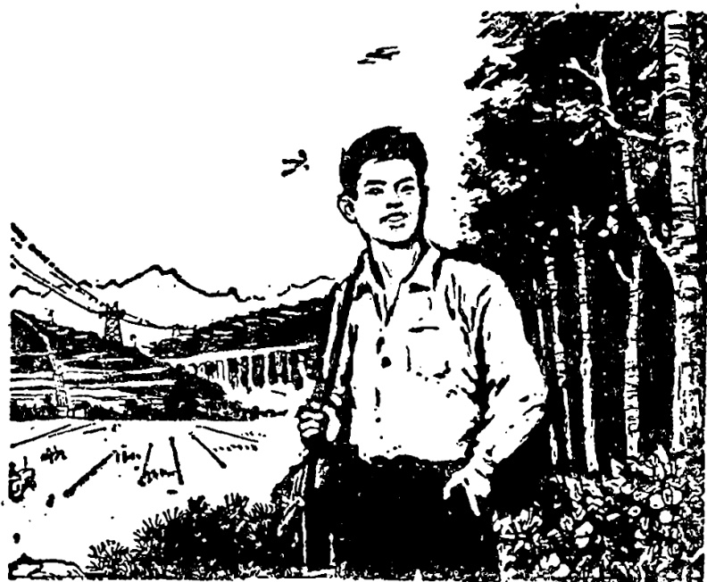

# 第三十九课 · 放假回农村 — Lesson 39

> OCR transcription; not manually verified. Source and confidence metadata are preserved per page.

<!-- source_pdf_page: 248; source_printed_page: 238; ocr_confidence: 0.9900 -->

这座楼比那座楼高。
妹妹比弟弟小三岁。
他唱歌唱得比我好。

## 一、替换练习 Substitution Drills

1. 这座楼比那座楼高。

|  路 | 〔条〕， | 宽  |
| --- | --- | --- |
|  工人 | 〔个〕， | 年轻  |
|  衣服 | 〔件〕， | 合适  |
|  电话 | 〔个〕， | 好用  |

2. 妹妹比弟弟小三岁。

<!-- source_pdf_page: 249; source_printed_page: 239; ocr_confidence: 0.9871 -->

大， 两岁

高， 一点儿

矮， 一些

胖（瘦）， 一点儿

3. 今年的小麦产量比去年增加了七千斤。

粮食， 八千斤

水果， 五千斤

汽车， 一千辆

机器， 六百台

4. 他唱歌唱得比我好。

跑步， 快

看书， 多

写字， 好看

说汉语，好

5. 农民的生活一天比一天好。

<!-- source_pdf_page: 250; source_printed_page: 240; ocr_confidence: 0.9743 -->

十一月的天气，冷
三月的天气，暖和
学过的生词，多
我们的学习，有进步

## 二、课文 Text

### 放假回农村

考完试以后，学校放假了。从前年春节到现在，我还没回过家。这次假期，我决定回家看看。

我家在农村，父亲和母亲都是农民。我有个弟弟，比我小两岁，中学毕业以后，在村里参加农业劳动。我还有个妹妹，她比弟弟小三岁，现在还在上学。

进了村子，我发现很多地方都变了样。村东新盖了几个工厂。村子中间的路，比以前宽了。路两边盖了不少新房子，比以前的房子漂亮得多。村里的小学也比以

<!-- source_pdf_page: 251; source_printed_page: 241; ocr_confidence: 0.9971 -->

前大了。我经过学校门口的时候，孩子们正在上课。

到家以后，先看到了弟弟。我觉得弟弟比前年又长高了一些，身体也比以前更健康了。弟弟告诉我，爸爸、妈妈身体都很好，他们去地里劳动了。听说大家都在劳动，我也拿了件工具，决定跟弟弟一起到地里去。

在路上，弟弟告诉我，今年小麦长得比去年好，每亩产量比去年增加了五十

<!-- source_pdf_page: 252; source_printed_page: 242; ocr_confidence: 0.9831 -->

斤。村里办了不少工厂，农民的收入比以前增加了很多，生活一天比一天好。

我们说着话，已经来到了劳动的地方。

## 三、生词 New Words

|  1. 座 | (量) zuò | *a measure word for buildings, etc.*  |
| --- | --- | --- |
|  2. 比 | (介) bǐ | *a preposition showing comparison, than*  |
|  3. 条 | (量) tiáo | *a measure word for long narrow trhings e.g. street, fish, trousers etc.*  |
|  4. 宽 | (形) kuān | wide  |
|  5. 年轻 | (形) niánqīng | young  |
|  6. 合适 | (形) héshì | suitable  |
|  7. 好用 | (形) hǎoyòng | easy to use  |
|  8. 岁 | (名) suì | age  |
|  9. 矮 | (形) āi | short (in stature)  |
|  10. 胖 | (形) pàng | fat  |
|  11. 瘦 | (形) shòu | thin  |

<!-- source_pdf_page: 253; source_printed_page: 243; ocr_confidence: 0.9927 -->

12. 小麦 (名) xiǎomài wheat
13. 产量 (名) chǎnliàng output
14. 增加 (动) zēngjiā to increase
15. 千 (数) qiān thousand
16. 机器 (名) jīqì machine
17. 台 (量) tái a measure word for engines, machines, etc.
18. 考试 (名、动) kǎoshì examination; to test
19. 假期 (名) jiàqī vacation, holiday
20. 决定 (动) juédìng to decide
21. 中学 (名) zhōngxué middle school, secondary school
22. 村子 (名) cūnzi village
23. 上学 shàngxué to go to school
24. 发现 (动) fāxiàn to discover
25. 变样 biànyàng to change
26. 漂亮 (形) piàoliang pretty, beautiful
27. 小学 (名) xiǎoxué primary school
28. 经过 (动) jīngguò to pass through
29. 长 (动) zhǎng to grow
30. 地 (名) dì land

<!-- source_pdf_page: 254; source_printed_page: 244; ocr_confidence: 0.9889 -->

31. 工具 (名) gōngjù tool
32. 听说 tīngshuō It is said that, (I am) told that
33. 亩 (量) mǔ a measure word for land, equal to 1/15 hectare
34. 办 (动) bàn to set up
35. 收入 (名、动) shōurù income; to earn

## 补充生词 Additional Words

1. 暑假 (名) shǔjià summer vacation
2. 寒假 (名) hánjià winter vacation
3. 乡 (名) xiāng countryside
4. 区 (名) qū district
5. 县 (名) xiàn county

## 四、注释 Notes

副词“还”... The adverb

(1) 表示动作或状态持续不变。如：“妹妹还没放假。”

The adverb 还 shows that an action or a state remains unchanged, e.g. 妹妹还没有放假.

(2) 表示数量增加，范围扩大。如：“我还有个妹妹。”
还 means “else” or “as well”, e.g. 我还有个妹妹.

<!-- source_pdf_page: 255; source_printed_page: 245; ocr_confidence: 0.9815 -->

(3) 用于比较句，有“更加”的意思。如：“你比他还高。”

还 in a comparative sentence means “even more”, e.g. 你比他还高.

## 五、语法 Grammar

1. 用“比”表示比较 Comparison expressed by 比
用“比”表示比较时，一般格式是：

The general formula of the comparative sentence with the preposition 比 is:

A——比——B——差别 例如：

A——比——B——the difference e.g.

你比我高，我比你矮。

这个学校的学生比那个学校(的学生)多。

这种句子，在形容词前可以用上表示比较程度的副词“更”“还”等。例如：

In the comparative sentence with 比, adverbs showing comparative degree such as 更 and 还, etc. can be used before the adjective, e.g.

这本词典比那本(词典)更好。

(那本已经很好了)

弟弟比哥哥还高。(哥哥已经很高了)

<!-- source_pdf_page: 256; source_printed_page: 246; ocr_confidence: 0.9981 -->

形容词前不能用“很”“非常”“太”等程度副词，不能说“他比我很高”“这个学校的学生比那个学校非常多”等。

Other adverbs of degree such as 很，非常，太 etc. cannot be used before the adjective in a comparative sentence with 比，so we cannot say 他比我很高，这个学校的学生比那个学校非常多，etc.

一般动词谓语句也可以用“比”表示比较。如：

In addition, 比 can also be used in the verbal predicate sentence to express comparison, e.g.

你比我更了解这里的情况。

现在的生活水平比以前提高了很多。

带程度补语的动词谓语句，“比”的位置如下：

The position of 比 in the verbal predicate sentence with a degree complement is as the following:

丁文比我来得早。

丁文来得比我早。

安娜写汉字比我写得好。

安娜写汉字写得比我好。

### 2. 数量补语 The complement of quantity

在用“比”的比较句中，如果要进一步指出两件事物具体的差别时，就可以用数量补语。例如：

In a comparative sentence with 比，if we want to point out a specific difference, we can use a complement of quantity, e.g.

<!-- source_pdf_page: 257; source_printed_page: 247; ocr_confidence: 0.9986 -->

弟弟比我小两岁。

这课的生词比上一课少五个。

如果要表示大概的差别程度，可以用“一点儿”“一些”说明差别不大，用程度补语“多”说明差别很大。例如：

If we want to show an approximate difference, we use 一点儿 or 一些 to indicate a minor difference, and 多 to indicate a large difference, e.g.

妹妹比弟弟高一点儿。

这座山比那座山高得多。

如果谓语动词带程度补语，“一点儿”“一些”和“多”等要放在程度补语之后。例如：

If the verb predicate is followed by a complement of degree, 一点儿, 一些 or 多 etc. should be put after this complement, e.g.

丁文比我来得早一点儿。

他唱得比我好得多。

3. “一天比一天”作状语 一天比一天 as an adverbial adjunct

“一天比一天”作状语，说明随着时间的前进，事物变化程度的递增。同样的结构还有“一年比一年”。例如：

一天比一天 used as an adverbial adjunct indicates the progressive change of something with the passage of time. 一年比一年 is constructed in the same way as 一天比一天, e.g.

他的身体一天比一天好了。

<!-- source_pdf_page: 258; source_printed_page: 248; ocr_confidence: 0.9813 -->

这个城市的建设一年比一年快。

## 六、练习 Exercises

1. 仿照例子，根据下列句子提问：

Ask questions according to the sentences given, following the example:

例 Example:

这座楼高三十米，那座楼高十五米。

这座楼比那座楼高吗？

这座楼比那座楼高多少？

(1) 这座山高六千米，那座山高五千米。
(2) 弟弟十八岁，妹妹十二岁。
(3) 今年小麦每亩产量九百斤，去年每亩产量八百斤。
(4) 这间房子宽四米，那间房子宽三米。
(5) 我们学了七百个生词，他们学了一千个生词。
(6) 这条路长十公里，那条路长十五

<!-- source_pdf_page: 259; source_printed_page: 249; ocr_confidence: 0.9909 -->

公里。

(7) 这个剧场有两千个座位，那个剧场只有一千个座位。
(8) 玛丽七点三刻到教室，安娜差五分八点到教室。

2. 根据句子的内容填空：

Fill in the blanks:

(1) 小王、小张、小李三个人是朋友。小王最大，今年二十二岁。小李最小，今年十八岁。小张比小王小三岁，比小李大一岁。小张今年____岁。
(2) 他家的小麦，今年亩产七百斤，比去年增加了五十斤。去年小麦亩产是____斤。
(3) 第一中学比第二中学大。第一中学有九百个学生，第二中学有七百个学生。第二中学比第一中学少____学生。
(4) 哈利作作业用了一个半小时，汉

<!-- source_pdf_page: 260; source_printed_page: 250; ocr_confidence: 0.9888 -->

斯作作业用了一小时二十分。哈利比汉斯多用了____。

(5) 马丁一分钟能写二十个汉字，汉斯一分钟能写十八个汉字。马丁每分钟比汉斯可以多写____汉字。

(6) 哈利身高一米八二，汉斯身高一米七九。

哈利比汉斯____，汉斯比哈利____。

### 3. 根据课文回答问题：

Answer the questions according to the text:

(1) 前年冬天你回家了吗？去年你回没回家？

(2) 今年你回家了吗？你是什么时候回家的？

(3) 你家在城市吗？你家都有谁？他们作什么工作？

(4) 这次回家，你发现村里哪些地方变了样？

<!-- source_pdf_page: 261; source_printed_page: 251; ocr_confidence: 0.9948 -->

(5) 你经过学校门口的时候, 孩子们正在作什么?
(6) 你看到弟弟, 觉得他变了吗?
(7) 你为什么要跟弟弟一起到地里去?
(8) 在路上弟弟对你说了些什么?

4. 阅读短文后回答问题:

Read the passage and answer the questions:

王军家有五口人: 父亲、母亲、哥哥、妹妹和他。王军的父亲五十八岁, 是个老师。母亲比父亲小, 他们差四岁。父亲在第一中学工作, 从家里出来, 走十分钟就能到。母亲在友谊医院工作, 坐车要坐十分钟。

哥哥是大学生, 比王军大三岁。他是前年中学毕业的, 毕业以后考进了北京大学, 现在在北京大学学习中国历史。王军十七岁, 明年中学毕业。毕业以后, 他想考北京外语学院学法语。王军的妹妹比他小六岁, 在小学学习, 明年才上中学。

<!-- source_pdf_page: 262; source_printed_page: 252; ocr_confidence: 0.9915 -->

(1) 王军的母亲多大年纪？
(2) 王军的父亲在哪儿工作？母亲在哪儿工作？
他们两个谁工作的地方离家近？
(3) 王军的哥哥多大？他在大学已经学习几年了？
(4) 王军的妹妹多大？已经上中学了吗？

## 汉字表 Table of Chinese Characters

> **Uncertainty:** OCR of character components and stroke forms is unreliable. This section is excluded from the default retrieval corpus.

|  1 | 条 | 久 | 條  |
| --- | --- | --- | --- |
|   |  | 示 |   |
|  2 | 宽 | 宀 | 宽  |
|   |  | 宀 |   |
|   |  | 见 |   |
|  3 | 适 | 舌（‘舌’） | 適  |
|   |  | 乚 |   |
|  4 | 岁 | 山 | 歲  |
|   |  | 夕 |   |

<!-- source_pdf_page: 263; source_printed_page: 253; ocr_confidence: 0.8084 -->

|  5 | 矮 | 矢 |   |
| --- | --- | --- | --- |
|   |  | 委 | 禾  |
|   |  |  | 女  |
|  6 | 胖 | 月 |   |
|   |  | 半 |   |
|  7 | 瘦 | 广 |   |
|   |  | 叟 | 由 ( 一 1 1 1 1 1 1 1 1 1 )  |
|   |  |  | 又  |
|  8 | 麦 | 主 | 麥  |
|   |  | 久 |   |
|  9 | 产 | 一 一 一 一 一 | 產  |
|  10 | 量 | 日 |   |
|   |  | 一 |   |
|   |  | 里 |   |
|  11 | 增 | 丿 |   |
|   |  | 曾 | 由 ( 一 1 1 1 1 1 1 1 1 1 1 )  |
|   |  |  | 日  |
|  12 | 千 | 一 二 千 |   |
|  13 | 器 | 器 |   |

<!-- source_pdf_page: 264; source_printed_page: 254; ocr_confidence: 0.9959 -->

|   |  | 犬 |   |
| --- | --- | --- | --- |
|   |  | 四 |   |
|  14 | 考 | 犬 |   |
|   |  | う（ーう） |   |
|  15 | 决 | ； |   |
|   |  | 夫 |   |
|  16 | 漂 | ； |   |
|   |  | 票 |   |
|  17 | 具 |  |   |
|  18 | 亩 | 一 | 畝  |
|   |  | 田 |   |
|  19 | 入 | ノ入 |   |
