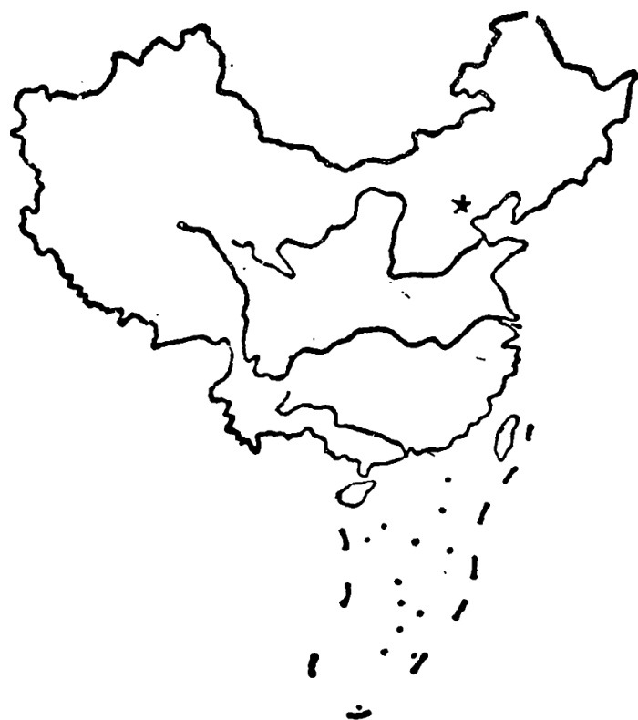
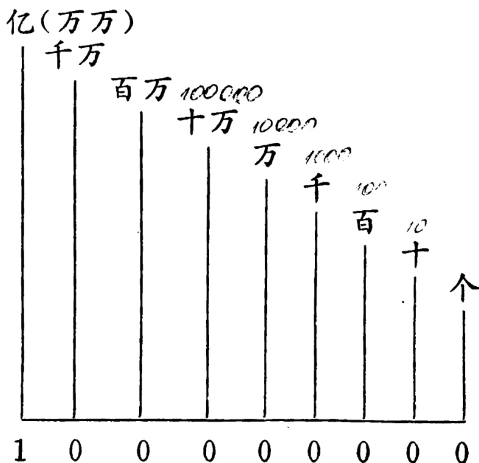

# 第四十课 · 学生数目；中国 — Lesson 40

> OCR transcription; not manually verified. Source and confidence metadata are preserved per page.

<!-- source_pdf_page: 265; source_printed_page: 255; ocr_confidence: 0.9788 -->

那个国家的面积有五十三万平方公里。
我们学校的女生占三分之一。

## 一、替换练习 Substitution Drills

1. 那个国家的面积有多大？

那个国家的面积有五十三万
（530,000）平方公里。

三十七万二千（372,000）

十四万（140,000）

五万六千（56,000）

七千七百（7,700）

2. 那个国家有多少人口？

那个国家有一千五百万
（15,000,000）人。

<!-- source_pdf_page: 266; source_printed_page: 256; ocr_confidence: 0.9983 -->

一亿一千万（110,000,000）

两千零八十万（20,800,000）

一百二十四万零三百（1,240,300）

二百二十七万三千（2,273,000）

3. 你们学校的女生占多少？

女生占三分之一（$\frac{1}{3}$）。

五分之二（$\frac{2}{5}$）

百分之六十（60%）

二分之一（$\frac{1}{2}$）

百分之三十一点五（31.5%）

4. 今年的水果产量比去年提高了多少？

今年的水果产量比去年提高了一倍。

布 肉

牛奶 面包

蔬菜 汽车

<!-- source_pdf_page: 267; source_printed_page: 257; ocr_confidence: 0.9912 -->

## 二、课文 Text

### (一) 学生数目

A: 这个学校有多少学生?

B: 去年有七千五百个学生, 今年有八千零五十个, 比去年多了五百五十个。

A: 建国以前这儿有几千学生?

B: 没有几千, 只有八百。现在学生的数目是建国前的十倍。

A: 现在的学生里, 有百分之多少是女生?

B: 百分之三十。女生数目增加得比男生快。一九五〇年男生是女生的六倍, 现在女生快占三分之一了。

A: 建国后这个学校一共毕业了多少学生?

B: 两万五千多。

A: 以后这个学校的学生数目还会增加

<!-- source_pdf_page: 268; source_printed_page: 258; ocr_confidence: 0.8584 -->

吧？

B. 当然。明年要增加到一万。

### (二) 中国

中华人民共和国在亚洲东部，面积九百六十多万平方公里，东西有五千公里长，南北长五千五百公里。中国的海岸线有一万四千多公里，差不多是东西长度的三倍。

<!-- source_pdf_page: 269; source_printed_page: 259; ocr_confidence: 0.9985 -->

长江和黄河是中国最大的两条河。长江全长有六千三百多公里，黄河长五千四百多公里。

中国的首都是北京。中国的人口超过十亿，差不多占世界人口的四分之一，是世界上人口最多的国家。

中国是一个多民族的国家，汉族占全国人口的百分之九十四，少数民族占百分之六。中国的少数民族有五十多个。

中国是发展中的国家。为了把自己的国家建设成一个现代化的社会主义强国，中国人民正在积极、努力地工作。

## 三、生词 New Words

|  1. 面积 | (名) | miànjī | area  |
| --- | --- | --- | --- |
|  2. 万 | (数) | wàn | ten thousand  |
|  3. 平方 | (名) | píngfāng | square  |
|  4. 人口 | (名) | rénkǒu | population  |
|  5. 亿 | (数) | yì | a hundred million  |

<!-- source_pdf_page: 270; source_printed_page: 260; ocr_confidence: 0.9857 -->

6. 占 (动) zhàn to constitute, to make up
7. ...分 ... fēnzhī ... formula for fractions
之...
8. 点 (数) diǎn point, dot
9. 提高 (动) tígāo to raise, to improve
10. 倍 (量) bèi fold, times
11. 布 (名) bù cloth
12. 肉 (名) ròu meat
13. 牛奶 (名) niúnǎi milk
14. 蔬菜 (名) shūcài vegetable
15. 数目 (名) shùmù number
16. 建国 (动) jiànguó to liberate
17. 中华人 (专) Zhōnghuá the People's Republic
民共和国 Rénmín of China
Gònghéguó
18. 亚洲 (专) Yàzhōu Asia
19. 海岸线 (名) hǎi'ànxiàn coastline
20. 长度 (名) chángdù length
21. 长江 (专) Cháng Jiǎng the Yangtze River
22. 黄河 (专) Huáng Hé the Yellow River

<!-- source_pdf_page: 271; source_printed_page: 261; ocr_confidence: 0.9721 -->

23. 首都 (名) shǒudū capital
24. 超过 (动) chāoguò to surpass, to exceed
25. 民族 (名) mínzú ethnic group, nationality
26. 汉族 (专) Hànzú Han nationality
27. 少数民族 (族) shǎoshù ethnic minority
   mínzú
28. 发展 (动) fāzhǎn to develop
29. ...中 ... zhōng in, among
30. 现代化 (名) xiàndàihuà modernization
31. 社会主义 (名) shèhuìzhǔyì socialism
32. 强国 (名) qiángguó a powerful country

## 补充生词 Additional Words

1. 欧洲 (专) Ōuzhōu Europe
2. 非洲 (专) Fēizhōu Africa
3. 北美洲 (专) Běi Měizhōu North America
4. 拉丁美洲 (专) Lādīng Latin America
   Měizhōu
5. 大洋洲 (专) Dàyángzhōu Australia

<!-- source_pdf_page: 272; source_printed_page: 262; ocr_confidence: 0.9957 -->

## 四、语法 Grammar

#### 1. 称数法（二） Numeration (2)

在第十六课称数法（一）里，介绍了汉语一到一百的称数法。一百以上的称数法见下表：

The numbers from 1 to 100 have already been taught in Lesson 16. The way of expressing numbers above 100 is shown in the following diagram:

在汉语中，数字达到“万”以上时，以“万”为单位。如100,000读“十万”，10,000,000读“一千万”，100,000,000读“一万万”或“一亿”。数字达到“万万”以上时，以“亿”为单位。如“十亿”“一百亿”等。具体读法举例如下：

In Chinese, 万 is used as the unit for any numbers from 万

<!-- source_pdf_page: 273; source_printed_page: 263; ocr_confidence: 0.9976 -->

to 亿, e.g. 100,000 is read as 十万, 10,000,000 as 一千万, and 100,000,000 as 一万万 or 一亿. 亿 is used as the unit for any numbers from 万万 up, e.g. 十亿, 一百亿 etc. Here are some examples showing how to express large numbers:

Note: If there are two or more consecutive zeroes used within a large number, only one zero is read out (as in examples 3,4), except when a large number is read numeral by numeral, in which case all the zeroes should be read out, e.g. 2003060 is read as 二零零三零六零.

(1) 345,678,912

三亿四千五百六十七

万八千九百一十二

(2) 1,536,000 一百五十三万六千

(3) 20,045,000 二千零四万五千

(4) 2,780,006 二百七十八万零六

要注意的是, 在多位数中间有两个或两个以上的“0”连在一起时, 只读一次“0”, 如(3)(4)。但是直接读数字时, 要把每个“0”都读出来。如“2003060”读成“二零零三零六零”。

### 2. 分数和百分数 Fraction and percentage

汉语里用“…分之…”表示分数, 分母在前, 分子在后。例如:

In Chinese, …分之… is used to show a fraction, with the denominator before the numerator, e.g.

<!-- source_pdf_page: 274; source_printed_page: 264; ocr_confidence: 0.9992 -->

|  $$\frac{1}{2}$$ | 二分之一  |
| --- | --- |
|  $$\frac{3}{4}$$ | 四分之三  |
|  $$\frac{7}{12}$$ | 十二分之七  |
|  $$\frac{13}{50}$$ | 五十分之十三  |

百分数就是分母为一百的分数，读时把“百分之”放在分子的前面。例如：

A percentage is a fraction in which the denominator is 100. In reading such a fraction, 百分之 comes before the numerator, e.g.

这个工厂的男工（男工人）占全厂工人的百分之二十（20%），女工占百分之八十（80%）。

他们学校的女生占全校学生的百分之三十（30%）。

### 3. 倍数 Multiple

数词后加上“倍”就表示倍数。例如：

A multiple is expressed by adding the word 倍 after the numeral, e.g.

二的四倍是八。

十五是三的五倍。

<!-- source_pdf_page: 275; source_printed_page: 265; ocr_confidence: 0.9879 -->

## 五、练习 Exercises

1. 读出并用汉字写出下列数字:

Read the following numbers and write them in Chinese:

|  (1) | 465,789,312 | 30056000  |
| --- | --- | --- |
|   | 763,822,495 | 20070080  |
|   | 2,036,000 | 4057100  |
|   | 6,087,000 | 5790003  |

|  (2) | $$\frac{1}{5}$$ | $$\frac{1}{2}$$ | $$\frac{3}{4}$$ | $$\frac{2}{15}$$ | $$\frac{6}{17}$$  |
| --- | --- | --- | --- | --- | --- |
|   | $$\frac{9}{22}$$ | $$\frac{19}{50}$$ | $$\frac{8}{17}$$ | $$\frac{8}{41}$$ | $$\frac{1.7}{100}$$  |
|   | $$\frac{10}{100}$$ | $$\frac{17}{1000}$$ | $$\frac{21}{10000}$$ | $$\frac{43}{100000}$$ |   |

2. 填空:

Fill in the blanks:

(1) 五万是五千的____倍。
(2) 三百的八十倍是____。
(3) 两万五千是二百的____倍。
(4) 九百的三十倍是____。

<!-- source_pdf_page: 276; source_printed_page: 266; ocr_confidence: 0.9954 -->

(5) 六十万是六亿的____。
(6) 四千八百万是四百八十万的____倍。
(7) 二千四百万的二分之一是____。
(8) 七千的三点五倍是____。

3. 根据课文（二）回答问题：

Answer the questions according to Text 2:

(1) 中国在世界的什么地方？面积是多少？
(2) 中国的海岸线有多长？
(3) 中国最大的两条河是哪两条？有多长？
(4) 中国的人口有多少？占世界人口的几分之几？
(5) 中国有多少个民族？汉族占全国人口的百分之几？少数民族占多少？
(6) 中国是什么样的国家？

<!-- source_pdf_page: 277; source_printed_page: 267; ocr_confidence: 0.9980 -->

## 汉字表 Table of Chinese Characters

> **Uncertainty:** OCR of character components and stroke forms is unreliable. This section is excluded from the default retrieval corpus.

|  1 | 万 | 一 丌 万 | 萬  |
| --- | --- | --- | --- |
|  2 | 平 |  |   |
|  3 | 亿 | 亻 | 億  |
|   |  | 乙 |   |
|  4 | 占 |  |   |
|  5 | 之 | 、ツ之 |   |
|  6 | 倍 | 亻 |   |
|   |  | 吉 | 立  |
|   |  | ロ |   |
|  7 | 布 | ナ（一ナ） |   |
|   |  | 巾 |   |
|  8 | 肉 | 内 |   |
|   |  | 人 |   |
|  9 | 牛 | ノムニ牛 |   |
|  10 | 奶 | 女 |   |
|   |  | 乃 |   |
|  11 | 蔬 | 艹 |   |

<!-- source_pdf_page: 278; source_printed_page: 268; ocr_confidence: 0.9865 -->

|   |  | 丑（丿丿丿丑丿丿）  |   |
| --- | --- | --- | --- |
|   |  | 亢  |   |
|  12 | 莱 | 艹  |   |
|   |  | 采（丿丿丿采）  |   |
|  13 | 数 | 娄 | 米 數  |
|   |  | 女  |   |
|   |  | 夂  |   |
|  14 | 亚 | 一丅丌丌丌亚 | 亞  |
|  15 | 洲 | 氵  |   |
|   |  | 州（丶丿丶州丶州）  |   |
|  16 | 线 | 纟 | 綫  |
|   |  | 戋  |   |
|  17 | 江 | 氵  |   |
|   |  | 工  |   |
|  18 | 首 |   |   |
|  19 | 超 | 走  |   |
|   |  | 召  |   |
|  20 | 族 | 方 |   |
|   |  | 矣 | 亠  |

<!-- source_pdf_page: 279; source_printed_page: 269; ocr_confidence: 0.9876 -->

|   |  | 矢  |
| --- | --- | --- |
|  21 | 社 | 木  |
|   |  | 土  |
|  22 | 強 | 弓  |
|   |  | 虽（ ）  |
