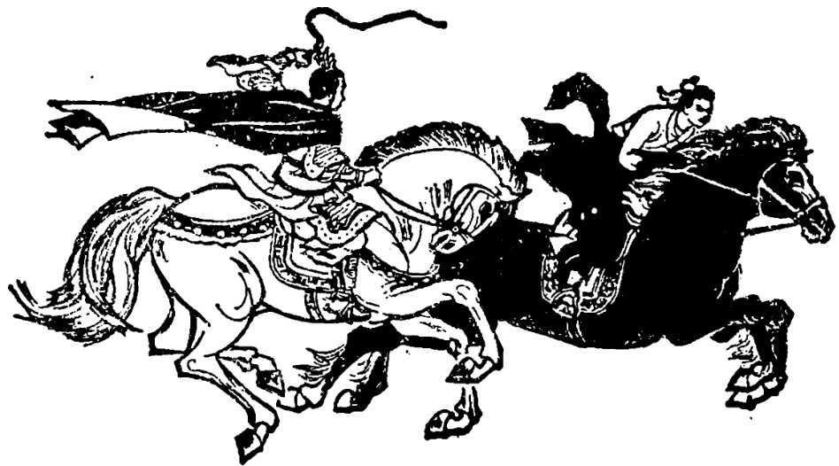

# 第四十一课 · 田忌赛马 — Lesson 41

> OCR transcription; not manually verified. Source and confidence metadata are preserved per page.

<!-- source_pdf_page: 280; source_printed_page: 270; ocr_confidence: 0.9981 -->

这两件衣服颜色一样。
我跟他不一样高。

## 一、替换练习 Substitution Drills

1. 这两匹马颜色一样。

|  毛衣[件] | 钢笔[支]  |
| --- | --- |
|  自行车[辆] | 提包[个]  |

2. 我的收录机跟他的一样。

|  收音机 | 照相机  |
| --- | --- |
|  自行车 | 意见  |
|  办法 |   |

3. 我跟他一样高。

<!-- source_pdf_page: 281; source_printed_page: 271; ocr_confidence: 0.9965 -->

（我跟他不一样高。）

这条河，那条河，长

这座山，那座山，高

我们班学生，他们班，多

这条街，那条街，宽

从这儿走，从那儿，远

4. 我要买一支跟那支一样的钢笔。

作一件，衬衣

换一个，耳机

借一本，小说

买一个，收音机

5. 弟弟有我这么高。

那孩子，桌子

那个衣柜，门

主席台，这座房子

那些树，二层楼①

<!-- source_pdf_page: 282; source_printed_page: 272; ocr_confidence: 0.9839 -->

6. 这个村子没有那个村子那么大。

这条路，那条路，宽
我的箱子，你的箱子，重
这匹马，那匹马，快
这篇文章，那篇文章，难
我的车，他的车，新

## 二、课文 Text

### 田忌赛马

两千多年以前，齐国有个叫田忌的，
最喜欢赛马。一天齐王对他说：“听说你
最近又买了几匹好马，我们再赛一赛，好
不好？”

田忌知道自己的马没有齐王的好，上
次赛马他就输了，可是齐王提出来比赛，
他只好答应。

齐王和田忌的马都分三等：上等马、
中等马、下等马。比赛一共进行三场，每

<!-- source_pdf_page: 283; source_printed_page: 273; ocr_confidence: 0.9997 -->

一场用三个等级的马赛三次。谁输谁赢按照三场比赛的最后结果决定。

比赛开始了。第一场，田忌用同等级的马跟齐王的赛。同一个等级的马，田忌的都没有齐王的好，结果赛了三次都输了。齐王赢了第一场，心里非常高兴。

田忌输了第一场，心里很着急。他想，今天的比赛又要输了。这时候，田忌的一个朋友走过来，低声对他说：“别着急，我有办法……”

第二场，齐王先出上等马，田忌用他

<!-- source_pdf_page: 284; source_printed_page: 274; ocr_confidence: 0.9953 -->

的下等马跟齐王赛。结果田忌当然输了。可是第二次比赛，当齐王出中等马时，田忌却⑨用了上等马。田忌的上等马比齐王的中等马跑得快，这次田忌赢了。第三次，田忌用中等马跟齐王的下等马赛，结果跟第二次一样，又赢了。

第三场，田忌用同样的方法，又赢了齐王。

最后的比赛结果，齐王一比二输给了田忌。

## 三、生词 New Words

|  1. 匹 | (量) pǐ | *a measure word for horses, mules, etc.*  |
| --- | --- | --- |
|  2. 马 | (名) mǎ | horse  |
|  3. 一样 | (形) yíyàng | same  |
|  4. 办法 | (名) bànfǎ | method, way  |
|  5. 这么 | (代) zhème | such, so  |
|  6. 层 | (量) céng | layer, storey  |

<!-- source_pdf_page: 285; source_printed_page: 275; ocr_confidence: 0.9983 -->

|  7. | 那么 | (代) | nàme | such  |
| --- | --- | --- | --- | --- |
|  8. | 田忌 | (专) | Tián Jì | Tian Ji, *a person's name*  |
|  9. | 赛马 |  | sài mǎ | horse-race  |
|  10. | 齐国 | (专) | Qíguó | the Qi State  |
|  11. | 齐王 | (专) | Qíwáng | King of the Qi State  |
|  12. | 输 | (动) | shū | to lose  |
|  13. | 只好 | (副) | zhǐhǎo | cannot but, can only  |
|  14. | 答应 | (动) | dāying | to agree, to answer  |
|  15. | 分 | (动) | fēn | to divide  |
|  16. | 等 | (名) | děng | grade, class  |
|  17. | 上等 | (形) | shàngděng | superior grade, first class  |
|  18. | 中等 | (形) | zhōngděng | medium grade  |
|  19. | 下等 | (形) | xiàděng | inferior grade  |
|  20. | 等级 | (名) | děngjí | grade, class  |
|  21. | 赢 | (动) | yíng | to win  |
|  22. | 按照 | (介) | ànzhào | according to  |
|  23. | 结果 | (名,动) | jiéguǒ | result; to end  |
|  24. | 同 | (形) | tóng | same  |
|  25. | 心(里) | (名) | xīn(lì) | (at) heart  |

<!-- source_pdf_page: 286; source_printed_page: 276; ocr_confidence: 0.9882 -->

26. 低声 dīshēng in a low voice
27. 却 (副) què but, however
28. 同样 (形) tóngyàng same
29. 方法 (名) fāngfǎ method, way

## 补充生词 Additional Words

1. 牛 (名) niú ox, cow
2. 羊 (名) yáng sheep
3. 鸡 (名) jī chicken
4. 狗 (名) gǒu dog
5. 猫 (名) māo cat

## 四、注释 Notes

### ① “二层楼”

中国人习惯把楼房从地面起的底层叫一层，以上各层类推。
In Chinese, the ground floor is known as the first floor and so on.

### ② 副词“却” The adverb 却

“却”表示转折，比“但是”“可是”语气略轻。例如：
The adverb 却 indicates contrast. It is slightly weaker than
但是 and 可是, e.g.

齐王出中等马时，田忌却用了上等马。

## 五、语法 Grammar

1. 用“跟…一样”表示比较 跟…一样 used to indicate

<!-- source_pdf_page: 287; source_printed_page: 277; ocr_confidence: 0.9934 -->

comparison

“一样”是形容词，可以作谓语。例如：

一样 is an adjective which can be used as a predicate, e.g.

这两件毛衣的颜色一样。

他们两个人的意见一样。

“跟…一样”常常用在一起，构成了一个固定格式。它可以作谓语、定语、状语等。例如：

跟…一样 is a fixed construction, which can be used as a predicate, an attributive or an adverbial adjunct, etc., e.g.

我的意见跟他的（意见）一样。

我要买一辆跟他那辆一样的自行车。

他写的汉字跟丁文写的一样好看。

2. “跟…一样”的否定 The negation of 跟…一样

“跟…一样”用“不”否定。“不”有两个位置。例如：

The negative form of 跟…一样 is constructed by putting 不 in either the following two positions:

我的意见跟他的不一样。

北京的天气不跟上海一样。

“不”放在“一样”前的情况更为常见。

不 before 一样 and after 跟 is more common.

3. 用“有”或“没有”表示比较 有 or 没有 used to indicate comparison

用“有”或“没有”表示比较时，格式如下：

<!-- source_pdf_page: 288; source_printed_page: 278; ocr_confidence: 0.9955 -->

The form of the comparative sentence with 有 or 没有 is as follows:

A——有——B——（这么或那么）——比较的方面

A——有——B——（这么 or 那么）the aspect to be compared

这种格式表示 A 在比较的方面达到了跟 B 一样的程度。这种方式的比较，否定式或疑问式更为常见。例如：

The idea expressed by this pattern is that A has reached the degree shown by B. The negative and interrogative forms are more common than the affirmative form, e.g.

妹妹有姐姐这么高了。

上海的夏天有北京这么热吗？

——上海的夏天没有北京这么热。

除形容词外，能够衡量程度的动词或能愿动词也可以用“有…”表示比较。例如：

Besides adjectives, those verbs and auxiliary verbs that can indicate degree can also take 有…to show comparison, e.g.

你有他那么喜欢听音乐吗？

我没有他那么会讲故事。

如果动词带程度补语，“有…”的位置和“比…”的位置一样。

If the main verb takes a complement of degree, the position of 有… is the same as that of 比…,

我来得没有他早。

<!-- source_pdf_page: 289; source_printed_page: 279; ocr_confidence: 0.9860 -->

他写汉字没有安娜写得好。

## 六、练习 Exercises

1. 用“跟…一样”或“跟…不一样”改写下列句子：

Rewrite the following sentences with 跟…一样 or 跟…不一样：

(1) 今天的作业是造句，昨天的作业是写一篇故事。
(2) 这次运动会，她参加体操比赛，她妹妹也参加体操比赛。
(3) 这匹马是白色的，那匹马是黑色的。
(4) 白文二十岁，田力也二十岁。
(5) 我一小时走五公里，他一小时也走五公里。
(6) 我们这座楼有十层，他们那座楼有十二层。
(7) 新年联欢会上，他们班演了一个小话剧，我们班唱了两个中国歌。
(8) 现在他学汉语，我也学汉语，一年以后，他学中国音乐，我学中

<!-- source_pdf_page: 290; source_printed_page: 280; ocr_confidence: 0.9935 -->

### 国历史。

2. 用表示比较的“有…”或“没有…”改写下列句子：
Rewrite the following sentences with 有… or 没有… to show comparison:

(1) 这条河跟那条河一样宽。
(2) 妹妹跟我一样高了。
(3) 我的箱子比他的箱子重。
(4) 我的办法比你的办法好。
(5) 这间屋子很大，那间屋子不比这间小。
(6) 哈利骑马骑得比我好。

3. 根据课文回答问题：

Answer the questions according to the text:

(1) 《田忌赛马》是什么时候的故事？
(2) 田忌最喜欢什么？齐王呢？
(3) 齐王要跟田忌赛马，田忌想不想跟他赛？为什么？最后答应了没有？
(4) 齐王和田忌赛马的方法是怎样

<!-- source_pdf_page: 291; source_printed_page: 281; ocr_confidence: 0.9861 -->

的？

(5) 第一场比赛的结果怎么样？为什么会是这个结果？
(6) 第二场谁赢了？怎么赢的？
(7) 第三场谁赢了？怎么赢的？
(8) 最后的比赛结果，谁输给了谁？

4. 阅读短文后回答问题：

Read the passage and answer the questions:

丁文坐火车回家过春节。到家以后，他发现 (fāxiàn discover) 他拿的提包不是他的。这个提包跟他的提包一样大，一样的颜色，都是黑的，上边写着一样的字——北京。但是这个提包比较新，没有他的那么旧，也比较重，没有他的那么轻。提包上的锁 (suǒ lock) 也不一样。丁文只好把提包送回车站，请那儿的同志帮助把自己的提包找回来。

丁文拿的提包跟他自己的提包有哪些地方一样？哪些地方不一样？

<!-- source_pdf_page: 292; source_printed_page: 282; ocr_confidence: 0.9981 -->

## 汉字表 Table of Chinese Characters

> **Uncertainty:** OCR of character components and stroke forms is unreliable. This section is excluded from the default retrieval corpus.

|  1 | 匹 | 一厂厂匹匹  |   |
| --- | --- | --- | --- |
|  2 | 层 | 尸 | 層  |
|   |  | 云  |   |
|  3 | 田 |   |   |
|  4 | 忌 | 己  |   |
|   |  | 心  |   |
|  5 | 输 | 车 | 韬  |
|   |  | 俞  |   |
|  6 | 级 | 纟 | 紉  |
|   |  | 及  |   |
|  7 | 赢 | 亡（、一亡） | 嬴  |
|   |  | 口  |   |
|   |  | 厥 | 月  |
|   |  |  | 贝  |
|   |  |  | 凡（丿几凡）  |
|  8 | 结 | 纟 | 結  |

<!-- source_pdf_page: 293; source_printed_page: 283; ocr_confidence: 0.9956 -->

|   |  | 吉士  |
| --- | --- | --- |
|   |  | 口  |
|  9 | 低 | 亻  |
|   |  | 氏（氏氏）  |
|  10 | 却 | 去  |
|   |  | 卩  |
