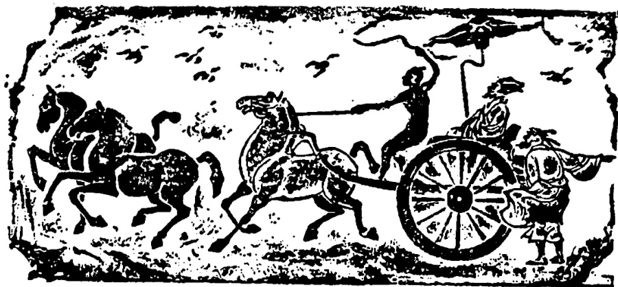

# 第四十二课 · 南辕北辙 — Lesson 42

> OCR transcription; not manually verified. Source and confidence metadata are preserved per page.

<!-- source_pdf_page: 294; source_printed_page: 284; ocr_confidence: 0.9965 -->

前边走过来一个人。
宿舍里搬走了两个同学。
雨越下越大。

## 一、替换练习 Substitution Drills

1. 桌子上放着很多书。

屋里，摆，花儿
墙上，挂，画儿
路上，停，马车
广场上，站，人
这儿，住，工人

2. 前边走过来一个人。

<!-- source_pdf_page: 295; source_printed_page: 285; ocr_confidence: 0.9976 -->

对面，跑，马[匹]
北边，飞，飞机[架]
前边，开，火车[列]
那边，开，汽车[辆]

3. 宿舍里搬走了两个同学。

教室里，搬出去，椅子[把]
墙上，掉下来，照片[张]
我们班，病，人[个]

4. 雨越下越大。

雪，下，大
风，刮，大
人们，玩儿，高兴
大家，谈，热闹

5. 农民的生活越来越好。

<!-- source_pdf_page: 296; source_printed_page: 286; ocr_confidence: 0.9702 -->

我们学的生词，多
我们学的语法，复杂
课文内容，深
他的身体，好

## 二、课文 Text

### 南辕北辙

这是中国的一个成语故事。

大路上过来一辆马车，车上坐着一个人，前边还有一个赶车的①。马车后边放着一只大箱子和一些别的东西。赶车的不停地赶，三匹马跑起来跟飞一样。看样子

<!-- source_pdf_page: 297; source_printed_page: 287; ocr_confidence: 0.9991 -->

他们要到很远的地方去。

路旁边走过来一位老人，对坐车的说：“先生，您这么着急，要到什么地方去？”

“我要到楚国去。”车停下以后，坐车的这样回答。

听说他要去楚国，老人笑了笑，说：“您走错了。楚国在南边，您怎么往北走呢？”

“那有什么关系！您没看见吗？这三匹马又高又大，跑起来快得很。”

“您的马虽然好，但这不是去楚国的路，怎么能到得了呢？”

“怕什么？”坐车的指着后边的箱子说，“我的箱子里放着很多钱。有这么多钱还怕到不了楚国吗？”

“您虽然有钱，可是，别忘了，您走的方向不对。这样会越走越远！”

<!-- source_pdf_page: 298; source_printed_page: 288; ocr_confidence: 0.9701 -->

坐车的听了，摇摇头说：“没关系，您看，这个赶车的，身体好，技术高，能力特别强，别人都比不了他。”说完，他就让赶车的继续朝②前赶。三匹马越跑越快，一会儿，马车就看不见了。

虽然坐车的有很多好的条件，可是方向错了，结果只能离他要去的地方越来越远。

## 三、生词 New Words

1. 马车 (名) mǎchē horse carriage
2. 广场 (名) guǎngchǎng square
3. 飞 (动) fēi to ly
4. 架 (量) jià a measure word for things with supports, stands or mechanisms
5. 列 (量) liè a measure word for things in rows or files
6. 越... yuè...yuè... the more... the more
   越...
7. 越来越 (副) yuèláiyuè more and more

<!-- source_pdf_page: 299; source_printed_page: 289; ocr_confidence: 0.9604 -->

|  8. | 深 | (形) | shēn | deep, profound  |
| --- | --- | --- | --- | --- |
|  9. | 南辕 |  | nányuán | head in the wrong  |
|   | 北辙 |  | běizhé | direction, diametrically opposite  |
|  10. | 赶(车) | (动) | gǎn(chē) | to drive (a car)  |
|  11. | 看样子 |  | kànyàngzi | it looks like  |
|  12. | 老人 | (名) | lǎorén | old person  |
|  13. | 先生 | (名)* | xiānsheng | gentleman, sir, Mr.  |
|  14. | 楚国 | (专) | Chǔguó | the Chu state  |
|  15. | 这样 | (代) | zhèyàng | like this  |
|  16. | 有关系 |  | yǒuguānxi | have . . . to do with  |
|  17. | 虽然 | (连) | suīrán | although  |
|  18. | 但(是) | (连) | dàn(shì) | but  |
|  19. | 了 | (动) | liǎo | to end up  |
|  20. | 怕 | (动) | pà | to fear, to be afraid of  |
|  21. | 方向 | (名) | fāngxiàng | direction  |
|  22. | 摇 | (动) | yáo | to shake  |
|  23. | 技术 | (名) | jìshù | technique  |
|  24. | 能力 | (名) | nénglì | ability  |
|  25. | 强 | (形) | qiáng | strong  |

<!-- source_pdf_page: 300; source_printed_page: 290; ocr_confidence: 0.9943 -->

26. 别人 (代) biérén others, another person
27. 继续 (动) jìxù to continue
28. 朝 (介) cháo towards
29. 条件 (名) tiáojiàn condition

## 四、注释 Notes

### ① “赶车的”

“赶车的”意思是“赶车的人”。这种“动词+宾语+的”构成的“的字结构”，相当一个指人的名词。如：“坐车的”“卖票的”等。

赶车的 means 赶车的人。The 的-construction, which is composed of V + O + 的, is equivalent to a personal noun, e.g. 坐车的, 卖票的, etc.

### ② 介词“朝” The preposition 朝

“朝”表示动作所对的方向。“朝…”只能用在动词前，如“朝我看”“朝东走”。“朝”与“往”的意思差不多。但“往”必须跟表示方位、处所的词语组合，不能直接跟表示人或物的名词组合，不能说“往我看”。

The preposition 朝 indicates the direction of an action. It can only be used before a verb, e.g. 朝我看，朝东走。朝 is more or less the same as 往, but 往 must be followed by a word indicating direction or place, and it cannot govern directly a noun or pronoun which refers to a person or a thing. Thus we cannot say 往我看.

<!-- source_pdf_page: 301; source_printed_page: 291; ocr_confidence: 0.9986 -->

## 五、语法 Grammar

### 1. 存现句 The existential sentence

“存现句”是表示人或事物存在、出现或消失的动词谓语句。

“存现句”的谓语动词主要不是说明动作，而是要说明人或事物在某处或某时以怎样的方式存在、出现或消失。

The sentence showing existence is a kind of verbal-predicate sentence. Instead of expressing action, however, it mainly tells where, when or how sb. or sth. exists, appears or disappears.

这种句子的词序是：

The word order of the sentence is:

处所词（或时间词）——动词——表示人或事物的名词

Place word (or time word) —verb—the noun referring to sb. or sth.

例如：e.g.

桌子上放着一个收音机。

前边开过来一辆汽车。

昨天来了两个新同学。

要注意的是：Points for attention:

（1）除少数句子外，动词后一般都有其他成分，如“了”、“着”补语等。

The verb is usually followed by another element such as 了，or a complement, etc., with only a few exceptions.

（2）动词后面表示存在、出现或消失的人或事物一般是不确指的。

The person or thing after the verb indicating existence,

<!-- source_pdf_page: 302; source_printed_page: 292; ocr_confidence: 0.9846 -->

appearance, or disappearance, is usually indefinite.

2. “越…越…” 格式 The construction 越…越…越…越…”

“越…越…” 表示程度随条件的发展而发展。例如：

The construction 越…越… indicates that sth. changes by degrees as a relevant condition changes, e.g.

他很着急，所以越走越快。

这种音乐真好听，我越听越爱听。

3. “越来越…” The construction 越来越…越来越…”

“越来越…” 表示程度随着时间的推移而发展。例如：

The construction 越来越…indicates that sth. changes with the passage of time, e.g.

快到冬天了，天气越来越冷。

他说汉语说得越来越好了。

## 六、练习 Exercises

1. 完成下列存现句：

Complete the following existential sentences:

(1) 墙上贴着____。

(2) 楼上掉下来____。

(3) 学校里开出来____。

(4) ____几辆马车。

<!-- source_pdf_page: 303; source_printed_page: 293; ocr_confidence: 0.9926 -->

(5) ____一个收音机。
(6) ____几位学生代表。
(7) 剧场门口停着____。
(8) ____一些人。

2. 用给的词组造句:

Make sentences with the given words:

(1) 越喝越喜欢喝
(2) 越来越少
(3) 越走越快
(4) 越来越高
(5) 越来越胖
(6) 越学越觉得容易

3. 根据课文回答问题:

Answer the questions according to the text:

(1) 《南辕北辙》是一个什么故事？
(2) 大路上过来一辆什么车？坐车的要到哪儿去？
(3) 这辆车有几匹马？跑得快不快？
(4) 坐车的往北走还是往南走？他要去

<!-- source_pdf_page: 304; source_printed_page: 294; ocr_confidence: 0.9860 -->

的地方在北边还是在南边？

(5) 坐车的人说, 他有哪些好条件?
(6) 坐车的到得了楚国吗? 为什么?

4. 把课文改成小话剧。

Change the text into a short play.

## 汉字表 Table of Chinese Characters

> **Uncertainty:** OCR of character components and stroke forms is unreliable. This section is excluded from the default retrieval corpus.

|  1 | 列 |   |   |
| --- | --- | --- | --- |
|  2 | 越 | 走  |   |
|   |  | 戊(一戌戌戌)  |   |
|  3 | 深 | 深  |   |
|   |  | 深(深)  |   |
|  4 | 辕 | 车 | 辕  |
|   |  | 袁土  |   |
|   |  | 口  |   |
|   |  | 仗(仆仆仆)  |   |
|  5 | 辙 | 车 | 辙  |
|   |  | 育  |   |
|   |  | 攵  |   |

<!-- source_pdf_page: 305; source_printed_page: 295; ocr_confidence: 0.9878 -->

|  6 | 虽 |  | 雞  |
| --- | --- | --- | --- |
|  7 | 怕 | 亻 |   |
|   |  | 白 |   |
|  8 | 向 | 门 |   |
|   |  | 口 |   |
|  9 | 摇 | 扌 |   |
|   |  | 岳（ㄧㄧㄧㄧ） |   |
|   |  | 岳（ㄧㄧ二午岳岳） |   |
|  10 | 朝 | 卓（ㄧㄣ卓） |   |
|   |  | 月 |   |
|  11 | 继 | 纟 | 繼  |
|   |  | 匪 | 米  |
|   |  | 匚 |   |
|  12 | 续 | 纟 | 續  |
|   |  | 卖 |   |
