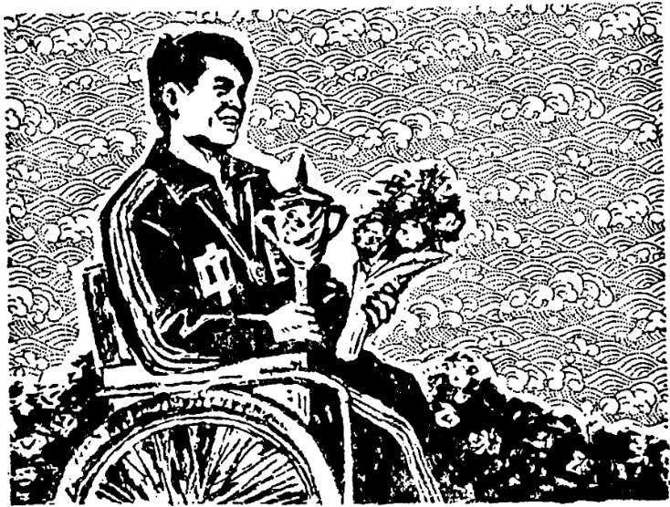

# 第四十三课 · 不平常的运动员 — Lesson 43

> OCR transcription; not manually verified. Source and confidence metadata are preserved per page.

<!-- source_pdf_page: 306; source_printed_page: 296; ocr_confidence: 0.9891 -->

他的练习作完了。
我的词典让他借走了。
那个病人被大夫救活了。

## 一、替换练习 Substitution Drills

1. 他的练习作完了。

|  衣服， | 洗干净  |
| --- | --- |
|  成绩， | 提高  |
|  腿， | 撞伤  |
|  伤， | 治好  |

2. 我的词典让（叫）他借走了。

<!-- source_pdf_page: 307; source_printed_page: 297; ocr_confidence: 0.9972 -->

自行车， 借去
录音机， 拿去
毛衣， 穿去
马， 骑走

3. 那个病人被大夫救活了。

路上的雪， 风， 刮走
他的情况， 游泳教练， 发现
那辆汽车， 我哥哥， 开走
刘向东， 汽车， 撞伤

4. 他被派到外国去学习了。

请到主席台上去
送进业余体育学校去学习
选到国家代表队去

5. 墙上的画儿没有被风刮掉。

<!-- source_pdf_page: 308; source_printed_page: 298; ocr_confidence: 0.9790 -->

我的提包， 人， 拿错
那些东西， 他， 扔掉
刘向东， 困难，吓倒

## 二、课文 Text

### 不平常的运动员

刘向东十岁的时候，有一次过马路，
被汽车撞伤了。他伤得很重，立刻被送进
了医院。经过大夫们的努力，向东被救活
了。但是他的右腿却失掉了。

刚刚十岁，只有一条腿，怎么生活下
去呢？小向东是个有毅力的孩子，他没有
被困难吓倒。慢慢地，他自己学会了走
路，生活上也不要家里人照顾了。

向东从小就喜欢游泳。现在父母不许
他再游了。可是他还是常常一个人到河里
去游。有一次，他游到河中心，力气用完
了，游不回来了，后来，让一位运动员救

<!-- source_pdf_page: 309; source_printed_page: 299; ocr_confidence: 0.9992 -->

了上来。

此后，刘向东更加努力练习游泳。过了几年，他游得差不多跟正常人一样快了。

刘向东的情况，被一位游泳教练发现了。教练让他进了业余体育学校。经过几年的训练，他的游泳成绩提高了很多。

有一年，亚洲举行残疾人运动会，刘向东被选进国家代表队，参加游泳比赛。比赛中，他用了全身的力气，最后得了第一名。当奖章挂在他身上的时候，他激动

<!-- source_pdf_page: 310; source_printed_page: 300; ocr_confidence: 0.9933 -->

得流出了眼泪①。

## 三、生词 New Words

1. 成绩 (名) chéngjī achievement
2. 撞 (动) zhuàng to hit, to bump into
3. 伤 (动) shāng to wound, to injure
4. 让 (介) ràng by, precedes agent in passive voice sentence
5. 叫 (介) jiào precedes agent in passive voice sentence, by
6. 被 (介) bèi indicates passive voice
7. 救 (动) jiù to save
8. 活 (动、形) huó to live; alive
9. 游泳 (动) yóuyǒng to swim, swimming
10. 游 (动) yóu to swim
11. 教练 (名) jiàoliàn coach
12. 刘向东 (专) Liú Xiàngdōng Liu Xiangdong, a person's name
13. 派 (动) pài to send
14. 业余 (形) yèyú amateur, sparetime
15. 选 (动) xuǎn to select

<!-- source_pdf_page: 311; source_printed_page: 301; ocr_confidence: 0.9891 -->

16. 代表队 (名) dàibiǎoduì (sports) team
17. 扔 (动) rēng to throw
18. 吓 (动) xià to frighten
19. 平常 (形) píngcháng ordinary
20. 马路 (名) mǎlù road, street
21. 失掉 (动) shīdiào to lose
22. 毅力 (名) yìlì will power, fortitude
23. 许 (动) xǔ to allow
24. 还是 (副) háishì still
25. 中心 (名) zhōngxīn centre
26. 力气 (名) lìqi strength
27. 后来 (名) hòulái later
28. 此后 (连) cǐhòu hereafter
29. 更加 (副) gèngjiā even more
30. 正常 (形) zhèngcháng normal
31. 训练 (动) xùnliàn to train
32. 残疾人 (名) cánjīrén handicapped person
33. 全身 (名) quánshēn whole body
34. 奖章 (名) jiǎngzhāng medal
35. 激动 (动) jīdòng to stir, to be excited

<!-- source_pdf_page: 312; source_printed_page: 302; ocr_confidence: 0.9912 -->

36. 流 (动) liú to flow
37. 眼泪 (名) yǎnlèi tears

## 补充生词 Additional Words

1. 冠军 (名) guànjūn champion
2. 亚军 (名) yājūn runner-up
3. 金牌 (名) jīnpái gold medal
4. 银牌 (名) yínpái silver medal
5. 铜牌 (名) tóngpái bronze medal

## 四、注释 Notes

① 复杂的程度补语 动词结构或主谓结构等也可以充任程度补语。如：“他激动得流出了眼泪。”“他说得大家都笑起来了。”

The complex complement of degree: A verbal construction or subject-predicate construction can also be used as a complement of degree, e.g. 他激动得流出了眼泪；他说得大家都笑起来了。

## 五、语法 Grammar

1. 意义上的被动句 The sentence with an implied passive voice

汉语中有的句子主语是受事，这种意义上的被动句在形式上跟主语是施事的句子没有区别。例如：

<!-- source_pdf_page: 313; source_printed_page: 303; ocr_confidence: 0.9947 -->

In some Chinese sentences the subject is the recipient of the action. Such sentences, though passive in meaning, are no different in form from sentences with the subject as the agent of the action, e.g.

那篇文章已经写完了。

他的成绩提高了很多。

这种受事主语句，在日常生活中用得很多。受事主语一般是确指的事物。

This kind of sentence, with the subject as the recipient of an action, is widely used in everyday conversation. The recipient subject usually refers to a specific thing.

### 2. “被”字句 The 被- sentence

用介词“被”“让”“叫”表示被动意义的句子，叫“被”字句。这种句子的谓语动词一般总带其他成分，说明动作的结果、程度、时间等。词序一般是：

The construction with 被，让 or 叫 carries a passive meaning. The predicate verb is usually followed by other elements indicating the result, degree or time of the action. The word order of such a sentence is as follows:

主语（受事）——让——介词的宾语（施事）——动词——其他成分

Subject (the recipient) ——让—— object of preposition (the agent) —— verb——other elements

“被”多用于书面语，口语中常用“让”“叫”。如：

被 is mostly used in written language while 让 or 叫 is

<!-- source_pdf_page: 314; source_printed_page: 304; ocr_confidence: 0.9963 -->

often used in spoken language, e.g.

我的照相机叫弟弟拿走了。

他被教练选进了业余体育学校。

刘向东让汽车撞伤了。

如果施事是不必或不能说出的，就可以略去施事或用泛指的“人”代替。例如：

The agent may be omitted or replaced by an indefinite 人 when it is unnecessary or inappropriate to mention it, e.g.

他被选进了国家代表队。

那本小说让人借走了。

如果句中有否定副词或能愿动词，要放在“被、让、叫”前面。例如：

If there is a negative adverb or auxiliary verb, it should be placed before 被，让 or 叫，e.g.

那本小说没让人借走。

## 六、练习 Exercises

1. 把下列被动句改为主动句：

Change the following passive sentences into active sentences:

(1) 我的《成语故事》让他借走了。

(2) 那个病人被大夫救活了。

<!-- source_pdf_page: 315; source_printed_page: 305; ocr_confidence: 0.9971 -->

(3) 他父亲让业余体育学校请去作教练了。
(4) 黑板上的字让我擦掉了。
(5) 杯子里的茶让他喝完了。
(6) 那些旧书让他母亲卖了。
(7) 他的腿被汽车撞伤了。
(8) 那棵小树没有被风刮倒。

2. 把下列句子改成被动句:

Change the following sentences into passive sentences:

(1) 学校派那个青年出国了。
(2) 他姐姐把那块很漂亮的布作成衬衣了。
(3) 一位运动员把那个孩子从河里救上来了。
(4) 他把那些没用的东西都扔了。
(5) 他已经把那些椅子搬到楼上去了。
(6) 他没把那辆马车送回去。
(7) 王毅已经把那个故事改成话剧了。

<!-- source_pdf_page: 316; source_printed_page: 306; ocr_confidence: 0.9958 -->

(8) 他把运动会得的奖章交给教练了。

3. 根据课文回答问题:

Answer the questions according to the text:

(1) 十岁的时候, 刘向东是怎么撞伤的?
(2) 刘向东被汽车撞得重不重? 他的伤治好了吗?
(3) 失掉了一条腿, 刘向东生活上有很多困难, 他被困难吓倒了吗?
(4) 刘向东从小喜欢什么体育运动? 失掉一条腿以后, 他还进行这样的运动吗?
(5) 有一次游泳的时候, 发生了什么情况?
(6) 过了几年, 刘向东的游泳技术提高了吗? 为什么?
(7) 刘向东在什么比赛中得了第一名?
(8) 他得了奖章, 为什么哭了?

<!-- source_pdf_page: 317; source_printed_page: 307; ocr_confidence: 0.9964 -->

## 汉字表 Table of Chinese Characters

> **Uncertainty:** OCR of character components and stroke forms is unreliable. This section is excluded from the default retrieval corpus.

|  1 | 绩 | 纟 |   | 績  |
| --- | --- | --- | --- | --- |
|   |  | 贵 | 一 |   |
|   |  |  | 贝 |   |
|  2 | 撞 | 扌 |   |   |
|   |  | 童 | 立 |   |
|   |  |  | 里 |   |
|  3 | 伤 | 傷 |   | 傷  |
|   |  | 勺（丿丿） |   |   |
|  4 | 被 | 戒 |   |   |
|   |  | 皮（一尸尸皮） |   |   |
|  5 | 救 | 求 |   |   |
|   |  | 攵 |   |   |
|  6 | 游 | 行 |   |   |
|   |  | 游 | 行 |   |
|   |  |  | 手 |   |
|  7 | 泳 | 泣 |   |   |
|   |  | 永（𠂊卩卩永） |   |   |

<!-- source_pdf_page: 318; source_printed_page: 308; ocr_confidence: 0.9927 -->

|  8 | 刘 | 文 | 劉  |
| --- | --- | --- | --- |
|   |  | 刂 |   |
|  9 | 派 | 氵 |   |
|   |  | 辰(「「「「「「「「 |   |
|  10 | 余 | 人 | 餘  |
|   |  | 示(一示) |   |
|  11 | 选 | 先 | 選  |
|   |  | 乚 |   |
|  12 | 扔 | 扌 |   |
|   |  | 乃 |   |
|  13 | 吓 | 口 | 嚇  |
|   |  | 下 |   |
|  14 | 失 | 丿乚失 |   |
|  15 | 殺 | 孽(「「「「「「 |   |
|   |  | 受 |   |
|  16 | 许 | 氵 | 許  |
|   |  | 午 |   |
|  17 | 此 | 止 |   |
|   |  | 匕 |   |

<!-- source_pdf_page: 319; source_printed_page: 309; ocr_confidence: 0.9941 -->

|  18 | 训 | 讠 | 訓  |
| --- | --- | --- | --- |
|   |  | 川 |   |
|  19 | 残 | 歹 | 殘  |
|   |  | 戋 |   |
|  20 | 疾 | 疒 |   |
|   |  | 矢 |   |
|  21 | 奖 | 艹 | 獎  |
|   |  | 大 |   |
|  22 | 激 | 氵 |   |
|   |  | 敕(ㄌ) |   |
|   |  | 攵 |   |
|  23 | 眼 | 目 |   |
|   |  | 艮 |   |
|  24 | 泪 | 泣 | 淚  |
|   |  | 目 |   |
