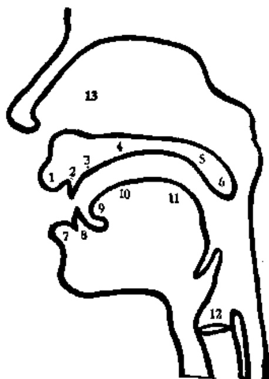

# 汉语拼音、词类简称与发音器官 — Pinyin, Part-of-Speech Abbreviations, and Organs of Speech

> OCR transcription; not manually verified. Source and confidence metadata are preserved per page.

<!-- source_pdf_page: 14; source_printed_page: 16; ocr_confidence: 0.9701 -->

## 汉语拼音字母表

## The Chinese Phonetic Alphabet

|  印刷体 Printed Forms | 书写体 Written Forms | 字母名称 Names | 印刷体 Printed Forms | 书写体 Written Forms | 字母名称 Names  |
| --- | --- | --- | --- | --- | --- |
|  A a | A a | [a] | N n | N n | [nɛ]  |
|  B b | B b | [pɛ] | O o | O o | [o]  |
|  C c | C c | [ts'ɛ] | P p | P p | [p'ɛ]  |
|  D d | D d | [tɛ] | Q q | Q q | [tɕ'iou]  |
|  E e | E e | [ɤ] | R r | R r | [ar]  |
|  F f | F f | [ɛf] | S s | S s | [ɛs]  |
|  G g | G g | [kɛ] | T t | T t | [t'ɛ]  |
|  H h | H h | [xa] | U u | U u | [u]  |
|  I i | I i | [i] | V v | V v | [vɛ]  |
|  J j | J j | [tɕiɛ] | W w | W w | [wa]  |
|  K k | K k | [k'ɛ] | X x | X x | [ɕi]  |
|  L l | L l | [ɛl] | Y y | Y y | [ja]  |
|  M m | M m | [ɛm] | Z z | Z z | [tsɛ]  |

<!-- source_pdf_page: 15; source_printed_page: 17; ocr_confidence: 0.9899 -->

## 词类简称表

### Abbreviations

|  1. (名) | 名词 | míngcí | noun  |
| --- | --- | --- | --- |
|  2. (代) | 代词 | dàicí | pronoun  |
|  3. (动) | 动词 | dòngcí | verb  |
|  4. (能动) | 能感动词 | néngyuàndòngcí | optative verb  |
|  5. (形) | 形容词 | xíngróngcí | adjective  |
|  6. (数) | 数词 | shùcí | numeral  |
|  7. (量) | 量词 | liàngcí | measure word  |
|  8. (副) | 副词 | fùcí | adverb  |
|  9. (介) | 介词 | jiècí | preposition  |
|  10. (连) | 连词 | liáncí | conjunction  |
|  11. (助) | 助词 | zhùcí | particle  |
|   | 动态助词 | dòngtài zhùcí | aspect particle  |
|   | 结构助词 | jiégòu zhùcí | structural particle  |
|   | 语气助词 | yǔqì zhùcí | modal particle  |
|  12. (叹) | 叹词 | tàncí | interjection  |
|  13. (象声) | 象声词 | xiàngshēngcí | onomatopoeia  |
|  (头) | 词头 | cítóu | prefix  |
|  (尾) | 词尾 | cíwěi | suffix  |
|  14. (专) | 专名 | zhuānmíng | proper noun  |

<!-- source_pdf_page: 16; source_printed_page: 18; ocr_confidence: 0.9979 -->

## 发音器官

### Organs of Speech

1. 上唇 upper lip
2. 上齿 upper teeth
3. 牙床 teethridge
4. 硬腭 hard palate
5. 软腭 soft palate
6. 小舌 uvula
7. 下唇 lower lip
8. 下齿 lower teeth
9. 舌尖 tip of tongue
10. 舌面 blade of tongue
11. 舌根 back of tongue
12. 声带 vocal cords
13. 鼻腔 nasal cavity
